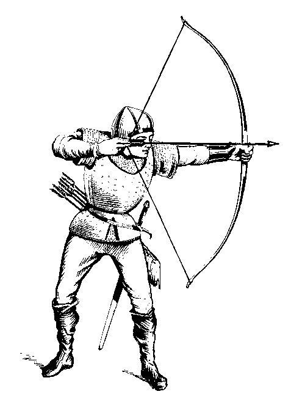

\clearpage

{width=100%}

Charaktererschaffung
====================

\lettrine{D}{as Spiel beginnt} damit, dass Du dir einen Charakter,
also eine Spielfigur erschaffst. 
Die Eigenschaften und Habseligkeiten Deines Charakters werden auf einem
Blatt Papier fest gehalten, dem so genannten Charakterbogen. Es gibt
dafür alle möglichen Formulare, aber Du kannst auch ein einfaches leeres
Blatt Papier dafür benutzen - ich finde das jedenfalls am meisten *old
school*. Beschrifte Deinen Charakterbogen immer nur mit Bleistift, denn
alle Eintragungen können sich im Laufe des Spiels verändern.

Oben links brauchst Du etwas Platz für den Namen deines Charakters.
Lasse das Feld noch offen, denn Du weißt ja noch nicht was für eine
Figur Du spielen wirst. Oben rechts kannst Du Deinen Namen und
vielleicht auch den Namen des Spielleiters eintragen.  Darunter,
solltest Du Dir ein bisschen Platz für eine kleine Skizze deiner Figur
frei halten.

Oben in die Mitte, zwischen dem Namen des Charakters und deinem Namen
brauchst Du etwas Platz, um *Volk*, *Klasse* und *Stufe* deines Charakters
zu notieren. Was mit Klasse gemeint ist, besprechen wir gleich, bei Stufe
kannst Du schon mal eine Eins eintragen. Du brauchst auch noch ein Feld um
Deine *Gesinnung* zu notieren. Eine Zeile unter *Klasse* würde sich dafür
anbieten.

Am linken Rand des Blattes schreibst Du unter einander die Worte:
"Stärke", "Intelligenz", "Weisheit", "Geschicklichkeit", "Konstitution"
und "Charisma". Das sind die Attribute deines Charakters. Du kannst auch
Abkürzungen benutzen um Platz zu sparen: ST, IN, WE, GE, KO, CH
(*Stinwegekoch*, kann man sich gut merken).  Nun nimmst Du drei
Sechser-Würfel (3W6), und würfelst von oben nach unten, also für
ein Attribut nach dem anderen einen Wert zwischen 3 und 18 aus, und
schreibst ihn hinter das jeweilige Attribut, je höher der Wert, desto
besser.  Nun kannst Du schon ein bisschen
erahnen, welche Art von Abenteurer Du hier vor Dir hast. Einen
dümmlichen Kraftprotz?  einen gewitzten Hänfling? jemanden der klug
und charismatisch ist?

Attribute
---------

Die Attribute *Stärke*, *Intelligenz* und *Weisheit* sind die
sogenannten Primärattribute der drei Charakterklassen *Kämpfer*,
*Zauberkundiger* und *Kleriker*. Das Primärattribut der jeweiligen Klasse
wirkt sich wie folgt auf die Ansammlung von Erfahrungspunkten und
Stufen aus:

: Primärattribute und Erfahrungspunkte

| Attribut | Erfahrungspunkte |
|:--------:|:----------------:|
|  15+     | + 10%            |
|  13 - 14 | + 5%             |
| 9 - 12   | kein Bonus       |
| 7 - 8    | - 10%            |
| 6-       | - 20%            |

Stärke \index{Stärke}
:    ist das Primärattribut der Kämpfer. Es steht für die Körperkraft eines Wesens. 
	  
Intelligenz \index{Intelligenz}
:    stellt das Buchwissen eines Charakters
     dar. Es ist das Primärattribut der Zauberkundigen. 
     Für jeden Punkt über 10 spricht der Charakter eine
     zusätzliche Sprache. 

Weisheit \index{Weisheit}
:    stellt die Intuition, den Instinkt und das gute
     Urteilsvermögen eines Charakters
     dar. Weisheit ist das Primärattribut der Kleriker.

Hat ein Charakter auch in anderen Attributen als seinem Primärattribut
gute Werte, kann dies helfen, denn Erfahrungsbonus weiter zu steigern.
Dieser Aufschlag auf das Primärattribut gilt allerdings nur für die
Berechnung des Erfahrungsbonus.

: Erfahrungsbonus durch andere Attribute 

| Klasse | Attribut | Aufschlag Primärattribut |
|:-------|:--------:|:------------------------:|
| Kämpfer | Intelligenz 9 - 10 | +1 |
| und     | Intelligenz 11 - 12 | +2 |
| Kleriker | Intelligenz 13 - 14 | +3 |
|         | Intelligenz 15 - 16 | +4 |
|         | Intelligenz 17 - 18 | +5 |
|         |                     |    |
| Kämpfer | Weisheit 9 - 11 | +1 |
|         | Weisheit 12 - 15 | +2 |
|         | Weisheit 16 - 18 | +3 |
|          |                     |    |
| Zauberkundige | Weisheit 9 - 10 | +1 |
|            | Weisheit 11 - 12 | +2 |
|            | Weisheit 13 - 14 | +3 |
|            | Weisheit 15 - 16 | +4 |
|            | Weisheit 17 - 18 | +5 |
|          |                     |    |
| Kleriker | Stärke 9 - 11 | +1 |
|          | Stärke 12 - 15 | +2 |
|          | Stärke 16 - 18 | +3 |

Dies ist sicherlich eine der seltsamsten und kompliziertesten Regeln
in der Originalausgabe des Spiels, und sie wird in vielen Retro-Klonen
kommentarlos übergangen. Aber anhand eines Beispiels lässt
sich gut verstehen, wie die Regel funktioniert, und warum sie sogar
sinnvoll ist:

Nehmen wir zum Beispiel einen Charakter mit diesen Spielwerten: Stärke
9, Intelligenz 17 und Weisheit 10. Wegen der außergewöhnlichen
Intelligenz wäre es naheliegend, dass dieser Charakter ein
Zauberkundiger wird. Die Spielerin könnte sich aber entscheiden,
lieber einen Kämpfer zu spielen, vielleicht weil sie schon ein genaues
Bild von ihrem Charakter vor Augen hat. Allein in Folge des eher
niedrigen Primärattributes hätte der Charakter überhaupt keinen Bonus
bei der Berechnung der Erfahrungspunkte. Durch die hohe Intelligenz
allerdings darf sich die Spieler zur Berechnung des Erfahrungsbonus
einen Aufschlag von +5 auf ihr Primärattribut anschreiben. Das heißt,
sie berechnet ihren Erfahrungsbonus so, als sei die Stärke ihres
Kämpfers 14. Ihr Erfahrungsbonus ist damit also 5%. Die Regel macht
deutlich, dass es durchaus auch Kämpfer geben kann, die mehr sind als
nur tumbe Kampfmaschinen.

Geschicklichkeit \index{Geschicklichkeit}
:    ist das Resultat aus Koordination und Schnelligkeit. Ein
     hoher Geschicklichkeitswert (12+) gibt einen Bonus von +1 auf
     Angriffswürfe im Fernkampf, also zum Beispiel mit Pfeil und Bogen. 
     Ein niedriger Wert (9-) gibt einen Abzug von -1 auf
     entsprechende Angriffswürfe.

Konstitution \index{Konstitution}
:    beschreibt die Zähigkeit eines Charakters. 
     Trefferpunkte stehen für die Menge an Schaden, Verletzungen,
     Prellungen aber auch zum Beispiel Rückschlag und Frustration, die
     ein Charakter im Kampf erleiden kann. Sinken die Trefferpunkte
     auf Null geht ein Charakter leblos zu Boden. Außerdem hat die
     Konstitution einen Einfluss auf die Chance, dass ein Charakter
     eine Wiederbelebung, Verwandlung oder Reinkarnation übersteht.
	
     : Konstitutions Bonus Tabelle

     | Konstitution | Trefferpunkte | Überleben |
     |:------------:|:-------------:|:---------:|
     |  15 - 18     |   +1          |  100 %    |
     |  13 - 14     |               |  100 %    |
     |  12          |               |   90 %    |
     |  11          |               |   80 %    |
     |  10          |               |   70 %    |
     |   9          |               |   60 %    |
     |   8          |               |   50 %    |
     |   7          |               |   40 %    |
     |   3 - 6      |   -1          |    0 %    |

Charisma \index{Charisma}
:    kann am besten als Ausdruck für das diplomatische Talent
     und die Führungsfähigkeiten eines Charakters verstanden werden.

     Charisma wirkt sich auf die Anzahl und die Loyalität von
     Gefolgsleuten aus, die ein Charakter in seinen Dienst nehmen
     kann. Für alle Gefolgsleute wird zu Beginn ein bestimmter
     Loyalitätswert ermittelt, den der Spielleiter bei Bedarf auf die
     Probe stellen kann. Wenn zum Beispiel ein  Spielercharakter eine
     besonders gefährliche Handlung von seinen Leuten
     verlangt, könnte mit einem Würfelwurf entschieden werden, ob sich
     die Gefolgsleute treu verhalten, oder eine Meuterei beginnen.

     : Charisma Bonus Tabelle

     | Charisma | Gefolgsleute (max. Anzahl) | Loyalität |
     |:--------:|:--------------------------:|:---------:|
     | 3 - 4    |       1                    | -2        |
     | 5 - 6    |       2                    | -1        |
     | 7 - 8    |       3                    |           |
     | 9 - 12   |       4                    |           |
     | 13 - 15  |       5                    |  +1       |
     | 16 - 17  |       6                    |  +2       |
     | 18       |      12                    |  +4       |

Fantasy-Völker
--------------

\index{Völker}
Die meisten Spielercharaktere sind üblicherweise Menschen. Es ist aber
auch möglich einen Charakter eines typischen Fantasy-Volkes, also
einen Elf, einen Halbling oder einen Zwerg zu spielen. Traditionell
werden diese Spezies unter dem Begriff "Halbmenschen" zusammen
gefasst, im Gegensatz zu "Humanoiden", worunter Orks, Goblins und
andere menschenähnliche Monster verstanden werden. 

Zwerge, Halblinge und Elfen haben jeweils besondere Eigenschaften, die
dadurch ausgeglichen werden, dass Halbmenschen nie so hohe Stufen wie
Menschen erreichen können, und auch auf bestimmte Klassen festgelegt
sind. 

### Zwerge

\index{Zwerge}
Zwerge können die Klasse Kämpfer oder Kleriker wählen. Sie können
maximal Stufe 6 erreichen. Dafür sind Zwerge besonders resistent gegen
Magie und bekommen daher einen  Bonus von +4 auf ihren Rettungswurf
gegen Zaubersprüche.
Im Kampf gegen Riesen und ähnliche Kreaturen erleiden Zwerge immer nur
den halben Schaden.
Außerdem können Zwerge leicht Gefälle, besondere
Mauerkonstruktionen wie bewegliche Wände und zum Beispiel Falltüren
erkennen. Sie sprechen neben der Gemeinsprache und Zwergisch die
Sprachen der Gnome, Kobolde und Goblins.

### Elfen

\index{Elfen}
Elfen können Zauberkundige oder Kämpfer, oder auch beides gleichzeitig
sein. Dafür können sie als Kämpfer nur Stufe 4, und als Zauberkundige
nur Stufe 8 erreichen. Elfen können gleichzeitig als Kämpfer und als
Zauberkundige agieren, doch sie müssen ihre Erfahrungspunkte auf die
beiden Klassen aufteilen. Im Endeffekt erreichen dadurch
Elfen höhere Stufen deshalb nur halb so schnell wie andere
Charaktere. Schließlich haben Elfen Vorteile im Kampf mit bestimmten
Gegnern: sie erhalten einen zusätzlichen Angriffsbonus von +1 gegen
Goblins, Orks, intelligente Untote und Werwölfe,
und sie sind immun gegen die lähmende Berührung der Ghule. Elfen
haben eine besonders scharfe Wahrnehmung, was das Entdecken
von Geheimtüren angeht. Sie sprechen neben der Gemeinsprache natürlich
Elfisch und die Sprache der Orks, Hobgoblins und der Gnolle.

### Halblinge

\index{Halblinge}
Halblinge können nur die Klasse des Kämpfers wählen und als solche
auch nur bis Stufe 4 aufsteigen. Dafür haben sie die Magieresistenz
und die Kampfeigenschaften gegen Riesen der Zwerge und erhalten einen
Bonus von +2 auf Fernkampfwaffen. Außerdem sind Halblinge nahezu
unsichtbar, wenn sie sich verstecken.

Klassen
-------

\index{Klassen}
Nun ist es an der Zeit eine Klasse für Deinen Charakter zu wählen. Wie
schon gesagt bietet *Menschen & Magie* die ursprünglichen drei Klassen
"Kämpfer", "Kleriker" und "Zauberkundiger". Du kannst die Wahl der
Klasse von den Werten in den Primärattributen abhängig machen, Du
musst es aber nicht. Um etwas schneller höhere Stufen zu erreichen,
ist es aber günstig, wenn Du bei einem hohen Wert in Intelligenz einen
Zauberkundigen wählst, oder bei einem hohen Wert in Stärke eben einen
Kämpfer.

Wenn Du eine Klasse ausgewählt hast, kannst Du anhand der Angaben die
nächsten Eintragungen auf deinem Charakterbogen machen.  Denn von der
Wahl der Klasse hängt auch unmittelbar die Anzahl der Trefferpunkte
\index{Trefferpunkte} ab, die Dein Charakter hat, wenn er das erste
Mal ins Abenteuer zieht.  Den Platz für die Klasse, oben in der Mitte,
hattest Du Dir ja schon frei gehalten. Unter den Feldern für Klasse
und Gesinnung, also rechts neben den Attributen, solltest Du Dir nun
Felder für Trefferpunkte\index{Trefferpunkte}\index{TP} 
(kurz TP - oder auch HP für *hit points*) und
Rüstungsklasse (kurz RK - oder AC für *armor
class*)\index{RK}\index{Rüstungsklasse} einrichten. Die
Trefferpunkte geben an, wie viel Schaden ein Charakter im Kampf
aushalten kann, bevor er zu Boden geht. Du solltest Deine
Trefferpunkte jetzt auswürfeln: wenn Du einen Zauberkundigen oder
einen Kleriker spielst mit einem 6er Würfel (1W6), und wenn Du einen
Kämpfer spielst mit einem 6er Würfel, wobei Du zu Deinem Wurf noch
eine 1 hinzurechnest (1W6+1). Vergiss nicht ggf. auch noch den
Konstitutionsbonus anzurechnen. Die Rüstungsklasse
bestimmt, wie leicht oder schwer es ist, dem Charakter überhaupt
Schaden zuzufügen. Du erfährst Deine Rüstungsklasse, sobald Du Deine
Ausrüstung ermittelt hast.

Unter dem Feld für die Rüstungsklasse kannst Du als nächstes eine
kleine Tabelle mit deinen fünf Rettungswürfen \index{Rettungswürfe}
anlegen.  Die Rettungswürfe heißen "Gift und Todesstrahlen",
"Zauberstäbe", "Lähmung und zu Stein erstarren", "Drachenodem" und
"Zaubersprüche, -stecken und -ruten". Das gibt Dir schon mal eine
Idee, in welchen prekären Situationen Rettungswürfe zum Einsatz kommen
könnten. Um Platz zu sparen, kürze ich die Rettungswürfe meistens ab
mit: Gift, Stäbe, Lähmung, Odem und Sprüche.

### Kämpfer

Primärattribut
:    Stärke
 

Trefferpunkte
:    1W6+1 

Klassenfähigkeiten
:    Kämpfer haben keine besonderen Klassenfähigkeiten. Magie ist
     ihnen nur durch die Benutzung magischer Waffen zugänglich. Dafür
     sind Kämpfer in der Regel im Kampf die robustesten Charaktere.

Klassenbeschränkungen
:    keine

Rettungswürfe
:    Gift: 12, Stäbe: 13, Lähmung: 14,\newline 
     Odem: 15, Sprüche: 16

### Zauberkundiger

Primärattribut
:    Intelligenz

Trefferpunkte
:    1W6 

Klassenfähigkeiten
:    Zauberkundige können Zauberkundigensprüche wirken. Um sie
     vorzubereiten müssen sie Zeit aufwenden um den Spruch mit Hilfe
     der magischen Aufzeichnungen im Zauberbuch zu studieren und sich
     so einzuprägen. Das wirken eines Spruches ist für die
     Zauberkundigen so anstrengend, dass die Einzelheiten des Spruches
     nach dem Wirken vergessen werden. Der Spruch kann erst nach
     erneuter Vorbereitung wieder gewirkt werden. Zauberkundige der
     ersten Stufe können nur einen Spruch des ersten Grades pro Tag
     wirken.  
     Zauberkundige der ersten Stufe haben zu Beginn 4 Sprüche in
     ihrem Zauberbuch, und zwar *Magie lesen*, einen nach Wunsch
     des Spielers ausgewählten Spruch, und zwei zufällig
     ermittelte Sprüche. Alle weiteren Sprüche müssen im Spiel
     gefunden bzw. erlernt werden.
	

Klassenbeschränkungen
:    Zauberkundige dürfen keine Waffen außer Dolche
     und Stäbe benutzen. Zauberkundige dürfen keine Rüstungen und
     keine Schilde tragen.

Rettungswürfe
:    Gift: 11, Stäbe: 12, Lähmung: 14,\newline
     Odem: 16, Sprüche 15

### Kleriker

Primärattribut
:    Weisheit

Trefferpunkte
:    1W6 

Klassenfähigkeiten
:    Kleriker können "Untote" beherrschen, und ab der zweiten Stufe 
     klerikale Magie wirken. \index{Untote!vertreiben}
	 
     Um Untote zu beherrschen werden 2W6 geworfen. Liegt das Ergebnis
     über einem bestimmten Wert, erlangt der Kleriker für eine 
     bestimmte Zeit die Kontrolle über die untoten Kreaturen.
     Der Spielleiter stellt fest, wie viele Untote tatsächlich
     beherrscht werden.
     Wenn Du einen Kleriker spielst, notiere Dir folgende kleine
     Tabelle auf deinem Charakterbogen:
	 
	 ---------- -----
	 Skelette       7
         
	 Zombies        9
	 
	 Ghule         11
         
	 ---------- -----

     Je nach Gesinnung bedeutet "beherrschen" etwas anderes. Kleriker
     guter Gesinnung *vertreiben* die Untoten, während Kleriker böser
     Gesinnung die Untoten in ihren Dienst befehlen können, zum
     Beispiel um eine bestimmte Aufgabe zu erledigen, oder einen
     bestimmten Bereich zu bewachen.
	 
Klassenbeschränkungen
:    Kleriker dürfen nur stumpfe Waffen benutzen.

Rettungswürfe
:    Gift: 11, Stäbe: 12, Lähmung: 14,\newline
     Odem: 16, Sprüche 15

## Wechsel der Charakterklasse

Unter bestimmten Voraussetzungen kann es auch möglich sein die Klasse
eines Charakters zu wechseln\index{Klasse!Wechsel der}. 
So etwas ist sicher nicht alltäglich, sondern eher ein *Life Event* und
sollte sich aus der Geschichte des Spiels ergeben. 

Neben den hier vorgestellten Klassen, gibt es in den diversen
Regelerweiterungen weitere Klassen, wie zum Beispiel Paladine, Waldläufer,
Druiden, Illusionisten, Assassinen oder sogar Mönche. Andererseits solltest
Du versuchen, Dich nicht durch die Klassenbezeichnungen einschränken zu
lassen. 

In Old-School-Rollenspielen wird vieles auf dem Charakterbogen gar
nicht so genau fest gelegt. Du kannst einfach die Klasse nehmen, die grob
am besten zu Deiner Charakteridee passt, und die Details rollenspielerisch
ausfüllen. Der Begriff "Zauberkundiger" - im englischen Original
"magic-user", illustriert das ganz gut: Die Klasse bietet Dir grundsätzlich
Zugang zu Magie. Für die Ausgestaltung Deines Magie-Anwenders gibt es aber
viele verschiedene Möglichkeiten. Du könntest natürlich einen klassischen
Magier mit spitzem Hut spielen, aber genauso gut auch eine Hexe, einen
gelehrten Forscher der arkanen Künste, oder einen illusionistisch begabten
Trickbetrüger.

Genau so gut könnte ein Kleriker auch als Druide oder Schamane
ausgestaltet werden, und ein Kämpfer als stolzer (möchte gern) Ritter,
gewiefter Waldläufer, als geheimnisvolle Amazone oder auch als
ungehobelter Barbar. Und es spricht auch nichts dagegen, Deinem
Charakter noch einen Beruf zu geben, der vielleicht erst mal nicht
besonders abenteuerlich ist, aber rollenspielerisch interessant sein
könnte.

Aber Achtung: investiere nicht zu viel Zeit und Hingabe in die
Hintergrundgeschichte Deines Charakters. Das Abenteurerleben in
Old-School-Spielen kann sehr kurz sein. Du solltest es lieber so
sehen, dass die Hintergrundgeschichte Deines Charakters während
der ersten drei Stufen erspielt wird.

Gesinnung
---------
\index{Gesinnung}

Jeder Charakter und jedes halbwegs intelligente Wesen in der Spielwelt
hat eine Gesinnung. Damit ist ganz grob die moralische Grundhaltung
gemeint. Dabei werden die Gesinnungen *Chaotisch*, *Neutral* und
*Rechtschaffen* unterschieden. 

Häufig wird zwar chaotisch mit "böse" gleich gesetzt, und
rechtschaffen mit "gut", doch am besten versteht man die drei
Gesinnungen, wenn man sich die Beziehung zwischen Individuum und
Gruppe klar macht. Ein chaotisches Wesen wird sich so verhalten, wie
es für sein individuelles Wohlergehen am besten ist, und sich nicht um
die Interessen der Gruppe kümmern. Ein rechtschaffenes Wesen hingegen
wird immer das Wohl der Gruppe über das eigene Wohl stellen, und sich
selbst im Zweifel opfern. Neutral bedeutet, dass das Wesen irgendwie
den Mittelweg zwischen diesen Extremen einschlägt oder sich
tendenziell mal eher chaotisch und mal eher rechtschaffen verhält. 

Tiere und auch wenig intelligente Monster haben in der Regel eine
neutrale Gesinnung, und genauso wird es auch für viele Menschen
zutreffen. "Monster" aber, Dämonen und Teufel sind häufig chaotisch,
während typische spirituelle Fanatiker häufig rechtschaffener
Gesinnung sein dürften. Nicht zuletzt können auch individualistische
Abenteurer gut und gerne eine chaotische oder rechtschaffene Gesinnung
haben.

In späteren Editionen wurden übrigens tatsächlich auch noch die
Kategorien "gut" und "böse"  ergänzt. Ich glaube jedoch, dass es
durchaus als Zeitzeugnis der frühen 70er Jahre angesehen kann, dass in
den ursprünglichen Regeln eben gerade nicht in gut und böse
unterschieden wurde. Immerhin hängen diese Begriffe ja sehr vom
jeweiligen Standpunkt ab. Schließlich müssten aus Sicht der Monster
wohl so gut wie alle Spielercharaktere als böse gelten.

Du solltest Dir also jetzt eine Gesinnung für Deinen
Charakter überlegen, und sie auf Deinem Charakterbogen notieren. Es
ist o.k. Deine Mitspieler zunächst im unklaren zu lassen, wenn Du Dich
zum Beispiel für eine chaotische Gesinnung entschieden hast. Du
solltest aber in jedem Fall Deiner Spielleiterin die gewählte
Gesinnung mitteilen, da sie sich auf manche Regeln
auswirken kann.

Sprachen
--------

Spielercharaktere sprechen immer mindestens die sogenannte 
*Gemeinsprache*\index{Sprache!Gemein-}. Also die Sprache, die von den
meisten Menschen und "Halbmenschen" (also Zwergen, Elfen und
Halblingen) verstanden und gesprochen wird.

Nicht menschliche Wesen haben aber in aller Regel auch eine eigene
Sprache, und "Monster" sprechen unter Umständen *nur* ihre eigene
Sprache. Das kann Verhandlungen schwierig machen, wenn zum
Beispiel niemand in der Abenteurergruppe der Goblin-Sprache
mächtig ist.

Daneben gibt es auch noch für jede Gesinnung
eine sogenannte Gesinnungssprache\index{Sprache!Gesinnungs-}.
Diese sollte man sich als eine Art Geheimsprache
vorstellen, die aus besonderen Handzeichen oder Gesten besteht,
die jeweils nur den Menschen und Kreaturen einer bestimmten Gesinnung
bekannt sind.

Zaubersprüche
-------------

\index{Zaubersprüche}
Zauberkundige lernen ihre Sprüche durch kostspielige Ausbildung
bei einem Meister, magische Forschung oder durch glückliche
Zufälle während ihrer Abenteuer.  Um einen Spruch wirken zu
können, müssen sie ihn mit Hilfe ihres Zauberbuches
\index{Zauberbuch} studieren und sich
einprägen\index{Zauberspruch!vorbereiten}. Wird der Spruch
einmal gewirkt, ist der Zauberkundige in Folge der Anstrengungen
des Spruchwirkens nicht mehr in der Lage, den gleichen Spruch
noch einmal zu wirken, sondern der Spruch muss auf die gleiche
Weise erneut vorbereitet werden^[Diese Art von Magie wird "Vance'sche
Magie" genannt, da sie genau so funktioniert, wie es von Jack Vance in seinen
*Dying Earth*-Geschichten beschrieben wurde.].  Daher können Zauberkundige der
ersten Stufe nur einen einzigen Spruch pro Tag wirken. Einmal
gelernte Sprüche werden aus dem Gedächtnis gewirkt. Es ist also
nicht erforderlich, dass der Zauberkundige sein Zauberbuch -
unter Umständen ein gewichtiger Foliant - mit sich herum trägt um
vorbereitete Zauber wirken zu können. Allerdings kann er auch
keine neuen Sprüche vorbereiten, sollte er keinen Zugriff auf
sein Zauberbuch haben, oder dieses gar verlieren.

Kleriker "lernen" ihre Sprüche durch Kontemplation und Gebet, oder wie
sonst auch immer sie ihrer jeweiligen Gottheit huldigen mögen.
Viele Klerikersprüche dienen Schutz, Gesundheit und
Heilung\index{Heilung}. 
Daher ist es für viele Unternehmungen lebenswichtig
einen Kleriker dabei zu haben, und es kann taktisch klug sein,
dem Kleriker zu helfen so schnell wie möglich die zweite Stufe zu
erlangen, damit er in die Lage versetzt wird, Sprüche wirken zu
können. Kleriker können frei auswählen, welchen Spruch aus der
Liste der Klerikersprüche sie an einem bestimmten Tag vorbereiten
wollen.\index{Zaubersprüche}

Einige Sprüche, sowohl die der Kleriker, als auch der
Zauberkundigen, können umgekehrt werden. Diese
Sprüche\index{Sprüche umkehren} sind in den
Tabellen mit einem Sternchen gekennzeichnet. Kleriker können
Sprüche, die sie zuvor bereits durch ihr Gebet erhalten haben,
spontan umkehren - was sie natürlich in Konflikt mir ihrer
Gottheit bringen könnte. 
Zauberkundige müssen den umgekehrten Spruch explizit
vorbereiten, und können ihn dann auch nur so wirken.

Die folgende Spruchauswahl entspricht den
ursprünglichen Regeln von 1974 bzw. *Swords & Wizardry White Box*. Wenn
keine Angaben zu einem Rettungswurf oder einer
Materialkomponente gegeben sind, ist auch explizit kein
Rettungswurf vorgesehen, bzw. keine Materialkomponente
erforderlich.

: Zauberkundigensprüche des 1. Grades

|   | Spruch | Seite                       |
|---|-----------------|-----------------------------|
| 1 | Magie erkennen                   | \pageref{tag-81} |
| 2 | Magischer Riegel                    | \pageref{tag-83}  |
| 3 | Magie lesen                        | \pageref{tag-82}      |
| 4 | Sprachen lesen                      | \pageref{tag-118}    |
| 5 | Schutz vor Bösem*                    | \pageref{tag-108}  |
| 6 | Licht*                              | \pageref{tag-74}   |
| 7 | Person bezaubern                    | \pageref{tag-97}  |
| 8 | Schlaf                              | \pageref{tag-106}            |

: Zauberkundigensprüche des 2. Grades

|  | Spruch | Seite |
|---|----------------|---------------|
| 1 | Unsichtbarkeit entdecken | \pageref{tag-123} |
| 2 | Levitation | \pageref{tag-73} |
| 3 | Halluzination | \pageref{tag-45} |
| 4 | Objekt finden | \pageref{tag-96} |
| 5 | Unsichtbarkeit | \pageref{tag-124} |
| 6 | Zauberschloss | \pageref{tag-135} |
| 7 | Entdeckt Böses | \pageref{tag-15} |
| 8 | ESP | \pageref{tag-13} |
| 9 | Dauerndes Licht* | \pageref{tag-10} |
| 10 | Klopfen | \pageref{tag-68} |

: Klerikersprüche des 1. Grades

|   | Spruch | Seite                                 |
|---|-----------------|-------------------------------|
| 1 | Heilen leichter Wunden*        | \pageref{tag-49}  |
| 2 | Wasser und Nahrung reinigen*   | \pageref{tag-130} |
| 3 | Magie erkennen             | \pageref{tag-81}  |
| 4 | Entdeckt Böses* | \pageref{tag-15} |
| 5 | Schutz vor Bösem*              | \pageref{tag-108}    |
| 6 | Licht*                         | \pageref{tag-74}    |

### Dauerndes Licht*

\index{Dauerndes Licht*}\label{tag-10}
\index{Dauerhaftes Licht}

Spruchstufe
:      Zauberkundige 2

Reichweite
:      120' (36 m)

Dauer
:      Dauerhaft

Wird dieser Spruch gewirkt, entsteht Licht mit einem Radius von 120' (36
m).  Das Licht ist so hell wie Sonnenlicht und sämtliche Kreaturen, die
Abzüge durch Sonnenlicht erhalten (mit Ausnahme von Schaden durch
Sonnenlicht), sind durch diesen Spruch betroffen. Der Spruch kann auf
einen Gegenstand gewirkt werden, so dass dieser Gegenstand unter der
Wirkung des Spruchs umher getragen werden kann. Wird der Spruch auf eine
Kreatur gewirkt, steht dieser ein Rettungswurf zu. Der Spruch kann auf
die Augen einer Kreatur gewirkt werden, was Blindheit zur Folge hat.
Dieser Spruch ist permanent, solange er nicht gebannt wird.

Dauerhafte Dunkelheit (Umkehrung von Dauerhaftes Licht)
produziert Dunkelheit im selben Ausmaß und auf dieselbe Art
wie Dauerhaftes Licht. Man kann Dauerhafter Dunkelheit mit
Dauerhaftem Licht oder Magie bannen entgegenwirken.
Ebenso wie Dauerhaftes Licht kann auch Dauerhafte
Dunkelheit mit denselben Folgen auf die Augen einer Kreatur
gewirkt werden. Normale Sicht, inklusive Infravision, kann die
so entstandene Dunkelheit nicht durchdringen, genauso wenig
wird sie durch Lampen, Fackeln oder den Spruch Licht, erhellt.

### Entdeckt Böses*

\index{Entdeckt Böses*}\label{tag-15}
\index{Böses entdecken}\index{Detect Evil}

Spruchstufe
:      Kleriker 1, Zauberkundige 2

Reichweite
:      Kleriker: 120' (36 m), Zauberkundige 60' (18 m)

Dauer
:      Kleriker: 1 Phase + 1/2 Phase pro Stufe, Zauberkundige: 5 Runden pro Stufe

In einem 10' (3 m) breiten Korridor in Blickrichtung des Zaubernden
kann die böse, oder gute Ausstrahlung von Geschöpfen und Gegenständen
erkannt werden - insofern sie eine Gesinnung haben. Eine Giftschlange
oder eine mechanische Falle sind zwar gefährlich, haben aber keine
böse Ausstrahlung, es sei denn sie wären mit einem entsprechenden
Zauber belegt. 

Der Spruchwirker kann die Gegenwart von bösen Absichten
spüren. Dies bezieht sich sowohl auf die Anwesenheit von
lebenden Kreaturen als auch von Objekten, die für böse
Absichten verzaubert wurden. Objekte und Kreaturen mit
bösen Absichten innerhalb der Reichweite werden von einem
magischen Glühen umhüllt.

Wichtig: Die Spielleitung hat zu entscheiden, was
"böse" ist. Manche Dinge können für den Spruchwirker
gefährlich sein, ohne "böse" zu sein, Fallen beispielsweise.
Dieser Spruch verleiht nicht die Fähigkeit, Gedanken zu lesen,
sondern nur die Fähigkeit, generell böse Absichten zu
erkennen.

### ESP

\index{ESP}\label{tag-13}
\index{Gedankenlesen}

Spruchstufe
:      Zauberkundige 2

Reichweite
:      12 Phasen

Dauer
:      60' (18 m)

Pro Phase konzentriert sich der Zauberanwender auf eine festgelegte
Richtung. Nach dieser Phase erkennt er in dieser Richtung innerhalb von
60' (18 m) die Gedanken aller Kreaturen. Der Zauberanwender versteht die
Bedeutung aller Gedanken, auch wenn er die Sprache der Kreaturen nicht
versteht. Sind mehrere Kreaturen in dem Wirkungsbereich des Spruchs, dann
muss sich der Zauberanwender eine zweite Phase lang konzentrieren, um die
unterschiedlichen Gedanken auch voneinander unterscheiden zu können, da
sie sonst in einem missverständlichen Durcheinander auf ihn einwirken.
Die Wahrnehmung der Gedanken wird durch Wände, dicker als 2 Fuß oder eine
dünne Bleischicht blockiert.

### Halluzination

\index{Halluzination}\label{tag-45}
\index{Trugbild}\index{Geisterhafte Kraft}

Spruchstufe
:      Zauberkundige 2

Reichweite
:      240' (73 m)

Dauer
:      Konzentration

Solange sich der Zauberwirker konzentriert, erschafft er eine
andauernde, aktive Illusion. Die Illusion verschwindet, 
sobald sie von einer Kreatur
berührt wird. Jedoch kann ein illusionäres Monster erschaffen
werden, das einen Feind angreift. Betrachter erhalten einen
Rettungswurf gegen Sprüche, um die Illusion zu
durchschauen. Wenn der Rettungswurf misslingt, dauert die
Illusion an und ein illusionäres Monster richtet Schaden an. 
Der Zauberanwender kann
keine andere Aktion durchführen, solange er sich auf Trugbild
konzentriert.

### Heilen leichter Wunden*

\index{Heilen leichter Wunden*}\label{tag-49}
\index{Heilt leichte Wunden}

Spruchstufe
:      Kleriker 1

Reichweite
:      Berührung

Dauer
:      dauerhaft

Mit diesem Spruch kann der Kleriker sich selbst oder einem anderen Wesen
2 - 7 (1W6+1) Trefferpunkte heilen. Es ist nicht möglich die
Trefferpunkte über den ursprünglichen Wert anzuheben. Der Spruch ist
umkehrbar, und *verursacht* dann 2 - 7 Punkte schaden. Da auch dafür eine
Berührung erforderlich ist, muss der Kleriker einen erfolgreichen
Trefferwurf ausführen, bevor er Schaden verursachen kann. Je nach
Gesinnung des Klerikers wird seine Gottheit unter Umständen nicht damit
einverstanden sein, dass er seine Macht nutzt um Schaden zu verursachen.

### Klopfen

\index{Klopf-Klopf}\label{tag-68}
\index{Klopfen}

Spruchstufe
:      Zauberkundige 2

Reichweite
:      60' (18 m)

Dauer
:      1 Runde

Dieser Spruch öffnet verschlossene, verbarrikadierte,
verklemmte oder festgehaltene Türen. Es öffnet geheime
Türen genauso wie verschlossene oder verriegelt Truhen
sowie trickreich verschlossene Kisten. Geheime Türen müssen
zuvor gefunden werden. Die Tür verschließt sich danach nicht
von selbst. Klopfen hebt keine Gittertore oder ähnliche
Hindernisse wie Fallgatter an, auch wirkt es nicht bei Seilen,
Klettergewächsen oder ähnlichem.
(Klopfen, Knock - Men & Magic)

### Levitation

\index{Levitation}\label{tag-73}
\index{Schweben}

Spruchstufe
:      Zauberkundige 2

Reichweite
:      Selbst

Dauer
:      6 + Erfahrungsstufe Runden

Für 6 + Erfahrungsstufe des Spruchanwenders Kampfrunden kann
sich der Spruchanwender nach seinen Wünschen hoch- und
runter bewegen. Er lenkt seinen Auf- oder Abstieg geistig und
hat dabei eine Geschwindigkeit von bis zu 20' pro Runde. Er
kann sich nicht horizontal bewegen, wobei er sich entlang
einer Klippe ziehen kann oder sich von einer Decke so
abstoßen kann, dass er sich seitlich bewegt (grundsätzlich mit
halber Landgeschwindigkeit).

### Licht*

\index{Licht*}\label{tag-74}

Spruchstufe
:      Kleriker 1, Zauberkundige 1

Reichweite
:      120' (36 m)

Dauer
:      Zauberkundige Stufe + 6 Phasen, Kleriker Stufe + 12 Phasen

Mit diesem Spruch kann magisches Licht von der Helligkeit einer Fackel
erzeugt werden.  Die Lichtquelle ist selbst unbeweglich, kann aber auf
einen beweglichen Gegenstand, oder auch auf die Augen eines Wesens
gewirkt werden. In letzterem Fall wird das Wesen durch den Zauber
geblendet, sofern ihm ein Rettungswurf misslingt.  Der Zauber kann
umgekehrt gewirkt werden, und erzeugt dann magische Dunkelheit.     

### Magie erkennen 

\index{Magie erkennen }\label{tag-81}
\index{Entdeckt Magie}\index{Zauberei erkennen}\index{Erkennt Magie}

Spruchstufe
:      Zauberkundige 1, Kleriker 1

Reichweite
:      60' (18 m)

Dauer
:      2 Phasen

Mit diesem Zauber kann festgestellt werden, ob eine Person, ein
Ort oder ein Gegenstand mit einem Zauber belegt wurde. Also zum
Beispiel eine magischer Gegenstand oder eine mit Magie
verschlossene Tür.

### Magie lesen

\index{Magie lesen}\label{tag-82}
\index{Zauber lesen}

Spruchstufe
:      Zauberkundige 1

Reichweite
:      selbst

Dauer
:      2 Spruchrollen oder andere magische Schriften, 1 Phase

Lässt die Zauberkundige magische Runen in Zauberbüchern, Spruchrollen,
aber auch auf Gegenständen entziffern. Wenn sie
einen Spruch auf einer Spruchrolle oder aus einem Zauberbuch
damit einmal entziffert hat, kann genau diese magische
Schrift fortan ohne erneutes Wirken des Spruches
gelesen werden. Alle
Zauberbücher der Magier und Elfen sind so geschrieben, dass
nur ihr Eigentümer diese ohne *Magie lesen* verwenden kann.

### Magischer Riegel

\index{Magischer Riegel}\label{tag-83}
\index{Hält Türen}\index{Portal verschließen}

Spruchstufe
:      Zauberkundige 1

Reichweite
:      nach Angabe der Spielleitung

Dauer
:      2W6 Phasen

Mit diesem Spruch werden Türen, Tore oder ähnliches für die
Wirkdauer magisch verschlossen. Sie können immer noch mit roher
Gewalt eingerannt werden. Ein *Klopfen* Spruch oder *Magie
zerstören* beendet die Spruchwirkung.

### Objekt finden

\index{Objekt finden}\label{tag-96}
\index{Objekt lokalisieren}\index{Gegenstand orten}\index{Ermittelt Objekt}

Spruchstufe
:      Zauberkundige 2

Reichweite
:      60' + 10'/Stufe (18 m + 3 m)

Dauer
:      momentan, 1 Runde

Der Spruchwirker ist in der Lage, die Richtung in der sich ein
ihm gut bekannter Gegenstand befindet, zu spüren. Auch
kann der Spruchwirker generell nach einer Sorte Gegenstand
suchen. Dabei erspürt er dann den ihm nächsten Gegenstand
dieser Sorte. Der Versuch, einen bestimmten Gegenstand zu
finden, benötigt ein genaues geistiges Abbild des Gegenstands.
Ist das Abbild nicht gut oder genau genug, schlägt der Spruch
fehl. Personen und Kreaturen können mit dem Spruch nicht
erspürt werden.

### Person bezaubern

\index{Person bezaubern}\label{tag-97}
\index{Bezaubert Personen}\index{Personen bezaubern}

Spruchstufe
:      Zauberkundige 1

Reichweite
:      120' (36 m)

Dauer
:      bis der Zauber gebrochen wird (!)

Eine mit diesem Spruch bezauberte Person sieht in dem
Spruchwirker einen guten Freund und Verbündeten, für den sie sich
innerhalb gewisser Grenzen vorteilhaft einsetzen wird. Eine
bezauberte Person wird bemüht sein, angemessenen Bitten des
Spruchwirkers nachzukommen, sie wird sich aber nicht kopflos in
den Untergang stürzen. 
Der bezauberten Person steht ein
Rettungswurf zu. 

### Schlaf

\index{Schlaf}\label{tag-106}

Spruchstufe
:      Zauberkundige 1

Reichweite
:      240' (80 m)

Dauer
:      6 Phasen 

Der Zauber lässt bis zu 2W8 Trefferwürfel an lebenden Wesen für die
genannte Dauer in einen Tiefschlaf verfallen. 
Durch Schläge oder
Tritte können sie geweckt werden. So lange sie schlafen, kann
ihnen aber automatisch, d.h. ohne Trefferwurf, Schaden zugefügt
werden. Ein Rettungswurf ist nicht zulässig; 
Schlaf wirkt nicht gegen Untote.

### Schutz vor Bösem*

\index{Schutz vor Bösem*}\label{tag-108}

Spruchstufe
:      Kleriker 1, Zauberkundige 1

Reichweite
:      selbst

Dauer
:      Kleriker 12 Phasen, Zauberkundige 6 Phasen

Der Zauber gibt den Angriffswürfen von bösen Kreaturen einen
Abzug von -1 und eigenen Rettungswürfen +1. Durch eine
magische Hülle, die den Empfänger umgibt, werden verzauberte,
beschworene oder herbeigerufene Wesen daran gehindert den
Empfänger auch nur zu berühren.

### Sprachen Lesen

\index{Sprachen Lesen}\label{tag-118}
\index{Read Languages}

Spruchstufe
:      Zauberkundige 1

Reichweite
:      selbst

Dauer
:      2 Runden

Für die Dauer dieses Zauberspruchs kann der Zaubernde jede Sprache,
verschlüsselte Nachrichten, Karten oder andere geschriebene Inhalte
lesen. Dieser Zauberspruch ermöglicht es nicht, diese Sprache auch zu
sprechen, oder Rätsel automatisch zu lösen.

### Unsichtbarkeit

\index{Unsichtbarkeit}\label{tag-124}

Spruchstufe
:      Zauberkundige 2

Reichweite
:      240' (72 m)

Dauer
:      bis gebrochen

Das Ziel des Spruches - eine Person, eine Kreatur oder ein Gegenstand
- wird unsichtbar, bis es selbst einen Angriff
ausführt, oder die Unsichtbarkeit durch den Zauberkundigen selbst,
oder einen anderen Zauber gebrochen wird.

### Unsichtbarkeit entdecken

\index{Unsichtbarkeit entdecken}\label{tag-123}
\index{Unsichtbares entdecken}\index{Entdeckt Unsichtbarkeit}

Spruchstufe
:      Zauberkundige 2

Reichweite
:      10' (3 m) pro Erfahrungsstufe

Dauer
:      6 Phasen

Der Zauberanwender kann unsichtbare, verborgene,
ätherische oder astrale Kreaturen und Gegenstände sehen.

### Wasser und Nahrung reinigen*

\index{Wasser und Nahrung reinigen*}\label{tag-130}
\index{Reinigt Essen und Trinken}

Spruchstufe
:      Kleriker 1

Reichweite
:      Nahbereich

Dauer
:      Sofort, dauerhaft

Dieser Spruch macht verschmutztes, brackiges, giftiges oder
anderweitig kontaminiertes Essen und Wasser wieder
genießbar. Es wird Nahrung für etwas 12 Personen gereinigt.
Der umgekehrte Spruch vergiftet Wasser und Nahrung ...
eine perfide Angelegenheit.

### Zauberschloss

\index{Zauberschloss}\label{tag-135}
\index{Arkanes Schloss}

Spruchstufe
:      Zauberkundige 2

Reichweite
:      Nahbereich

Dauer
:      dauerhaft, bis gebrochen

Ein Arkanes Schloss wird auf Türen, Truhen oder Portale gezaubert und
verschließt diese ähnlich dem Zauberspruch Portal schließen auf
magische Weise.  Der Zauberanwender kann jederzeit ohne
Schwierigkeiten das arkane Schloss öffnen und schließen, anderenfalls
kann das Arkane Schloss mit Magie bannen oder Klopfen geöffnet werden.
Zusätzlich kann jeder Zauberanwender, der mindestens drei Stufen
mächtiger als der Spruchanwender des Arkanen Schlosses ist, das Arkane
Schloss ungehindert passieren. Wesen mit Magieresistenz können magisch
verschlossene Türen ohne jedes Problem aufbrechen.

Geld und Ausrüstung
---------------------
\index{Geld}\index{Ausrüstung!Pakete}

Üblicherweise wird das Startgeld eines Charakters ermittelt in dem ein
Wurf von 3W6 mit 10 multipliziert wird. Dabei ergibt sich dann ein
Betrag von 30 bis 180 Goldmünzen (GM)\index{GM}\index{Goldmünzen},
von dem der Charakter seine erste Ausrüstung kaufen kann. 

In vielen Regelwerken kommen an dieser Stelle Tabellen mit diversen
Ausrüstungsgegenständen und Preisangaben, aus der sich jeder seine
Ausrüstung zusammenstellen kann. Dieses "Einkaufen" wird aber schnell
mühsam, besonders, wenn während eines laufenden Spiels schnell ein
neuer Charakter erstellt werden soll. Viel einfacher ist
es, auf einer der folgenden Tabellen die Grundausrüstung
auszuwürfeln^[Die Idee mit der auswürfelbaren Ausrüstung wurde das erste
Mal von Brendan S. auf seinem *Necropraxis* Blog 
veröffentlicht. Er war so nett, mir zu erlauben sie in *Menschen &
Magie* zu verwenden.]. Dabei entspricht zum Beispiel der Eintrag mit der
Nummer 5 in der Klerikertablle einer soliden Ausrüstung, die sich ein
Kleriker von 50 Goldmünzen kaufen könnte. Was dabei nicht
ausgegeben wurde, bleibt als Bargeld übrig.

### Ausrüstung für Kämpfer
\label{eqtab}

 3.  Normale Kleidung (RK 9 [10]), Speer, 6 Fackeln, Rucksack,
     Wasserschlauch, 7 eiserne Rationen, 15 m Seil, 4 GM, BW 12"

 4.  Lederrüstung (RK 7 [12]), Knüppel, 
     Rucksack, Schlafsack, Wasserschlauch, 7
     eiserne Rationen, 6 Fackeln, 3 m Holzstab, 1 GM, BW 12"

 5.  Lederrüstung (RK 7 [12]), Morgenstern, Dolch, 
     Rucksack, Wasserschlauch, 7 eiserne Rationen, 6 Fackeln, 15 m
     Seil, 3 GM, BW 12"

 6.  Lederrüstung (RK 7 [12]), Streitaxt, Handaxt, 
     Dolch , Schleuder mit 20 Steinen, 
     Rucksack, Wasserschlauch, 7 eiserne
     Rationen, 6 Fackeln, 3 m Holzstab 9 GM, BW 9"

 7.  Kettenrüstung (RK 5 [14]), Speer, Dolch, Schleuder mit 20
     Steinen, 6 Fackeln, Rucksack, Wasserschlauch, 7 eiserne
     Rationen, 15 m Seil, 11 GM, BW 6"

 8.  Kettenrüstung (RK 5 [14]), Schild (RK -1 [+1]), Schwert, Dolch,     
     6 Fackeln, Rucksack, Wasserschlauch, 7 eiserne Rationen,
     3 m Holzstab,  4 GM, BW 6"

 9.  Kettenrüstung (RK 5 [14]), Speer, leichte Armbrust, 30 Bolzen,
     6 Fackeln, Rucksack, Wasserschlauch, 7 eiserne Rationen,
     15 m Seil, 11 GM, BW 6"              

 10. Plattenrüstung (RK 3 [16]), Schild (RK -1 [+1]), Schwert, Dolch, 
     6 Fackeln, Rucksack, Wasserschlauch, 7 eiserne Rationen, 3 m
     Holzstab, 4 GM, BW 6"
 
 11. Plattenrüstung (RK 3 [16]), Zweihandschwert, 3 Dolche, 6 Fackeln,
     Rucksack, Wasserschlauch, 7 eiserne Rationen,
     15 m Seil, 2 Ölfläschchen, 9 GM, BW 6"

 12. Plattenrüstung (RK 3 [16]), Schild (RK -1 [+1]), Schwert, leichte Armbrust,
     30 Bolzen, Rucksack, Wasserschlauch, 7 eiserne Rationen, 
     6 Fackeln, 3 m Holzstab, 2 GM, BW 6"  
                                      
 13. Plattenrüstung (RK 3 [16]), Flegel, Dolch, Kurzbogen, 20 Pfeile, 
     6 Fackeln, Rucksack, Wasserschlauch, 7 eiserne Rationen,
     15 m Seil, kleiner Sack, 10 GM, BW 6"

 14. Plattenrüstung (RK 3 [16]), Schild (RK -1 [+1]), Schwert, leichte Armbrust, 
     30 Bolzen, Rucksack, Wasserschlauch, 7 eiserne Rationen, Laterne,
     4 Ölfläschchen, 3 m Holzstab, 5 GM, BW 6"

 15. Plattenrüstung (RK 3 [16]), Helm, zwei Streitäxte, Dolch, leichte
     Armbrust, 30 Bolzen, 6 Fackeln, Rucksack, Wasserschlauch, 7
     eiserne Rationen, 15 m Seil, 5 Ölfläschchen, 15 GM, BW 6"

 16. Plattenrüstung (RK 3 [16]), Zweihandschwert, Dolch, Kurzbogen, 20
     Pfeile, Rucksack, Wasserschlauch, 7 eiserne Rationen, Laterne, 4
     Ölfläschchen, 3 m Holzstab, 2 kleine Säcke, 15 GM, BW 6"

 17. Plattenrüstung (RK 3 [16]), Hellebarde, Dolch, Langbogen, 
     20 normale Pfeile, 2 Pfeile
     mit Silberspitzen, Rucksack, Wasserschlauch, Laterne, 4
     Ölfläschchen, 7 eiserne Rationen, 15 m Seil, 10 GM, BW 6"

 18. Plattenrüstung (RK 3 [16]), Schild (RK -1 [+1]), Helm, Schwert, 2 Dolche,
     leichte Armbrust, 30 normale Bolzen, 4 Bolzen mit Silberspitzen,
     Rucksack, Wasserschlauch, 7 eiserne Rationen, Laterne, 4
     Ölfläschchen, 3 m Holzstab, 9 GM, BW 6"

### Ausrüstung Zauberkundiger

  3. Normale Kleidung (RK 9 [10]), Dolch, Rucksack, Wasserschlauch, 
     7 eiserne Rationen, 3 m Holzstab, Zauberbuch, 4GM, BW 9"

  4. Normale Kleidung (RK 9 [10]), 2 Dolche, Rucksack, Wasserschlauch, 
     7 eiserne Rationen, 2 Ölfläschchen, 15 m Seil, Zauberbuch, 
     7 GM, BW 9"

  5. Normale Kleidung (RK 9 [10]), Dolch, Rucksack, 
     Wasserschlauch, 7 eiserne Rationen, Laterne, 4 Ölfläschchen,
     Zauberbuch, 3 m Holzstab, 7 GM, BW 9"

  6. Normale Kleidung (RK 9 [10]), Dolch, Rucksack, 
     Wasserschlauch,  6 Fackeln, 7 eiserne Rationen, 15 m Seil, 
     Zauberbuch, 1 Phiole Weihwasser, 9 GM, BW 9"

  7. Normale Kleidung (RK 9 [10]), Dolch, 6 Fackeln, Rucksack,
     Wasserschlauch, 7 eiserne Rationen, 3 m Holzstab, 5 Ölfläschchen,
     Silberspiegel, ein Bund Belladonna, Zauberbuch, 9 GM, BW 9"

  8. Normale Kleidung (RK 9 [10]), Dolch, Rucksack, 
     Wasserschlauch, 7 eiserne Rationen, 15 m Seil, 2 Phiolen
     Weihwasser, Zauberbuch, 4 GM, BW 9"

  9. Normale Kleidung (RK 9 [10]), 3 Dolche, Rucksack, 
    Wasserschlauch, 7 eiserne Rationen, 
    Laterne, 4 Ölfläschchen, 3 m Holzstab, Phiole Weihwasser,
    Zauberbuch, 16 GM, 
    BW 9"

 10. Normale Kleidung (RK 9 [10]), Dolch, 6 Fackeln, 
    Zauberbuch, Rucksack, Wasserschlauch, 7 eiserne
    Rationen, 15 m Seil, 2 Phiolen Weihwasser, 24 GM, BW 9"

 11. Normale Kleidung (RK 9 [10]), Dolch, 
     Zauberbuch, Rucksack, Wasserschlauch, 7 eiserne Rationen, 
    Laterne, 4 Ölfläschchen, 3 m Holzstab, Bund Wolfsbann, 57 GM, BW 9"
    
 12. Normale Kleidung (RK 9 [10]), Dolch, Zauberbuch, 
     Rucksack, Wasserschlauch, 7 eiserne
    Rationen, 1 Laterne, 4 Ölfläschchen,
     15 m Seil, Bund Belladonna, Bund Wolfsbann 57 GM, BW 9"

  13. Normale Kleidung (RK 9 [10]),  Dolch, 6 Fackeln, 
      Rucksack, Wasserschlauch, 7 eiserne Rationen, 3 m
      Holzstab, Zauberbuch, Spruchrolle, 4 GM, BW 9"

  14. Normale Kleidung (RK 9 [10]), 2 Dolche, 6 Fackeln, 
    Rucksack, Wasserschlauch, 7 eiserne Rationen, Zauberbuch, 
    Spruchrolle, 15 m Seil,  11 GM, BW 9"

  15. Normale Kleidung (RK 9 [10]), Dolch, Rucksack, 
    Wasserschlauch, 7 eiserne Rationen, Zauberbuch, Laterne, 4
    Ölfläschchen, Spruchrolle, 3 m Holzstab, 7 GM, BW 9"

  16. Normale Kleidung (RK 9 [10]), Dolch, Rucksack, Zauberbuch, 
      Wasserschlauch, 7 eiserne Rationen, Laterne, 4 Ölfläschchen,
      Spruchrolle, 15 m Seil, 17 GM, BW 9"

  17. Normale Kleidung (RK 9 [10]), Dolch, Rucksack,
    Wasserschlauch, 7 eiserne Rationen, 
    Laterne, 4 Ölfläschchen, Zauberbuch, 
    Spruchrolle, 3 m Holzstab, Bund Wolfsbann, 17 GM

  18. Normale Kleidung (RK 9 [10]), Dolch, Rucksack,
    Wasserschlauch, 7 eiserne Rationen, 
    Laterne, 4 Ölfläschchen, Zauberbuch, 15 m Seil, 
    Spruchrolle, Phiole Weihwasser, 12 GM, BW 9" 

### Ausrüstung für Kleriker

 3.  Normale Kleidung (RK 9 [10]), Knüppel, 
     6 Fackeln, Rucksack, Wasserschlauch, 7 eiserne Rationen, 
     3 m Holzstab, hölzernes heiliges Symbol,   
     4 GM, BW 12"

 4.  Normale Kleidung (RK 9 [10]), Schild (RK -1 [+1]), Knüppel, 
     6 Fackeln, Rucksack,
     Wasserschlauch, 7 eiserne Rationen, 15 m Seil,
     hölzernes Heiliges Symbol, 4 GM, BW 12"

 5.  Lederrüstung (RK 7 [12]), Streitkolben, 
     6 Fackeln, Rucksack, Wasserschlauch, 7 eiserne Rationen, 3 m
     Holzstab, hölzernes Heiliges Symbol, 5 GM, BW 9"

 6.  Lederrüstung (RK 7 [12]), Kampfstab, 
     Rucksack, Wasserschlauch,  
     6 Fackeln, 7 eiserne Rationen,
     15 m Seil, 12 Eisennägel, hölzernes 
     heiliges Symbol, 3 Pflöcke & Hammer, Stahlspiegel,
     10 GM, BW 9"

 7.  Kettenrüstung (RK 5 [14]), Kriegshammer, 
     Rucksack, Wasserschlauch, 
     6 Fackeln, 7 eiserne Rationen, 3 m Holzstab, 
     hölzernes heiliges Symbol, 2 kleine Säcke, 8 GM, BW 6"

 8.  Kettenrüstung (RK 5 [14]), Schild (RK -1 [+1]), Streitkolben, 
     7 eiserne Rationen, 
     Rucksack, Wasserschlauch, 6 Fackeln, hölzernes heiliges Symbol, 
     15 m Seil, 2 kleine Säcke, 8 GM, BW 6"

 9.  Kettenrüstung (RK 5 [14]), Schild (RK -1 [+1]), Kriegshammer, 
     6 Fackeln, Rucksack, Wasserschlauch, 7 eiserne Rationen, 3
     m Holzstab, hölzernes heiliges Symbol, 2 kleine Säcke, 3
     Pflöcke und Hammer, Stahlspiegel, 10 GM, BW 6"

 10. Plattenrüstung (RK 3 [16]), Schild (RK -1 [+1]), 
     Streitkolben, 
     Rucksack, Wasserschlauch, 6 Fackeln, 7 eiserne Rationen,   
     15 m Seil, 
     hölzernes heiliges Symbol, 10 GM, BW 6"

 11. Plattenrüstung (RK 3 [16]), Schild (RK -1 [+1]), Kriegshammer, 
     Rucksack, Wasserschlauch, Laterne, 4 Ölfläschchen, 7 eiserne
     Rationen, 3 m Holzstab, hölzernes Heiliges Symbol, kleiner Sack, 
     2 GM, BW 6"

 12. Plattenrüstung (RK 3 [16]), Kampfstab, 
     Rucksack, Wasserschlauch, 
     Laterne, 4 Ölfläschchen, 7 eiserne Rationen,
     15 m Seil, silbernes heiliges Symbol, 
     4 GM, BW 6"

 13. Normale Kleidung (RK 9 [10]), Knüppel, Rucksack, 
     Wasserschlauch, 3 m Holzstab, 
     6 Fackeln, 7 eiserne Rationen,
     hölzernes heiliges Symbol,
     Spruchrolle (!), 4 GM, BW 12"

 14. Plattenrüstung (RK 3 [16]), Schild (RK -1 [+1]), 
     Streitkolben, Rucksack, Wasserschlauch, 
     Laterne, 4 Ölfläschchen, 7 eiserne Rationen, 
     silbernes heiliges Symbol, 15 m Seil, 
     10 GM, BW 6"

 15. Lederrüstung (RK 7 [12]), Streitkolben,
     Rucksack, Wasserschlauch, 6 Fackeln, 7 eiserne Rationen,
     hölzernes heiliges Symbol, 3 m Holzstab, Spruchrolle (!), 2
     Ölfläschchen, 1 GM 

 16. Plattenrüstung (RK 3 [16]), Schild (RK -1 [+1]), Helm, Kriegshammer, 
     Rucksack, Wasserschlauch, Laterne, 4
     Ölfläschchen, 7 eiserne Rationen, 15 m Seil, silbernes
     heiliges Symbol, 3 Pflöcke und Hammer, 
     Stahlspiegel, 12 GM, BW 6"

 17. Kettenrüstung (RK 5 [14]), Kriegshammer, 
     Rucksack, Wasserschlauch, 6 Fackeln, 7 eiserne Rationen,
     hölzernes heiliges Symbol, 
     Spruchrolle (!), 10 GM, BW 9"

 18. Plattenrüstung (RK 3 [16]), Schild (RK -1 [+1]), Helm,   
     Streitkolben, Rucksack, Wasserschlauch, Laterne, 4
     Ölfläschchen, 7 eiserne Rationen, 15 m Seil, 1 Phiole Weihwasser,
     silbernes heiliges Symbol, 12 Eisennägel, 3 Pflöcke und Hammer,
     kleiner Sack, 10 GM, BW 6"
\label{eqtabend}

Wenn Dir Deine erwürfelte Ausrüstung nicht gefällt, kannst Du
natürlich eine Ausrüstung mit einem niedrigeren Wert aussuchen, und
Dir die Differenz in Goldmünzen gut schreiben. Sagen wir Du würfelst
für Deinen Zauberkundigen eine 12, aber die Ausrüstung, die unter 11
angegeben ist, gefällt Dir besser, dann nimm Einfach die Ausrüstung
Nummer 11 und schreibe Dir noch 10 Goldmünzen extra gut.

Alles was *nach* der Charaktererstellung an Ausrüstung benötigt wird, 
muss *im Spiel* beschafft werden. Was genau ein Händler im Angebot
hat, und zu welchen Preisen, hängt von der Situation in der Spielwelt
ab.

Waffen\index{Waffen} machen bei einem erfolgreichen Angriff
grundsätzlich 1 - 6 Punkte Schaden\index{Schaden}. Deshalb sind für
die einzelnen Waffen auch keine speziellen Werte angegeben, der
Schaden wird einfach immer mit 1W6 ausgewürfelt. Es mag vielleicht
unsinnig erscheinen, dass ein Dolch genauso viel Schaden verursachen
soll wie eine Streitaxt, aber letztlich kann natürlich ein einzelner
Dolchstich tödlich sein, und eine Streitaxt zwar treffen, aber
dann doch nur eine Schramme verursachen. Im ersten Zusatzband zu den
Originalspielregeln mit dem Titel *Greyhawk*\index{Greyhawk}, 
wurde der sogenannte
variable Waffenschaden eingeführt. Viele finden es realistischer, 
wenn ein Dolch nur 1-4 Punkte Schaden verursacht, und eine
Streitaxt 1-8 Punkte, aber wenn man darüber nachdenkt, dann ist es
durchaus reizvoll, die Würfel die Geschichte erzählen zu lassen. Eine
6 beim Angriff mit einem Dolch könnte man erzählerisch als meisterlich
geführten, hinterhältigen Angriff ausgestalten, während die Schramme
mit der Streitaxt den furchteinflößenden Minotaurus nur zu einem
hämischen Lachen veranlasst, bevor er zu seinem Gegenangriff ansetzt.

Noch ein Wort zum Thema Rüstungsklasse\index{Rüstungsklasse}: Die
Rüstungsklasse zeigt an, wie schwer es ist einem Charakter oder einem
anderen Wesen Schaden zuzufügen. In den Originalspielregeln war die
Rüstungsklasse eine Zahl zwischen 9 und 2, und zwar war die
Rüstungsklasse um so *besser* je *niedriger* die Zahl war.
Rüstungsklasse 9 wäre demnach ungerüstet, und Rüstungsklasse 2 wäre
ein Charakter mit Plattenrüstung und Schild. Diese ursprüngliche
Rüstungsklasse wird heute "absteigende Rüstungsklasse" genannt, denn
es hat sich irgendwann auch die "aufsteigende Rüstungsklasse"
entwickelt, die seit der 3. Edition des Originalspiels zur 
Anwendung kommt. Bei der
aufsteigenden Rüstungsklasse ist höher besser, was vielleicht vielen
einfacher erscheinen mag. Um möglichst
kompatibel zu sein, wird in *Swords & Wizardry* und vielen *modernen* 
Old-School Publikationen
beides angegeben, und zwar zuerst die traditionelle absteigende
Rüstungsklasse, und dann in eckigen Klammern die entsprechende
aufsteigende Rüstungsklasse. Demnach wäre ungerüstet RK 9 [10],
und Plattenrüstung RK 3 [16]. Ein Schild erhöht bzw. erniedrigt die
Rüstungsklasse jeweils um eins, also -1 [+1]. Wenn Ihr also die alte
absteigende Rüstungsklasse benutzt, orientiert Euch an der Zahl vor
der eckigen Klammer, wenn ihr aufsteigende Rüstungsklasse benutzt
gilt die Zahl *in* der eckigen Klammer^[Natürlich hängen absteigende
und aufsteigende Rüstungsklasse zusammen, es sind im Grunde zwei
Seiten der selben Gleichung: aufsteigende und absteigende
Rüstungsklasse ergeben zusammen gerechnet immer 19.].

Den Charakter vollenden
-----------------------

Nach dem der Charakter nun Attribute hat, eine Klasse, die dazu
gehörigen Trefferpunkte und Rettungswürfe ermittelt wurden, nach dem
er vielleicht die ersten Zaubersprüche gelernt hat, und
eine Ausrüstung gekauft wurde, kann jetzt also auch noch 
die Rüstungsklasse auf dem Charakterbogen
eingetragen werden.

Ganz unten sollte noch etwas Platz eingerichtet werden, um zu
notieren, bei wie vielen Erfahrungspunkten die nächste Stufe erreicht
wird, dann kann es los gehen. 

