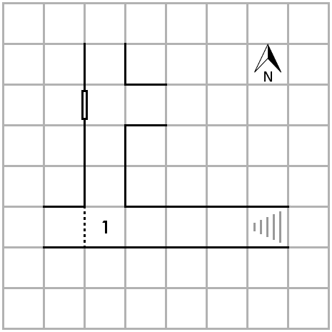
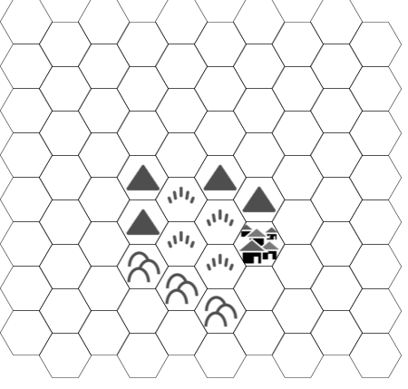
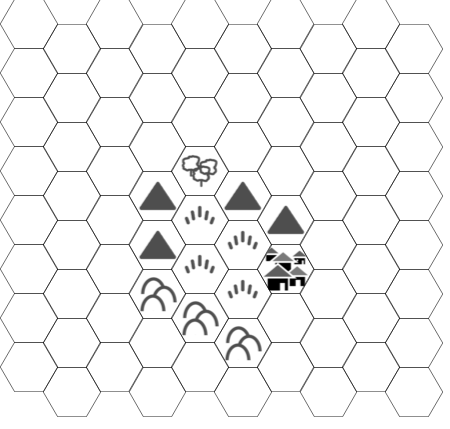
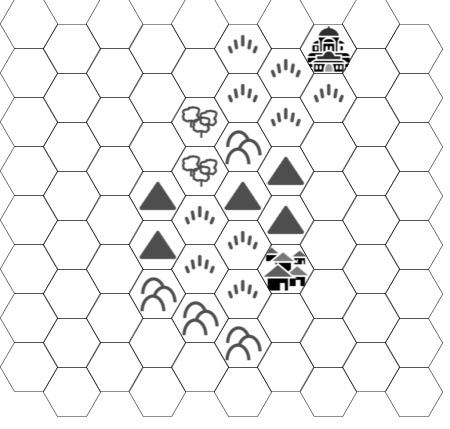

\Large
Menschen & Magie \newline
\normalsize
Ein Spielerhandbuch für Old-School Rollenspiele \newline
Version *beta*, 
Datum:
\newline
Text und Satz: © Laurens Kils-Hütten, 2019 \newline
<lskh3004@gmail.com>
\small

Titelbild: LadyofHats, CC 0, public domain 

OSR-Logo: [Matt S. Jackson, public domain](http://www.msjx.org/2018/11/vintage-logos-2.html)

*Dungeons & Dragons*, *D&D* und *AD&D* sind eingetragene
Warenzeichen von *Wizards of the Coast*

*Swords & Wizardry* ist ein eingetragenes Warenzeichen von Matthew J.
Finch

*Labyrinth Lord* ist ein eingetragenes Warenzeichen von Daniel
Proctor

*OSRIC* ist ein eingetragenes Warenzeichen von Matthew J. Finch und Stuart Marshall

*Basic Fantasy Role Playing Game* ist ein eingetragenes
Warenzeichen von Chris Gonnermann

*Lamentations of the Flame Princess* ist ein eingetragenes
Warenzeichen von James Raggie IV

Der Text und alle Tabellen von *Menschen & Magie* ist Open Game
Content im Sinne der Open Game License, OGL 1.0a

Das heißt, Du darfst dieses Heftchen für Dich und für andere kopieren.
Gib es gerne weiter! 

Es ist auch kein Problem, *Menschen & Magie* für deinen eigenen Open
Game Content zu benutzen, vorausgesetzt, Du hälst Dich dabei an die
Regeln der Open Game License.

Schließlich ist *Menschen & Magie* auch Open Source. Du findest die Quelldateien für dieses Dokument unter 
<https://github.com/lskh/Hausregeln>

\normalsize 

\tableofcontents

\listoftables

Vorwort
=======

\lettrine{A}{m Anfang} war mein Plan einfach nur eine Liste mit
Hausregeln zu verfassen. Dann dachte ich, dass es ganz schön wäre,
wenn alle Spieler ein kleines Heftchen mit den wichtigsten Tabellen
zur Hand hätten. Schließlich ist daraus dieses kleine Spielerhandbuch
geworden. Und das schöne ist, es kann frei ausgedruckt und kopiert 
werden, und völlig legal als PDF weiter gereicht werden.

Doch dieses Heft ist mehr als nur ein Spielerhandbuch. Durch die
Hinweise in den Fußnoten ist es auch ein
kleines Werk über die Geschichte der ersten Versionen von *Dungeons &
Dragons* aus den 70er und 80er Jahren geworden. 

Ermöglicht wird diese Projekt durch die Veröffentlichung der
*Open Game License* und der *System Reference Documents* durch
*Wizards of the Coast* und die Vorarbeit vieler
Mitglieder einer Bewegung, die sich *Old School Renaissance*
(OSR) nennt. Eine Bewegung die seit etwa Mitte der Nuller Jahre 
die alten
Regelwerke neu formuliert veröffentlicht, und darüber hinaus
eine unglaubliche Menge spannender, origineller und zum Teil
in eindrucksvoller künstlerischer Qualität gearbeiteter Werke
hervor gebracht hat.

*Menschen & Magie* ist kein "Retro-Klon" einer bestimmten
früheren Edition sondern eher so eine Art Remix aus den echten
alten Regeln und neueren Regelwerken.  Grundlage für diesen Remix
war zunächst *Labyrinth Lord* ein Retro-Klon der B/X-Edition,
doch beim Sichten und Zusammenstellen der Regeln aus den
verschiedenen Systemen habe ich mich auch an *OSRIC*, *Swords &
Wizardry*, *Lamentations of the Flame Princess* und *Blueholme* 
bedient. Es ist eine bunte Mischung
geworden, die schließlich auch noch Hausregeln aus unserer eigenen
Spielrunde und aus einschlägigen Internetforen enthält.
Zusammenfassend könnte man über *Menschen & Magie* sagen, es hat
die Flexibilität der Charaktererschaffung von *Swords & Wizardry*,
die Gewichtung der Attribute von *B/X*, und die Zähigkeit der
Charaktere wie in *OSRIC* oder *Lamentations of 
the Flame Princess*.

Aufgebaut ist das Heft aus einem einfach gehaltenen Abschnitt 
über die Erschaffung von Stufe 1-Charakteren, einem Abschnitt über 
die Prozeduren und Regeln die während des Spiels zum tragen kommen,
sowie einem Tabellenteil, der im laufenden Spiel und auf höheren 
Spielstufen als schnelle Referenz benutzt werden kann.

Einleitung
===========

\lettrine{M}{enschen und Magie} ist eine Hausregelsammlung für
das erste Fantasy Rollenspiel der Welt. 
Das Prinzip ist einfach, jeder Spieler führt eine
fiktive Figur - üblicherweise Charakter genannt - durch eine
abenteuerliche Fantasywelt voller unwägbarer Gefahren, geheimnisvoller
Magie und fabelhafter Schätze. Die Welt selbst, das Verhalten von
seltsamen Fabelwesen, Monstern aber auch zum Beispiel vom Tavernenwirt
oder vom Händler an der Ecke wird vom Spielleiter beschrieben.

Das funktioniert zum Beispiel so: 

> Spielleiter: ... nachdem Ihr die Kellertreppe herunter gestiegen
> seid, steht ihr in einem kleinen Raum, vielleicht 3 x 4 Meter groß,
> nur von euren Fackeln erleuchtet.
> In der Südost-Ecke stehen zwei Holzfässer die nach Sauerkraut
> riechen, daneben lehnt ein Sack, vielleicht ein Kartoffelsack. In der
> Nordwand seht ihr eine verschlossene Tür aus dicken Eichenbohlen.
> Was tut ihr?
>
> Spielerin von Etzo dem Zwerg: ich sehe mir die Fässer genauer an,
> und hebe mal den Sack an.
>
> Spielleiter: die Fässer sehen aus wie normale Weinfässer. Was
> besonderes kannst Du nicht erkennen. Der Sack ist leichter als er
> aussieht. Er scheint auch keine Kartoffeln zu enthalten, sondern
> etwas weiches, vielleicht Stoff oder Kleidung, als Du ihn wieder
> hinstellst, hörst Du auch ein metallisches Klappern in dem Sack.
>
> Spieler von Hedwig der Kämpferin: ich gehe zu der Tür und lausche,
> was höre ich?
>
> Spielleiter: Du hörst leises Murmeln, menschliche Stimmen ...
>
> Hedwig: kann ich etwas verstehen? Erkenne ich eine von den Stimmen?
>
> Spielleiter: ... ja, doch ... Du hörst eine Stimme die sich genau anhört
> wie die von Haken-Ede ...
>
> Hedwig: ich gebe Etzo ein Zeichen und flüstere ihm zu: "sieht so aus
> als hätten wir den Unterschlupf von Edes Bande gefunden. Los, hol
> die anderen, diese Halunken schnappen wir uns!" 

Das Spiel benötigt also kein Spielbrett, sondern wird in erster Linie
im "Kopfkino" gespielt. Je blumiger die Beschreibungen aller
Beteiligten, desto besser. Und großartig ist natürlich, wenn Du nicht
sagst: 

> "Mein Zwerg geht zum Wirt und bestellt drei Bier" 

sondern 

> "He Wirt, wir sind durstig! Drei Humpen Bier für mich und meine zwei
> wackeren Gefährten! Ho ho, wir haben etwas zu feiern!" 

Und wenn Du dabei auch noch sprichst wie ein
Zwerg, um so besser!

Ziel des Spiels - aus Sicht der Spieler und der Spielleitung -
ist, gemeinsam eine unterhaltsame Geschichte zu erzählen. Dabei
können grandiose Erfolge genauso spannend und unterhaltsam sein,
wie dramatische Niederlagen, oder auch völliges Scheitern. Die
literarischen Vorbilder folgen oft dem Muster der
klassischen Heldenreise: also dem mutigen Aufbruch in die Fremde,
dem Erleben von Abenteuern, dem Entscheiden Müssen in
Schicksalsfragen, schließlich die krisenhafte Auseinandersetzung
mit Scheitern, Untergang und Tod, um dann, vielleicht
transformiert, und hoffentlich geläutert und bereichert zurück zu
kehren.
    
Aus Sicht der Charaktere ist das Ziel des Spiels, möglichst viel
Gold zu bekommen. Denn Gold ist auch die Währung in der in diesem
Spiel *Erfahrung* bemessen wird. Und Erfahrung ermöglicht einem
Charakter höhere Stufen, und damit bessere Fähigkeiten, mehr
Widerstandskraft, höhere Magie und ähnliches zu erlangen. 

Eine der wichtigsten Regeln des Spiels überhaupt ist, dass Du deinen
Charakter **alles** machen lassen kannst was Dir einfällt. Ein *das geht
nicht, dass steht so nicht in den Regeln* sollte es nicht
geben. 

Nochmal weil es so schön ist: **Du kannst deine Figur alles machen
lassen was Du möchtest!**

Wenn Du einkaufen gehen willst, geh einkaufen, wenn Du lieber im Wald
spazieren gehst, nur zu. Wenn Du in einem tiefen Kerker nach Schätzen
suchen willst - großartig! Und falls Du dabei wirklich erfolgreich
sein solltest, bring Dein Geld auf die Bank, spare ein wenig, und kauf
Dir eines Tages deine eigene Burg, kein Problem!

Allerdings kann es sehr gut passieren, dass der Spielleiter von Dir
verlangt zu würfeln, um zu sehen ob Dir dein kühnes Vorhaben gelingt.
Nun hängt das Schicksal von den Würfeln ab, und die können
gnadenlos sein. Die Wahrscheinlichkeit für eine erfolgreiche
Würfelprobe liegt bei Old-School Rollenspielen oft in einer
Größenordnung von 25 bis 50 %, vielleicht etwas besser, wenn
die Figur gute Spielwerte hat.
Tendenziell bedeutet also die Aufforderung des Spielleiters zu würfeln in
etwa: "was Du hier vor hast funktioniert mit großer Wahrscheinlichkeit
**nicht**, oder ist super **gefährlich**, dieser Würfelwurf ist Deine
letzte Chance damit irgendwie davon zukommen". Das Gleiche gilt,
wenn gewürfelt wird um in den Kampf zu ziehen. Kämpfe sind gefährlich! -
meistens tödlich! - aber das wusstest Du wahrscheinlich schon.

Noch was zu den Würfeln: in diesem Spiel werden viele verschiedene
Würfel benutzt. Die normalen sechsseitigen, aber auch 4-, 8-, 10-, 12-
und 20-seitige Würfel. Das sind die *normalen* Gaming Würfel, die man
auch in dieser Zusammenstellung als Satz kaufen kann. 
Aber denk nicht, dass es keine 5-, 7-, 24- oder 30-seitige Würfel gäbe!

Um einen bestimmten Würfel zu bezeichnen werden meistens Abkürzungen
benutzt. W4 = vierseitiger Würfel, W8 = achtseitiger Würfel usw. wenn
irgendwo W100 oder W% steht, dann ist ein Paar zehnseitiger Würfel
gemeint, bei dem der eine für die Einerstellen, und der andere für die
Zehnerstellen benutzt wird.

Um anzugeben wie viele Würfel von welcher Sorte für eine
bestimmte Probe geworfen werden sollen, hat sich folgende
Notation etabliert. Wenn zum Beispiel drei Sechserwürfel gemeint
sind, schreibt man 3W6, und sagt "drei-weh-sechs", bei 2 Zwölfern
entsprechend 2W12 usw. Es kann auch sein, dass noch eine
bestimmte Punktzahl hinzurechnen werden soll. Dann schreibt man
zum Beispiel 1W4+3, womit gemeint ist, dass man einen
vierseitigen Würfel wirft, und dann zu dem Ergebnis 3 addiert. Es
müsste also eine zufällige Zahl zwischen 4 und 7 dabei heraus
kommen. In alten Regelheften und Abenteuermodulen wurde anstelle
von 1W4+3 oft auch nur 4 - 7 angegeben. Der Leser musste dann
selbst austüfteln, mit welcher Kombination von Würfel und Bonus
der entsprechende Wertebereich abgedeckt werden konnte. 

	
Charaktererschaffung
====================

\lettrine{D}{as Spiel beginnt} damit, dass Du dir einen Charakter,
also eine Spielfigur erschaffst. 
Die Eigenschaften und Habseligkeiten Deines Charakters werden auf einem
Blatt Papier fest gehalten, dem so genannten Charakterbogen. Es gibt
dafür alle möglichen Formulare, aber Du kannst auch ein einfaches leeres
Blatt Papier dafür benutzen - ich finde das jedenfalls am meisten *old
school*. Beschrifte Deinen Charakterbogen immer nur mit Bleistift, denn
alle Eintragungen können sich im Laufe des Spiels verändern.

Oben links brauchst Du etwas Platz für den Namen deines Charakters.
Lasse das Feld noch offen, denn Du weißt ja noch nicht was für eine
Figur Du spielen wirst. Oben rechts kannst Du Deinen Namen und
vielleicht auch den Namen des Spielleiters eintragen.  Darunter,
solltest Du Dir ein bisschen Platz für eine kleine Skizze deiner Figur
frei halten.

Oben in die Mitte, zwischen dem Namen des Charakters und deinem Namen
brauchst Du etwas Platz, um *Volk*, *Klasse* und *Stufe* deines
Charakters zu notieren. Zu Klasse und Volk kommen wir gleich, bei Stufe
kannst Du schon mal eine eins eintragen. Du brauchst auch noch ein Feld
um Deine *Gesinnung* zu notieren. Eine Zeile unter *Klasse* würde sich
dafür anbieten.

Am linken Rand des Blattes schreibst Du unter einander die Worte:
"Stärke", "Intelligenz", "Weisheit", "Geschicklichkeit", "Konstitution"
und "Charisma". Das sind die Attribute deines Charakters. Du kannst auch
Abkürzungen benutzen um Platz zu sparen: ST, IN, WE, GE, KO, CH
(*Stinwegekoch*, kann man sich gut merken).  Nun nimmst Du drei
Sechser-Würfel (3W6), und würfelst von oben nach unten, also für
ein Attribut nach dem anderen einen Wert zwischen 3 und 18 aus, und
schreibst ihn hinter das jeweilige Attribut, je höher der Wert, desto
besser. Wenn Du möchtest, kannst Du einmalig den höchsten mit dem
niedrigsten Wert vertauschen. Nun kannst Du schon ein bisschen
erahnen, welche Art von Abenteurer Du hier vor Dir hast. Einen
dümmlichen Kraftprotz?  einen gewitzten Hänfling? jemanden der klug
und charismatisch ist?

Attribute
---------

Stärke \index{Stärke}
:    steht für die Körperkraft eines Wesens. Kämpfer mit 
     einer Stärke von 
     15 oder mehr erhalten einen Aufschlag von 5% auf ihre
     gesammelten Erfahrungspunkte. Außerdem erhalten sie einen
     Aufschlag von +1 auf ihren Trefferwurf im Nahkampf sowie auf
     Schadenswürfe im Nah- und Fernkampf.\label{stbonus}
	  
Intelligenz \index{Intelligenz}
:    stellt quasi das Buchwissen eines Charakters
     dar. Für jeden Punkt über 10 spricht der Charakter eine
     zusätzliche Sprache. Zauberkundige mit einer Intelligenz
     von 15 oder mehr erhalten einen Aufschlag von 5% auf ihre
     gesammelten Erfahrungspunkte.

Weisheit \index{Weisheit}
:    stellt die Intuition, den Instinkt und das gute
     Urteilsvermögen eines Charakters
     dar. Alle Charaktere mit einer Weisheit von 15 oder mehr
     erhalten einen Aufschlag von 5% auf ihre Erfahrungspunkte.
     Da Weisheit das Primärattribut der Kleriker ist, erhalten
     Kleriker mit einer Weisheit von 15 oder mehr 10% Aufschlag
     auf ihre Erfahrungspunkte.
	  
Geschicklichkeit \index{Geschicklichkeit}
:    ist das Resultat aus Koordination und Schnelligkeit. Ein
     hoher Geschicklichkeitswert (15+) gibt einen Bonus von +1 auf
     Angriffswürfe im Fernkampf, also zum Beispiel mit Pfeil und
     Bogen. Ein niedriger Wert (8-) gibt einen Abzug von -1 auf
     entsprechende Angriffswürfe.

Konstitution \index{Konstitution}
:    beschreibt die Zähigkeit eines Charakters, denn sie entscheidet
     mit welchem Würfel die Trefferpunkte des Charakters ermittelt
     werden. Trefferpunkte stehen für die Menge an Schaden, Verletzungen,
     Prellungen aber auch zum Beispiel Rückschlag und Frustration, die
     ein Charakter im Kampf erleiden kann. Sinken die Trefferpunkte
     auf Null geht ein Charakter leblos zu Boden.
	 
     | Konstitution | Trefferwürfel |
     |:------------:|:-------------:|
     |  18          |   W12         |
     |  16 - 17     |   W10         |
     |  13 - 15     |   W8          |
     |  8 - 12      |   W6          |
     |  3 - 7       |   W4          |

Charisma \index{Charisma}
:    kann am besten als Ausdruck für das diplomatische Talent
     und die Führungsfähigkeiten eines Charakters verstanden werden.
     Charaktere mit einem Charismawert von 15 oder mehr erhalten
     einen Bonus von 5% auf ihre Erfahrungspunkte.

     Charisma wirkt sich auch auf die Anzahl und die
     Loyalität von Gefolgsleuten aus, die ein Charakter in 
     seinen Dienst nehmen kann.

     : Charisma Bonus Tabelle

     | Charisma | Gefolgsleute (max. Anzahl) | Loyalität |
     |:--------:|:--------------------------:|:---------:|
     | 3 - 4    |       1                    | -2        |
     | 5 - 6    |       2                    | -2        |
     | 7 - 8    |       3                    | -1        |
     | 9 - 12   |       4                    |  0        |
     | 13 - 15  |       5                    |  +1       |
     | 16 - 17  |       6                    |  +2       |
     | 18       |       7                    |  +2       |

Klassen
-------

Nun ist es an der Zeit eine Klasse für Deinen Charakter zu
wählen. *Menschen & Magie* bietet die ursprünglichen drei Klassen
"Kämpfer", "Kleriker" und "Zauberkundiger". Eine wichtige Rolle
spielt bei der Wahl der Klasse das sogenannte
Primärattribut\index{Primärattribut}. Zum Beispiel ist das
Primärattribut der Kämpfer-Klasse die Stärke. Ein Kämpfer
profitiert von einem hohen Wert in Stärke mehr als andere
Charakterklassen, deshalb ist es taktisch günstig einen Kämpfer
zu wählen, wenn die Würfel einen hohen Wert in Stärke ergeben
haben. Tabelle \ref{pri-atr} gibt eine Übersicht über die vier
Klassen und ihre Primärattribute.

: Primärattribute\label{pri-atr}

| Klasse         | Primärattribut   |
|----------------|------------------|
| Kämpfer        | Stärke           |
| Zauberkundiger | Intelligenz      |
| Kleriker       | Weisheit         |

Wenn Du eine Klasse ausgewählt hast, kannst Du anhand der Angaben
die nächsten Eintragungen auf deinem Charakterbogen machen. 

Den Platz für die Klasse, oben in der Mitte, hattest Du Dir ja
schon frei gehalten. Unter den Feldern für Klasse, Volk und
Gesinnung, also rechts neben
den Attributen und Modifikatoren, solltest Du Dir nun Felder für
Trefferpunkte (TP), Angriffsbonus (AB) und Rüstungsklasse (RK)
einrichten. 

Von der Wahl der Klasse hängt auch unmittelbar die Anzahl der
Trefferpunkte \index{Trefferpunkte} ab, die Dein Charakter hat, 
wenn er das erste Mal ins
Abenteuer zieht.
 
* * * * 

Hausregel
:    Die Trefferpunkte werden bei der Charaktererschaffung
     ausgewürfelt. Unterschreiten die Trefferpunkte allerdings einen
     bestimmten Mindestwert, kann nochmal gewürfelt werden.

     : Minimale Trefferpunkte 

     | Klasse | Trefferpunkte |
     |:--------|:-------:|
     | Kämpfer | 5 | 
     | Kleriker | 4 |
     | Zauberkundige | 3 |

* * * *

Unter dem Feld für die Rüstungsklasse kannst Du als nächstes eine 
kleine Tabelle
mit deinen fünf Rettungswürfen \index{Rettungswürfe} anlegen.  Die
Rettungswürfe heißen "Gift und Todesstrahlen", "Zauberstäbe", "Lähmung
und zu Stein erstarren", "Drachenodem" und "Zaubersprüche, -stecken und
-ruten". Das gibt Dir schon mal eine Idee, in welchen prekären
Situationen Rettungswürfe zum Einsatz kommen könnten. Um Platz
zu sparen, kürze ich die Rettungswürfe meistens ab mit: Gift,
Stäbe, Lähmung, Odem und Sprüche.

### Kämpfer

Primärattribut
:    Stärke

Trefferpunkte
:    1W6+1 

Klassenfähigkeiten
:    Parieren: Kämpfer können sich im Kampf defensiv verhalten, so 
     dass sich ihr Geschicklichkeitsmodifikator als Malus auf den 
     Angriffswurf des Gegners auswirkt.

Klassenbeschränkungen
:    keine

Rettungswürfe
:    Gift: 12, Stäbe: 13, Lähmung: 14, Odem: 15,\newline
     Sprüche: 16

### Kleriker

Primärattribut
:    Weisheit

Trefferpunkte
:    1W6 

Klassenfähigkeiten
:    Kleriker können "Untote" beherrschen, und ab der zweiten Stufe 
     klerikale Magie wirken. \index{Untote!vertreiben}
	 
     Um Untote zu beherrschen werden 2W6 geworfen. Liegt das Ergebnis
     über einem bestimmten Wert, erlangt der Kleriker für eine 
     bestimmte Zeit die Kontrolle über die untoten Kreaturen.
     Der Spielleiter stellt fest, wie viele Untote tatsächlich
     beherrscht werden.
     Wenn Du einen Kleriker spielst, notiere Dir folgende kleine
     Tabelle auf deinem Charakterbogen:
	 
	 ---------- -----
	 Skelette       7
         
	 Zombies        9
	 
	 Ghule         11
         
	 ---------- -----

     Je nach Gesinnung bedeutet "beherrschen" etwas anderes. Kleriker
     guter Gesinnung *vertreiben* die Untoten, während Kleriker böser
     Gesinnung die Untoten in ihren Dienst befehlen können, zum
     Beispiel um eine bestimmte Aufgabe zu erledigen, oder einen
     bestimmten Bereich zu bewachen.
	 
Klassenbeschränkungen
:    Kleriker dürfen nur stumpfe Waffen benutzen.

Rettungswürfe
:    Gift: 11, Stäbe: 12, Lähmung: 14, Odem: 16,\newline
     Sprüche 15

### Zauberkundiger

Primärattribut
:    Intelligenz

Trefferpunkte
:    1W6 

Klassenfähigkeiten
:    Zauberkundige können Zauberkundigensprüche wirken. Um sie
     vorzubereiten müssen sie Zeit aufwenden um den Spruch mit Hilfe
     der magischen Aufzeichnungen im Zauberbuch zu studieren und sich
     so einzuprägen. Das wirken eines Spruches ist für die
     Zauberkundigen so anstrengend, dass die Einzelheiten des Spruches
     nach dem Wirken vergessen werden. Der Spruch kann erst nach
     erneuter Vorbereitung wieder gewirkt werden. Zauberkundige der
     ersten Stufe können nur einen Spruch des ersten Grades pro Tag
     wirken.
	
     * * * * 
     
     Hausregel

	 ~  Zauberkundige der ersten Stufe haben zu Beginn 4
	    Sprüche in ihrem Zauberbuch, und zwar *Magie lesen*,
	    einen nach Wunsch des Spielers ausgewählten Spruch,
	    und zwei zufällig ermittelte Sprüche. Alle weiteren
	    Sprüche müssen im Spiel gefunden bzw. erlernt
	    werden.
	
     * * * * 

Klassenbeschränkungen
:    Zauberkundige dürfen keine Waffen außer Dolchen, Kampfstäben und
     Wurfpfeilen benutzen. Zauberkundige dürfen keine Rüstungen und
     keine Schilde tragen.

Rettungswürfe
:    Gift: 11, Stäbe: 12, Lähmung: 14, Odem: 16,\newline
     Sprüche 15

Unter bestimmten Voraussetzungen kann es auch möglich sein die
Klasse eines Charakters zu wechseln. So etwas ist sicher nicht
alltäglich, sondern eher ein *Life Event* und sollte sich aus der
Geschichte des Spiels ergeben. Daneben gibt auch noch weitere
Klassen wie zum Beispiel Paladine, Waldläufer, Druiden,
Illusionisten, Assassinen oder sogar Mönche. Wenn Du ein anderes
Spielerhandbuch benutzt - was erlaubt ist - findest Du dort
vielleicht Angaben zu anderen Klassen. Meistens kann man diese
Klassen aber nur spielen, wenn man bestimmte Mindestwerte in den
Attributen erwürfelt hat.

Andererseits solltest Du versuchen, Dich nicht durch die
Klassenbezeichnungen einschränken zu lassen. In
Old-School-Rollenspielen wird vieles auf dem Charakterbogen gar
nicht so genau fest gelegt. Du kannst einfach die Klasse nehmen,
die grob am besten zu Deiner Charakteridee passt, und die Details
rollenspielerisch ausfüllen. Der Begriff "Zauberkundiger" - im
englischen original "magic-user" illustriert das ganz gut: Die
Klasse bietet Dir grundsätzlich Zugang zu Magie. Für die
Ausgestaltung Deines Magie-Anwenders gibt es aber viele
verschiedene Möglichkeiten. Du könntest natürlich einen
klassischen Magier mit spitzem Hut spielen, aber genauso gut auch
eine Hexe, einen gelehrten Forscher der arkanen Künste, oder
einen illusionistisch begabten Trickbetrüger.

Genau so gut könnte ein Kleriker auch als Druide oder Schamane
ausgestaltet werden, und ein Kämpfer als stolzer (möchtegern)
Ritter, gewiefter Waldläufer, als geheimnisvolle Amazone
oder auch als ungehobelter Barbar. Und es spricht auch nichts
dagegen, Deinem Charakter noch
einen Beruf zu geben, der vielleicht erstmal nicht besonders
abenteuerlich ist, aber rollenspielerisch interessant sein könnte.

Aber Achtung, investiere nicht zuviel Zeit und Hingabe in die
Hintergrundgeschichte Deines Charakters. Das Abenteurerleben in
Old-School-Spielen kann sehr kurz sein. Du solltest es lieber so
sehen, dass die Hintergrundgeschichte Deines Charakters während
der ersten drei Stufen erspielt wird.

Gesinnung
---------
\index{Gesinnung}

TODO einfaches Gesinnungssystem

In Old-School-Rollenspielen findet man zwei verschiedene
Gesinnungssysteme. Das ursprüngliche, einfachere System unterscheidet
zwischen *rechtschaffen*, *neutral* und *chaotisch*. In den komplexeren
Systemen findet man zusätzlich noch die Achse *böse*, *neutral*, *gut*.

Um möglichst gut mit den verschiedenen Systemen kompatibel zu sein,
werden hier alle neun Gesinnungen angegeben, die das zweidimensionale
Gesinnungssystem aus der *ersten
Edition* von 1979 bietet.

Die Achse gut - neutral - böse ist wohl selbsterklärend. Die Achse
rechtschaffen - neutral - chaotisch lässt sich vielleicht am
einfachsten mit Bezug auf externe Wertesysteme verstehen. Ein
rechtschaffener Charakter glaubt an das Gute in Gesetzen und Regeln,
die Bedürfnisse der Allgemeinheit zählen mehr als individuelle
Bedürfnisse. Der Chaotische Charakter hingegen steht Regeln und
Gesetzen ablehnend gegenüber, individuelle Interessen gehen vor
Interessen der Allgemeinheit.

: Gesinnungen\index{Gesinnung!Tabelle}

----------------------- ---------------------- ---------------------
 rechtschaffen-gut         neutral-gut           chaotisch-gut 
 rechtschaffen-neutral     neutral              chaotisch-neutral 
 rechtschaffen-böse       neutral-böse           chaotisch-böse 
--------------------------------------------------------------------

*Mahatma Ghandi* wäre nach diesem System 
rechtschaffen-guter Gesinnung, während die Hippies ein schönes
Beispiel für chaotisch-gut wären. Befehlstreue Nazi-Schergen wären
rechtschaffen-böse (sozusagen gesetzestreue Menschenverachtung), und
für chaotisch-böse ist der *Joker* aus den Batman-Geschichten ein
gutes Beispiel, oder ein außer Kontrolle geratener Killer-Roboter
... oh Mann ... jedenfalls gruselig. Die meisten Tiere sind einfach
nur neutral. 

Um es einfach zu machen: Dir steht es frei, das Gesinnungssystem nach
deinem Geschmack zu nutzen. Wenn Dir wichtig ist, dass deine Figur
rechtschaffen-neutral ist, ist das in Ordnung, Du kannst aber auch
einfach nur zwischen chaotisch, neutral und böse unterscheiden. 

Sprachen
--------

Es wird angenommen, dass die meisten Menschen und Halbmenschen (also
Zwerge, Halblinge und Elfen) die sogenannte
"Gemeinsprache"\index{Sprache!Gemein-}
sprechen - sich also ohne Schwierigkeiten unterhalten können.
Elfen und Zwerg sprechen darüber hinaus die Sprache ihrer
Völker. Viele
Monster haben aber ihre eigenen Sprachen, und sprechen unter Umständen
die Gemeinsprache nicht, was die Verhandlungen erschweren kann.

Daneben gibt es auch für jede Gesinnung
eine sogenannte Gesinnungssprache\index{Sprache!Gesinnungs-}.
Diese sollte man sich aber wohl eher wie eine Art Geheimsprache
vorstellen, die aus besonderen Handzeichen oder Gesten besteht,
die jeweils nur den Menschen und Kreaturen einer bestimmten Gesinnung
bekannt sind.

Magie
-----

Zauberkundige lernen ihre Sprüche durch kostspielige Ausbildung
bei einem Meister, magische Forschung oder durch glückliche
Zufälle während ihrer Abenteuer.  Um einen Spruch wirken zu
können, müssen sie ihn mit Hilfe ihres Zauberbuches
\index{Zauberbuch} studieren und sich
einprägen\index{Zauberspruch!vorbereiten}. Wird der Spruch
einmal gewirkt, ist der Zauberkundige in Folge der Anstrengungen
des Spruchwirkens nicht mehr in der Lage, den gleichen Spruch
noch einmal zu wirken, sondern der Spruch muss auf die gleiche
Weise erneut vorbereitet werden.  Daher können Zauberkundige der
ersten Stufe nur einen einzigen Spruch pro Tag wirken. Einmal
gelernte Sprüche werden aus dem Gedächtnis gewirkt. Es ist also
nicht erforderlich, dass der Zauberkundige sein Zauberbuch -
unter Umständen ein gewichtiger Foliant - mit sich herum trägt um
vorbereitete Zauber wirken zu können. Allerdings kann er auch
keine neuen Sprüche vorbereiten, sollte er keinen Zugriff auf
sein Zauberbuch haben, oder dieses gar verlieren.

Kleriker "lernen" ihre Sprüche durch Kontemplation und Gebet, oder wie
sonst auch immer sie ihrer jeweiligen Gottheit huldigen mögen.
Viele Klerikersprüche dienen Schutz, Gesundheit und
Heilung\index{Heilung}. 
Daher ist es für viele Unternehmungen lebenswichtig
einen Kleriker dabei zu haben, und es kann taktisch klug sein,
dem Kleriker zu helfen so schnell wie möglich die zweite Stufe zu
erlangen, damit er in die Lage versetzt wird, Sprüche wirken zu
können. Kleriker können frei auswählen, welchen Spruch aus der
Liste der Klerikersprüche sie an einem bestimmten Tag vorbereiten
wollen.\index{Zaubersprüche}

Einige Sprüche, sowohl die der Kleriker, als auch der
Zauberkundigen, können umgekehrt werden. Diese
Sprüche\index{Sprüche umkehren} sind in den
Tabellen mit einem Sternchen gekennzeichnet. Kleriker können
Sprüche, die sie zuvor bereits durch ihr Gebet erhalten haben,
spontan umkehren - was sie natürlich in Konflikt mir ihrer
Gottheit bringen könnte. 
Zauberkundige müssen den umgekehrten Spruch explizit
vorbereiten, und können ihn dann auch nur so wirken.

### Spruchrollen
\index{Spruchrollen}

Es kann gut sein, dass die Abenteurer auf ihren Unternehmungen
auf Pergamentrollen geschriebene Sprüche entdecken. Vielleicht
als Bestandteil eines Schatzes, oder man bietet ihnen 
eine Spruchrolle zum Kauf, oder als Lohn für eine besondere
Aufgabe an.

Bei diesen Spruchrollen kann es sich um Klerikersprüche - die von
jedem (!) gewirkt werden können - oder um Zauberkundigen-Sprüche
handeln. Letztere können nur von Zauberkundigen benutzt werden.
Sprüche von einer Spruchrolle werden - unabhängig von der Stufe des
Anwenders - durch lautes Vorlesen gewirkt. Es ist also mit Hilfe
von Spruchrollen möglich, sehr mächtige Sprüche zu wirken, zu
denen sonst gar kein Zugang bestehen würde. Auch wirken sich von
Spruchrollen gewirkte Sprüche nicht auf das Kontingent der
vorbereiteten Sprüche aus.

Allerdings verschwindet die magische Schrift der Spruchrollen von
dem Pergament, sobald der Spruch einmal gewirkt wurde. Sprüche
von Spruchrollen können also nur ein einziges mal gewirkt werden.

Zauberkundigen steht es frei, den Spruch - nachdem er
mit *Magie lesen* einmalig entziffert wurde - in ihr Buch
einzutragen, um ihn später immer wieder vorbereiten und wirken zu
können. Auch dann verschwinden die magischen Runen allerdings von
der Spruchrolle.

Schließlich können Zauberkundige Zeit und Geld in die Herstellung
eigener Spruchrollen investieren[^scrolls]. Die Kosten dafür betragen
eine Woche Arbeit und 100 GM pro Spruch-Grad. Einen Spruch des dritten
Grades auf eine Spruchrolle zu transkribieren dauert also 3 Wochen *In
Game*-Zeit, und kostet den Zauberkundigen 300 GM. Und natürlich kann der
Zauberkundige nur solche Sprüche auf Rollen schreiben, die er schon
kennt und in seinem Sprüchebuch hat.

[^scrolls]: Dieses ist eine besondere Regel aus der *Holmes-Edition*. 
    In den meisten Editionen können nur Zauberkundige ab der 7. Stufe 
    selbst Spruchrollen schreiben. Ich finde diese Regel zu
    Spruchrollen sehr gut, da sie Charakteren niedriger Stufen mehr 
    Möglichkeiten bietet, und ich nicht sehe, dass durch diese Regel
    das Spielgleichgewicht ernsthaft gestört werden könnte.

### Spruchforschung und neue Sprüche

Zauberkundige können auch völlig neue Sprüche entwickeln. Dieses 
ist allerdings sehr aufwändig und es gibt keine Garantie für Erfolg.

Wenn Du eine Idee für einen neuen, genialen Zauberspruch hast,
besprich Deine Idee in Ruhe mit dem Spielleiter. Vielleicht muss der
Effekt noch etwas angepasst werden, um nicht zu mächtig für den
gewünschten Spruch-Grad zu sein. Wenn ihr Euch einig seid, muss der
Zauberkundige eine Woche Arbeit und 2.000 GM pro Spruch-Grad in die
Forschung investieren, und dann 1W100 werfen. Bei einem Wurf von 20
oder weniger - also mit einer Wahrscheinlichkeit von 20 % - gelingt es
dem Zauberkundigen, seinen Spruch erfolgreich umzusetzen und in sein
Zauberbuch einzutragen[^spells].

[^spells]: Auch dieses ist eine Spezialregel aus der Holmes-Edition. 
     Ich finde sie großartig, da sie schon Charakteren niedriger Stufen
     ermöglicht, spannende Details zur Spielwelt beizutragen. In
     anderen Editionen können ebenfalls erst Zauberkundige höherer
     Stufen selbst Sprüche entwickeln, und Gary Gygax verlangte in
     seinem *Dungeon Masters Guide* von 1979, dass der Spieler dem 
     Spielleiter "eine mit Schreibmaschine geschriebene Beschreibung"
     des Spruchs vorlegen müsse, damit dieser beurteilt werden
     kann ...

### Magische Gegenstände
\index{Magische Gegenstände}

In der Spielwelt gibt es unzählige verschiedene magische
Gegenstände. Dabei kann es sich um Tränke und Elixiere, Ringe,
Schmuckstücke, Zauberstäbe, magische Rüstungen, Waffen oder
sonstige Gegenstände handeln. 

Viele Gegenstände haben spruchähnliche Wirkungen wie zum Beispiel
ein *Amulett der Unsichtbarkeit*. Zauberstäbe
\index{Zauberstäbe} haben häufig eine 
begrenzte Anzahl von "Ladungen" - ein *Feuerball Stab* wäre ein
Beispiel. Manche Gegenstände wirken nur ein einziges Mal, wie zum
Beispiel ein *Wunschring*.

**Magische Rüstungen** \index{Rüstung!magische}verbessern die Rüstungsklasse. Zum Beispiel
hätte ein magisches Kettenhemd+1 eine Rüstungsklasse von 4 statt
5 (niedrige Rüstungsklassen sind besser als hohe). Gleichzeitig
wirken sich magische Rüstungen weniger auf die Belastung
\index{Belastung!Magische Rüstungen} aus.

**Magische Waffen** \index{Waffen!magische} geben Aufschläge auf
Treffer- und Schadenswurf.  Ein magischer Morgenstern+2 verbessert
also die Trefferwahrscheinlichkeit um 10%, und verursacht immer 2
Punkte mehr Schaden, als es bei einem gewöhnlichen Morgenstern der
Fall wäre. 

Da es Kreaturen gibt, die überhaupt nur mit magischen Waffen
verletzt werden können, werden manche Unternehmungen hoffnungslos
sein, wenn keiner der Abenteurer über eine magische Waffe
verfügt.

Manche magische Waffen haben eine besonders
ausgeprägte Wirkung gegenüber bestimmten Kreaturen. Es wäre also
zum Beispiel ein *magisches Schwert +1/+3 gegen Drachen* denkbar.

Mit magischen Schwertern \index{Schwerter!magische} hat es
überhaupt eine besondere Bewandtnis. Häufig kann man sie an einem
geheimnisvollen Glimmen ihrer Klinge erkennen, manchmal so hell,
dass sie im Dunklen ausreichend Licht spenden. Schwerter mit
einer besonderen Wirkung gegen bestimmte Kreaturen werden
regelrecht aufleuchten, wenn sich eine entsprechende Kreatur in
der Nähe befindet. Schließlich soll es Schwerter geben, die so
voller Magie sind, dass sie ihrem Besitzer ermöglichen, bestimmte
Sprüche zu wirken, und manche Schwerter haben sogar einen eigenen
Willen und können selbstständig Kämpfen. Solche Schwerter
verfolgen dann auch meistens ihre eigenen schwer durchschaubaren
Ziele.

### Erkennen und Identifizieren magischer Gegenstände

Die meisten magischen Gegenstände sehen aus wie ganz gewöhnliche
Gegenstände. Einige mögen mit geheimnisvollen Runen oder Symbolen
verziert sein. 

Mit einem *Magie entdecken* Spruch, kann auch ein unerfahrener
Magier feststellen, *dass* ein Gegenstand magische Eigenschaften
hat. Er kann jedoch nicht erkennen, genau welche!

Die Wirkung magischer Gegenstände kann meistens
durch schlichtes ausprobieren festgestellt werden, was aber auch
Risiken birgt. Zum Beispiel könnte es passieren, dass ein
magischer Helm nach einmaligem aufsetzen erst einmal nicht mehr
abgenommen werden kann.

Erfahrene Zauberkundige, die einen Spruch wie *Identifizieren*
oder ein entsprechendes Ritual beherrschen, können einen
Gegenstand genau analysieren, und dessen magischen Eigenschaften
und Wirkungen vorhersagen.

### Verfluchte Gegenstände

Genauso wie Gegenstände mit nützlichen magischen Eigenschaften
belegt sein können, kann es auch verfluchte Gegenstände geben.
Dabei kann es sich um eher unterhaltsame Effekte handeln, wie zum
Beispiel, dass sich die Kleidung des Betroffenen in Luft auflöst,
oder dessen Nase plötzlich unnatürliche Proportionen annimmt. Es
können aber auch dramatische Dinge geschehen. 

Nicht ganz selten, kann der Fluch
der auf einem magischen Gegenstand liegt, seinen Träger auf eine
bestimmte Queste zwingen, und ihn ansonsten mit immer schlimmer
werdenden Albträumen heimsuchen, falls er nicht alles daran setzt
das Ziel der verfluchten Mission zu erreichen.

Zaubersprüche
-------------

Die folgende Spruchauswahl orientiert sich stark an den
ursprünglichen Regeln von 1974 bzw. an *Swords & Wizardry*. Wenn
keine Angaben zu einem Rettungswurf oder einer
Materialkomponente gegeben sind, ist auch explizit kein
Rettungswurf vorgesehen, bzw. keine Materialkomponente
erforderlich.

: Klerikersprüche des 1. Grades

|   | Klerikersprüche des 1. Grades | Seite                                 |
|---|-------------------------------|---------------------------------------|
| 1 | Heilen leichter Wunden*        | \pageref{heilen-leichter-wunden}      |
| 2 | Wasser und Nahrung reinigen*   | \pageref{wasser-und-nahrung-reinigen} |
| 3 | Zauberei erkennen             | \pageref{zauberei-erkennen}           |
| 4 | Böses erkennen*                | \pageref{buxf6ses-erkennen}              |
| 5 | Schutz vor Bösem*              | \pageref{schutz-vor-buxf6sem}            |
| 6 | Licht*                         | \pageref{licht}                       |

: Zauberkundigensprüche des 1. Grades

|   | Zauberkundigensprüche des 1. Grades | Seite                       |
|---|-------------------------------------|-----------------------------|
| 1 | Zauberei erkennen                   | \pageref{zauberei-erkennen} |
| 2 | Magischer Riegel                    | \pageref{magischer-riegel}  |
| 3 | Zauber lesen                        | \pageref{zauber-lesen}      |
| 4 | Sprachen lesen                      | \pageref{sprachen-lesen}    |
| 5 | Schutz vor Bösem*                    | \pageref{schutz-vor-buxf6sem}  |
| 6 | Licht*                              | \pageref{licht}             |
| 7 | Person bezaubern                    | \pageref{person-bezaubern}  |
| 8 | Schlaf                              | \pageref{schlaf}            |

#### Böses erkennen*
\index{Böses erkennen}

Zaubergrad
:    Kleriker 1, Zauberkundiger 2

Reichweite
:    Kleriker: 120' (36m), Zauberkundiger 60' (18m)

Dauer
:    Kleriker: 1 Phase + 1/2 Phase pro Stufe, Zauberkundiger 5 Runden
     pro Stufe

Materialkompenenten
:    Der Kleriker muss sein heiliges Symbol vor sich halten

Wirkung
:    In einem 10' (3 m) breiten Korridor in Blickrichtung des
     Zaubernden kann die böse, oder gute Ausstrahlung von Geschöpfen
     und Gegenständen erkannt werden - insofern sie eine Gesinnung
     haben. Eine Giftschlange oder eine mechanische Falle sind zwar
     gefährlich, haben aber keine böse Ausstrahlung, es sei denn sie
     wären mit einem entsprechenden Zauber belegt. 

#### Heilen leichter Wunden*
\index{Heilen leichter Wunden*}

Stufe
:    Kleriker 1

Sprechzeit
:    1 Runde

Reichweite
:    Berührung

Dauer
:    dauerhaft

Wirkung
:    Mit diesem Spruch kann der Kleriker sich selbst oder einem
     anderen Wesen 2 - 7 (1W6+1) Trefferpunkte heilen. Es ist nicht
     möglich die Trefferpunkte über den ursprünglichen Wert
     anzuheben. Der Spruch ist umkehrbar, und *verursacht* dann 2 - 7
     Punkte schaden. Da auch dafür eine Berührung erforderlich ist,
     muss der Kleriker einen erfolgreichen Trefferwurf ausführen, bevor
     er Schaden verursachen kann. Je nach Gesinnung des Klerikers wird
     seine Gottheit unter Umständen nicht damit einverstanden sein,
     dass er seine Macht nutzt um Schaden zu verursachen.

#### Licht*

Stufe
:    Kleriker 1, Zauberkundige 1

Sprechzeit
:    1 Runde

Reichweite
:    120'

Dauer
:    12 Runden

Rettungswurf
:    Sprüche	

Materialkompenenten
:    keine

Wirkung
:    Mit diesem Spruch kann magisches Licht von der Helligkeit einer Fackel erzeugt werden.
Die Lichtquelle ist selbst unbeweglich, kann aber auf einen beweglichen Gegenstand, oder auch
auf die Augen eines Wesens gewirkt werden. In letzterem Fall wird das Wesen durch den Zauber
geblendet, sofern ihm ein Rettungswurf misslingt.

     Der Zauber kann umgekehrt gewirkt werden, und erzeugt dann magische Dunkelheit.     

#### Magischer Riegel
\index{Magischer Riegel}

Auch bekannt als *Hält Türen* \index{Hält Türen}\index{Magischer Riegel}.

Stufe
:    Zauberkundige 1

Sprechzeit
:    1 Runde

Reichweite
:    20' (6 m) / Stufe

Dauer
:    1 Runde / Stufe

Wirkung
:    Mit diesem Spruch werden Türen, Tore oder ähnliches für die
Wirkdauer magisch verschlossen. Sie können immer noch mit roher
Gewalt eingerannt werden. Ein *Klopfen* Spruch oder *Magie
zerstören* beendet die Spruchwirkung.

#### Person bezaubern
\index{Person bezaubern}

Stufe
:    Zauberkundige 1

Sprechzeit
:    1 Runde

Reichweite
:    120' (36 m)

Dauer
:    bis der Zauber gebrochen wird (!)

Rettungswurf
:    Sprüche

Wirkung
:    Eine mit diesem Spruch bezauberte Person sieht in dem
Spruchwirker einen guten Freund und Verbündeten, für den sie sich
innerhalb gewisser Grenzen vorteilhaft einsetzen wird. Eine
bezauberte Person wird bemüht sein, angemessenen Bitten des
Spruchwirkers nachzukommen, sie wird sich aber nicht kopflos in
den Untergang stürzen. 

#### Schlaf
\index{Schlaf}

Stufe
:    Zauberkundige 1

Sprechzeit
:    1 Runde

Reichweite
:    240' (80 m)

Dauer
:    5 Runden pro Stufe

Materialkompenenten
:    Eine Prise feiner Sand, Rosenblätter oder eine lebende Grille

Wirkung
:    Der Zauber lässt 2W8 Trefferwürfel an lebenden Wesen für die
genannte Dauer in einen Tiefschlaf verfallen. Durch Schläge oder
Tritte können sie geweckt werden. So lange sie schlafen, kann
ihnen aber automatisch, d.h. ohne Trefferwurf Schaden zugefügt
werden. 

#### Schutz vor Bösem*
\index{Schutz vor Bösem}

Umkehrbar zu *Schutz vor Gutem*

Stufe
:    Kleriker 1, Zauberkundige 1

Reichweite
:    Berührung

Dauer
:    Kleriker 3 Runden pro Stufe, Zauberkundige 2 Runden pro Stufe

Materialkompenenten
:    Um den Empfänger muss mit Weihwasser (oder Blut im Falle des
umgekehrten Zaubers) ein 1 m
durchmessender Kreis auf den Boden gezeichnet werden.

Wirkung
:    Der Zauber gibt den Angriffswürfen von bösen Kreaturen einen
Abzug von -2 und den Rettungswürfen des Empfängers +2. Durch eine
magische Hülle, die den Empfänger umgibt werden verzauberte,
beschworene oder herbeigerufene Wesen daran gehindert den
Empfänger auch nur zu berühren.

#### Sprachen lesen
\index{Sprachen lesen}

Stufe
:    Zauberkundige 1

Reichweite
:    Berührung

Dauer
:    2 Phasen

Materialkompenenten
:    Eine Prise Ruß und etwas Salz

Wirkung
:    Der Spruch erlaubt dem Spruchwirker, ihm unbekannte Zeichen
und Sprachen zu entziffern. Der Spruch erlaubt nicht das
automatische Lösen von Rätseln!

#### Wasser und Nahrung reinigen*
\index{Wasser und Nahrung reinigen}

Stufe
:    Kleriker 1

Reichweite
:    10' (3 m)

Dauer
:    permanent

Wirkung
:    Mit diesem Spruch können Nahrung und Wasser für bis zu 12 Personen wieder genießbar gemacht werden, wenn sie
zuvor verschmutzt, vergiftet oder auf andere Art kontaminiert
wurden. Der umgekehrte Spruch vergiftet Wasser und Nahrung ...
eine perfide Angelegenheit.

#### Zauberei erkennen
\index{Zauberei erkennen}

Stufe
:    Zauberkundige 1, Kleriker 1

Reichweite
:    Zauberkundige 60' (18 m), Kleriker 30' (9 m)

Dauer
:    Zauberkundige 2 Runden pro Stufe, Kleriker 

Materialkomponente
:    Zauberkundige keine, Kleriker müssen ihre heiliges Symbol
benutzen.

Wirkung
:    in einem 10' (3 m) breiten Bereich in 
Blickrichtung werden magische Gegenstände und magische
Ausstrahlungen erkannt. Der Spruch wird durch dicke Steinwände,
Metall von mehr als 2 cm, und Holz von mehr als 90 cm Dicke
blockiert.

#### Zauber lesen
\index{Zauber lesen}

Stufe
:    Zauberkundige 1

Reichweite
:    nur der Zauberkundige selbst

Dauer
:    2 Schriftrollen oder andere einzelne Absätze magischer
Schriftzeichen

Materialkomponente
:    ein Kristallprisma

Wirkung
:    Lässt die Zauberkundige magische Runen entziffern. Wenn sie
einen Spruch auf einer Spruchrolle oder aus einem Zauberbuch
damit einmal entziffert hat, kann genau diese magische
Schrift fortan ohne erneutes Wirken des Spruches
gelesen werden.

Silber und Gold
----------------

Nachdem Du nun also einen fertigen Charakter hast, ist es an der
Zeit sie auszurüsten. Dazu brauchst Du Geld. Oder besser gesagt
Gold\index{Geld}! 

Das Startgeld eines Charakters wird ermittelt mit einem Wurf von 3W6,
dessen Ergebnis mit 10 multipliziert wird. Charaktere starten also mit
30 - 180 GM.

Basisausrüstung
----------------
\index{Ausrüstung!Pakete}

: Ausrüstungstabelle Kleriker

----------------------------------------------------------------------------------
 3d6    Ausrüstung
------- --------------------------------------------------------------------------
 3      Knüppel, 6 Fackeln, Rucksack, Wasserschlauch, Eiserne Rationen 
        für 7 Tage, 3 m Holzstange, hölzernes heiliges Symbol, 4 GM 

 4      Knüppel, Schild, 6 Fackeln, Rucksack, Wasserschlauch, Eiserne 
        Rationen für 7 Tage, 15 m Seil, hölzernes heiliges Symbol, 4 GM 

 5      Steitkolben, Lederrüstung, 6 Fackeln, Rucksack, Wasserschlauch, 
        Eiserne Rationen für 7 Tage, 3 m Holzstange, hölzernes heiliges 
        Symbol, 5 GM 

 6      Kampfstab, Lederrüstung, 6 Fackeln, Rucksack, Wasserschlauch, 
        Eiserne Rationen für 7 Tage, 15 m Seil, 12 Eisennägel, hölzernes 
        heiliges Symbol, 3 Pflöcke & Hammer, Stahlspiegel, 10 GM 

 7      Kettenrüstung, Kriegshammer, 6 Fackeln, Rucksack,  
        Wasserschlauch, Eiserne Rationen für 7 Tage, 3 m Holzstange,    
        hölzernes heiliges Symbol, 2 kleine Säcke, 8 GM 
 
 8      Kettenrüstung, Schild, Steitkolben, 6 Fackeln,
        Rucksack, Wasserschlauch, Eiserne Rationen für 7 Tage, 15 m Seil,
        hölzernes heiliges Symbol, 2 kleine Säcke, 8 GM 
 
 9      Kettenrüstung, Schild, Kriegshammer, 6 Fackeln, Rucksack, 
        Wasserschlauch, Eiserne Rationen für 7 Tage, 3 m Holzstange, 
        hölzernes heiliges Symbol, 2 kleine Säcke, 3 Pflöcke & Hammer, 
        Stahlspiegel, 10 GM

 10     Plattenrüstung, Schild, Steitkolben, 6 Fackeln, Rucksack, 
        Wasserschlauch, Eiserne Rationen für 7 Tage, 15 m Seil, 
        hölzernes heiliges Symbol, 10 GM

 11     Plattenrüstung, Schild, Kriegshammer, Rucksack, Wasserschlauch,
        Laterne, 4 Ölfläschchen, Eiserne Rationen für 7 Tage, 3 m 
        Holzstange, hölzernes heiliges Symbol, 1 kleiner Sack, 2 GM 
 
 12     Plattenrüstung, Kampfstab, Rucksack, Wasserschlauch, Laterne, 
        4 Ölfläschchen, Eiserne Rationen für 7 Tage, 15 m Seil, 
        silbernes heiliges Symbol, 4 GM 

 13     Knüppel, 6 Fackeln, Rucksack, Wasserschlauch, Eiserne Rationen 
        für 7 Tage, 3 m Holzstange, hölzernes heiliges Symbol, 
        Spruchrolle, 4 GM 

 14     Plattenrüstung, Schild, Steitkolben, Rucksack, Wasserschlauch, 
        Laterne, 4 Ölfläschchen, Eiserne Rationen für 7 Tage, 15 m Seil, 
        silbernes heiliges Symbol, 10 GM

 15     Lederrüstung, Steitkolben, 6 Fackeln, Rucksack, Wasserschlauch, 
        Eiserne Rationen für 7 Tage, 3 m Holzstange, hölzernes heiliges 
        Symbol, Spruchrolle, 2 Ölfläschchen, 1 GM 

 16     Plattenrüstung, Schild, Helm, Kriegshammer, Rucksack, 
        Wasserschlauch, Laterne, 4 Ölfläschchen, Eiserne Rationen für 
        7 Tage, 15 m Seil, silbernes heiliges Symbol, 3 Pflöcke & 
        Hammer, Stahlspiegel, 12 GM 

 17     Kettenrüstung, Kriegshammer, 6 Fackeln, Rucksack, 
        Wasserschlauch, Eiserne Rationen für 7 Tage, 3 m Holzstange,     
        hölzernes heiliges Symbol, Spruchrolle, 10 GM 

 18     Plattenrüstung, Schild, Helm, Steitkolben, Rucksack, 
        Wasserschlauch, Laterne, 4 Ölfläschchen, Eiserne Rationen für 
        7 Tage, 15 m Seil, silbernes heiliges Symbol, Phiole heiliges 
        Wasser, 12 Eisennägel, 3 Pflöcke & Hammer, 1 kleiner Sack,
        10 GM

----------------------------------------------------------------------------------

: Ausrüstungstabelle Kämpfer

----------------------------------------------------------------------------------
 3W6    Ausrüstung Kämpfer
------- --------------------------------------------------------------------------
 3      Speer, Dolch, 6 Fackeln, Rucksack, Wasserschlauch, Eiserne 
        Rationen für 7 Tage, 15 m Seil, 3 GM    

 4      Knüppel, Lederrüstung, 6 Fackeln, Rucksack, Wasserschlauch, 
        Eiserne Rationen für 7 Tage, 3 m Holzstange, 1 GM        

 5      Lederrüstung, Morgenstern, Dolch, 6 Fackeln, Rucksack, 
        Wasserschlauch, Eiserne Rationen für 7 Tage, 15 m  Seil, 3 GM                 

 6      Lederrüstung, Streitaxt, Wurfbeil, Dolch, Schleuder, Tasche mit 
        20 Steinen, 6 Fackeln, Rucksack, Wasserschlauch, Eiserne Rationen 
        für 7 Tage, 3 m Holzstange, 7 GM           

 7      Kettenrüstung, Speer, Dolch, Schleuder, Tasche  mit 20 Steinen, 
        6 Fackeln, Rucksack, Wasserschlauch, Eiserne Rationen für 7 Tage, 
        15 m Seil, 11 GM    

  8     Kettenrüstung, Schild, Schwert, Dolch, 6 Fackeln, Rucksack, 
        Wasserschlauch, Eiserne Rationen für 7 Tage, 3 m Holzstange, 4 GM

  9     Kettenrüstung, Speer, leichte Armbrust, Kasten mit 30 Bolzen, 6 
        Fackeln, Rucksack, Wasserschlauch, Eiserne Rationen für 7 Tage, 
        15 m Seil, 11 GM              

 10     Plattenrüstung, Schild, Schwert, Dolch, 6 Fackeln, Rucksack, 
        Wasserschlauch, Eiserne Rationen für 7 Tage, 3 m Holzstange, 4 GM 
 
 11     Plattenrüstung, Zweihänder, 3 Dolche, 6 Fackeln, Rucksack, 
        Wasserschlauch, Eiserne Rationen für 7 Tage, 15 m Seil, 
        2 Ölfläschchen, 9 GM

  12    Plattenrüstung, Schild, Schwert, leichte Armbrust, Kasten mit 
        30 Bolzen, 6 Fackeln, Rucksack, Wasserschlauch, Eiserne Rationen 
        für 7 Tage, 3 m Holzstange, 2 GM
                                         
  13    Plattenrüstung, Flegel, Dolch, Kurzbogen, Köcher mit 20 Pfeilen, 
        6 Fackeln, Rucksack, Wasserschlauch, Eiserne Rationen für 7 Tage, 
        15 m Seil, 1 kleiner Sack, 10 GM                                                  

  14    Plattenrüstung, Schild, Schwert, leichte Armbrust, Kasten mit 
        30 Bolzen, Rucksack, Wasserschlauch, Laterne, 4 Ölfläschchen, 
        Eiserne Rationen für 7 Tage, 3 m Holzstange, 5 GM                                                

  15    Plattenrüstung, Helm, 2 Streitäxte, Dolch, leichte Armbrust, 
        Kasten mit 30 Bolzen, 6 Fackeln, Rucksack, Wasserschlauch, Eiserne 
        Rationen für 7 Tage, 15 m Seil, 5 Ölfläschchen, 15 GM                             

  16    Plattenrüstung, Zweihänder, Dolch, Kurzbogen, Köcher mit 20 
        Pfeilen, Rucksack, Wasserschlauch, Laterne, 4 Ölfläschchen, 
        Eiserne Rationen für 7 Tage, 3 m Holzstange, 2 kleine Säcke, 15 GM                            

  17    Plattenrüstung, Helebarde, Dolch, Langbogen, Köcher mit 20 
        Pfeilen, 2 Pfeile mit Silberspitze, Rucksack, Wasserschlauch, 
        Laterne, 4 Ölfläschchen, Eiserne Rationen für 7 Tage, 15 m Seil, 
        10 GM                             

  18    Plattenrüstung, Schild, Helm, Schwert, 2 Dolche, leichte Armbrust, 
        Kasten mit 30 Bolzen, 4 Bolzen mit Silberspitze, Rucksack, 
        Wasserschlauch, Laterne, 4 Ölfläschchen, Eiserne Rationen für 7 
        Tage, 3 m Holzstange, 9 GM   

----------------------------------------------------------------------------------

: Ausrüstungstabelle Zauberkundiger

----------------------------------------------------------------------------------
 3W6    Ausrüstung Zauberkundiger
------- --------------------------------------------------------------------------
  3     Dolch, 6 Fackeln, Rucksack, Wasserschlauch, Eiserne Rationen für 
        7 Tage, 3 m Holzstange, 4 GM 

  4     2 Dolche, 6 Fackeln, Rucksack, Wasserschlauch, Eiserne Rationen 
        für 7 Tage, 2 Ölfläschchen, 15 m Seil, 7 GM 

  5     Dolch, Rucksack, Wasserschlauch, Laterne, 4 Ölfläschchen, Eiserne 
        Rationen für 7 Tage, 3 m Holzstange, 7 GM 

  6     Dolch, 6 Fackeln, Rucksack, Wasserschlauch, Eiserne Rationen für 
        7 Tage, 15 m Seil, 1 Phiole Weihwasser, 9 GM 

  7     Dolch, 6 Fackeln, Rucksack, Wasserschlauch, Eiserne Rationen für 
        7 Tage, 3 m Holzstange, 5 Ölfläschchen, Silberspiegel, Belladona, 
        9 GM 

  8     Dolch, 6 Fackeln, Rucksack, Wasserschlauch, Eiserne Rationen für 
        7 Tage, 15 m Seil, 2 Phiolen Weihwasser, 4 GM 

  9     3 Dolche, Rucksack, Wasserschlauch, Laterne, 4 Ölfläschchen, 
        Eiserne Rationen für 7 Tage, 3 m Holzstange, 1 Phiole Weihwasser, 
        16 GM 

 10     Dolch, 6 Fackeln, Rucksack, Wasserschlauch, Eiserne Rationen für 
        7 Tage, 15 m Seil, 2 Phiolen Weihwasser, 24 GM 

 11     Dolch, Rucksack, Wasserschlauch, Laterne, 4 Ölfläschchen, 
        Eiserne Rationen für 7 Tage, 3 m Holzstange, 67 GM 

 12     Dolch, Rucksack, Wasserschlauch, Laterne, 4 Ölfläschchen, 
        Eiserne Rationen für 7 Tage, 15 m Seil, 77 GM 

 13     Dolch, 6 Fackeln, Rucksack, Wasserschlauch, Eiserne Rationen für 
        7 Tage, Spruchrolle, 3 m Holzstange, 4 GM

  14    2 Dolche, 6 Fackeln, Rucksack, Wasserschlauch, Eiserne Rationen 
        für 7 Tage, Spruchrolle, 15 m Seil, 11 GM
  
  15    Dolch, Rucksack, Wasserschlauch, Laterne, 4 Ölfläschchen, Eiserne 
        Rationen für 7 Tage, Spruchrolle, 3 m Holzstange, 7 GM
 
  16    Dolch, Rucksack, Wasserschlauch, Laterne, 4 Ölfläschchen, Eiserne 
        Rationen für 7 Tage, Spruchrolle, 15 m Seil, 17 GM
  
  17    Dolch, Rucksack, Wasserschlauch, Laterne, 4 Ölfläschchen, Eiserne 
        Rationen für 7 Tage, Spruchrolle, 3 m Holzstange, 27 GM
  
  18    Dolch, Rucksack, Wasserschlauch, Laterne, 4 Ölfläschchen, Eiserne 
        Rationen für 7 Tage, Spruchrolle, 15 m Seil, 37 GM

----------------------------------------------------------------------------------

Hausregel
    ~ Schilde \index{Schilde} können *einen* Treffer aufnehmen, und sind
      dann zerstört. Diese Regel ist im Internet bekannt als
      *shields shall be splintered* [^shields]

[^shields]:
<http://trollsmyth.blogspot.com/2008/05/shields-shall-be-splintered.html>

Den Charakter vollenden
-----------------------

Nach dem der Charakter nun Attribute hat, die Modifikatoren ermittelt
wurden, eine Klasse und die dazu gehörigen Trefferpunkte,
Rettungswürfe ermittelt wurden, nach dem der Charakter vielleicht die
ersten Zaubersprüche gelernt hat, etwas Startgeld bekommen hat, und
davon eine Ausrüstung gekauft wurde, kann jetzt auch noch der letzte
wichtige Spielwert, nämlich die Rüstungsklasse auf dem Charakterbogen
eingetragen werden.

Ganz unten sollte noch etwas Platz eingerichtet werden, um zu
notieren, bei wie viel Erfahrungspunkten die nächste Stufe erreicht
wird, dann kann es los gehen. 

Schließlich könnte es noch sein, dass Dir dein Primärattribut einen
Bonus bei der Berechnung von Erfahrungspunkten einbringt. Du erhältst
einen Zuschlag entsprechend der Beschreibung der einzelnen
Attribute. 

Um es noch einmal mit einem Beispiel zu verdeutlichen: angenommen
Du spielst einen Kämpfer mit Stärke 15, also einem guten Wert im
Primärattribut \index{Primärattribut} der Kämpfer. Wenn dieser
Kämpfer sich 100 Erfahrungspunkte verdient hat, ermöglicht das
hohe Primärattribut einen Aufschlag von 5%. Er darf sich also
statt 100 Erfahrungspunkten 105 Erfahrungspunkte anschreiben.
Ein hoher Wert im Primärattribut ermöglicht einem Charakter
schneller höhere Stufen zu erreichen.

Ins Abenteuer ziehen
====================

Grob gesagt kann man die Geschehnisse einer Spielrunde meistens
in eine von drei Kategorien einteilen. Das Stadtabenteuer, das
Erkunden von Höhlen und Verliesen, auch bekannt als *Dungeon
Crawl* und drittens das Wildnisabenteuer, oder die Überlandreise.

In einem typischen Old School Spiel gibt es keinen vorgefertigten
Plot für ein bestimmtes Abenteuer. Vielmehr kannst Du davon
ausgehen, dass die Spielleiterin eine sogenannte *Sandbox*
vorbereitet hat. Das ist ein mehr oder weniger großer Ausschnitt
einer Fantasy-Welt mit allen möglichen interessanten Orten,
gefährlichen Kreaturen und verborgenen Schätzen, in der sich die
Spielerfiguren frei bewegen können. Der Spielleiter wird
vielleicht mehr oder weniger offensichtlich 
sogenannte "Plot-Hooks" \index{Plot-Hook}- also Aufhänger - 
anbieten. Was ihr
tatsächlich unternehmt, welchem Plot-Hook ihr vielleicht folgt,
ist ganz alleine Eure Entscheidung als Spieler. 

Würfelproben
------------
\index{Proben}

In Old-School Rollenspielen wird in erster Linie durch die
Spieler beschrieben und erzählt was die Charaktere unternehmen
und die Spielleiterin wird dann, mal spontan, mal anhand einer
verdeckten Würfelprobe entscheiden was passiert.

Wie aber bereits in der Einleitung erwähnt, kann die Spielleiterin
gelegentlich auch Würfelproben durch die Spieler verlangen, 
um festzustellen, ob eine Aktion gelingt. Dabei kann es sich um
eine Attributsprobe handeln, oder einen Rettungswurf.
Typischerweise kommen Attributsproben zum Tragen, wenn die
Initiative vom Spielercharakter ausgeht - also nichts passieren
würde, wenn der Charakter einfach nur still stehen bliebe.
Rettungswürfe spielen dagegen eine Rolle, bei Ereignissen denen der
Charakter passiv ausgesetzt ist, und auf deren
Ausgang er nur geringen Einfluss hat.

### Attributsproben
\index{Proben!W20 basiert}\index{Proben!Attributs-}

Attributsproben werden "gegen" ein Attribut gewürfelt - also
gegen Stärke, Intelligenz, Weisheit, Geschicklichkeit,
Konstitution oder Charisma - je nach dem, welches Attribut in der
jeweiligen Situation relevant ist. Für eine
erfolgreiche Probe muss auf dem W20 eine Zahl **kleiner oder
gleich** dem jeweiligen Attributswert gewürfelt werden.

Versucht beispielsweise ein Charakter mit Geschicklichkeit 12 auf 
einen Baum zu klettern,
kann die Spieleiterin eine *Probe gegen Geschicklichkeit*
verlangen. Würfelt der Spieler eine 8 gelingt es dem Charakter
den Baum zu erklettern. Ergibt der Wurf dagegen eine 13 scheitert
der Charakter - vielleicht war seine Rüstung zu sperrig, oder ein
Ast ist abgebrochen.

### Rettungswürfe
\index{Rettungswürfe}

Rettungswürfe beziehen sich auf den Wert, den ein Charakter in
einer bestimmten Rettungswurf-Kategorie hat. Also in "Gift und
Todesstrahlen", "Stäbe", "Lähmung und Versteinerung",
"Drachenodem" und "Zaubersprüche". Ein Rettungswurf gelingt, wenn
der Würfel eine Zahl **größer oder gleich** dem Zielwert ergibt.

Angenommen ein Stufe 1 Kämpfer mit einem Wert von 12 in "Gift und
Todesstrahlen" wird von einer giftigen Schlange gebissen. Würfelt
er eine 12, hat er Glück und überlebt die Wirkung des Giftes, bei
einer 11 jedoch hätte sein letztes Stündlein geschlagen.

Stadtabenteuer
--------------

Typischerweise beginnt eine Spielsession in der Taverne einer 
menschlichen Ansiedlung. Das mag etwas abgedroschen klingen, ist
aber aus verschiedenen Gründen sehr wirkungsvoll um ins Spiel 
zu kommen. 

Während Ihr - Du
merkst ich spreche Dich jetzt als dein Spielercharakter an - also
in der Taverne sitzt, und Euch von dem alten einbeinigen Mann
mit der Augenklappe sagenhafte alte Geschichten erzählen lasst,
sind wir ganz klar im ersten Spielmodus, dem Stadtabenteuer. Es
geht darum, sich zu orientieren, Gerüchte (höchst wahrscheinlich
Plot-Hooks) in Erfahrung zu
bringen, vielleicht einen Auftraggeber für einen gut bezahlten
Job zu finden und Einkäufe zu erledigen um die Ausrüstung
aufzustocken. Vielleicht muss ein verletzter
Gefährte noch ein paar Tage rasten, bevor ihr aufbrechen könnt.

In dieser Spielphase wird meistens kaum gewürfelt, sondern es ist
die Zeit für intensives Rollenspiel. Komm' mit dem alten Mann ins
Gespräch, bestelle beim Wirt großzügig eine Runde für deine
Gefährten. Du kannst - und solltest auch versuchen mit anderen
Personen ins Gespräch zu kommen. Gebe deinem Charakter eine
Stimme, probiere verschiedene Stimmlagen aus, vielleicht einen
Akzent, eine ulkige Redensart, lass ihn oder sie persönliche 
Markenzeichen entwickeln. Und noch ein kleines Geheimnis 
zum *Alten Mann*: er ist das geheime Sprachrohr der
Spielleiterin. Es könnte sein, dass sie Euch - in der
Rolle des alten Mannes - entscheidende Hinweise zu raunt. Aber
umgekehrt könnt ihr auch den alten Mann fragen, wenn ihr Fragen
als an den Spielleiter habt. Insbesondere wenn Du noch nie so ein
Rollenspiel gespielt hast, und alles ganz schön verwirrend
findest. Versuche Deine Frage aus Sicht deiner Spielerfigur zu
formulieren, und frag' den alten Mann in der Taverne!
\index{Taverne!alter Mann in der -} Du kannst
natürlich gerne auch jeden anderen NSC ansprechen (so
werden die Nicht-Spieler-Charaktere\index{NSC}, also die Figuren, 
die von
der Spielleitung geführt werden, genannt). Alle NSC
können als geheime Telegrafieleitung zum Spielleiter genutzt
werden. Insbesondere der Aufenthalt in der Taverne dient letztlich
dazu, Euch eine Idee zu geben, was ihr unternehmen könnten, und
so dem Spiel eine Richtung zu geben.

Neben dem ganzen Gequatsche können Stadtabenteuer aber auch
wirklich abenteuerlich sein. Vielleicht kommt es in der Taverne
zu einer Schlägerei, oder ihr werdet auf dem Weg in Euer
Nachtquartier von Straßenräubern überfallen. Und nicht selten
findet sich der Eingang zum nächsten Dungeon gleich im Keller
unter der Taverne. Wenn ihr's nicht glaubt könnt ihr ja mal nach
sehen. Schließlich sind Städte und Dörfer oft die Orte wo es in
Wirklichkeit das meiste Gold gibt. Ist ja auch logisch: wenn
Heerscharen von Abenteurern in Grotten und Wildnis ausziehen um
Gold zu finden, müssen sie es ja am Ende irgendwo hin bringen.
Und unsere Regel ist ja auch, dass nur ausgegebenes Gold für das
Ansammlung von Erfahrung zählt. Je nach dem wie Deine Gesinnung
ist, könntest Du ja an dieser Stelle mal
über den Pfandleiher gleich neben dem Juwelier gegenüber vom
Kontor des Stadtkämmerers nachdenken, oder zumindest über die
Schatulle des Tavernenwirts.

Womit wir bei einem wichtigen Aspekt des Stadtabenteuers wären:
Aufenthalte in der Stadt kosten Geld. Tu' dem Spielleiter einen
riesigen Gefallen und führe während der Phase des Stadtabenteuers
selbst Buch über deine Ausgaben. Jede Übernachtung kostet ein paar
Münzen, und auch jede Mahlzeit. Der Wirt wird Dir schon sagen,
was Du zu zahlen hast (Sprachrohr...). Sollte Dir das Geld
ausgehen, sei nicht betrübt, das ist der Sinn der Sache! Erstens
verdienst Du Erfahrungspunkte, und zweitens musst Du dich jetzt
umschauen: nach einem Job, dem Beutel deines Nachbarn, oder nach
dem Pfandleiher - und schon geht das Abenteuer los. 

Wenn Du ein echter *Munchkin*[^munchkin]\index{Munchkin} bist, 
dann ziehst Du
natürlich bevorzugt ins nächste Dungeon, verprügelst ein paar
Monster, nimmst ihnen ihr Gold weg, und bezahlst dann damit deine
offene Rechnung beim Tavernenwirt - der alte Mann mit 
dem Papagei auf der Schulter wird stolz auf Dich sein! 

[^munchkin]: So nennen Rollenspiel-Nerds die bis aufs letzte
    Detail optimierten Charaktere erfahrener Spieler. Rüstungsklasse
    -1 durch magische Rüstung und Geschicklichkeitsbonus, 30
    Trefferpunkte, Angriffsbonus +6 durch Stufe, Stärkebonus 
    und *Ring der Unsichtbarkeit*, extra Schaden mit der magischen 
    *Axt der vielfachen Zerteilung* und durch 
    die *Ogerkraft-Handschuhe* ...

TODO: Gefolgsleute und Mietlinge

Der Dungeon Crawl
-------------------
\index{Dungeon Crawl}

Im Stadtabenteuer wird der Verlauf der Zeit häufig stark
abstrahiert. Der Spielleiter erzählt vielleicht einfach, dass ihr
"noch zwei weitere Tage" mit Vorbereitungen verbringt, um dann
aufzubrechen. Vielleicht wird grob in vormittags, nachmittags und
abends eingeteilt.

Sobald sich das Geschehen der Handlung aber an einen 
gefährlichen Ort wie eben ein typische Verlies - einen *Dungeon* -
verlagert, bekommt das Spiel einen anderen Rhythmus.

### Spielphasen
\index{Phase}

Der Spielleiter beginnt nun das Geschehen in jeweils 10-minütige
Phasen einzuteilen. Alles wofür die Spielercharaktere *in der
Spielwelt* ungefähr 10 Minuten benötigen wird als Phase gezählt.
Das kann in Realzeit schnell abgehandelt sein, zum Beispiel wenn
die Spieler erklären, dass sie einen Raum gründlich absuchen,
oder einfach erzählt wird: "ihr bewegt Euch vorsichtig weitere 60
Fuß den Gang hinunter". In beiden Fällen sind *in game* jeweils
10 Minuten - also eine Phase - vergangen[^phase]. Andererseits
kann aber eine Phase auch *echte* 10 Minuten beanspruchen, zum
Beispiel wenn Die Charaktere vor einer verschlossenen Tür stehen
und *in Echtzeit* diskutieren, ob sie die Tür nun einrennen
sollen, oder nicht. Schließlich kann eine Phase auch mehr als 10
Minuten Realzeit in Anspruch nehmen, nämlich dann, wenn es sich
um eine Aktion handelt, die *in game* zwar sicher nicht mehr als
10 Minuten in Anspruch nehmen würde, aber am Spieltisch in
Realzeit mehr als zehn Minuten braucht, um in allen Einzelheiten
durchgespielt zu werden.

Die Einteilung in Phasen ist spielmechanisch aus verschiedenen
Gründen wichtig. Die Geschwindigkeit, mit der sich die
Abenteurer durch einen Dungeon bewegen können, wird in *Fuß pro
Phase* gemessen - selten auch in Meter pro Phase. Wurde also eine
bestimmte Distanz im Dungeon zurück gelegt, ist entsprechend auch
eine bestimmte Anzahl Phasen verstrichen, egal wie lange das
Spiel in Realzeit gedauert hat. Es wird angenommen, dass die
Charaktere nach 5 Phase *Dungeon Crawling* eine Pause von der
Dauer einer Phase benötigen, um nicht zu erschöpfen - was 
natürlich zu Abzügen bei den  nächsten Würfelproben führen könnte. 

Und schließlich wird auch das Geschehen der Spielwelt durch das
Verstreichen von Phasen angetrieben. Die Spielleitung wird
nämlich typischerweise alle zwei bis drei Phasen würfeln um zu
prüfen ob es zu einer zufälligen Begegnung,
\index{Zufallsbegegnung} zum Beispiel mit einem sogenannten
"wandernden" Monster \index{Monster!wandernde} kommt.  Wandernde
Monster - dabei kann es sich um ein oder mehrere echte Monster,
aber auch sonstige NSC, oder auch mal um eine konkurrierende, vom
Spielleiter geführte Abenteurergruppe handeln - lassen die
Spielwelt lebendig erscheinen. Es wäre ja ungewöhnlich wenn die
Monster immer nur dann in Erscheinung träten, wenn sie von den
Abenteurern aktiv aufgesucht werden. Sicherlich haben auch
*Goblins* ihre eigenen Angelegenheiten zu erledigen. 

[^phase]: Die Bewegung in einer Phase findet relativ langsam
    statt. In den abstrakten Ablauf einer Phase werden Tätigkeiten
    wie das Suchen nach Fallen, beobachten der Umgebung, Zeichnen
    einer Karte, immer wieder stehen bleiben um zu Lauschen und
    ähnliches einkalkuliert.

### Karten zeichnen

Während Ihr einen Dungeon oder eine ähnliche unbekannte Umgebung
erkundet, solltet ihr unbedingt eine Karte zeichnen. Sprecht Euch
als Gruppe ab, wer den Job des Kartenzeichners übernimmt.
Traditionell wird das Kartenzeichnen als *in game* Tätigkeit
aufgefasst. Das heißt, während Du als Spieler mit einem Bleistift
in der Hand auf einem Stück Karo-Papier zeichnest, 
schreitet Dein Charakter mit vorsichtigen
Schritten und vielleicht einem Stück Baumrinde und einem rußigen
Stöckchen in der Hand durch die Höhle, beobachtet, und schätzt,
versucht alle Details zu erfassen, um sie auf seiner "Karte" fest
zu halten. 

Prädestiniert für diese Aufgabe sind natürlich die
Zauberkundigen, da sie sich in gefährlichen Umgebungen ohnehin
lieber nicht in der ersten Reihe aufhalten sollten, in der
Regel des Schreibens mächtig sind, und wahrscheinlich auch Feder,
Tinte und vielleicht sogar ein Stück Pergament bei sich haben - 
schließlich haben sie studiert.

Um eine Karte zu zeichnen höre genau zu, was die Spielleiterin
sagt. Sie wird zu Beispiel erzählen:

> "... nachdem ihr die Treppe hinunter gestiegen seid, und 
> ungefähr 40 Fuß in westlicher Richtung zurück
> gelegt habt ist der Weg vor Euch mit Gitterstäben versperrt
> allerdings zweigt in nördlicher Richtung ein Gang ab.
>  
> Alle Gänge hier sind übrigens ungefähr 10 Fuß hoch und
> 10 Fuß breit. 
> 
> Etwa 30 Fuß in nördlicher Richtung, soweit wie das
> Licht eurer Fackeln reicht, erkennt ihr auf der Westseite eine
> Tür und auf der Ostseite scheinbar eine weitere Abzweigung
> ..."

Deine Zeichnung könnte also nun zum Beispiel ungefähr so
aussehen wie in Abbildung 1. Ihr steht gerade da, wo die "1" ist,
und schaut nach Norden.

{ width=50% }

10 Fuß pro Kästchen ist ein sehr üblicher Maßstab zum
Kartenzeichnen, und 10 Fuß Breite und 10 Fuß Höhe ist auch das
weit verbreitete Standard-Maß für die Gänge eines Dungeons. 
Wenn Du keine Angaben zur Breite eines Ganges erhalten hast, dann
geh davon aus, dass er 10 Fuß breit ist. Genauso kannst Du davon
ausgehen, dass Abzweigungen rechtwinkelig verlaufen, wenn hierzu
keine speziellen Angaben gemacht wurden.

Da Du am Anfang noch nicht weißt, in welche
Richtung euch die Gänge führen werden, fange einfach in der Mitte
des Blattes an. Wahrscheinlich musst Du dann relativ bald irgend
wo ein neues Blatt anbauen, aber das macht ja nichts.

Für die Charaktere ist das Anfertigen einer Karte die
Voraussetzung, sich überhaupt im Dungeon zu recht
zu finden. Nur so können sie im Notfall auch den Weg zum 
Ausgang wieder finden. Dir als Spieler - und natürlich der ganzen
Spielrunde - hilft es, sich das Ganze besser vorstellen zu können.  

Es kommt überhaupt nicht darauf an, dass die Karte genau mit der
geheimen Karte des Spielleiters übereinstimmt. Die Charaktere
laufen ja schließlich nicht mit Messlatten durch den Dungeon,
sondern schätzen grob wie viele Schritte sie von einer zur
nächsten Abzweigung zurück gelegt haben. Genauso grob darf Eure
Karte gerne sein. Vielleicht hat der
Spielleiter ja auch gar keine Karte und improvisiert gerade - wer
weiß das schon. 

Wenn Dir etwas zu den räumlichen Bedingungen unklar ist, kannst
Du den Spielleiter fragen - am besten solltest Du dies in eine
Handlung deines Charakters verpacken:

> "ich konnte nicht genau erkennen, ob nicht auf der Südseite
> doch noch eine Tür ist. Ich schau mir den Raum nochmal genau
> an, was sehe ich?"

Wenn dann immer noch etwas unklar ist, konnten die Charaktere
eben einfach nicht alles genau erfassen. So ist das Leben im
Dungeon nun einmal. Der Spielleiter sollte wirklich nur in
Ausnahmefällen selbst auf Eurer Karte etwas einzeichnen, oder
korrigieren.

### Belastung
\index{Belastung}

Je nach dem wie viel Ausrüstung und Schätze die Abenteurer mit
sich herum schleppen, sind sie mehr oder weniger *belastet*.
Charaktere mit einer höheren Belastung können sich weniger
Schnell bewegen, als Charaktere mit weniger Belastung. Die alten
Regeln zur Belastung waren ziemlich aufwendig, es musste das
Gewicht jedes einzelnen Gegenstandes festgehalten
und zusammengerechnet werden, um die Gesamtbelastung zu 
ermitteln - eine Buchhaltungsorgie!

Das folgende Belastungssystem aus *Lamentations of the Flame
Princess* ist mit den früheren Regeln zur Belastung
kompatibel, aber viel leichter zu handhaben. 
Für bestimmte Gegenstände oder Gruppen von Gegenständen werden
Belastungspunkte vergeben. Auf der Bewegungstabelle kann dann die
unter der gegebenen Belastung noch mögliche Geschwindigkeit 
abgelesen werden.

: Belastungspunkte

| Gegenstände                | Belastungspunkte |
|----------------------------|:----------------:|
| Kettenhemd, Schuppenpanzer | +1               |
| Plattenrüstung             | +2               |
| > 5 kleine Gegenstände     | +1               |
| > 10 kleine Gegenstände    | +2               |
| > 15 kleine Gegenstände    | +3               |
| > 20 kleine Gegenstände    | +4               |
| 1 übergroßer Gegenstand    | +1               |

Normale Kleidung, und Rüstung die leichter ist als ein 
Kettenhemd werden nicht extra
gezählt. Mengen von gleichen kleinen Gegenständen wie zum Beispiel
Pfeile, Krähenfüße oder Armbrustbolzen zählen als jeweils ein
Gegenstand. Als übergroße Gegenstände gelten zweihändige Waffen, und
generell jeder Gegenstand, der mit zwei Händen getragen werden muss,
wie zum Beispiel eine Truhe. Sehr leichte Gegenstände wie zum Beispiel
eine Schreibfeder, oder einzelne Pergamentrollen werden gar nicht gezählt.

### Bewegung
\index{Bewegung}

Die folgende Tabelle zeigt die verschiedenen Geschwindigkeitsstufen
eines Charakters in Abhängigkeit von der Belastung. Mit *BW* ist die
Basis Geschwindigkeit oder *basic move* gemeint. Sie wurde in den
früheren Ausgaben noch in Inch - also einer Spielbrettdistanz -
angegeben und dann je nach Umgebung auf Fuß oder Yards bzw. Meter hoch
gerechnet. In der letzten Spalte findet sich die Angabe für die Anzahl
an Kästchen, die auf einem typischen Spielfeld pro Runde zurück gelegt
werden kann.

: Belastungsstufen

-------------------------------------------------------------------------
 Belastungs-    BW (")    BW (m)    Bewegung    Bewegung     5' Kästchen
 Punkte                             pro Phase   pro Runde
------------- --------- ---------- ----------- ------------ ------------- 
  0-1            12"	  36 m          120'       40'            8

   2             9"       27 m           90'       30'            6

   3             6"       18 m           60'       20'            4

   4             3"        9 m           30'       10'            2
	
   5+            0"        0 m            0'        0'            0
-------------------------------------------------------------------------

Um es noch einfacher zu machen, kannst Du Dich auch an folgenden
Belastungsstufen orientieren:

: Belastungsstufen, vereinfacht

---------------------------------------------------------------------
Ausrüstung/Gepäck       BW (m)    Bewegung   Bewegung    5' Kästchen
                                 pro Phase   pro Runde
---------------------  -------- ----------- ----------- -------------
Unbelastet,             36 m     120'        40'            8
kein Gepäck
 
Kettenrüstung           27 m     90'         30'            6
oder Gepäck
 
Plattenrüstung          18 m     60'         20'            4
oder
Kettenrüstung
und Gepäck 

Plattenrüstung           9 m     30'         10'            2
und Gepäck
--------------------------------------------------------------------- 

Wildnisabenteuer
----------------
\index{Wildnisabenteuer}

Entscheidet Ihr euch in die Ferne zu ziehen, um vielleicht weiter
entfernte Ruinen zu erforschen, von denen Euch der alte Mann in 
der Taverne erzählt hat, beginnt ein Wildnisabenteuer.

In diesem Spielmodus wird nicht jeder einzelne Schritt
ausgespielt, sondern ihr erklärt wie, ob zu Fuß oder zu Pferd, und 
in welche Richtung ihr Euch bewegen wollt, und die Reise findet
dann quasi im Zeitraffer statt. 
Der Spielleiter beschreibt Euch die
Landschaft, durch die ihr reist, und erzählt, wem ihr
begegnet, und was sich sonst an Ereignissen auf Eurer Reise
ergeben mögen. Auch wenn ihr in der Wildnis unterwegs seid,
würfelt der Spielleiter in bestimmten Intervallen auf
Zufallsbegegnungen.

Seid darauf gefasst, dass Begegnungen in der Wildnis durchaus
gefährlich sein können. Auf ausgetretenen Routen zwischen zwei
Ortschaften werdet ihr vielleicht eher Probleme mit Wegelagerern
haben, aber abseits der Straßen könntet ihr durchaus einmal
unerwartet einem Riesen oder einem Drachen gegenüberstehen.

Natürlich kann es auch gut sein, dass ihr auf Eurer Reise durch die
Wildnis eine Höhle oder eine alte Ruine entdeckt, dann wären wir
wieder beim Dungeon Crawl. Oder ihr erreicht eine benachbarte
Ortschaft, so dass das Spiel wieder auf Stadtabenteuer
umschaltet.

Um es mit den Richtungsangaben 
einfacher zu haben, werden Wildniskarten traditionell auf Papier mit
Sechseck-Raster gezeichnet. Deshalb wird dieser Spielmodus auch
*Hex crawl* \index{Hex crawl} genannt.  
Meistens wird das Raster so ausgerichtet,
dass die Hexfelder auf der Seite liegen (und nicht auf der Spitze
stehen). Entsprechend hätte also jedes Hexfeld eine Nord- eine
Süd-, eine Nordost-, eine Südost, und eine Nordwest- und eine
Südwest-Seite. Und an genau diese Himmelsrichtungen wird sich 
der Spielleiter in seiner Beschreibung halten.

Abbildung \ref{hexmap-1} zeigt eine Karte wie Du sie zum
Beispiel gezeichnet haben könntest, nachdem der Spielleiter Euch
folgende Beschreibung gegeben hat:

> "... ihr habt das Dorf in nordwestlicher Richtung verlassen. Im
> Nordosten seht ihr eine Gebirgskette, die in nordwestlicher
> Richtung verläuft. Im Südwesten seht ihr, dass das Land nach
> einigen Meilen zu einer Hügellandschaft ansteigt. Weit vor Euch
> im Nordwesten seht ihr ebenfalls einige Berge..."

{ width=80% }

Ihr entscheidet Euch, die Ebene in Richtung der Berge im
Nordwesten zu durchqueren. Der Spielleiter erzählt:

> "... nach ereignisloser Wanderung erreicht ihr am späten
> Nachmittag den Fuß der Berge im Nordwesten. Nun seht ihr, dass
> im Norden ein dichter Wald beginnt ..."

Abbildung \ref{hexmap-2} zeigt, wie die Karte nun aussieht.
Du konntest lediglich im Norden ein Symbol für dichten Wald
ergänzen, denn durch die ganzen Bäume oder auch die Berghänge im
Nordosten und im Nordwesten kann man ja nicht weit gucken.

{ width=80% }

Nach einer unruhigen Nacht, während der ihr abwechselnd Wache
gehalten habt, seid Ihr am nächsten Tag aufgebrochen, um den
Wald in nordöstlicher Richtung zu durchqueren. Nur mit Glück
konntet ihr auf dem Weg im letzten Moment einem Grünen 
Drachen[^drache] ausweichen, der irgendwo in dem Wald sein Lager zu 
haben scheint. Abends schließlich erreicht ihr einige Hügel im
Nordosten des Waldes, von wo aus ihr eine weitere größere Ebene
in nordöstlicher Richtung überblicken könnt. Viele Meilen im Nordosten
seht ihr im Dunst, von der Abendsonne angeleuchtet, die Silhouette
einer Stadt ...

Aber wo wir gerade beim Thema waren: ihr solltet immer Wachen
aufstellen, wenn ihr in der Wildnis kampiert, denn auch für jede
Nacht wird die Spielleiterin auf wandernde Monster würfeln.
Typischerweise wird die Nacht in drei Wachen eingeteilt: Abend,
tiefe Nacht, auch bekannt als "Hundewache" und die Morgenstunden. 

[^drache]: Ihr solltet Euch eine Notiz machen, dass ihr in diesem
Hexfeld einen Drachen gesehen habt. Entweder weil ihr in Zukunft
lieber vermeiden wollt, diese Gegend zu bereisen, oder weil ihr
Euch überlegt, nach gründlicher Planung und Zusammenstellung
einer entsprechenden Ausrüstung auf Drachenjagd zu gehen. 

Abbildung \ref{hexmap-3} zeigt, wie die Karte
nun aussieht.

{ width=80% }

Du siehst, dass man offensichtlich über weite Ebenen, oder erst
Recht von erhöhten Positionen weiter gucken kann, und so auch
Informationen über weiter entfernte Hexfelder erhalten kann.
Befindet man sich dagegen in einem Tal zwischen zwei Bergketten,
kann man noch gerade etwas aus dem direkt angrenzenden Hexfeld
erkennen. Steht man im Wald, kann man überhaupt nichts über
die angrenzenden Hexfelder erfahren - außer man fragt die
freundlichen Waldbewohner, wie es 6 Meilen von hier im Südwesten
aussieht.

### Bewegungstempo in der Wildnis

Wie im Dungeon wirkt sich eure Belastung auf das Bewegungstempo
in der Wildnis aus. Meistens werden Wildniskarten in einem
Maßstab von 6 Meilen pro Hexfeld gezeichnet. Entsprechend
könnt Ihr an einem Tag zurücklegen:

: Bewegung in der Wildnis

--------------------------------------------------
 Belastung-   Meilen pro Tag   6-Meilen-Hexfelder  
 Punkte                        pro Tag 
------------ ---------------- --------------------
  0-1             24              4
    
    2             18              3

    3             12              2

    4              6              1
--------------------------------------------------

Natürlich hängt die Geschwindigkeit auch von der Art des Geländes
ab. 

: Bewegung ja nach Gelände

-------------------------------------------
Geländeart           Bewegungstempo
------------------- -----------------------
Straßen                3/2

Offenes Gelände,       normal
Steppen, Pfade

Wald, Hügel            2/3

Gebirge, Sumpf         1/2
Dschungel
-------------------------------------------

### Verirren

Schließlich kann es natürlich, abseits von Straßen, oder wenn Ihr
nicht zum Beispiel einem Flusslauf folgt, auch dazu
kommen, dass ihr Euch verirrt. Geht also nicht fest davon aus,
dass Eure Karte immer richtig ist. Achtet darauf in welcher
Richtung die Sonne untergeht. Vielleicht könnt ihr nachts den
Nordstern erkennen. Achtet auf Landmarken oder fragt andere
Reisende nach dem richtigen Weg.

Kampf
-----

Um einen Angriff auszuführen wird mit einem zwanzigseitigen Würfel
gegen eine bestimmte Rüstungsklasse gewürfelt. Mit dem
Trefferwurf muss ein bestimmter Wert erreicht oder überschritten
werden. Trage Dir folgende Tabelle auf deinem Charakterbogen ein,
um zu sehen, welche Zahl Du zum Treffen einer bestimmten
Rüstungsklasse mindestens erreichen musst:

: Angriffstabelle für Stufe 1 Charaktere

RK       |  9 |  8 |  7 |  6 |  5 |  4 |  3 |  2 |  1 |  0 | -1 |
---------|----|----|----|----|----|----|----|----|----|----|----|  
1W20     | 10 | 11 | 12 | 13 | 14 | 15 | 16 | 17 | 18 | 19 | 20 |  

\index{Angriffstabelle}

Das ist die Treffertabelle für normale Stufe 1 Charaktere. Solltest Du
aber zum Beispiel ein Kämpfer mit einem Stärkemodifikator von +1 sein,
dann solltest Du die Tabelle anpassen:

: Angriffstabelle, Stufe 1 mit Angriffsbonus +1

RK       |  9 |  8 |  7 |  6 |  5 |  4 |  3 |  2 |  1 |  0 | -1 |
---------|----|----|----|----|----|----|----|----|----|----|----|  
1W20     |  9 | 10 | 11 | 12 | 13 | 14 | 15 | 16 | 17 | 18 | 19 |  

denn Dein Angriffswurf ist ja immer um 1 besser.

Wenn Du sowohl Nahkampf- als auch Fernkampfwaffen benutzt, und gute
Modifikatoren hast, kannst Du dir z.B. eine zusätzliche Tabelle für 
Fernkampf einrichten. 

Hier zum Beispiel die Fernkampftabelle von *Bo dem Halbling* mit 
Geschicklichkeit 14, Bo hat also einen Fernkampfbonus von +2 
(+1 weil er ein Halbling ist, und nochmal +1 wegen der guten 
Geschicklichkeit):

: Angriffstabelle, Stufe 1 mit Angriffsbonus +2

RK       |  9 |  8 |  7 |  6 |  5 |  4 |  3 |  2 |  1 |  0 | -1 |
---------|----|----|----|----|----|----|----|----|----|----|----|  
1W20     |  8 |  9 | 10 | 11 | 12 | 13 | 14 | 15 | 16 | 17 | 18 |  

Mit Bo ist also nicht zu spaßen - ganz wie *Gary Gygax* geschrieben 
hat: *"Halflings [...] have deadly accuracy with missiles ..."*

### Kampfrunden
\index{Kampfrunde}

Kommt es zu einem Kampf wird gewissermaßen auf Zeitlupe umgeschaltet,
denn dann wird die Zeit in *Runden* gemessen, die ungefähr 10 Sekunden
Realzeit entsprechen. Auch hier wird abstrahiert. Zehn Sekunden sind
in einem wilden Schwertkampf eine lange Zeit, sicherlich Zeit für
mehrere abwechselnde Schwerthiebe, Finten, Zwischenrufe und ähnliches.

### Überraschung 
\index{Überraschung}

Gerade in einem Dungeon oder in unwegsamem Gelände kann es leicht
vorkommen, dass ein Partei durch einen Angriff überrascht,
man könnte auch sagen *überfallen* wird.

Wird eine Partei überrascht, kann sie erst in der folgenden
Kampfrunde selbst aktiv werden!

Falls es sich nicht aus der Handlung offensichtlich ergibt,
kann es sein, dass der Spielleiter Euch also dazu auffordert zu
würfeln, ob ihr überrascht seid. Dazu wird ein W6 geworfen. In der
Regel ist eine Partei mit einer Wahrscheinlichkeit von 2 in 6
Überrascht, besonders hinterhältige oder schwer auszumachende
Kreaturen könnten Euch aber auch schon bei 3 in 6 oder gar 4 in 6
überraschen. 

### Initiative
\index{Initiative}

Für jede Kampfrunde in der *kein* Überraschungsmoment für eine
Seite mehr vorliegt, wird zu Beginn um die *Initiative*
gewürfelt, also um die Reihenfolge in der die beiden Seiten
handeln.

Die Initiative wird einmal für jede Partei mit einem W6
gewürfelt, die größere Zahl gewinnt. Haben beide Parteien die
gleiche Zahl gewürfelt, finden die Aktionen der Runde
*gleichzeitig* statt. Regeltechnisch bedeutet das schlicht, dass
jeder Kombattant in dieser Kampfrunde seine geplante Aktion
ausführen und beenden kann, gleichgültig, ob der in dieser
Kampfrunde kampfunfähig wird oder nicht. In Runden mit
gleichzeitiger Initiative ist es also möglich, dass sich zwei
Gegner gegenseitig umbringen.

: Ablauf einer Kampfrunde \index{Kampfrunde!Ablauf}

----- -------------------------------------------------------
   1. Vorhaben erklären, Zaubersprüche vorbereiten

   2. Auswürfeln der Initiative

   3. Ausspielen der einzelnen Aktionen:

      a) Vermeiden der Begegnung (Fliehen, Türe zuwerfen
      u.ä.), Versuch zu verhandeln

      b) Bewegung, Kampfmanöver

      c) Fernkampfangriffe

      d) Zaubersprüche werden aktiv

      e) Nahkampfangriffe

   4. Die andere Partei führt ihre Aktionen a) - e) aus

   5. falls der Kampf noch nicht beendet ist zurück zu Punkt 
      1.
----- -------------------------------------------------------

### Kampfmanöver

Angriff von hinten
:    Ein Angriff von hinten hat einen Trefferbonus von +2, und negiert
     einen eventuellen Rüstungsbonus durch ein Schild. Greift ein Dieb
     von hinten an, erhält er einen Angriffsbonus von +4.\index{Angriff
     von hinten}

Stürmen
:    Charaktere können sich entscheiden in einen Kampf zu stürmen. 
     Durch diese Entscheidung gewinnen sie automatisch die Initiative
     und sie verursachen bei erfolgreichen Trefferwürfen **doppelten 
     Schaden**.\index{Stürmen}

     Die Sache hat aber auch einen Haken: 
     Sollten die Gegner *längere* Waffen benutzen als die der
     heranstürmenden
     Helden - z.B. Lanzen gegen Schwerter - dann dürfen die Gegner 
     zuerst ihre Trefferwürfel ausführen, obwohl sie eigentlich nicht 
     die Initiative haben. 

     Das gilt natürlich auch anders herum: mit "aufgesetzten" Speeren
     und Lanzen, kann man sich gegen einen Sturmangriff verteidigen.
     
     Außerdem muss die stürmende Partei für die Kampfrunde in der 
     gestürmt wird einen Abzug von +2 auf ihre Rüstungsklasse in Kauf
     nehmen.

Rückzugsgefecht
:    Ein Charakter kann sich mit halber Geschwindigkeit rückwärts
     bewegen und dabei weiter kämpfen. Falls sein Gegner ihn dabei
     nicht verfolgt, oder der Gegner zum Beispiel durch einen
     Verbündeten an einer Verfolgung gehindert wird, kann sich der
     Charakter so relativ risikoarm aus einem Gefecht zurück ziehen.

     Das Rückzugsgefecht bietet also die Möglichkeit zu einer
     kooperativen Strategie.\index{Rückzugsgefecht}

Rückzug
:    Entscheidet sich ein Charakter aus dem Kampf zu fliehen, kann er
     dies mit voller Geschwindigkeit tun, muss aber einen
     Gelegenheitsangriff\index{Gelegenheitsangriff} 
     mit +2 durch seinen Gegner riskieren.\index{Rückzug}
	 
Flucht 
:    Ein Charakter kann im Kampf mit bis zu dreifacher
     Kampfgeschwindigkeit (also 90' pro Runde bei BW 9") flüchten, und
     bekommt grundsätzlich eine Runde Vorsprung, bevor seine
     Kontrahenten gegebenenfalls die Verfolgung aufnehmen.\index{Flucht}

     Wenn Du dich entschlossen hast zu Flüchten, und es wirklich ums
     Überleben geht, kann es hilfreich sein, teile deiner Ausrüstung, 
     Schätze, oder auch deinen Proviant fallen zu lassen. Denn
     erstens kannst Du dadurch schneller werden, und zweitens könnte
     es ja sein, dass die Orks, die dir gerade hinterher rennen, mehr
     an deinen Goldmünzen als an deiner Haut interessiert sind.

Deckung
:    Entsprechende Bedingungen vorausgesetzt, kann ein Charakter der 
     nicht gerade in einem Schwertkampf oder Handgemenge involviert ist, 
     in Deckung gehen. Er kann dabei immer noch Fernkampfangriffe
     ausführen,
     und kann durch seine Gegner nur mit einem Abzug von -2 getroffen
     werden.\index{Deckung}

### Reichweite im Fernkampf
\index{Reichweite!Fernkampf}

Fernkampfangriffe werden in drei Distanz-Kategorien eingeteilt: kurz, mittel und weit. 
Angriffe auf nahe Distanz erhalten einen Bonus von +1, solche auf
weite Distanz erhalten einen Abzug von -1.

: Reichweiten im Fernkampf

-----------------------------------------------------------------
Waffe                     nah (+1)     mittel         fern (-1) 
----------------------- ------------ ------------- --------------
Dolch, Wurfaxt, Lanze    10' (3 m)    20' (6 m)     30' (9 m)

Flaschen, Flakons        10' (3 m)    30' (9 m)     50' (15 m)

Speer                    20' (6 m)    40' (12 m)    80' (24 m)

Kurzbogen                50' (15 m)   100' (30 m)   150' (60 m)

Schleuder,                60' (18 m)   120 (37 m)    180' (55 m)
Leichte Armbrust

Langbogen                70' (21 m)   140' (42 m)   210' (64 m)

Kompositbogen, Schwere   80' (24 m)   160' (48 m)   240' (73 m)
Armbrust 

-----------------------------------------------------------------

### Verletzung, Bewußtlosigkeit, Tod
\index{Verletzung}\index{Bewußtlosigkeit}\index{Tod}
Sinken die Trefferpunkte eines Charakters auf unter Null geht der
Charakter leblos zu Boden. Vielleicht ist er sofort tot, vielleicht nur
bewußtlos, aber dann wird er in kürze sterben\index{Sterben}, 
wenn ihm nicht so schnell wie möglich geholfen wird.  

Spielmechanisch bedeuten Null oder weniger
Trefferpunkte\index{Trefferpunkte!null oder weniger}, dass der
Spieler die Kontrolle über seinen Charakter verliert. Es liegt
nun am Spielleiter, zu entscheiden was geschieht. 

Traditionell sind Old-School Rollenspiele hart, was diese Frage
angeht: null Trefferpunkte bedeutet tot - mausetot. Aber es
gibt auch viele Regeln die diese Härte etwas abmildern. Zum
Beispiel könnte es sein, dass der Charakter erst bei einer
bestimmten Zahl negativer Trefferpunkte stirbt, und noch eine
Chance besteht, ihn mit geeigeneten Erste
Hilfe-Maßnahmen\index{Erste Hilfe} zu
stabilisieren. Oder er stirbt nicht sofort, sondern hat noch
ein paar Momente Zeit, den Gefährten seinen letzten Willen
mitzuteilen. Letztlich geht es ja darum, eine unterhaltsame - und
in diesem Moment vielleicht sogar dramatische Geschichte zu
erzählen.

Außerdem bedeutet selbst der Tod nicht, dass das Spiel für den
betreffenden Charakter beendet ist - wir befinden uns ja in einer
Fantasy-Welt, in der Magie und göttliche Interventionen Realität
sind. Irgendwo an den abgelegenen Orten mystischer Macht, oder in
den Zentren arkaner Forschung der Metropolen dieser Welt, wird es
mächtige Weise geben. Einige von ihnen haben gelernt, die Toten
ins Leben zurück zu holen, oder die
Reinkarnation\index{Reinkarnation} eines Verstorbenen zu
begünstigen - wenn vielleicht auch in anderer Gestalt. Vermutlich
sind so mächtige Weise nicht einfach zu finden, und deren Dienste
werden ihren Preis haben, aber das ist eben das Garn aus dem
Abenteuer gewebt sind.

### Heilungsrate

Charaktere heilen \index{Heilung} 1-3 Trefferpunkte wenn sie für einen
Tag vollständige Ruhe einhalten. Nach 3 Wochen Krankenlager sind sie
so oder so wieder vollständig geheilt.

Erfahrungspunkte und Stufen
---------------------------
\index{Erfahrungspunkte}

Wie schon gesagt werden höhere Stufen erreicht in dem Erfahrung
gesammelt wird. Erfahrung wird durch Erfahrungspunkte (EP oder
auch XP für *experience points*) bemessen. Wie viele
Erfahrungspunkte zum Erreichen der nächsten Stufe angesammelt
werden müssen geht aus den Stufentabellen ab Seite
\pageref{tabellen} hervor.

Alleine für das Überleben einer Session erhält ein
*Spielercharakter* 500 Erfahrungspunkte. Zusätzlich erhält jeder
*Spieler* 200 Erfahrungspunkte, die an andere Spielercharaktere
verteilen werden sollen. Zum Beispiel für gutes Rollenspiel.

Für jede Goldmünze, die im Spiel *ausgegeben* wird, erhält ein
Spielercharakter einen einen Erfahrungspunkt.

Für *feindselige Monster* die überwunden werden, erhält ein
Spielercharakter 100 Erfahrungspunkte pro Trefferwürfel.
*Überwinden* bedeutet in diesem Zusammenhang aus getrickst, im
Kampf besiegt, in die Flucht geschlagen, oder ähnliches. Ob ein
Schnack mit einem Drachen über das Wetter Erfahrungspunkte
bringt, liegt im Ermessen der Spielleitung.

Das Spiel in der Kampagne
-------------------------

Mit Kampagne ist eine Abfolge von Spielen in der gleichen
Umgebung und mit den gleichen Charakteren über mehrere
Spiel-Sitzungen hinweg gemeint. Die einzelnen Spielsitzungen
können dabei kontinuierlich auf einander aufbauen, dass heißt,
die Spieler setzten ihr Spiel dort fort, wo sie das letzte mal
aufgehört haben. Es ist aber auch genauso möglich, dass zwar die
Welt und die wichtigen NSCs immer die gleichen sind, die
einzelnen Spielsitzungen aber in sich geschlossenen, von einander
unabhängigen Abenteuern entsprechen. 

Das Gegenteil zur Kampagne wäre der sogenannte
*One-Shot*\index{One-Shot}. Ein meistens nur für eine Sitzung
geplantes Spiel in einer eigenen Umgebung, mit eigens für diese
Sitzung erstellten Charakteren.

Während es großen Spaß machen kann, in einem One-Shot die
Geschichte völlig eskalieren zu lassen, da man ja überhaupt keine
Rücksicht auf das Danach nehmen muss, und es egal ist, wenn alle
Spielercharaktere in dem Abenteuer zu Grunde gehen, ist aus
meiner Sicht die Kampagne eigentlich die reizvollere Spielform.
Die Kampagne bietet viel mehr Möglichkeiten Charaktere und
Spielwelt über die Zeit auszugestalten, und ich denke auch, dass
die Kampagne als die ursprüngliche Form des Spiels angesehen
werden kann.

### Megadungeons

Sehr große Verlies- und Höhlenkomplexe, sogenannte *Megadungeons*
\index{Megadungeon}
sind sicherlich die erste Kampagnenform des Spiels gewesen. In
*The Underworld & Wilderness Adventures*, Band III des originalen
Spiels von 1974, schrieben Gary Gygax und
Dave Arneson: 

> A good dungeon will have no less then a dozen levels down, with
> offshot levels in addition, and new levels under construction
> so that players will never grow tired of it.

Das ist eine Ansage, und macht deutlich, was mit Megadungeon
gemeint ist, auch wenn der Begriff damals vielleicht noch nicht
geprägt war. Über sein eigenes "Megadungeon" 
schrieb Gary Gygax weiter:

> "Castle Greyhawk"\index{Greyhawk!Castle}, for example, has over
> a dozen levels in succession downwards, more than that number
> branching from these, and not less than two levels under
> construction at any time.

Auch was einen in Castle Greyhawk erwartete wird angedeutet: 

> These levels contain such things as a museum from another age,
> an underground lake, a series of caverns filled with giant
> fungi, a bowling alley for 30' Giants, an arena of evil,
> crypts, and so on.

In einem guten Megadungeon sollte man also ganz und gar nicht nur
endlose Abfolgen von sich aufzweigenden Gängen mit immer wieder den
gleichen wandernden Monstern erwarten. Viel mehr sollte man auf eine
stark variierende Umgebungen gefasst sein.  Durch so einfache
"Technologien" wie Portale\index{Portale}, Taschendimensionen
\index{Taschendimensionen} und Ähnliches, sind innerhalb des
Megadungeons Wildnisabenteuer, Dimensions- und Zeitreisen, Abenteuer mit
Aliens und Raumschiffen, und Stadtabenteuer in unterirdischen Metropolen
denkbar. 

Für die Spielrunde ist das Megadungeon letztlich ein fester
Rahmen für eine Abfolge von neuen und unabhängigen Abenteuern. In
einer Spielsitzung den gesamten Megadungeon zu erforschen ist
ohnehin völlig unmöglich und auch gar nicht gewünscht. Aber nach
einigen Sitzungen wird es Bereiche des Megadungeons geben, die
allgemein bekannt sind, und es werden sich Hinweise auf neue
Gefahren und Geheimnisse ergeben habe. Vielleicht gelingt es Euch als
Spielgruppe in einem relativ sicheren Bereich des Dungeons eine
Art Außenposten zu etablieren, an dem ihr Verpflegung und
Material für weitere, tiefere Expeditionen lagern könnt.

In der Einleitung zu den originalen Spielregeln wird zur Anzahl
der Spieler in einer Kampagne 4 bis 50 (!) angegeben. Sicherlich
war damit nicht gemeint, dass ein Spielleiter und 50 Spieler
während der selben Session um einen Tisch sitzen, sondern dass 50
Spieler in unterschiedlichen Sitzungen, und vielleicht in
unterschiedlichen Zusammensetzungen an der Spielwelt einer
Kampagne teilgenommen haben. Heutzutage wird so etwas 
*Open Table*[^opentable] genannt\index{Open Table}.

[^opentable]:
<https://thealexandrian.net/wordpress/38643/roleplaying-games/open-table-manifesto>

### Zeit und Raum

Eine Kampagne sollte zeitlich und örtlich konsistent verlaufen,
damit sich glaubhafte Geschichten entwickeln können. Örtliche
Sprünge und ungewollte Zeitschleifen können sich sehr irritierend
auswirken, und lassen das Geschehen oder die Aktionen der
Charaktere und deren Konsequenzen beliebig erscheinen.  Eine
konsistenter Ablauf der Zeit wird dadurch erreicht, dass jede
Aktion in der Spielwelt, sei es ein Kampf über wenige Minuten,
oder eine Reise über zwei Wochen oder mehr, die Spielwelt-Zeit
gnadenlos um den entsprechenden Zeitraum fortschreiten lässt. 

Das Nachhalten der Zeit, ist klar die Aufgabe der Spielleitung,
aber Du solltest als Spieler darauf gefasst sein, dass die
Spielleitung bezüglich Zeit und Raum ein strenges Regime führt.

Wenn also zum Beispiel in der Spielsitzung an einem Sonntag die
Spieler der Charaktere A, B und C eine zweitägige Reise zu einer
verlassenen Ruine unternehmen, sind zu der Spielsitzung am darauf
folgenden Freitag auch für die Spieler-Charaktere D und E zwei
Tage Spielweltzeit vergangen, auch wenn deren Spieler vielleicht
am Montag nicht dabei waren.  Die Charaktere D und E befinden
sich zu diesem Zeitpunkt weiterhin am gemeinsamen Ausgangsort,
und müssen gegebenenfalls für zwei Tage Kost und Logis bezahlen,
da ja die entsprechende Zeit vergangen ist.  Haben sich die
Charaktere A, B und C schließlich auch noch entschieden bei der
Ruine zu bleiben, oder wurden sie dort aufgehalten, ist nicht nur
die entsprechende Zeit vergangen, sondern die Charaktere A, B und
C befinden sich nun auch an einem zwei Tagesreisen entfernten
Ort. 

Es gäbe aus dieser Situation verschiedene Möglichkeiten, dass
Spiel gemeinsam fortzusetzen. Dabei können die zeitlich und
räumlich getrennten Handlungsstränge wieder zusammen geführt,
oder auch fortan getrennt verlaufen. Die Spieler der
Charaktere D und E könnten zum Beispiel entscheiden, für die
Spielsitzung die Rolle von Söldnern der Charaktere A, B und C zu
übernehmen, und am Ort der verlassenen Ruine weiter zu spielen.
Umgekehrt könnten die Spieler der Charaktere A, B und C
entscheiden sich am gemeinsamen Ausgangsort, an dem sich D und E
noch aufhalten, neue Charaktere zu erstellen und von dort aus
weiter zu spielen. Oder die Spieler der Charaktere D und E
entscheiden sich, noch einmal zwei Tage Spielwelt-Zeit zu warten,
bis A, B und C wieder zurück gekehrt sind, so dass sich die
Handlungsstränge wieder treffen.  Schließlich wäre es auch
möglich entweder in ein und der selben Spielsitzung szenenartig
zwischen verschiedenen Orten und Zeitpunkten hin und her zu
springen, oder die Handlung trennt sich dauerhafter auf, so dass
fortan Spielsitzungen mit unterschiedlicher Besetzung an
verschiedenen Tagen statt finden. 

Dass sich eine Kampagne so entwickelt, ist aus meiner Sicht
durchaus wünschenswert. Denn so wird es möglich, dass die
Aktionen der einen Gruppe sich auf das Erleben der Spielwelt der
anderen Gruppe auswirken können und umgekehrt - die Spielwelt
kann sich so auf eine Art entwickelt, und an Tiefe und
Facettenreichtum gewinnen, die für einen einzelnen Spielleiter so
kaum zu planen wäre. Gut möglich, dass in solch einer Kampagne
die Spieler der einen Gruppe von den Taten der anderen Gruppe
erfahren, weil in der Taverne entsprechende Lieder gesungen
werden.

Ein weiteres Beispiel für eine interessante zeitliche Entwicklung
durch konsequente Kontrolle der Kampagnenzeit wäre, dass sich der
Zauberkundige *Egbert der Einsame* entscheidet, bei einem alten
Meister an einer entfernt liegenden Magier-Akademie ein Seminar
zu belegen. Er will dort neue Zaubersprüche lernen, nachdem er in
seinem letzten Abenteuer das nötige Kleingeld für die Ausbildung
verdient hat. Egberts Spieler könnte erklären, dass Egbert nach
entsprechender Vorbereitung aufbricht, und erst in vier Wochen
wieder zurück erwartet wird.

Die Spieler könnten nun natürlich entscheiden, vier Wochen
Spielwelt-Zeit verstreichen zu lassen, um - einige Momente später
in der Realzeit, aber vier Wochen später in der Spielzeit - das
Spiel mit dem nun mächtigeren Egbert fortzusetzen. Es könnte aber
für Egberts Spieler eine viel reizvollere Möglichkeit sein, für
die kommenden vier Wochen Spielzeit einen anderen Charakter zu
spielen. Und so könnten viele Spielsitzungen vergehen, bis Egbert
endlich von seiner Bildungsreise zurück kehrt.

### Leben und Reisen im Off

#### Längere Aufenthalte im Gasthaus
Spielercharaktere (SC), welche die vorangegangene Spielrunde in einer
Taverne beendet haben (was günstig ist, und angestrebt werden sollte),
bleiben so lange in der Taverne ohne an weiteren Abenteuern
teilzunehmen, bis die jeweiligen Spieler wieder an einer Runde
teilnehmen. Dem SC wird für den Aufenthalt, jeweils 1 GM pro Tag für
Kost und Logis berechnet. Natürlich kann das dazu führen, dass der SC
beim Wirt Schulden anschreiben muss.

#### Reisen 
Falls der SC einer abwesenden Spielerin eine Reise unternehmen muss,
um wieder mit dem Rest der Gruppe aufzuschließen, benötigt er eine
Woche Reisezeit für jede angefangenen 18 bis 90 Meilen (3 bis 15
Hexfelder), und muss pro Woche 15 GM an Reisekosten aufbringen. Falls
die Reise länger wird, bricht eine weitere Woche an. Für jede
Reisewoche wird auf ein Reiseereignis gewürfelt, und dem SC werden
Erfahrungspunkte in Höhe des Würfelergebnis * 20 gutgeschrieben.
\index{Reisen}

----------------------------------------------------------------------
 2W6    Reiseereignis
------- --------------------------------------------------------------
 2      Der reisende SC taucht nicht mehr auf und wird zum NSC. 
        Was genau passiert, weiß nur die Spielleitung. Er kann 
        wieder zum SC werden, falls sie oder er durch eine aktive 
        Suche der anderen SC wiedergefunden wird.
	  
 3      Es passiert etwas schreckliches, der SC wird traumatisiert 
        und verliert eine Stufe.

 4      Der SC wird ausgeraubt und verliert sein gesamtes Hab und 
        Gut. Er hat nun nur noch ein Bündel mit normaler Kleidung 
        (RK 9) und einen Knüppel (1W4) bei sich.

 5      Der SC wird im Kampf verletzt und verliert eine Woche 
        Reisezeit - also erneuter Wurf auf dieser Tabelle.
	  
 6      Der SC erhält auf seiner Reise Hilfe durch einen 
        höherstufigen NSC. Er steht nun in dessen Schuld.
		  
 7      Der SC macht auf dem Weg eine Entdeckung, er konnte nicht 
        viel herausfinden, aber es handelt sich um: 1. einen bisher 
        unentdeckten Höhleneingang, 2. eine überwucherte Ruine, 
	    3. ein ungeheuerliches Monster, 4. einen Übergang in eine 
	    andere Welt (1W4) - Spieler, denk’ dir was aus!

 8      Der SC findet einen freundlichen Reisegefährten (NSC): +2 
        für erneute Würfe auf dieser Tabelle, +2 auf Moral- und 
        Reaktionswürfe, falls der Reisegefährte nach der Reise als 
        “Waffenknecht” angeheuert wird.
	  
 9      Der SC kann sich durch kleine Arbeiten während der Reise 
        3W10 GM verdienen.
  
 10     Der SC kommt in den Besitz einer Schatzkarte.
   
 11     Der SC findet einen wertvollen Edelstein (1W10*100 GM).
  
 12     Der SC findet einen magischen Gegenstand (vom DM zufällig 
        bestimmt).
----------------------------------------------------------------------

#### 9-to-5 Jobs für Abenteurer
Falls ein Charakter mehr als zwei Wochen an einem Ort bleibt ohne auf
Abenteuer auszuziehen, kann er versuchen Arbeit\index{Arbeit}
anzunehmen. Es wird eine Probe mit 2W6 + Charisma-Modifikator
gewürfelt. Ist das Ergebnis 8 oder mehr, gelingt es dem SC einen Job
zu finden, mit dem er pro Woche 2W4 * 10 GM verdient. Wird der Wurf
verfehlt, verstreicht eine Woche ohne Einkommen, bis eine erneute
Probe abgelegt werden kann. Bei einem kritischen Fehlwurf (also einer
2) muss der SC zwei Wochen ohne Einkommen\index{Einkommen} hinnehmen.

### Terminplanung
\index{Terminplanung}

Anfang des 21. Jahrhunderts ist es offensichtlich schwer geworden
mit einer Gruppe von 3 bis 6 Erwachsenen regelmäßige gemeinsame
Termin für Spielrunden zu finden. Job, Familie usw.
gehen vor, und scheinbar hat jeder
dauernd irgendwelche Termine.

Um mit einer Kampagne erfolgreich zu sein, und die Spielleiterin
nicht doppelt zu belasten, halte ich es für hilfreich, dass
die Terminplanung *durch die Spieler* erfolgt. Die Spielleiterin
wird vielleicht mögliche Termine anbieten, aber die Spieler
sollten unter einander aushandeln, zu welchem der angebotenen
Termine sie spielen wollen, und dann der Spielleiterin
verbindlich zu sagen.

Ich glaube ansonsten, dass es viel entspannter ist, gar nicht
erst zu versuchen, zu jeder Spielrunde immer alle Spieler
zusammen zu trommeln, sondern sich gleich an die Konzepte des
*Open Tables* bzw. die *West Marches* zu halten.

Vielleicht ist auch das ein Grund für die wieder zugenommene
Popularität der Old-School Spiele, denn ich glaube, dass diese
sich im Gegensatz zu moderneren Rollenspielsystemen besonders
gut für offene Sandbox Kampagnen eignen.

### West Marches
\index{West Marches}

2007 veröffentlichte der Blogger *Ben Robbins* einen Bericht über
seine *West Marches*-Kampagne[^arsludi].  Dieser Bericht erhielt
große Aufmerksamkeit und hat seit dem den Begriff *West Marches*
für einen bestimmten Kampagnen-Stil geprägt.\index{West Marches}

Die West Marches-Kampagne zeichnete sich durch ein paar besondere
Eigenschaften aus, die offenbar in den meisten Spielgruppen
Anfang der Nuller Jahre keine Selbstverständlichkeit war:

 - Es gab keine regelmäßige Termine, alle Sessions wurden spontan
   geplant.

 - Es gab keine festgelegte Gruppe. Jede einzelne Session konnte
   sich aus einem größeren Pool von Spielern rekrutieren.

 - Es gab keinen vorgefertigten Plot, sondern nur eine
   ausgestaltete Umgebung, eine sogenannte *Sandbox*.  Es lag
   ganz alleine an den Spielern, was sie in der Spielwelt
   unternehmen wollten.

Die Spielwelt war so angelegt, dass es als zentralen Ausgangsort
ein sicheres Dorf gab, in dem sich die Charaktere ausrüsten und
erholen, und auch zu längeren Aufenthalten einquartieren konnten 
- sprich, wenn sie nicht an Spielsessions teilnahmen.
Westlich des Dorfes begann die unbekannte Wildnis der *West
Marches*, die tendenziell immer gefährlicher, aber auch
interessanter und lukrativer wurde, je weiter sie vom Dorf
entfernt lag. Zentral im Dorf gab es natürlich die Taverne, und
auf der Tischplatte des Abenteurer-Stammtischs eingeritzt eine
Landkarte der West Marches. Die Abenteurer konnten nun also in
der Taverne um die Landkarte herum sitzen, sich von ihren kühnen
Abenteuern berichten und Pläne für die
nächsten Abenteuer schmieden.

In der Realität wurde die Taverne durch einen Email-Verteiler
repräsentiert. Die Spieler waren aufgefordert, zwischen den
eigentlichen Spielsitzungen von ihren Abenteuern und Entdeckungen
zu berichten, um anderen Spielern, die bei der vorangegangen
Session nicht dabei waren, über alle Neuigkeiten zu informieren,
und dann die nächste Spielrunde zu planen. Die
Landkarte der West Marches wurde von den Spielern gezeichnet und
nach jeder neuen Entdeckung ergänzt. Wenn eine Gruppe irgendwo
eine noch unbekannte Ruine entdeckt hatten, wurde sie in die
Karte eingezeichnet. Wenn eine andere Gruppe das erste mal eine
Gebirgskette in der Ferne gesichtet hatte, wurde die Karte um ein
weiteres Blatt in der entsprechenden Richtung erweitert und
ergänzt. Alle Spieler konnten dann ihr Spiel in den nächsten
Runden auf den neuen Entdeckungen aufbauen.

[^arsludi]:
<http://arsludi.lamemage.com/index.php/78/grand-experiments-west-marches/>

Charakteroptionen
=================

Attribute
---------

Beginnend mit der ersten Edition bis zur heutigen 5. Edition werden
die Attribute mit vier Sechser- Würfeln ausgewürfelt, wobei der
niedrigste Wert verworfen wird - *4W6 drop lowest*. Dabei ergeben
sich auch Werte zwischen 3 und 18, aber mit einer deutlichen
Betonung der höheren Werte.  Aus meiner Sicht ist das nicht mehr
Old-School, und "moderne" Old-School Regelwerke wie *Basic Fantasy
RPG*, *Swords & Wizardry* oder *Lamentations of the Flame
Princess* nutzen weiterhin einhellig die alte 3W6 Methode.

Optionale Klassen
-----------------

In der Ausgabe von 1974 gab es nur die drei bisher beschriebenen
Klassen. Im Supplement I "Greyhawk" tauchte dann als erste neue
Klasse der *Dieb* auf. 

TODO: %-Fertigkeiten beschreiben. 

und bekam einen W4 als
Trefferwürfel. Genau so war es auch in *Basic*.  In
*Advanced*
schließlich bekam der Dieb dann den W6 als Trefferwürfel. Der
*Specialist* eine moderne Version des Diebes aus *Lamentations of
the Flame Princess* hat ebenfalls einen W6.

Das Greyhawk-Supplement, *Basic* und *Advanced* benutzten für
die Fertigkeiten des Diebes eine riesige Tabelle mit
Prozentangaben. Das erscheint mir zu kompliziert. Das System mit
Sechser-Würfeln aus *Lamentations of the Flame Princess* erscheint
mir logischer und wesentlich einfacher.

### Spezialist

Primärattribut
:    Geschicklichkeit

Trefferpunkte
:    1W6, mindestens 4 

Klassenfähigkeiten
:    Der Spezialist hat bessere Möglichkeiten bestimmte Fertigkeiten zu
     erlernen. Hierzu bekommt er in jeder Stufe eine bestimmte Anzahl
     an Fertigkeitspunkten, mit denen er die Grundstufen der
     Fertigkeiten verbessern kann. Näheres dazu unter
     *Fertigkeiten*. Ein Dieb der ersten Stufe startet mit 4
     Fertigkeitspunkten.
	 
     Eine besondere Fertigkeit des Spezialisten ist der *Hinterhältige
     Angriff*, sofern es dem Dieb gelingt unbeobachtet zu bleiben,
     kann er seinen Kontrahenten mit einem Aufschlag von +4 angreifen,
     und verursacht dabei auch noch den doppelten Schaden.

Klassenbeschränkungen
:    Spezialisten dürfen nur Lederrüstungen, und keine Schilde tragen.
     Sie dürfen keine zweihändigen Waffen benutzen.
	 
Rettungswürfe
:    Gift 13, Stäbe 14, Lähmung 13, Odem 16, Sprüche 15

Fertigkeiten
------------
\index{Fertigkeiten}

Im Spiel wird es immer wieder Situationen geben, in denen die
Charaktere eine Aktion ausführen wollen, deren Ergebnis ungewiss
oder gar gefährlich ist. Zum Beispiel der Versuch eine Mauer zu
erklimmen, ein Schloss zu knacken, oder eine Felsspalte zu
überspringen. 

Das Ergebnis einer solchen Aktion kann mit einer sogenannten Probe
ermittelt werden. In den ursprünglichen Regeln von 1974 waren
solche Proben überhaupt nicht standardisiert. Oft wurde als
schnelle Variante eine Würfelwurf "gegen ein Attribut"
ausgeführt -
eine sogenannte Attributsprobe \index{Probe!Attributs-}. Um eine
Attributsprobe zu machen, wird gewürfelt, und wenn der Wurf eine
Zahl *kleiner oder gleich* dem in Frage kommenden Attribut ergibt,
ist die Probe gelungen. 

Ein Beispiel: ein Halbling versucht einen Graben zu überspringen.
Seine Geschicklichkeit ist 11. Die Spielleiterin fordert einen
Geschicklichkeitsprobe, doch leider würfelt die Spielerin des
Halblings eine 12 ... der Halbling rutscht ab, und fällt in den
Matsch (jedenfalls gelingt es nicht, erfolgreich über den Graben
zu springen). Attributsproben können mit verschiedenen Würfeln
geworfen werden. Meistens 1W20 oder 3W6, aber auch eine
Attributsprobe mit 4W6 wäre denkbar. Die Spielleitung wird das
je nach Schwierigkeit der jeweiligen Aktion ansagen.

Es kann auch sein, dass die Spielleitung die Wahrscheinlichkeit
für das Gelingen einer bestimmten Aktion in Prozent angibt. 
Dann muss mit den Prozentwürfeln (W%) eine Zahl *kleiner oder 
gleich* der angegebenen Wahrscheinlichkeit gewürfelt werden, um
die Probe zu bestehen[^prozent].

[^prozent]: Ganz ähnlich wie so eine Prozentprobe funktionierten die
    Fertigkeiten des Diebes in den alten Regeln. Zum Beispiel konnte
    ein Dieb der ersten Stufe die Ferigkeit "Taschendiebstahl" mit
    30% beherrschen. Der Spieler musste also mit den Prozentwürfeln
    eine 30 oder weniger werfen, damit sein Dieb beim
    Taschendiebstahl erfolgreich sein konnte.

Schon in den alten Regeln waren für bestimmmte Standardaktionen
im Dungeon Wahrscheinlichkeiten als n-in-6 angegeben, 
die dann ggf. noch
durch einen Attributsmodifikator oder die besonderen Fähigkeiten
eines Volkes modifiziert wurden, nämlich "Lauschen"
\index{Lauschen} mit 1 in 6,
und "Türen aufbrechen" \index{Türen aufbrechen} mit 2 in 6.

Daneben
ist dir vielleicht bei den *Elfen* auf Seite \pageref{elfen} die
Angabe "Suchen 2 in 6" aufgefallen. Tabelle \ref{nin6} zeigt die
Wahrscheinlichkeiten, die sich bei den Proben mit einem
Sechser-Würfel ergeben.

: Wahrscheinlichkeiten, n in 6\label{nin6}

-----------------------------------
 n      Wahrscheinlichkeit [%]
----- -----------------------------
 1       16,7 %

 2       33,3 %

 3       50 %

 4       66,7 %

 5       83,3 %  

 6       100 %

-----------------------------------

Die Klassen in diesem Spielleiterhandbuch benutzen das 
folgende Fertigkeitssystem ist aus 
*Lamentations of the Flame Princess*
welches auf den n-in-6 Proben aufbaut: 

: Fertigkeiten

| Fertigkeit             | Grundwert      |
|------------------------|----------------|
| Architektur            | 1 in 6         |
| Wildnisleben           | 1 in 6         |
| Klettern               | 1 in 6         |
| Sprachen               | 1 in 6         |
| Suchen                 | 1 in 6         |
| Taschendiebstahl       | 1 in 6         |
| Heimlichkeit           | 1 in 6         |
| Tüfteln                | 1 in 6         |

Die Grundwerte gelten für alle Charakterklassen. Diebe
können ihre zusätzlichen Fertigkeitspunkte in eine
Steigerung der Grundwerte investieren.

Eine Probe gilt als gelungen, wenn auf einem W6 der jeweilige 
Fertigkeitswert oder weniger gewürfelt wird. Sollte ein Charakter
eine Fertigkeit von 6 in 6 haben, muss die Probe mit zwei Würfeln
gewürfelt werden. Sie scheitert nur dann, wenn auf beiden Würfeln 
eine 6 erscheint.

### Architektur
\index{Architektur}

Mit dieser Fertigkeit können besondere Eigenschaften von Gebäuden erkannt
werden, z.B. minimale Gefälle von Gängen, neue Einbauten, Hinweise auf
Schiebetüren oder Fallen. Eine Eigenschaft die Traditionell in besonderem Maße
den Zwergen zugeschrieben wird.

### Wildnisleben
\index{Wildnisleben}

Wenn in der Wildnis nach Wasser und Nahrung gesucht werden muss, kann eine
Probe auf diese Fertigkeit gewürfelt werden.  Günstige Bedingungen können Boni
ergeben wie z.B. Jagen im Wald oder im Dschungel +2, auf offenen Ebenen +1.
Andererseits könnte es zum Beispiel in der Wüste schwierig werden, also -1. Um
in einer Wüste Wasser zu finden ist ein Wildnisleben-Wurf auf einem W12,
anstelle eines W6 erforderlich.

### Klettern
\index{Klettern}

Alle Abenteurer können klettern. Hiermit ist eher so etwas die
*Freeclimbing* gemeine. Diese Fertigkeit dient dazu, 
mit entsprechender Ausrüstung
völlig glatte Wände hoch zu klettern. Charaktere dürfen höchstens 2
Belastungspunkte haben um diese Fertigkeit erfolgreich anwenden
zu können. Um mit zwei freien Händen eine Leiter hoch zu klettern
ist natürlich kein Wurf erforderlich.

### Sprachen
\index{Sprachen}

Charaktere sprechen zu Beginn die sogenannte Gemeinsprache, 
ggf. die Sprache ihres Volkes, und manchmal auch zusätzliche
Sprachen wie es bei Zwergen und Elfen der Fall ist.

Kommt ein Charakter später im Spiel mit einer bestimmten Sprache
in Berührung, wird mit dieser Fertigkeit einmalig festgestellt, ob
er die fragliche Sprache versteht und spricht.

Auf diesen Wurf werden der Intelligenzmodifikator und ein
Modifikator für die Schwierigkeit der Sprache angewendet:
ähnliche Sprachen (z.B. Gnomisch für einen Zwerg, Französisch 
für einen Spanier) -1, exotische Sprachen -2, mystische Sprachen 
wie zum Beispiel die Drachensprache, oder die Sprache eines lange
ausgestorbenen Volkes -3. 

Magische Sprachen können nur mit entsprechenden magischen
Fähigkeiten verstanden werden.

### Suchen
\index{Suchen}

Selbsterklärend, diese Fertigkeit dient dazu verborgene Dinge zu
entdecken. Allerdings, dass sei an dieser Stelle noch einmal
gesagt, ist der Würfelwurf nur der Backup-Mechanismus für gutes
Rollenspiel. Ein
Spieler sollte immer genau beschreiben wonach, wo und wie er
etwas sucht, dann ist wahrscheinlich kein Würfelwurf
erforderlich, und das Spiel erfolgreicher.

### Taschendiebstahl
\index{Taschendiebstahl}

Auch diese Fertigkeit ist Selbsterklärend. Es gilt prinzipiell
das gleiche wie fürs *Suchen*.

### Heimlichkeit
\index{Heimlichkeit}

Mit dieser Fertigkeit kann ein Charakter sich verstecken und
umher schleichen. Ein Erfolgreicher Wurf in Heimlichkeit ist
meistens die Voraussetzung für den *Hinterhältigen Angriff* des
Diebes.

### Tüfteln
\index{Tüfteln}

Diese Fertigkeit kann für alles Mögliche zum Einsatz kommen,
dient aber vor allem dazu Schlösser zu knacken, diffizile Fallen
zu entschärfen, oder selbst mechanische Fallen herzustellen.

Achtung: Fallen können nur entschärft werden, wenn sie durch
gutes Rollenspiel oder einen glücklichen *Suchen* Wurf vorher
gefunden wurden.

### Fertigkeiten verbessern
\index{Fertigkeiten!verbessern}

Alle vier Stufen, also bei Aufstieg zur 4., 8., 12. Stufe usw.
erhalten Charaktere die dieses Fertigkeitssystem nutzen einen
zusätzlichen Fertigkeitspunkt. 

Und wenn das Rollenspiel episch war und die Gestirne günstig stehen,
wird es vielleicht auch mal außer der Reihe einen Fertigkeitspunkt 
extra geben. 

Völker
------

Neben den verschiedenen Klassen können Charaktere auch einem
bestimmten Volk\index{Volk} der Fantasy-Welt angehören.
Traditionell wird in Fantasy-Rollenspielen hier der Begriff
"Rasse" benutzt. Dieser Begriff ist natürlich aus historischen
Gründen sehr problematisch, und ja auch noch nicht einmal
richtig. Im naturwissenschaftlichen Sinne wäre wahrscheinlich
*Spezies* oder *Art* richtiger, vielleicht auch *Familie* oder
*Gattung*. Der Begriff "Volk" ist auch nicht ganz
unproblematisch, aber ich finde, dass er gut in die Fantasy-Welt
passt: "Volk der Zwerge", "Elfenvolk", das ist schon ganz o.k.,
finde ich.  Andere Spezies\index{Spezies} wie zum Beispiel Elfen
haben bestimmte vorteilhafte Fähigkeiten, müssen dafür aber auch
Einschränkungen in Kauf nehmen. Zum Beispiel kann es sein, dass
Ihnen nur kleinere Trefferwürfel zur Verfügung stehen, oder dass
sie in einer bestimmten Klasse nur bis zu einem bestimmten Level
aufsteigen können. 

Manche Völker können gleichzeitig mehreren Klassen angehören, und
deren Eigenschaften kombinieren - *multiclassing*
genannt\index{multiclassing}. Zum Beispiel kann man einen
elfischen zauberkundigen Kämpfer spielen. Dann müssen allerdings
die erworbenen Erfahrungspunkte auf die zwei oder drei Klassen
aufgeteilt werden, so dass der Stufenaufstieg entsprechend
langsamer vonstatten geht. 

### Menschen

Menschen haben keine besonderen Vor- oder Nachteile, und keine
Klassen- oder Stufenbeschränkungen, außer dass sie nur immer
jeweils einer Klasse angehören können.\index{Menschen}

### Elfen
\index{Elfen}

Voraussetzungen
:    Intelligenz mindestens 9, Konstitution maximal 17

Klassen
:    Kämpfer bis Stufe 7, Zauberkundiger bis Stufe 11, Kleriker bis
	 Stufe 7, Dieb unbegrenzt. Elfen können mehrere Klassen
	 kombinieren.

Vorteile
:    Trefferwurf +1 mit Schwertern und Bögen, Infravision,
     Geheimtüren entdecken/Fertigkeit *Suchen* 2 in 6 (im Vorbeigehen 
     immer noch
     1 in 6), Immunität gegen magische Lähmung, Elfen sprechen neben der
     Gemeinsprache auch Elfisch und Orkisch.
     Rettungswürfe gegen Versteinerung und Lähmung +2.
 
Nachteile
:    Elfen benutzen maximal einen W8 als Trefferwürfel

### Halblinge
\index{Halblinge}

Voraussetzungen
:    Geschicklichkeit mindestens 9, Stärke maximal 17

Klassen
:    Kämpfer bis Stufe 6, Dieb unbegrenzt

Vorteile
:    +1 auf Fernkampfangriffe, Rüstungsklasse um 2 verbessert im Kampf
     gegen
     Kreaturen die größer als Menschen sind, Initiative +1 (falls die
     Initiative individuell ausgewürfelt wird), Verstecken in der Natur
     9 in 10, Verstecken im Dungeon 3 in 10. Fertigkeit *Wildnisleben*
     3 in 6\index{Wildnisleben}. Rettungswürfe gegen Gift und
     Todesstrahlen +2.

Nachteile
:    Halblinge benutzen maximal einen W6 als Trefferwürfel, sie können
     keine zweihändigen Waffen benutzen, und müssen normal große
     Waffen zweihändig führen.

### Zwerge
\index{Zwerge}

Voraussetzungen
:    Konstitution mindestens 9, Charisma höchstens 17

Klassen
:    Kämpfer bis Stufe 9, Kleriker bis Stufe 8, Dieb unbegrenzt.

Vorteile
:    Infravision, *Architektur* 3 in 6 (damit ist das entdecken von
     Veränderungen im Mauerwerk, das Wahrnehmen von Gefällen und
     ähnliches gemeint). Zwerge sprechen neben der Gemeinsprache auch
     Zwergisch, Goblinsch und Gnomisch.
     Rettungswürfe gegen Zaubersprüche +2.
	 
Nachteile
:    Zwerge dürfen keine Zweihandschwerter, Stangenwaffen oder
     Langbögen benutzen[^11].
	 
[^11]: In den alten Regeln dürfen Zwerge auch keine zweihändigen Äxte
    oder Kriegshämmer benutzen... das habe ich nie verstanden. In
    allen Romanen und Filmen hat doch *jeder* Zwerg eine zweihändige
    Axt ...

Andere Spielerhandbücher
========================

Ich möchte meine Spieler ermutigen *jedes* OSR-kompatible
Spielerhandbuch zu benutzen, um sich daraus Charakterklassen
\index{Klassen} und Sprüche auszusuchen. Um zu etwa gleich
starken Charakteren zu kommen, sollten allerdings Trefferpunkte
nach den hier vorgestellten Regeln ermittelt werden, und auch nur
die hier genannten Attributs-Modifikatoren und Angriffstabellen
genutzt werden.

Folgende Spielerhandbücher sind aus meiner Sicht OSR-Kompatibel:

### OD&D

Dungeons & Dragons I - "Men & Magic"
:    Gary Gygax and Dave Arneson, 1974, TSR 
     
     Das Original mit dem alles began, auch bekannt als OD&D oder
     0e. Originalausgaben werden als Sammlerstücke gehandelt. Um die $
     1000 sollte man schon einplanen.

     <https://www.drivethrurpg.com/product/28306/ODD-Dungeons--Dragons-Original-Edition-0e?it=1>

Swords & Wizardry White Box
:    Marv Breig, 2010, Mythmere Games

     Ein Retroclon der OD&D, Gibt die Regeln der drei "little
     brown books" (LBB) ohne die Zusatzregeln der Supplemente 
     wieder. PDF kostenlos, als Print-on-Demand rund 20 €.

     <http://www.lulu.com/shop/matthew-finch/swords-wizardry-whitebox-rules-softcover/paperback/product-15991261.html>

White Box: Fantastic Medieval Adventure Game
:    Charlie Mason, 2017, Seattle Hill Games

     Ebenso ein sehr schön gestalteter OD&D Retroclon, um die 10 € als 
     Print-on-Demand, PDF kostenlos.

     <http://whiteboxgame.blogspot.com/>

Delving Deeper
:    Simon J. Bull, 2015, Immersive Ink

     Ein weiterer OD&D Retroclon mit hervorragend indexiertem
     Online-Regelwerk. Daneben auch als Print-on-Demand erhältlich.

     <http://ddo.immersiveink.com/>

Swords & Wizardry Core Rules
:    Matt Finch, 2011, Mythmere Games

     Regelumfang der in etwa OD&D plus dem Greyhawk-Supplement
     entspricht. Als PDF kostenlos, als Print-on-demand ca. 20 €.

     <http://www.lulu.com/shop/matthew-finch/swords-wizardry-core-rules-pdf/ebook/product-15718826.html>

D&D Holmes Edition
:    Die erste Überarbeitung der ursprünglichen D&D Regeln durch 
     Eric Holmes, TSR, Lake Geneva, 1977,
     auch bekannt als *Blue Box* Edition.

     Die Regeln entsprechen bis auf wenige Abweichungen dem
     Umfang der LBB plus Greyhawk-Supplement, allerdings werden
     nur die Spielerstufen 1 - 3 besprochen. Enthält das
     legendäre Porttown-Einsteiger Dungeon.  

     Eine offizielle PDF-Version ist mir nicht bekannt, aber es gibt
     einen ganz netten Video-Review auf YouTube:
     
     <https://www.youtube.com/watch?v=uhug8E7s210>

Blueholme
:    Retroclon der Bluebox Edition

     <https://www.drivethrurpg.com/product/109409/BLUEHOLMETM-Prentice-Rules>

Swords & Wizardry Complete
:     Matt Finch, 2012, Mythmere Games

      Regelumfang von OD&D einschließlich aller Supplemente. Es
      gibt die zusätzlichen Klassen wie Mönch, Paladin, Druide
      und Waldläufer. Von hier aus ist es nur noch ein ganz
      kurzer Weg zu AD&D.

      Vielleicht das beste Regelwerk, das es je gab.  
      Soll demnächst beim System-Matters Verlag auf Deutsch
      erscheinen.

### AD&D
    
AD&D Spielerhandbuch
:    Gary Gygax, 1978, TSR, beim FSV Verlag auf deutsch
     erschienen. Als Sammlerstück bei Ebay so um die 50 €.    

     <https://www.ebay.de/sch/&_nkw=AD%26D+Spielerhandbuch+Gary+Gygax>

OSRIC 2nd Edition
:    Stuart Marshall, 2015, Usherwood Publishing 

     Der erste Retro-Klon überhaupt und damit sowas wie ein Anfang der 
     OSR-Bewegung. OSRIC steht für "Old School Rules and Index Compilation".
     Ein umfangreicher AD&D-Klon, knapp 400 Seiten, kostenloses PDF.

     <http://www.knights-n-knaves.com/osric/>

### Basic D&D

Basic D&D Moldvay
:    Tom Moldvay, 1981, TSR

     Der erste Band der sogenannten B/X-Edition. Grundlage für
     viele OSR-Spiele. Knapp 5 € als PDF.

     <https://www.drivethrurpg.com/product/110274/DD-Basic-Set-Rulebook-B-X-ed-Basic>

Labyrinth Lord
:    Daniel Proctor, 2009, Goblinoid Games

     Retro-Klon der Moldvay-Edition, antiquarisch auch noch auf
     Deutsch erhältlich.

     <https://www.ebay.de/sch/&_nkw=%22Herr+der+Labyrinthe%22>

Basic D&D Mentzer 
:    Frank Mentzer, 1983, TSR, bei FSV auch auf deutsch
     erschienen. ISBN 3-89084-000-0

     <https://www.abebooks.de/servlet/SearchResults?&isbn=3-89084-000-0> 

### Weiterentwicklungen

Basic Fantasy RPG
:    Chris Gonnerman, 2016, <http://www.basicfantasy.org>

     Inhaltlich noch sehr nah an der B/X-Edition, benutzt aber
     die sogenannte *aufsteigende Rüstungsklasse* 

     PDF kostenlos, Print-on-Demand zum Selbstkostenpreis (um 10
     € mit Versand). Auf der Download-Seite von Basic Fantasy
     gibt es auch zahlreiche kostenlose Abenteuermodule.

Weird Fantasy Role-Playing, Player Core Book: Rules & Magic
:    James E. Raggi IV, 2013, Lamentations of the Flame Princess
    
     Eine Weiterentwicklung von B/X mit einigen deutlichen
     Abweichungen. Wegen der Illustrationen erst ab 18 und auch
     nicht jedermanns Sache.

     PDF ohne Illustrationen kostenlos, Hardcover 22 € zzgl.
     Versand aus Helsinki. 

     <http://www.lotfp.com/RPG/>

Swords & Wizardry Continual Light, Deutsche Ausgabe
:    Zach Glazar, James M. Spahn und Erik „Tenkar“ Stiene, 2018,
     System Matters Verlag

     Mini-Rollenspiel basierend auf OD&D mit einigen modernen
     Elementen. Kostenloses PDF:
     
     <https://www.system-matters.de/wp-content/uploads/2018/02/SW-Continual-Light-Download.pdf>

Tabellen
==============
\index{Tabellen}

## Charakterstufen
\index{Stufen}

Die folgenden Tabellen zeigen die speziellen Voraussetzungen und
Eigenschaften der verschiedenen Klassen. "EP" steht für
Erfahrungspunkte, die für das Erreichen einer bestimmten Stufe
angesammelt werden müssen. "TP" bezeichnen die Trefferpunkte, und "AB"
den Angriffsbonus, der auf höheren Stufen erlangt werden kann, und dann
als zusätzlicher Bonus auf Angriffswürfe angewandt wird.

Die Tabellen der Klassen die Magie anwenden können finden sich auf der
rechten Seite nummerierte Spalten. Diese zeigen die Anzahl an
Zaubersprüchen einer bestimmten Stufe an, die ein Charakter *pro Tag*
wirken kann. Beim Kleriker steht zum Beispiel in der vierten Stufe in
der Spalte 1 eine 2, und in der Spalte 2 eine 1. Das bedeutet, dass
ein Kleriker der vierten Stufe an einem Tag jeweils 2 Sprüche
des 1. Grades und einen Spruch des 2. Grades wirken kann. 

: Kämpfer Stufen

| Stufe |             EP | TW          | AB |
|:-----:|---------------:|:-----------:|:--:|
| 1     |              0 | 1+1 TP      | 0  |
| 2     |          2.000 | 2           | 0  |
| 3     |          4.000 | 3           | 0  |
| 4     |          8.000 | 4           | +1 |
| 5     |         16.000 | 5           | +1 |
| 6     |         32.000 | 6           | +1 |
| 7     |         64.000 | 7           | +2 |
| 8     |        128.000 | 8           | +2 |
| 9     |        256.000 | 9           | +2 |
| 10    |        350.000 | +2 TP       | +3 |
| 11+   | +100.000/Stufe | +2 TP/Stufe | +3 |

\index{Kämpfer!Stufen}

: Kleriker Stufen

| Stufe |          EP | TW    | AB | 1 | 2 | 3 | 4 | 5 | 6 | 7 |
|:-----:|------------:|:-----:|:--:|---|---|---|---|---|---|---|
| 1     |           0 | 1     | 0  | - | - | - | - | - | - | - |
| 2     |       1.500 | 2     | 0  | 1 | - | - | - | - | - | - |
| 3     |       3.000 | 3     | 0  | 2 | - | - | - | - | - | - |
| 4     |       6.000 | 3+1 TP| 0  | 2 | 1 | - | - | - | - | - |
| 5     |      12.000 | 4     | +1 | 2 | 2 | - | - | - | - | - |
| 6     |      24.000 | 5     | +1 | 2 | 2 | 1 | 1 | - | - | - |
| 7     |      48.000 | 6     | +1 | 2 | 2 | 2 | 1 | 1 | - | - |
| 8     |     100.000 | 6+1 TP| +1 | 2 | 2 | 2 | 2 | 2 | - | - |
| 9     |     170.000 | 7     | +2 | 3 | 3 | 3 | 2 | 2 | - | - |
| 10    |     240.000 | +1 TP | +2 | 3 | 3 | 3 | 3 | 3 | - | - |
| 11    |     310.000 | +1 TP | +2 | 4 | 4 | 4 | 3 | 3 | - | - |
| 12    |     380.000 | +1 TP | +2 | 4 | 4 | 4 | 4 | 4 | 1 | - |
| 13    |     450.000 | +1 TP | +3 | 5 | 5 | 5 | 4 | 4 | 1 | - |
| 14    |     520.000 | +1 TP | +3 | 5 | 5 | 5 | 5 | 5 | 2 | - |
| 15    |     590.000 | +1 TP | +3 | 6 | 6 | 6 | 5 | 5 | 2 | - |
| 16    |     660.000 | +1 TP | +3 | 6 | 6 | 6 | 6 | 6 | 3 | - |
| 17    |     730.000 | +1 TP | +4 | 7 | 7 | 7 | 6 | 6 | 3 | 1 |
| 18    |     800.000 | +1 TP | +4 | 7 | 7 | 7 | 7 | 7 | 4 | 1 |
| 19    |     870.000 | +1 TP | +4 | 8 | 8 | 8 | 7 | 7 | 4 | 2 |
| 20    |     940.000 | +1 TP | +4 | 8 | 8 | 8 | 8 | 8 | 5 | 2 |
| 21+   |  +70.000/St | +1/St | +5 | 9 | 9 | 9 | 8 | 8 | 5 | 3 |

\index{Kleriker!Stufen}

: Zauberkundige Stufen
\index{Zauberkundige!Stufen}

| Stufe |          EP | TW    | AB | 1 | 2 | 3 | 4 | 5 | 6 | 7 | 8 | 9 |
|:-----:|------------:|:-----:|:--:|---|---|---|---|---|---|---|---|---|
| 1     |           0 | 1     | 0  | 1 | - | - | - | - | - | - | - | - |
| 2     |       2.500 | 1+1 TP| 0  | 2 | - | - | - | - | - | - | - | - |
| 3     |       5.000 | 2     | 0  | 3 | 1 | - | - | - | - | - | - | - |
| 4     |      10.000 | 2+1 TP| 0  | 3 | 2 | - | - | - | - | - | - | - |
| 5     |      20.000 | 3     | 0  | 4 | 2 | 1 | - | - | - | - | - | - |
| 6     |      35.000 | 3+1 TP| +1 | 4 | 2 | 2 | - | - | - | - | - | - |
| 7     |      50.000 | 4     | +1 | 4 | 3 | 2 | 1 | - | - | - | - | - |
| 8     |      75.000 | 4+1 TP| +1 | 4 | 3 | 3 | 2 | - | - | - | - | - |
| 9     |     100.000 | 5     | +1 | 4 | 3 | 3 | 2 | 1 | - | - | - | - |
| 10    |     200.000 | +1 TP | +1 | 4 | 4 | 3 | 2 | 2 | - | - | - | - |
| 11    |     300.000 | +1 TP | +2 | 4 | 4 | 4 | 3 | 3 | - | - | - | - |
| 12    |     400.000 | +1 TP | +2 | 4 | 4 | 4 | 4 | 4 | 1 | - | - | - |
| 13    |     500.000 | +1 TP | +2 | 5 | 5 | 5 | 4 | 4 | 2 | - | - | - |
| 14    |     600.000 | +1 TP | +2 | 5 | 5 | 5 | 4 | 4 | 3 | 1 | - | - |
| 15    |     700.000 | +1 TP | +2 | 5 | 5 | 5 | 5 | 4 | 4 | 2 | - | - |
| 16    |     800.000 | +1 TP | +3 | 5 | 5 | 5 | 5 | 5 | 5 | 1 | 1 | - |
| 17    |     900.000 | +1 TP | +3 | 6 | 6 | 6 | 5 | 5 | 5 | 2 | 2 | - |
| 18    |   1.000.000 | +1 TP | +3 | 6 | 6 | 6 | 6 | 6 | 5 | 2 | 2 | 1 |
| 19    |   1.100.000 | +1 TP | +3 | 7 | 7 | 7 | 6 | 6 | 6 | 3 | 2 | 2 |
| 20    |   1.200.000 | +1 TP | +3 | 7 | 7 | 7 | 7 | 7 | 7 | 3 | 3 | 2 |
| 21+   | +100.000/St | +1/St | +3 | 8 | 8 | 8 | 7 | 7 | 7 | 4 | 3 | 3 |

: Spezialist Stufen
\index{Spezialist!Stufen}

| Stufe |            EP | TW       | AB | Fertigkeitspunkte |
|:-----:|--------------:|:--------:|:--:|:-----------------:|
| 1     |             0 | 1        | +0 | 4                 |
| 2     |         1.250 | 2        | +0 | +2                |
| 3     |         2.500 | 3        | +0 | +1                |
| 4     |         5.000 | 4        | +0 | +1                |
| 5     |        10.000 | 5        | +1 | +1                |
| 6     |        20.000 | 6        | +1 | +1                |
| 7     |        40.000 | 7        | +1 | +1                |
| 8     |        60.000 | 8        | +1 | +1                |
| 9     |        90.000 | 9        | +2 | +1                |
| 10    |       120.000 | +2 TP    | +2 | +1                |
| 11    |       240.000 | +2 TP    | +2 | +1                |
| 12+   |   +130.000/St | +2/St    | +2 | +1/St             |

## Angriffstabellen

: Angriffstabelle Kämpfer, Waldläufer, Paladine, Normale Menschen (NM)

| Stufe | AB |  9 |  8 |  7 |  6 |  5 |  4 |  3 |  2 |  1 |  0 | -1 | -2 |
|-------+----+----+----+----+----+----+----+----+----+----+----+----+----|
|    NM | -1 | 11 | 12 | 13 | 14 | 15 | 16 | 17 | 18 | 19 | 20 | 20 | 20 |
|   1-2 |  0 | 10 | 11 | 12 | 13 | 14 | 15 | 16 | 17 | 18 | 19 | 20 | 20 |
|     3 | +1 |  9 | 10 | 11 | 12 | 13 | 14 | 15 | 16 | 17 | 18 | 19 | 20 |
|   4-5 | +2 |  8 |  9 | 10 | 11 | 12 | 13 | 14 | 15 | 16 | 17 | 18 | 19 |
|    6  | +3 |  7 |  8 |  9 | 10 | 11 | 12 | 13 | 14 | 15 | 16 | 17 | 18 |
|    7  | +4 |  6 |  7 |  8 |  9 | 10 | 11 | 12 | 13 | 14 | 15 | 16 | 17 |
|    8  | +5 |  5 |  6 |  7 |  8 |  9 | 10 | 11 | 12 | 13 | 14 | 15 | 16 |
|    9  | +6 |  4 |  5 |  6 |  7 |  8 |  9 | 10 | 11 | 12 | 13 | 14 | 15 |
| 10-11 | +5 |  3 | 4  | 5  |  6 |  7 |  8 |  9 | 10 | 11 | 12 | 13 | 14 | 
|    12 | +6 | 2  | 3  |  4 |  5 |  6 |  7 |  8 | 9  | 10 | 11 | 12 | 13 | 
| 13-14 | +7 |  1 |  2 |  3 |  4 | 5  |  6 |  7 |  8 |  9 | 10 | 11 | 12 |
|    15 | +8 | 1  |  1 |  2 |  3 | 4  |  5 |  6 |  7 |  8 |  9 | 10 | 11 |
|    16 | +9 | 1  |  1 |  1 |  2 | 3  |  4 |  5 |  6 |  7 |  8 |  9 | 10 | 
| 17-18 | +10 | 1 |  1 | 1  | 1  | 2  | 3  |  4 |  5 |  6 |  7 |  8 |  9 |
| 19-20 | +11 | 1 |  1 | 1  | 1  | 1  | 2  | 3  |  4 |  5 |  6 |  7 |  8 |

: Angriffstabelle Kleriker, Diebe, Assassinen, Mönche und Druiden

| Stufe | AB |  9 |  8 |  7 |  6 |  5 |  4 |  3 |  2 |  1 |  0 | -1 | -2 |
|-------+----+----+----+----+----+----+----+----+----+----+----+----+----|
|   1-2 |  0 | 10 | 11 | 12 | 13 | 14 | 15 | 16 | 17 | 18 | 19 | 20 | 20 |
|   3-4 | +1 |  9 | 10 | 11 | 12 | 13 | 14 | 15 | 16 | 17 | 18 | 19 | 20 |
|   5-6 | +2 |  8 |  9 | 10 | 11 | 12 | 13 | 14 | 15 | 16 | 17 | 18 | 19 |
|  7-8  | +3 |  7 |  8 |  9 | 10 | 11 | 12 | 13 | 14 | 15 | 16 | 17 | 18 |
|    9  | +4 |  6 |  7 |  8 |  9 | 10 | 11 | 12 | 13 | 14 | 15 | 16 | 17 |
| 10-11 | +5 |  5 | 6  |  7 |  8 |  9 | 10 | 11 | 12 | 13 | 14 | 15 | 16 |
|    12 | +6 |  4 | 5  |  6 |  7 |  8 |  9 | 10 | 11 | 12 | 13 | 14 | 15 |
| 13-14 | +7 |  3 | 4  |  5 |  6 |  7 |  8 |  9 | 10 | 11 | 12 | 13 | 14 |
| 15-16 | +8 |  2 | 3  |  4 |  5 |  6 |  7 |  8 |  9 | 10 | 11 | 12 | 13 |
|    17 | +9 |  1 | 2  |  3 |  4 |  5 |  6 |  7 |  8 |  9 | 10 | 11 | 12 |
| 18-19 | +10|  1 | 1  |  2 |  3 |  4 |  5 |  6 |  7 |  8 |  9 | 10 | 11 |
|    20 | +11|  1 | 1  |  1 |  2 |  3 |  4 |  5 |  6 |  7 |  8 | 11 | 10 |

: Angriffstabelle Zauberkundige und Illusionisten

| Stufe | AB |  9 |  8 |  7 |  6 |  5 |  4 |  3 |  2 |  1 |  0 | -1 | -2 |
|-------+----+----+----+----+----+----+----+----+----+----+----+----+----|
|   1-3 |  0 | 10 | 11 | 12 | 13 | 14 | 15 | 16 | 17 | 18 | 19 | 20 | 20 |
|  4-5  | +1 |  9 | 10 | 11 | 12 | 14 | 14 | 15 | 16 | 17 | 18 | 19 | 20 |
|  6-7  | +2 |  8 |  9 | 10 | 11 | 12 | 13 | 14 | 15 | 16 | 17 | 18 | 19 |
|  8-9  | +3 |  7 |  8 |  9 | 10 | 11 | 12 | 13 | 14 | 15 | 16 | 17 | 18 |
|   10  | +4 |  6 |  7 |  8 |  9 | 10 | 11 | 12 | 13 | 14 | 15 | 16 | 17 |
| 11-13 | +5 |  5 |  6 |  7 |  8 |  9 | 10 | 11 | 12 | 13 | 14 | 15 | 16 |
| 14-15 | +6 |  4 |  5 |  6 |  7 |  8 |  9 | 10 | 11 | 12 | 13 | 14 | 15 |
| 16-19 | +7 |  3 |  4 |  5 |  6 |  7 |  8 |  9 | 10 | 11 | 12 | 13 | 14 |
| 20-23 | +8 |  2 |  3 |  4 |  5 |  6 |  7 |  8 |  9 | 10 | 11 | 12 | 13 |

## Rettungswürfe

: Rettungswürfe der Kämpfer

| Stufe                           | 1-3 | 4-6 | 7-9 | 10-12 | 13+ |
|---------------------------------|-----|-----|-----|-------|-------|
| Gift und Todesstrahlen          | 12  | 10  | 8   | 6     | 4     |
| Zauberstäbe                     | 13  | 11  | 9   | 7     | 5     |
| Lähmung und zu Stein erstarren  | 14  | 12  | 10  | 8     | 5     |
| Drachenodem                     | 15  | 13  | 10  | 8     | 5     |
| Zaubersprüche, -stecken, -ruten | 16  | 14  | 12  | 10    | 8     |

\index{Rettungswürfe!Kämpfer}	

: Rettungswürfe der Kleriker

| Stufe                           | 1-4 | 5-8 | 9-12 | 13+   |
|---------------------------------|-----|-----|------|-------|
| Gift und Todesstrahlen          | 11  | 9   | 6    | 3     |
| Zauberstäbe                     | 12  | 10  | 7    | 5     |
| Lähmung und zu Stein erstarren  | 14  | 12  | 9    | 7     |
| Drachenodem                     | 16  | 14  | 11   | 8     |
| Zaubersprüche, -stecken, -ruten | 15  | 12  | 9    | 7     |

\index{Rettungswürfe!Kleriker}

: Rettungswürfe der Zauberkundigen und Diebe

| Stufe                           | 1-5 | 6-10 | 11-15 | 16+ |
|---------------------------------|-----|------|-------|-----|
| Gift und Todesstrahlen          | 13  | 11   | 8     | 5 |
| Zauberstäbe                     | 14  | 12   | 9     | 6 |
| Lähmung und zu Stein erstarren  | 13  | 11   | 8     | 5 |
| Drachenodem                     | 16  | 14   | 11    | 8 |
| Zaubersprüche, -stecken, -ruten | 15  | 12   | 8     | 3 |

\index{Rettungswürfe!Zauberkundige}\index{Rettungswürfe!Diebe}

## Untote vertreiben

Es werden zwei Sechser-Würfel (2W6) gewürfelt, um zu sehen ob
eine bestimmte Art von Untoten vertrieben werden kann. 

Die Tabelle zeigt zeilenweise die aufsteigenden Klerikerstufen.
Die Spalten beziehen sich auf die Anzahl Trefferwürfel der
untoten Kreaturen. Zombies haben einen Trefferwürfel, Skelette
zwei, Ghule drei usw. "V", dass ein Vertreiben automatisch gelingt,
und "Z" das die Untoten nicht nur vertrieben, sondern endgültig
zerstört werden. 

: Untote vertreiben

| Untote TW:     | 1 | 2 | 3 | 4 | 5 | 6 | 7 | 8 | 9 | 10+ |
|:--------------:|:-:|:-:|:-:|:-:|:-:|:-:|:--|:-:|:-:|:---:|
| Kleriker Stufe |   |   |   |   |   |   |   |   |   |     |
| 1              | 7 | 9 |11 | - | - | - | - | - | - | -   |
| 2              | 5 | 7 | 9 | 11| - | - | - | - | - | -   |
| 3              | 3 | 5 | 7 | 9 | 11| - | - | - | - | -   |
| 4              | V | 3 | 5 | 7 | 9 |11 | - | - | - | -   |
| 5              | V | V | 3 | 5 | 7 | 9 |11 | - | - | -   |
| 6              | Z | V | V | 3 | 5 | 7 | 9 |11 | - | -   |
| 7              | Z | Z | V | V | 3 | 5 | 7 | 9 |11 | -   |
| 8              | Z | Z | Z | V | V | 3 | 5 | 7 | 9 | 11  |
| 9              | Z | Z | Z | Z | V | V | 3 | 5 | 7 |  9  |
| 10             | Z | Z | Z | Z | Z | V | V | 3 | 5 |  7  |
| 11             | Z | Z | Z | Z | Z | Z | V | V | 3 | 5   |
| 12             | Z | Z | Z | Z | Z | Z | Z | V | V | 3   |
| 13             | Z | Z | Z | Z | Z | Z | Z | Z | V | V   |
| 14+            | Z | Z | Z | Z | Z | Z | Z | Z | Z | V   |

\index{Untote!vertreiben}

Preislisten
------------

Eine Goldmünze (GM) entspricht 10 Silbermünzen (SM), 
oder auch 100 Kupfermünzen (KM).

: Waffen
\index{Waffen}

| Waffe                              | Preis | Schaden |   Gewicht |
|------------------------------------|------:|:-------:|----------:|
| Axt, Streit-                       |  6 GM | 1W8     |   6 Pfund |
| Axt, Hand-                         |  1 GM | 1W6     |   3 Pfund |
| Keule                              |  3 GM | 1W4     |   3 Pfund |
| Armbrust, schwer                   | 25 GM | -       |   8 Pfund |
| Schwere Bolzen (10) |  3 GM | 1W8     |   1 Pfund |
| Armbrust, leicht                   | 16 GM | -       |   4 Pfund |
| Leichte Bolzen (10) |  3 GM | 1W6     |   1 Pfund |
| Dolch                              |  3 GM | 1W4     |   1 Pfund |
| Dolch, silbern                     | 30 GM | 1W4     |   1 Pfund |
| Wurfpfeil                          |  5 SM | 1W4     | 1/2 Pfund |
| Flegel                             |  3 GM | 1W6     |   5 Pfund |
| Flegel,  schwer                    |  8 GM | 1W8     |  10 Pfund |
| Hammer, leicht                     |  1 GM | 1W4     |   2 Pfund |
| Hammer, schwer                     |  7 GM | 1W6     |   5 Pfund |
| Wurfspeer                          |  1 GM | 1W6     |   2 Pfund |
| Lanze                              |  7 GM | 1W6     |  10 Pfund |
| Langbogen                          | 40 GM | -       |   3 Pfund |
| Kompositbogen                      | 45 GM | -       |   3 Pfund |
| Pfeile (20) im Köcher              |  5 GM | 1W8     |   3 Pfund |
| Streitkolben                       |  5 GM | 1W6     |   3 Pfund |
| Morgenstern                        |  5 GM | 1W6     |   6 Pfund |
| Picke, schwer                      |  8 GM | 1W8     |   6 Pfund |
| Picke, leicht                      |  5 GM | 1W6     |   3 Pfund |
| Stangenwaffe                       |  7 GM | 1W10    |  15 Pfund |
| Kampfstab                          |  2 GM | 1W6     |   4 Pfund |
| Krummsäbel                         | 15 GM | 1W6     |   4 Pfund |
| Kurzbogen                          | 25 GM | -       |   2 Pfund |
| Pfeile (20) im Köcher              |  5 GM | 1W6     |   3 Pfund |
| Schleuder                          |   2GM | -       |   0 Pfund |
| Schleudersteine (10)               |     - | 1W4     |   5 Pfund |
| Speer                              |  3 GM | 1W6     |   6 Pfund |
| Schwert, Lang-                     | 10 GM | 1W8     |   4 Pfund |
| Schwert, Bastard-                  | 20 GM | 2W4     |   6 Pfund |
| Schwert, Kurz-                     |  7 GM | 1W6     |   2 Pfund |
| Schwert, Zweihänder-               | 15 GM | 1W10    |  15 Pfund |
| Dreizack                           |  4 GM | 1W6     |   4 Pfund |

: Rüstungen
\index{Rüstung}\index{Rüstungsklasse}

| Rüstung                 |  Preis | RK |  Gewicht |
|-------------------------|-------:|:--:|---------:|
| Bänderpanzer            | 250 GM | 4  | 35 Pfund |
| Kettenhemd              | 150 GM | 5  | 30 Pfund |
| Pferderüstung           | 150 GM | 5  | 60 Pfund |
| Lederrüstung            |  20 GM | 7  | 15 Pfund |
| Waffenrock              |   5 GM | 8  | 10 Pfund |
| Plattenpanzer           | 600 GM | 3  | 50 Pfund |
| Schuppenpanzer          |  65 GM | 6  | 40 Pfund |
| Schild                  |  10 GM | -1 | 10 Pfund |
| Schienenpanzer          | 200 GM | 4  | 45 Pfund |
| Verstärkte Lederrüstung |  30 GM | 6  | 20 Pfund |
| Ungerüstet              |      - | 9  |        - |

: Sonstige Ausrüstung
\index{Ausrüstung!sonstige}

----------------------------------------------------------------------
Gegenstand                                          Preis      Gewicht  
------------------------------------------ -------------- ------------ 
Rucksack (leer)                                      2 GM      2 Pfund  

Schlafsack                                           1 SM      5 Pfund  

Decke (Winter)                                       5 SM      3 Pfund  

Flaschenzug                                          5 GM      5 Pfund  

Flasche, (Wein-) aus Glas                            2 GM            -  

Kerzen (10)                                         10 KM            -  

Spruchrollenbehälter                                 1 GM    1/2 Pfund  

Kette (10 Fuß / 3 Meter)                            30 GM      2 Pfund  

Stemmeisen                                           2 GM      5 Pfund  

Flakon (leer)                                        3 KM    1/2 Pfund  

Feuerstein und Stahl                                 2 GM            -  

Knoblauch (3 Knollen)                                5 GM            -  

Enterhaken                                           1 GM      4 Pfund  

Hammer                                               5 SM      2 Pfund  

Heiliges Symbol (aus Holz)                           1 GM            -  

Heiliges Symbol (aus Silber)                        25 GM      1 Pfund  

Heiliges Wasser (Flakon)                            25 GM      1 Pfund  

Tinte (1 Phiole)                                     8 GM            -  

Schreibfeder                                         1 SM            -  

Leiter ( 10 Fuß = 3 Meter)                           5 KM     20 Pfund  

Laterne                                              9 GM      3 Pfund  

Schloss                                             20 GM      1 Pfund  

Handfesseln                                         15 GM      2 Pfund  

Spiegel, kleiner Stahl-                             10 GM    1/2 Pfund  

Öl (1 Fläschchen)                                    1 SM      1 Pfund  

Papier (Blatt)                                       4 SM            -  

Pergament (Blatt)                                    2 SM            -  

Picke, Bergmanns-                                    3 GM     10 Pfund  

Holzstab (10 Fuß = 3 Meter)                          2 SM      8 Pfund  

Ration, frisch (pro Tag)                             2 SM      1 Pfund  

Ration, konserviert (pro Tag)                        5 SM      1 Pfund  

Seil, Hanf- (50 Fuß = 17 Meter)                      1 GM     10 Pfund  

Seil, Seide (50 Fuß = 17 Meter)                     10 GM      5 Pfund  

Sack, groß (leer)                                    2 SM    1/2 Pfund  

Sack, klein (leer)                                   1 SM    1/2 Pfund  

Sattel                                              25 GM     25 Pfund  

Satteltasche                                         1 SM    1/2 Pfund  

Spaten oder Schaufel                                 2 GM      8 Pfund  

Spruchbuch (leere Seiten)                           15 GM      3 Pfund  

Krähenfüße, eisern (12)                              1 GM      8 Pfund  

Fernglas                                         1.000 GM      1 Pfund  

Pflock, Holz. (3)                                    5 KM      1 Pfund  

Diebeswerkzeug                                      30 GM      1 Pfund  

Fackeln (6)                                          3 SM      8 Pfund  

Phiole, für Tinte, Tränke oder                       1 GM   1/10 Pfund  
Heiliges Wasser

Wasserschlauch oder Weinschlauch (leer)              1 GM      4 Pfund  

Wein (1 Liter)                                       1 GM      2 Pfund  

Wolfsbann (1 Büschel)                               10 GM            -  
----------------------------------------------------------------------

: Haus-, Reittiere und Vieh
\index{Tiere}

-----------------------------------------------------------
Tier                   Preis   Tier                   Preis   
----------------- ----------   ----------------- ----------   
Hund                    1 GM   Jagdhund               17 GM

Wachhund               25 GM   Schaf/Ziege             1 GM

Esel                    8 GM   Pony                   15 GM   

Maultier               20 GM   Reitpferd              40 GM   

Schlachtroß           225 GM   Kuh                    10 GM

Ochse                  15 GM   Taube                   2 KM

Huhn                    3 KM   Singvogel               4 KM

Falke                  18 GM   Habicht                40 GM

Ferkel                  1 GM   Schwein                 3 GM
-----------------------------------------------------------   
 

: Speisen und Getränke\index{Speisen und Getränke}

  ------------------ -------
  Bier                  1 SM
  Starkbier             1 GM
  Met                   2 SM
  Traubenwein           2 GM
  Krug Wasser           1 KM
  Käsestulle            2 KM
  Brotsuppe             5 KM
  Griesbrei             2 KM
  Braten                1 GM
  Bankett pro Gast     10 GM
  ------------------ -------

: Logis\index{Logis}

  ----------------------------------------- ------
  Übernachtung im Schlafsaal pro Person       1 SM
  Übernachtung im Doppelzimmer pro Person     2 GM
  Übernachtung im Einzelzimmer                3 GM
  Hafer für 1 Pferd pro Tag                   1 SM
  ----------------------------------------- ------

: Beförderungsmittel
\index{Wagen}\index{Wasserfahrzeuge}
\index{Transport}\index{Boote}\index{Schiffe}

-----------------------------------------------
                                          Preis  
--------------------------------- ------------- 
Handkarren                                10 GM

Fuhrwerk, einachsig                      100 GM  

Fuhrwerk, zweiachsig                     200 GM  

Floß, pro Quadratmeter                     1 GM  

Ruderboot (Prahm)                         20 GM

Kanu                                      55 GM  

Rettungsboot (Gig)                     1.000 GM

Segelboot                              2.000 GM

Flussboot                              4.000 GM

Segelschiff, klein (Kogge)             7.000 GM  

Galeere, klein                        12.000 GM  

Langschiff                            17.000 GM  

Segelschiff, groß (Karacke)           22.000 GM  

Frachtsegelschiff                     30.000 GM  

Galeere, groß (Trireme)               32.000 GM  

Galeasse                              65.000 GM  

-----------------------------------------------

: Handwerker
\index{Handwerker}

----------------------------------------------------------
Beruf                     Täglicher Lohn  Monatlicher Lohn 
------------------------ --------------- -----------------
Träger / Diener                   1 SM                1 GM 

Zimmermann                        3 SM                2 GM 

Lederarbeiter                     2 SM               30 SM 

Maler                            10 SM               10 GM 

Fackelträger                      4 SM                1 GM 

Steinmetz                         4 SM                3 GM 

Viehhändler                       2 SM               30 SM 

Schneider                         2 SM               30 SM 

Fuhrknecht                        5 SM                5 GM 

Waffenschmied                      -                100 GM 

Hufschmied                         -                 30 GM 

Goldschmied/                       -                100 GM 
Edelsteinschleifer

Bergarbeiter                       -                150 GM
----------------------------------------------------------

: Gelehrte
\index{Gelehrte}

----------------------------------------------------------
Beruf                                     Monatlicher Lohn
---------------------------------- -----------------------
Alchimist                                     300 GM

Architekt                                     150 GM

Pionier-Artillerist                           150 GM

Seher                                    bis etwa 1200 GM    

Schriftgelehrter                           150 - 300 GM

Verwalter/Kastellan                       200 GM / Stufe

Spione                                  Verhandlungssache

----------------------------------------------------------

: Seeleute \index{Seeleute}

-------------------------------------------------------
Dienstgrad                             Monatliche Heuer
-------------------------------- ----------------------
Deckscrew                                          2 GM

Ruderer                                            5 GM

Maat (1. Stufe)                              30 GM + 1%

Offizier (2.-3. Stufe)                      100 GM + 5%

Schiffsführer (4.-7. Stufe)                100 GM + 25% 

-------------------------------------------------------

Die Prozentangabe bei der monatlichen Heuer bezieht sich auf
einen entsprechenden Anteil an der Prise bzw. dem Gewinn des
Unternehmens zur See. Die Crew erwartet einen Anteil von 5 %, den
sie unter sich aufteilt.

Seeleute haben 1-6 Trefferpunkte, und kämpfen wenn es sein muss
ungerüstet (RK 9) mit Säbeln und Entermessern (S:1-6).
Marine-Infrantristen haben die gleichen Werte wie die *schwere
Infantrie* in der folgenden Tabelle.

Die höheren Dienstgrade Maat, Offizier und Schiffsführer 
sind NSC der entsprechenden Stufen -
meistens Kämpfer - und haben die entsprechenden Spielwerte.

: Söldner, Sold pro Monat in GM \index{Söldner}

--------------------------------------------------------------------
Söldnertyp                      Zwerg   Elf   Goblin   Mensch   Ork
------------------------------ ------- ----- -------- -------- -----
**Bauer**,                        -      -       -       1       -
normale Kleidung,
Kurzschwert
TP 1-6, RK 9, S: 1-6, BW 12"

**Schwere Infantrie**,            5      7       -       4       2
Kettenhemd, Schild,
Schwert
TP 1-8, RK 4, S: 1-8, BW 6"

**Armbrustschütze**,              7      -       -       5       3
Kettenhemd, schwere
Armbrust
TP 1-8, RK 5, S: 1-6, BW 6"

**Armbrustschütze,               20      -       -       -       -
beritten**, Armbrust,
TP 1-8, RK 9, S: 1-6, BW 12"

**Bogenschütze**, Lederrüstung,   -     12       4       7       5
Kurzbogen, Schwert,
TP 1-6, RK 7, S: 1-6, BW 9"

**Bogenschütze, beritten**,       -     35       -      15       -
Kurzbogen, TP 1-6, RK 9,
S: 1-6, BW 18"

**Langbogenschütze**,             -     25       -      10       -
Langbogen, Kettenhemd,
TP 1-6, RK 5, S: 1-8, BW 9"

**Leichte Kavallerie**,           -     25       -      10       -
Lederrüstung, Lanze,
TP 1-6, RK 7, S: 1-10, BW 24"

**Mittelschwere Kavallerie**,     -      -       -      15       -
Kettenhemd, Lanze,
TP 1-8, RK 5, S: 1-10, BW 18"

**Schwere Kavallerie**,           -      -       -      20       -
Plattenrüstung, Lanze,
Schwert, TP 1-8, RK 3,
S: 1-10, BW 18"

**Wolfsreiter**,                  -      -       6       -       -
Lederrüstung, Speer,
TP 1-4, RK 6, S: 1-6, BW 18"

--------------------------------------------------------------------

: Baukosten\index{Baukosten}

--------------------------------------------------------------------
Struktur                                                      Kosten
---------------------------------------------------- ---------------
Holzgebäude, 30 Quadratfuß                                  2.500 GM

Steingebäude,  30 Quadratfuß                                4.000 GM

Burgmauer 20' hoch, 100' Länge                              5.000 GM

Bastion (halbrunder Turm), 30' hoch                         7.000 GM
30' Durchmesser

Torhaus, 20' hoch, 30' x 20'                                7.500 GM

Turm, mittelgroß , 30' hoch,                               17.500 GM 
20' Durchmesser

Turm, groß, 30' hoch,                                      30.000 GM
30' Durchmesser

Vorwerk (Torhaus,                                          38.000 GM
2 mittelgroße Türme, Zugbrücke)

Burgfried, quadratisch, 80' hoch,                          76.000 GM
60 Quadratfuß

Burggraben, 100' x 20' x 10' Tiefe                            400 GM

Verliesgang, Steinboden,                                      450 GM
10' x 10' x 10' 
--------------------------------------------------------------------

Die Kosten von Türmen verdoppeln sich für Türme die höher als 
als ihr Durchmesser sind. Türme dürfen maximal doppelt so 
hoch sein wie ihr Durchmesser.

Abweichungen von den 1974er Regeln
==================================

Folgende Regeln weichen von den ursprünglichen Regeln des Spiels ab: 

1. Eine Stärke von 15+ erbringt nur einen Bonus für
   Erfahrungspunkte, jedoch keinen Aufschlag auf Treffer- oder
   Schadenswürfe wie auf Seite \pageref{stbonus} dargestellt.

Appendix N
==========

Bücher
------

Der kleine Hobbit
:    John Ronald Reuel Tolkien, 1937, 
     <https://de.wikipedia.org/wiki/Der_Hobbit>

Die Sterbende Erde 
:    Jack Vance, 1950, <https://tinyurl.com/ya9q4727>

Dreiherz
:    Poul Anderson, 1961, <https://tinyurl.com/y7bhk6x4>

Schwerter und Teufelei
:    Fritz Leiber, 1970, sowie diverse andere Titel aus der Reihe 
     um "Fafhrd und den Grauen Mausling",
<https://tinyurl.com/y8y3hq55>

Der Hexenmeister vom Flammenden Berg
:    Steve Jackson und Ian Livingstone, 1982,
<https://tinyurl.com/y9qfoejm>

TODO

# OPEN GAME LICENSE Version 1.0a

\small

The following text is the property of Wizards of the Coast, Inc. and is
Copyright 2000 Wizards of the Coast, Inc (‘Wizards’).  All Rights Reserved.

1. Definitions: (a)’Contributors’ means the copyright and/or trademark
owners who have contributed Open Game Content; (b)’Derivative Material’
means copyrighted material including derivative works and translations
(including into other computer languages), potation, modification,
correction, addition, extension, upgrade, improvement, compilation,
abridgment or other form in which an existing work may be recast,
transformed or adapted; (c) ‘Distribute’ means to reproduce, license,
rent, lease, sell, broadcast, publicly display, transmit or otherwise
distribute; (d)’Open Game Content’ means the game mechanic and includes
the methods, procedures, processes and routines to the extent such
content does not embody the Product Identity and is an enhancement over
the prior art and any additional content clearly identified as Open Game
Content by the Contributor, and means any work covered by this License,
including translations and derivative works under copyright law, but
specifically excludes Product Identity. (e) ‘Product Identity’ means
product and product line names, logos and identifying marks including
trade dress; artifacts; creatures characters; stories, storylines, plots,
thematic elements, dialogue, incidents, language, artwork, symbols,
designs, depictions, likenesses, formats, poses, concepts, themes and
graphic, photographic and other visual or audio representations; names
and descriptions of characters, spells, enchantments, personalities,
teams, personas, likenesses and special abilities; places, locations,
environments, creatures, equipment, magical or supernatural abilities or
effects, logos, symbols, or graphic designs; and any other trademark or
registered trademark clearly identified as Product identity by the owner
of the Product Identity, and which specifically excludes the Open Game
Content; (f) ‘Trademark’ means the logos, names, mark, sign, motto,
designs that are used by a Contributor to identify itself or its products
or the associated products contributed to the Open Game License by the
Contributor (g) ‘Use’, ‘Used’ or ‘Using’ means to use, Distribute, copy,
edit, format, modify, translate and otherwise create Derivative Material
of Open Game Content. (h) ‘You’ or ‘Your’ means the licensee in terms of
this agreement.

2. The License: This License applies to any Open Game Content that
contains a notice indicating that the Open Game Content may only be Used
under and in terms of this License. You must affix such a notice to any
Open Game Content that you Use. No terms may be added to or subtracted
from this License except as described by the License itself. No other
terms or conditions may be applied to any Open Game Content distributed
using this License.

3. Offer and Acceptance: By Using the Open Game Content You indicate Your
acceptance of the terms of this License.

4. Grant and Consideration: In consideration for agreeing to use this
License, the Contributors grant You a perpetual, worldwide, royalty-free,
non-exclusive license with the exact terms of this License to Use, the
Open Game Content.

5. Representation of Authority to Contribute: If You are contributing
original material as Open Game Content, You represent that Your
Contributions are Your original creation and/or You have sufficient
rights to grant the rights conveyed by this License.
6.Notice of License Copyright: You must update the COPYRIGHT NOTICE
portion of this License to include the exact text of the COPYRIGHT NOTICE
of any Open Game Content You are copying, modifying or distributing, and
You must add the title, the copyright date, and the copyright holder’s
name to the COPYRIGHT NOTICE of any original Open Game Content you
Distribute.

7. Use of Product Identity: You agree not to Use any Product Identity,
including as an indication as to compatibility, except as expressly
licensed in another, independent Agreement with the owner of each element
of that Product Identity. You agree not to indicate compatibility or
co-adaptability with any Trademark or Registered Trademark in conjunction
with a work containing Open Game Content except as expressly licensed in
another, independent Agreement with the owner of such Trademark or
Registered Trademark. The use of any Product Identity in Open Game
Content does not constitute a challenge to the ownership of that Product
Identity. The owner of any Product Identity used in Open Game Content
shall retain all rights, title and interest in and to that Product
Identity.

8. Identification: If you distribute Open Game Content You must clearly
indicate which portions of the work that you are distributing are Open
Game Content.

9. Updating the License: Wizards or its designated Agents may publish
updated versions of this License. You may use any authorised version of
this License to copy, modify and distribute any Open Game Content
originally distributed under any version of this License.

10. Copy of this License: You MUST include a copy of this License with
every copy of the Open Game Content You Distribute.

11. Use of Contributor Credits: You may not market or advertise the Open
Game Content using the name of any Contributor unless You have written
permission from the Contributor to do so.

12. Inability to Comply: If it is impossible for You to comply with any
of the terms of this License with respect to some or all of the Open Game
Content due to statute, judicial order, or governmental regulation then
You may not Use any Open Game Material so affected.

13. Termination: This License will terminate automatically if You fail to
comply with all terms herein and fail to cure such breach within 30 days
of becoming aware of the breach. All sublicenses shall survive the
termination of this License.

14. Reformation: If any provision of this License is held to be
unenforceable, such provision shall be reformed only to the extent
necessary to make it enforceable.

15. COPYRIGHT NOTICE
Open Game License v 1.0a Copyright 2000, Wizards of the Coast, Inc.

System Reference Document © 2000, Wizards of the Coast, Inc.; Authors
Jonathon Tweet, Monte Cook, Skip Williams, based on original material
by E. Gary Gygax and Dave Arneson.

System Reference Document © 2000-2003, Wizards of the Coast, Inc.;
Authors Jonathan Tweet, Monte Cook, Skip Williams, Rich Baker, Andy
Collins, David Noonan, Rich Redman, Bruce R . Cordell, John D. Rateliff,
Thomas Reid, James Wyatt, based on original material by E. Gary Gygax
and Dave Arneson.

Modern System Reference Document © 2002-2004, Wizards of the Coast,
Inc.; Authors Bill Slavicsek, Jeff  Grubb,  Rich  Redman,  Charles
Ryan, Eric Cagle, David Noonan, Stan!, Christopher Perkins, Rodney
Thompson, and JD Wiker, based on  material  by  Jonathan  Tweet,
Monte Cook, Skip Williams, Richard Baker, Peter Adkison, Bruce R .
Cordell, John Tynes, Andy Collins, and JD Wiker.

Castles & Crusades: Players Handbook, Copyright 2004, Troll Lord
Games; Authors Davis Chenault and Mac Golden.

Castles & Crusades: Monsters Product Support, © 2005, Troll Lord Games.

Basic Fantasy Role-Playing Game Copyright © 
2006–2008 Chris Gonnerman.

New Spells: A Basic Fantasy Supplement Copyright © 2007 Chris Gonnerman,Ola
Berg, Angelo Bertolli, Jeff Querner, Everett Bradshaw, Emiliano Marchetti,Ethan
Moore,  Jim  Bobb,  and  Scott Abraham

OSRICTM © 2006, Stuart Marshall, adapting material prepared by Matthew J.
Finch, based upon the System Reference Document, and inspired by the works of
E. Gary Gygax, Dave Arneson, and many others.

Labyrinth LordTM © 2007–2009, Daniel Proctor. Author Daniel Proctor.

Swords & Wizardry Core Rules, © 2008, Matthew J. Finch

Eldritch Weirdness, Book One, © 2008, Matthew J. Finch

Darwin’s World © 2002, RPGObjects; Authors Dominic Covey and Chris Davis.

Mutant FutureTM © 2008, Daniel Proctor and Ryan Denison. Authors Daniel Proctor
and Ryan Denison.

Advanced Edition  Companion,  ©  2009–2010, Daniel Proctor. Author Daniel
Proctor.

Lamentations of the Flame Princess: Weird Fantasy Role-Playing Deluxe Edition,
© 2010, LotFP.  Author James Edward Raggi IV

First Level Magic-User Spells Grindhouse Edition Spell Contest: Bookspeak, ©
2011 Daniel Smith

First Level Magic-User Spells Grindhouse Edition Spell Contest: Howl of the
Moon, © 2011 Joel Rojas)

Lamentations of the Flame Princess: Weird Fantasy Role-Playing Grindhouse
Edition, © 2011, LotFP, Author James Edward Raggi IV

Lamentations of the Flame Princess: Weird Fantasy Role-Playing Player Core
Book: Rules & Magic © 2013 LotFP, author James Edward Raggi IV

Menschen & Magie, © 2019, Laurens Kils-Hütten

Open Content: All text and tables of *Menschen & Magie*

END OF LICENCE

\normalsize
\printindex
