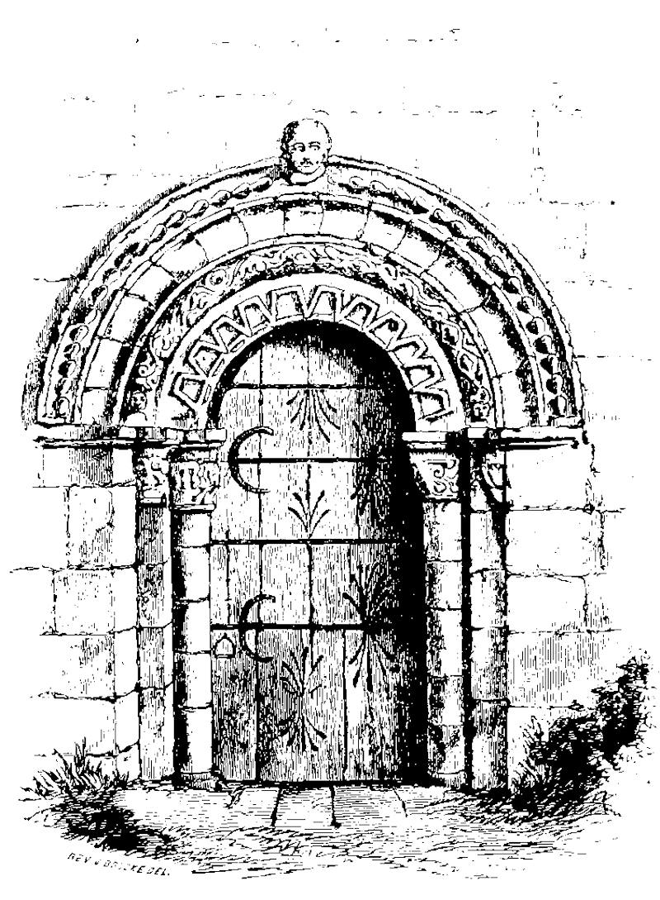
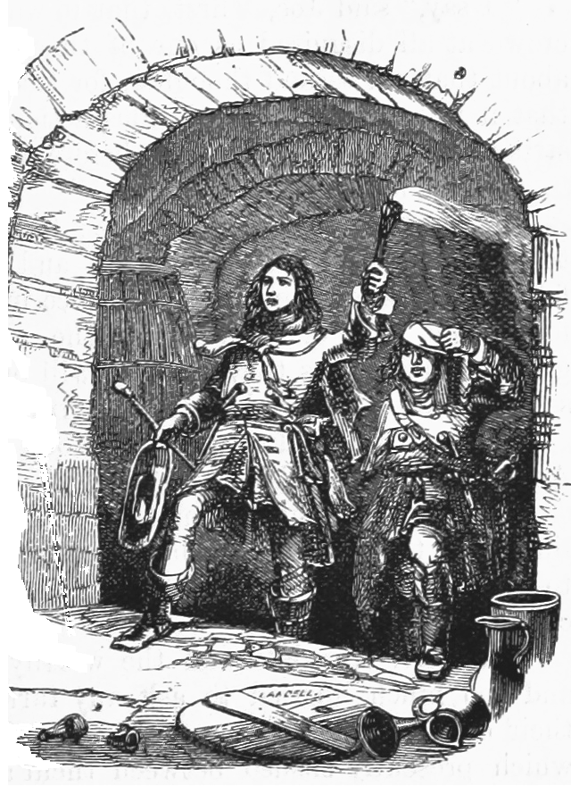
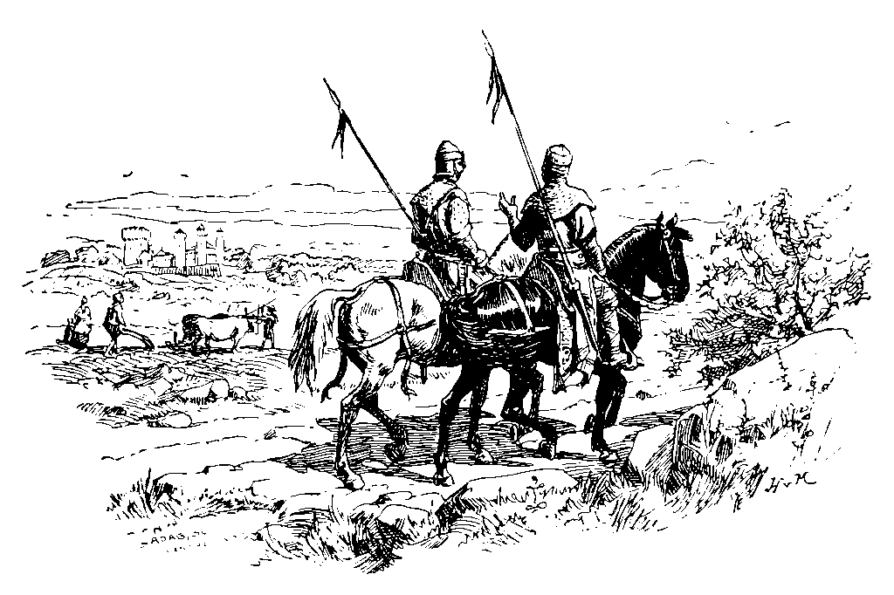
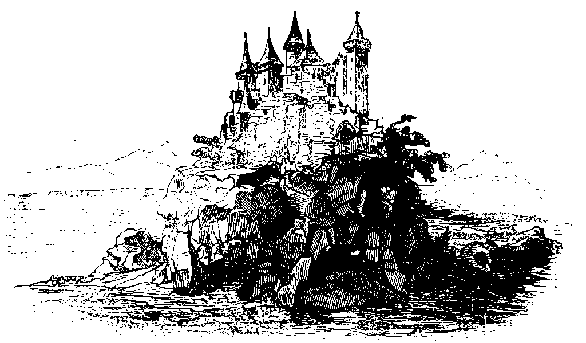

\null\vfill
\noindent
\Large
Menschen & Magie \newline
\normalsize
Ein Spielerhandbuch für Old-School Rollenspiele, kompatibel mit
*Swords & Wizardry* und allen Regeln, die auf dem Original Fantasy
Rollenspiel von 1974 basieren.

Text und Satz: © Wanderer Bill, 
<wandererbill73@gmail.com>,\newline
Datum:
\small

Titelbild: LadyofHats, CC 0, public domain 

OSR-Logo: [Matt S. Jackson, public domain](http://www.msjx.org/2018/11/vintage-logos-2.html)

Übrige Grafiken: public domain

*Swords & Wizardry* ist ein eingetragenes Warenzeichen von Matthew J.
Finch. Wanderer Bill ist nicht assoziiert mit Matthew J. Finch,
Mythmere Games oder Frog God Games.

Das Wanderer Bill Logo ist Product Identity. Ansonsten ist dieses
Spielerhandbuch Open Game Content im Sinne der Open Game License, OGL
1.0a, mit Ausnahme der Ausrüstungstabellen auf den Seiten
\pageref{eqtab} bis \pageref{eqtabend}. 

Das heißt, Du darfst dieses Buch für Dich und für andere kopieren.
Gib es gerne weiter!  

Es ist auch kein Problem, *Menschen & Magie* für deinen eigenen Open
Game Content zu benutzen, vorausgesetzt, Du hälst Dich dabei an die
Regeln der Open Game License.  

Schließlich ist *Menschen & Magie* auch Open Source. Du findest die
Quelldateien für dieses Dokument unter
<https://github.com/lskh/Hausregeln>

Open Content: All text and tables of this booklet, except for the
equipment tables on pages \pageref{eqtab} through \pageref{eqtabend},
which are based on an idea by Brendan S. a.k.a Necropraxis and used
here with kind permission.

\clearpage

\normalsize 

\tableofcontents*

\listoftables*

Vorwort
=======

\lettrine{A}{m Anfang} war mein Plan einfach nur eine Liste mit Hausregeln
für unsere Rollenspiel-Runde zu verfassen. Dann dachte ich, dass es ganz
schön wäre, wenn alle Spieler ein kleines Heftchen mit den wichtigsten
Tabellen zur Hand hätten. Schließlich ist daraus dieses kleine
Spielerhandbuch, ein Band mit Hausregeln und ein Buch mit Zaubersprüchen
geworden. Und das schöne ist, alle drei Bücher können ausgedruckt und
kopiert werden, und völlig legal als PDF weiter gereicht werden.

Schließlich wurde dann auch noch der Zine-Contest des System-Matters
Verlags angekündigt, was mich motiviert hat, "das Ding endlich über
die Rampe zu bringen" und dieses Spielerhandbuch zum Contest
einzureichen.

Ermöglicht wird dieses Projekt durch die Veröffentlichung der *Open Game
License* und der *System Reference Documents* durch *Wizards of the Coast*
(siehe Seite \pageref{open-game-license-version-1.0a}) und die Vorarbeit
vieler Mitglieder einer Bewegung, die sich *Old School Renaissance* (OSR)
nennt. Eine Bewegung die seit etwa Mitte der Nuller Jahre die alten
Regelwerke neu formuliert veröffentlicht, und darüber hinaus eine
unglaubliche Menge spannender, origineller und zum Teil in eindrucksvoller
künstlerischer Qualität gearbeiteter Werke hervor gebracht hat.

Die Open Game License machte es möglich, dass die Spielregeln des
originalen Fantasy Rollenspiels unter permissiven Lizenzbedingungen,
neu formuliert veröffentlicht werden können. Diese neu formulierten
Regeln werden oft als Retro-Klon bezeichnet.

*Menschen & Magie* versucht, den Geist der ersten Ausgabe des ersten
Fantasy-Rollenspiels zu vermitteln, welches 1974 von Gary Gygax und
Dave Arneson veröffentlicht wurde. Außerdem soll es möglichst gut
kompatibel zu den Retro-Klonen der frühen Editionen sein.  Für die
Spieler sollte es keinen Unterschied machen, ob der Spielleiter sein
Spiel auf Grundlage der Original-Regeln von 1974 oder einem der
Retro-Klone wie zum Beispiel *Swords & Wizardry* spielt. Auch für
Spieler in Kampagnen, die auf den *Advanced*-Regeln, oder einem der
B/X-Klone aufbauen, sollten die Informationen dieses Spielerhandbuchs
hilfreich sein.

Grundlage für *Menschen & Magie* ist *Swords & Wizardry White Box*,
ein Retro-Klon der "three little brown books".  Im Anhang habe ich
aufgeführt, in welchen Punkten *Menschen & Magie* von den
Original-Regeln abweicht.

Aufgebaut ist das Heft aus einem einfach gehaltenen Abschnitt über die
Erschaffung von Charakteren der ersten Stufe, den Regeln um den so
erschaffenen Charakter auf Abenteuer ausziehen zu lassen, sowie einem
ausführlichen Abschnitt über das Spiel in einer groß angelegten offenen
Fantasy-Kampagne. Ein Thema, welches in vielen Regelwerken für meinen
Geschmack zu kurz kommt.

Ich hoffe, dass Ihr *Menschen & Magie* nützlich findet. Ein Spieler
aus unserer Runde hat kürzlich im Urlaub - nur mit diesem Heft
ausgestattet - eine spontane Runde geleitet, mit kleinen Zetteln vom
Kellner-Notizblock als Charakterbögen ... genau so soll es sein!

\pagestyle{empty}

{width=100%}

\mainmatter
\pagestyle{plain}

Einleitung
===========

\lettrine{M}{enschen und Magie} ist eine Regelsammlung für
das erste Fantasy Rollenspiel der Welt. 
Das Prinzip ist einfach, jeder Spieler führt eine
fiktive Figur - üblicherweise Charakter genannt - durch eine
abenteuerliche Fantasywelt voller unwägbarer Gefahren, geheimnisvoller
Magie und fabelhafter Schätze. Die Welt selbst, das Verhalten von
seltsamen Fabelwesen, Monstern aber auch zum Beispiel vom Tavernenwirt
oder der Händlerin an der Ecke wird vom Spielleiter beschrieben.

Das funktioniert zum Beispiel so: 

> Spielleiter: ... nachdem Ihr die Kellertreppe herunter gestiegen
> seid, steht ihr in einem kleinen Raum, vielleicht 3 x 4 Meter groß,
> nur von euren Fackeln erleuchtet.
> In der Südost-Ecke stehen zwei Holzfässer die nach Sauerkraut
> riechen, daneben lehnt ein Sack, vielleicht ein Kartoffelsack. In der
> Nordwand seht ihr eine verschlossene Tür aus dicken Eichenbohlen.
> Was tut ihr?^[dieses "was tut ihr?" - *"what do you want to do?"* ist
> vielleicht die wichtigste Regel des ganzen Spiels. Es ist die eigentliche
> *game engine*, die das Spiel am laufen hält. Dieses Spielprinzip haben
> wir allem Anschein nach  Dave Arneson zu verdanken.  Robert J.  Kuntz,
> ehemaliger Mitarbeiter bei TSR hat ein ganzes Buch darüber geschrieben:
> <https://www.threelinestudio.com/store/dave-arneson-s-true-genius/>] 
>
> Spielerin von Etzo dem Zwerg: ich sehe mir die Fässer genauer an,
> und hebe mal den Sack hoch.
>
> Spielleiter: die Fässer sehen aus wie normale Weinfässer. Was
> besonderes kannst Du nicht erkennen. Der Sack ist leichter als er
> aussieht. Er scheint auch keine Kartoffeln zu enthalten, sondern
> etwas weiches, vielleicht Stoff oder Kleidung, als Du ihn wieder
> hinstellst, hörst Du auch ein metallisches Klappern in dem Sack.
>
> Spieler von Hedwig der Kämpferin: ich gehe zu der Tür und lausche,
> was höre ich?
>
> Spielleiter: Du hörst leises Murmeln, menschliche Stimmen ...
>
> Hedwig: kann ich etwas verstehen? Erkenne ich eine von den Stimmen?
>
> Spielleiter: ... ja, doch ... Du hörst eine Stimme die sich genau anhört
> wie die von Haken-Ede ...
>
> Hedwig: ich gebe Etzo ein Zeichen und flüstere ihm zu: "sieht so aus
> als hätten wir den Unterschlupf von Edes Bande gefunden. Los, hol
> die anderen, diese Halunken schnappen wir uns!" 

Das Spiel benötigt also kein Spielbrett, sondern wird in erster Linie
im "Kopfkino" gespielt. Je blumiger die Beschreibungen aller
Beteiligten, desto besser. Und großartig ist natürlich, wenn Du nicht
sagst: 

> "Mein Zwerg geht zum Wirt und bestellt drei Bier" 

sondern 

> "He Wirt, wir sind durstig! Drei Humpen Bier für mich und meine zwei
> wackeren Gefährten! Ho ho, wir haben etwas zu feiern!" 

Und wenn Du dabei auch noch sprichst wie ein
Zwerg, um so besser!

Ziel des Spiels - aus Sicht der Spieler und der Spielleitung -
ist, gemeinsam eine unterhaltsame Geschichte zu erzählen. Dabei
können grandiose Erfolge genauso spannend und unterhaltsam sein,
wie dramatische Niederlagen, oder auch völliges Scheitern. 

Die literarischen Vorbilder sind natürlich Tolkiens Geschichten vom
*Hobbit* und dem einen Ring, die unser Bild von Elfen, Zwergen, Halblingen
und Orks geprägt haben, Fritz Leibers Abenteuer von *Fafhrd und dem Grauen
Mausling*, die als archetypische Diebe im Konflikt mit furchteinflößenden
Magiern nach Gold und schönen Frauen streben, sowie Robert E. Howards
Barbar *Conan*, der sich wider aller Gefahren zum mächtigen König
aufschwingt.  Aber auch die Geschichten der sterbenden Erde von Jack Vance,
die ganz entscheidend die Magie-Regeln geprägt haben, der Epos um den
Magier Elric und sein Schwert *Stormbringer* von Michael Moorcock, und
verschiedene Erzählungen von Poul Anderson, wie z.B.  *Dreiherz*, in der
die Figur des edlen Paladins im Kampf zwischen Chaos und Rechtschaffenheit,
und nicht zuletzt auch der Troll der nur mit Feuer bekämpft werden kann,
geprägt wurden. Schließlich hatten auch die Werke des Horror-Autors Howard
P. Lovecraft einen spürbaren Einfluss, insbesondere was die
Auseinandersetzung mit kosmischen Gefahren und weltfremden, übermächtigen
Monstern angeht. 

Oft folgen diese Geschichten dem Muster der klassischen Heldenreise:
also dem mutigen Aufbruch in die Fremde, dem Erleben von Abenteuern,
dem Entscheiden-Müssen in Schicksalsfragen, schließlich die
krisenhafte Auseinandersetzung mit Scheitern, Untergang und Tod, um
dann, vielleicht transformiert, und hoffentlich geläutert und
bereichert zurück zu kehren.
    
Aus Sicht der Charaktere ist das Ziel des Spiels, möglichst viel
Gold zu bekommen. Denn Gold ist auch die Währung in der in diesem
Spiel *Erfahrung* bemessen wird. Und Erfahrung ermöglicht einem
Charakter höhere Stufen, und damit bessere Fähigkeiten, mehr
Widerstandskraft, höhere Magie und ähnliches zu erlangen. 

Eine der wichtigsten Regeln des Spiels überhaupt ist, dass Du deinen
Charakter **alles** machen lassen kannst was Dir einfällt. Ein *das geht
nicht, dass steht so nicht in den Regeln* sollte es nicht
geben. 

Nochmal weil es so schön ist: **Du kannst deine Figur alles machen
lassen was Du möchtest!**

Wenn Du einkaufen gehen willst, geh einkaufen, wenn Du lieber im Wald
spazieren gehst, nur zu. Wenn Du in einem tiefen Kerker nach Schätzen
suchen willst - großartig! Und falls Du dabei wirklich erfolgreich
sein solltest, bring Dein Geld auf die Bank, spare ein wenig, und kauf
Dir eines Tages deine eigene Burg, kein Problem!

Allerdings kann es sehr gut passieren, dass die Spielleiterin von Dir
verlangt zu würfeln, um zu sehen ob Dir dein kühnes Vorhaben gelingt.
Nun hängt das Schicksal von den Würfeln ab, und die können
gnadenlos sein. Die Wahrscheinlichkeit für eine erfolgreiche
Würfelprobe liegt bei Old-School Rollenspielen oft in einer
Größenordnung von 25 %, vielleicht etwas besser, wenn
die Figur gute Spielwerte hat.

Tendenziell bedeutet also die Aufforderung der Spielleiterin zu
würfeln in etwa: "was Du hier vor hast funktioniert mit großer
Wahrscheinlichkeit **nicht**, oder ist sehr **gefährlich**, dieser
Würfelwurf ist Deine letzte Chance damit irgendwie davon zukommen".
Das Gleiche gilt, wenn gewürfelt wird um in den Kampf zu ziehen.
Kämpfe sind gefährlich! - meistens tödlich! - aber das wusstest Du
wahrscheinlich schon.

Noch was zu den Würfeln: in diesem Spiel werden viele verschiedene
Würfel benutzt. Die normalen sechsseitigen, aber auch 4-, 8-, 10-, 12-
und 20-seitige Würfel. Das sind die *normalen* Gaming-Würfel, die man
auch in dieser Zusammenstellung als Satz kaufen kann. 
Aber denk nicht, dass es keine 5-, 7-, 24- oder 30-seitige Würfel gäbe!

Um einen bestimmten Würfel zu bezeichnen werden meistens Abkürzungen
benutzt. W4 = vierseitiger Würfel, W8 = achtseitiger Würfel usw. wenn
irgendwo W100 oder W% steht, dann ist ein Paar zehnseitiger Würfel
gemeint, bei dem der eine für die Einerstellen, und der andere für die
Zehnerstellen benutzt wird.

Um anzugeben wie viele Würfel von welcher Sorte für eine
bestimmte Probe geworfen werden sollen, hat sich folgende
Notation etabliert: Wenn zum Beispiel drei Sechserwürfel gemeint
sind, schreibt man 3W6, und sagt "drei-weh-sechs", bei 2 Zwölfern
entsprechend 2W12 usw. Es kann auch sein, dass noch eine
bestimmte Punktzahl hinzurechnen werden soll. Dann schreibt man
zum Beispiel 1W4+3, womit gemeint ist, dass man einen
vierseitigen Würfel wirft, und dann zu dem Ergebnis 3 addiert. Es
müsste also eine zufällige Zahl zwischen 4 und 7 dabei heraus
kommen. In alten Regelheften und Abenteuermodulen wurde anstelle
von 1W4+3 oft auch nur 4 - 7 angegeben. Der Leser musste dann
selbst austüfteln, mit welcher Kombination von Würfel und Boni
der entsprechende Wertebereich abgedeckt werden konnte. 

\clearpage

{width=100%}

Charaktererschaffung
====================

\lettrine{D}{as Spiel beginnt} damit, dass Du dir einen Charakter,
also eine Spielfigur erschaffst. 
Die Eigenschaften und Habseligkeiten Deines Charakters werden auf einem
Blatt Papier fest gehalten, dem so genannten Charakterbogen. Es gibt
dafür alle möglichen Formulare, aber Du kannst auch ein einfaches leeres
Blatt Papier dafür benutzen - ich finde das jedenfalls am meisten *old
school*. Beschrifte Deinen Charakterbogen immer nur mit Bleistift, denn
alle Eintragungen können sich im Laufe des Spiels verändern.

Oben links brauchst Du etwas Platz für den Namen deines Charakters.
Lasse das Feld noch offen, denn Du weißt ja noch nicht was für eine
Figur Du spielen wirst. Oben rechts kannst Du Deinen Namen und
vielleicht auch den Namen des Spielleiters eintragen.  Darunter,
solltest Du Dir ein bisschen Platz für eine kleine Skizze deiner Figur
frei halten.

Oben in die Mitte, zwischen dem Namen des Charakters und deinem Namen
brauchst Du etwas Platz, um *Volk*, *Klasse* und *Stufe* deines Charakters
zu notieren. Was mit Klasse gemeint ist, besprechen wir gleich, bei Stufe
kannst Du schon mal eine Eins eintragen. Du brauchst auch noch ein Feld um
Deine *Gesinnung* zu notieren. Eine Zeile unter *Klasse* würde sich dafür
anbieten.

Am linken Rand des Blattes schreibst Du unter einander die Worte:
"Stärke", "Intelligenz", "Weisheit", "Geschicklichkeit", "Konstitution"
und "Charisma". Das sind die Attribute deines Charakters. Du kannst auch
Abkürzungen benutzen um Platz zu sparen: ST, IN, WE, GE, KO, CH
(*Stinwegekoch*, kann man sich gut merken).  Nun nimmst Du drei
Sechser-Würfel (3W6), und würfelst von oben nach unten, also für
ein Attribut nach dem anderen einen Wert zwischen 3 und 18 aus, und
schreibst ihn hinter das jeweilige Attribut, je höher der Wert, desto
besser.  Nun kannst Du schon ein bisschen
erahnen, welche Art von Abenteurer Du hier vor Dir hast. Einen
dümmlichen Kraftprotz?  einen gewitzten Hänfling? jemanden der klug
und charismatisch ist?

Attribute
---------

Die Attribute *Stärke*, *Intelligenz* und *Weisheit* sind die
sogenannten Primärattribute der drei Charakterklassen *Kämpfer*,
*Zauberkundiger* und *Kleriker*. Das Primärattribut der jeweiligen Klasse
wirkt sich wie folgt auf die Ansammlung von Erfahrungspunkten und
Stufen aus:

: Primärattribute und Erfahrungspunkte

| Attribut | Erfahrungspunkte |
|:--------:|:----------------:|
|  15+     | + 10%            |
|  13 - 14 | + 5%             |
| 9 - 12   | kein Bonus       |
| 7 - 8    | - 10%            |
| 6-       | - 20%            |

Stärke \index{Stärke}
:    ist das Primärattribut der Kämpfer. Es steht für die Körperkraft eines Wesens. 
	  
Intelligenz \index{Intelligenz}
:    stellt das Buchwissen eines Charakters
     dar. Es ist das Primärattribut der Zauberkundigen. 
     Für jeden Punkt über 10 spricht der Charakter eine
     zusätzliche Sprache. 

Weisheit \index{Weisheit}
:    stellt die Intuition, den Instinkt und das gute
     Urteilsvermögen eines Charakters
     dar. Weisheit ist das Primärattribut der Kleriker.

Hat ein Charakter auch in anderen Attributen als seinem Primärattribut
gute Werte, kann dies helfen, denn Erfahrungsbonus weiter zu steigern.
Dieser Aufschlag auf das Primärattribut gilt allerdings nur für die
Berechnung des Erfahrungsbonus.

: Erfahrungsbonus durch andere Attribute 

| Klasse | Attribut | Aufschlag Primärattribut |
|:-------|:--------:|:------------------------:|
| Kämpfer | Intelligenz 9 - 10 | +1 |
| und     | Intelligenz 11 - 12 | +2 |
| Kleriker | Intelligenz 13 - 14 | +3 |
|         | Intelligenz 15 - 16 | +4 |
|         | Intelligenz 17 - 18 | +5 |
|         |                     |    |
| Kämpfer | Weisheit 9 - 11 | +1 |
|         | Weisheit 12 - 15 | +2 |
|         | Weisheit 16 - 18 | +3 |
|          |                     |    |
| Zauberkundige | Weisheit 9 - 10 | +1 |
|            | Weisheit 11 - 12 | +2 |
|            | Weisheit 13 - 14 | +3 |
|            | Weisheit 15 - 16 | +4 |
|            | Weisheit 17 - 18 | +5 |
|          |                     |    |
| Kleriker | Stärke 9 - 11 | +1 |
|          | Stärke 12 - 15 | +2 |
|          | Stärke 16 - 18 | +3 |

Dies ist sicherlich eine der seltsamsten und kompliziertesten Regeln
in der Originalausgabe des Spiels, und sie wird in vielen Retro-Klonen
kommentarlos übergangen. Aber anhand eines Beispiels lässt
sich gut verstehen, wie die Regel funktioniert, und warum sie sogar
sinnvoll ist:

Nehmen wir zum Beispiel einen Charakter mit diesen Spielwerten: Stärke
9, Intelligenz 17 und Weisheit 10. Wegen der außergewöhnlichen
Intelligenz wäre es naheliegend, dass dieser Charakter ein
Zauberkundiger wird. Die Spielerin könnte sich aber entscheiden,
lieber einen Kämpfer zu spielen, vielleicht weil sie schon ein genaues
Bild von ihrem Charakter vor Augen hat. Allein in Folge des eher
niedrigen Primärattributes hätte der Charakter überhaupt keinen Bonus
bei der Berechnung der Erfahrungspunkte. Durch die hohe Intelligenz
allerdings darf sich die Spieler zur Berechnung des Erfahrungsbonus
einen Aufschlag von +5 auf ihr Primärattribut anschreiben. Das heißt,
sie berechnet ihren Erfahrungsbonus so, als sei die Stärke ihres
Kämpfers 14. Ihr Erfahrungsbonus ist damit also 5%. Die Regel macht
deutlich, dass es durchaus auch Kämpfer geben kann, die mehr sind als
nur tumbe Kampfmaschinen.

Geschicklichkeit \index{Geschicklichkeit}
:    ist das Resultat aus Koordination und Schnelligkeit. Ein
     hoher Geschicklichkeitswert (12+) gibt einen Bonus von +1 auf
     Angriffswürfe im Fernkampf, also zum Beispiel mit Pfeil und Bogen. 
     Ein niedriger Wert (9-) gibt einen Abzug von -1 auf
     entsprechende Angriffswürfe.

Konstitution \index{Konstitution}
:    beschreibt die Zähigkeit eines Charakters. 
     Trefferpunkte stehen für die Menge an Schaden, Verletzungen,
     Prellungen aber auch zum Beispiel Rückschlag und Frustration, die
     ein Charakter im Kampf erleiden kann. Sinken die Trefferpunkte
     auf Null geht ein Charakter leblos zu Boden. Außerdem hat die
     Konstitution einen Einfluss auf die Chance, dass ein Charakter
     eine Wiederbelebung, Verwandlung oder Reinkarnation übersteht.
	
     : Konstitutions Bonus Tabelle

     | Konstitution | Trefferpunkte | Überleben |
     |:------------:|:-------------:|:---------:|
     |  15 - 18     |   +1          |  100 %    |
     |  13 - 14     |               |  100 %    |
     |  12          |               |   90 %    |
     |  11          |               |   80 %    |
     |  10          |               |   70 %    |
     |   9          |               |   60 %    |
     |   8          |               |   50 %    |
     |   7          |               |   40 %    |
     |   3 - 6      |   -1          |    0 %    |

Charisma \index{Charisma}
:    kann am besten als Ausdruck für das diplomatische Talent
     und die Führungsfähigkeiten eines Charakters verstanden werden.

     Charisma wirkt sich auf die Anzahl und die Loyalität von
     Gefolgsleuten aus, die ein Charakter in seinen Dienst nehmen
     kann. Für alle Gefolgsleute wird zu Beginn ein bestimmter
     Loyalitätswert ermittelt, den der Spielleiter bei Bedarf auf die
     Probe stellen kann. Wenn zum Beispiel ein  Spielercharakter eine
     besonders gefährliche Handlung von seinen Leuten
     verlangt, könnte mit einem Würfelwurf entschieden werden, ob sich
     die Gefolgsleute treu verhalten, oder eine Meuterei beginnen.

     : Charisma Bonus Tabelle

     | Charisma | Gefolgsleute (max. Anzahl) | Loyalität |
     |:--------:|:--------------------------:|:---------:|
     | 3 - 4    |       1                    | -2        |
     | 5 - 6    |       2                    | -1        |
     | 7 - 8    |       3                    |           |
     | 9 - 12   |       4                    |           |
     | 13 - 15  |       5                    |  +1       |
     | 16 - 17  |       6                    |  +2       |
     | 18       |      12                    |  +4       |

Fantasy-Völker
--------------

\index{Völker}
Die meisten Spielercharaktere sind üblicherweise Menschen. Es ist aber
auch möglich einen Charakter eines typischen Fantasy-Volkes, also
einen Elf, einen Halbling oder einen Zwerg zu spielen. Traditionell
werden diese Spezies unter dem Begriff "Halbmenschen" zusammen
gefasst, im Gegensatz zu "Humanoiden", worunter Orks, Goblins und
andere menschenähnliche Monster verstanden werden. 

Zwerge, Halblinge und Elfen haben jeweils besondere Eigenschaften, die
dadurch ausgeglichen werden, dass Halbmenschen nie so hohe Stufen wie
Menschen erreichen können, und auch auf bestimmte Klassen festgelegt
sind. 

### Zwerge

\index{Zwerge}
Zwerge können die Klasse Kämpfer oder Kleriker wählen. Sie können
maximal Stufe 6 erreichen. Dafür sind Zwerge besonders resistent gegen
Magie und bekommen daher einen  Bonus von +4 auf ihren Rettungswurf
gegen Zaubersprüche.
Im Kampf gegen Riesen und ähnliche Kreaturen erleiden Zwerge immer nur
den halben Schaden.
Außerdem können Zwerge leicht Gefälle, besondere
Mauerkonstruktionen wie bewegliche Wände und zum Beispiel Falltüren
erkennen. Sie sprechen neben der Gemeinsprache und Zwergisch die
Sprachen der Gnome, Kobolde und Goblins.

### Elfen

\index{Elfen}
Elfen können Zauberkundige oder Kämpfer, oder auch beides gleichzeitig
sein. Dafür können sie als Kämpfer nur Stufe 4, und als Zauberkundige
nur Stufe 8 erreichen. Elfen können gleichzeitig als Kämpfer und als
Zauberkundige agieren, doch sie müssen ihre Erfahrungspunkte auf die
beiden Klassen aufteilen. Im Endeffekt erreichen dadurch
Elfen höhere Stufen deshalb nur halb so schnell wie andere
Charaktere. Schließlich haben Elfen Vorteile im Kampf mit bestimmten
Gegnern: sie erhalten einen zusätzlichen Angriffsbonus von +1 gegen
Goblins, Orks, intelligente Untote und Werwölfe,
und sie sind immun gegen die lähmende Berührung der Ghule. Elfen
haben eine besonders scharfe Wahrnehmung, was das Entdecken
von Geheimtüren angeht. Sie sprechen neben der Gemeinsprache natürlich
Elfisch und die Sprache der Orks, Hobgoblins und der Gnolle.

### Halblinge

\index{Halblinge}
Halblinge können nur die Klasse des Kämpfers wählen und als solche
auch nur bis Stufe 4 aufsteigen. Dafür haben sie die Magieresistenz
und die Kampfeigenschaften gegen Riesen der Zwerge und erhalten einen
Bonus von +2 auf Fernkampfwaffen. Außerdem sind Halblinge nahezu
unsichtbar, wenn sie sich verstecken.

Klassen
-------

\index{Klassen}
Nun ist es an der Zeit eine Klasse für Deinen Charakter zu wählen. Wie
schon gesagt bietet *Menschen & Magie* die ursprünglichen drei Klassen
"Kämpfer", "Kleriker" und "Zauberkundiger". Du kannst die Wahl der
Klasse von den Werten in den Primärattributen abhängig machen, Du
musst es aber nicht. Um etwas schneller höhere Stufen zu erreichen,
ist es aber günstig, wenn Du bei einem hohen Wert in Intelligenz einen
Zauberkundigen wählst, oder bei einem hohen Wert in Stärke eben einen
Kämpfer.

Wenn Du eine Klasse ausgewählt hast, kannst Du anhand der Angaben die
nächsten Eintragungen auf deinem Charakterbogen machen.  Denn von der
Wahl der Klasse hängt auch unmittelbar die Anzahl der Trefferpunkte
\index{Trefferpunkte} ab, die Dein Charakter hat, wenn er das erste
Mal ins Abenteuer zieht.  Den Platz für die Klasse, oben in der Mitte,
hattest Du Dir ja schon frei gehalten. Unter den Feldern für Klasse
und Gesinnung, also rechts neben den Attributen, solltest Du Dir nun
Felder für Trefferpunkte\index{Trefferpunkte}\index{TP} 
(kurz TP - oder auch HP für *hit points*) und
Rüstungsklasse (kurz RK - oder AC für *armor
class*)\index{RK}\index{Rüstungsklasse} einrichten. Die
Trefferpunkte geben an, wie viel Schaden ein Charakter im Kampf
aushalten kann, bevor er zu Boden geht. Du solltest Deine
Trefferpunkte jetzt auswürfeln: wenn Du einen Zauberkundigen oder
einen Kleriker spielst mit einem 6er Würfel (1W6), und wenn Du einen
Kämpfer spielst mit einem 6er Würfel, wobei Du zu Deinem Wurf noch
eine 1 hinzurechnest (1W6+1). Vergiss nicht ggf. auch noch den
Konstitutionsbonus anzurechnen. Die Rüstungsklasse
bestimmt, wie leicht oder schwer es ist, dem Charakter überhaupt
Schaden zuzufügen. Du erfährst Deine Rüstungsklasse, sobald Du Deine
Ausrüstung ermittelt hast.

Unter dem Feld für die Rüstungsklasse kannst Du als nächstes eine
kleine Tabelle mit deinen fünf Rettungswürfen \index{Rettungswürfe}
anlegen.  Die Rettungswürfe heißen "Gift und Todesstrahlen",
"Zauberstäbe", "Lähmung und zu Stein erstarren", "Drachenodem" und
"Zaubersprüche, -stecken und -ruten". Das gibt Dir schon mal eine
Idee, in welchen prekären Situationen Rettungswürfe zum Einsatz kommen
könnten. Um Platz zu sparen, kürze ich die Rettungswürfe meistens ab
mit: Gift, Stäbe, Lähmung, Odem und Sprüche.

### Kämpfer

Primärattribut
:    Stärke
 

Trefferpunkte
:    1W6+1 

Klassenfähigkeiten
:    Kämpfer haben keine besonderen Klassenfähigkeiten. Magie ist
     ihnen nur durch die Benutzung magischer Waffen zugänglich. Dafür
     sind Kämpfer in der Regel im Kampf die robustesten Charaktere.

Klassenbeschränkungen
:    keine

Rettungswürfe
:    Gift: 12, Stäbe: 13, Lähmung: 14,\newline 
     Odem: 15, Sprüche: 16

### Zauberkundiger

Primärattribut
:    Intelligenz

Trefferpunkte
:    1W6 

Klassenfähigkeiten
:    Zauberkundige können Zauberkundigensprüche wirken. Um sie
     vorzubereiten müssen sie Zeit aufwenden um den Spruch mit Hilfe
     der magischen Aufzeichnungen im Zauberbuch zu studieren und sich
     so einzuprägen. Das wirken eines Spruches ist für die
     Zauberkundigen so anstrengend, dass die Einzelheiten des Spruches
     nach dem Wirken vergessen werden. Der Spruch kann erst nach
     erneuter Vorbereitung wieder gewirkt werden. Zauberkundige der
     ersten Stufe können nur einen Spruch des ersten Grades pro Tag
     wirken.  
     Zauberkundige der ersten Stufe haben zu Beginn 4 Sprüche in
     ihrem Zauberbuch, und zwar *Magie lesen*, einen nach Wunsch
     des Spielers ausgewählten Spruch, und zwei zufällig
     ermittelte Sprüche. Alle weiteren Sprüche müssen im Spiel
     gefunden bzw. erlernt werden.
	

Klassenbeschränkungen
:    Zauberkundige dürfen keine Waffen außer Dolche
     und Stäbe benutzen. Zauberkundige dürfen keine Rüstungen und
     keine Schilde tragen.

Rettungswürfe
:    Gift: 11, Stäbe: 12, Lähmung: 14,\newline
     Odem: 16, Sprüche 15

### Kleriker

Primärattribut
:    Weisheit

Trefferpunkte
:    1W6 

Klassenfähigkeiten
:    Kleriker können "Untote" beherrschen, und ab der zweiten Stufe 
     klerikale Magie wirken. \index{Untote!vertreiben}
	 
     Um Untote zu beherrschen werden 2W6 geworfen. Liegt das Ergebnis
     über einem bestimmten Wert, erlangt der Kleriker für eine 
     bestimmte Zeit die Kontrolle über die untoten Kreaturen.
     Der Spielleiter stellt fest, wie viele Untote tatsächlich
     beherrscht werden.
     Wenn Du einen Kleriker spielst, notiere Dir folgende kleine
     Tabelle auf deinem Charakterbogen:
	 
	 ---------- -----
	 Skelette       7
         
	 Zombies        9
	 
	 Ghule         11
         
	 ---------- -----

     Je nach Gesinnung bedeutet "beherrschen" etwas anderes. Kleriker
     guter Gesinnung *vertreiben* die Untoten, während Kleriker böser
     Gesinnung die Untoten in ihren Dienst befehlen können, zum
     Beispiel um eine bestimmte Aufgabe zu erledigen, oder einen
     bestimmten Bereich zu bewachen.
	 
Klassenbeschränkungen
:    Kleriker dürfen nur stumpfe Waffen benutzen.

Rettungswürfe
:    Gift: 11, Stäbe: 12, Lähmung: 14,\newline
     Odem: 16, Sprüche 15

## Wechsel der Charakterklasse

Unter bestimmten Voraussetzungen kann es auch möglich sein die Klasse
eines Charakters zu wechseln\index{Klasse!Wechsel der}. 
So etwas ist sicher nicht alltäglich, sondern eher ein *Life Event* und
sollte sich aus der Geschichte des Spiels ergeben. 

Neben den hier vorgestellten Klassen, gibt es in den diversen
Regelerweiterungen weitere Klassen, wie zum Beispiel Paladine, Waldläufer,
Druiden, Illusionisten, Assassinen oder sogar Mönche. Andererseits solltest
Du versuchen, Dich nicht durch die Klassenbezeichnungen einschränken zu
lassen. 

In Old-School-Rollenspielen wird vieles auf dem Charakterbogen gar
nicht so genau fest gelegt. Du kannst einfach die Klasse nehmen, die grob
am besten zu Deiner Charakteridee passt, und die Details rollenspielerisch
ausfüllen. Der Begriff "Zauberkundiger" - im englischen Original
"magic-user", illustriert das ganz gut: Die Klasse bietet Dir grundsätzlich
Zugang zu Magie. Für die Ausgestaltung Deines Magie-Anwenders gibt es aber
viele verschiedene Möglichkeiten. Du könntest natürlich einen klassischen
Magier mit spitzem Hut spielen, aber genauso gut auch eine Hexe, einen
gelehrten Forscher der arkanen Künste, oder einen illusionistisch begabten
Trickbetrüger.

Genau so gut könnte ein Kleriker auch als Druide oder Schamane
ausgestaltet werden, und ein Kämpfer als stolzer (möchte gern) Ritter,
gewiefter Waldläufer, als geheimnisvolle Amazone oder auch als
ungehobelter Barbar. Und es spricht auch nichts dagegen, Deinem
Charakter noch einen Beruf zu geben, der vielleicht erst mal nicht
besonders abenteuerlich ist, aber rollenspielerisch interessant sein
könnte.

Aber Achtung: investiere nicht zu viel Zeit und Hingabe in die
Hintergrundgeschichte Deines Charakters. Das Abenteurerleben in
Old-School-Spielen kann sehr kurz sein. Du solltest es lieber so
sehen, dass die Hintergrundgeschichte Deines Charakters während
der ersten drei Stufen erspielt wird.

Gesinnung
---------
\index{Gesinnung}

Jeder Charakter und jedes halbwegs intelligente Wesen in der Spielwelt
hat eine Gesinnung. Damit ist ganz grob die moralische Grundhaltung
gemeint. Dabei werden die Gesinnungen *Chaotisch*, *Neutral* und
*Rechtschaffen* unterschieden. 

Häufig wird zwar chaotisch mit "böse" gleich gesetzt, und
rechtschaffen mit "gut", doch am besten versteht man die drei
Gesinnungen, wenn man sich die Beziehung zwischen Individuum und
Gruppe klar macht. Ein chaotisches Wesen wird sich so verhalten, wie
es für sein individuelles Wohlergehen am besten ist, und sich nicht um
die Interessen der Gruppe kümmern. Ein rechtschaffenes Wesen hingegen
wird immer das Wohl der Gruppe über das eigene Wohl stellen, und sich
selbst im Zweifel opfern. Neutral bedeutet, dass das Wesen irgendwie
den Mittelweg zwischen diesen Extremen einschlägt oder sich
tendenziell mal eher chaotisch und mal eher rechtschaffen verhält. 

Tiere und auch wenig intelligente Monster haben in der Regel eine
neutrale Gesinnung, und genauso wird es auch für viele Menschen
zutreffen. "Monster" aber, Dämonen und Teufel sind häufig chaotisch,
während typische spirituelle Fanatiker häufig rechtschaffener
Gesinnung sein dürften. Nicht zuletzt können auch individualistische
Abenteurer gut und gerne eine chaotische oder rechtschaffene Gesinnung
haben.

In späteren Editionen wurden übrigens tatsächlich auch noch die
Kategorien "gut" und "böse"  ergänzt. Ich glaube jedoch, dass es
durchaus als Zeitzeugnis der frühen 70er Jahre angesehen kann, dass in
den ursprünglichen Regeln eben gerade nicht in gut und böse
unterschieden wurde. Immerhin hängen diese Begriffe ja sehr vom
jeweiligen Standpunkt ab. Schließlich müssten aus Sicht der Monster
wohl so gut wie alle Spielercharaktere als böse gelten.

Du solltest Dir also jetzt eine Gesinnung für Deinen
Charakter überlegen, und sie auf Deinem Charakterbogen notieren. Es
ist o.k. Deine Mitspieler zunächst im unklaren zu lassen, wenn Du Dich
zum Beispiel für eine chaotische Gesinnung entschieden hast. Du
solltest aber in jedem Fall Deiner Spielleiterin die gewählte
Gesinnung mitteilen, da sie sich auf manche Regeln
auswirken kann.

Sprachen
--------

Spielercharaktere sprechen immer mindestens die sogenannte 
*Gemeinsprache*\index{Sprache!Gemein-}. Also die Sprache, die von den
meisten Menschen und "Halbmenschen" (also Zwergen, Elfen und
Halblingen) verstanden und gesprochen wird.

Nicht menschliche Wesen haben aber in aller Regel auch eine eigene
Sprache, und "Monster" sprechen unter Umständen *nur* ihre eigene
Sprache. Das kann Verhandlungen schwierig machen, wenn zum
Beispiel niemand in der Abenteurergruppe der Goblin-Sprache
mächtig ist.

Daneben gibt es auch noch für jede Gesinnung
eine sogenannte Gesinnungssprache\index{Sprache!Gesinnungs-}.
Diese sollte man sich als eine Art Geheimsprache
vorstellen, die aus besonderen Handzeichen oder Gesten besteht,
die jeweils nur den Menschen und Kreaturen einer bestimmten Gesinnung
bekannt sind.

Zaubersprüche
-------------

\index{Zaubersprüche}
Zauberkundige lernen ihre Sprüche durch kostspielige Ausbildung
bei einem Meister, magische Forschung oder durch glückliche
Zufälle während ihrer Abenteuer.  Um einen Spruch wirken zu
können, müssen sie ihn mit Hilfe ihres Zauberbuches
\index{Zauberbuch} studieren und sich
einprägen\index{Zauberspruch!vorbereiten}. Wird der Spruch
einmal gewirkt, ist der Zauberkundige in Folge der Anstrengungen
des Spruchwirkens nicht mehr in der Lage, den gleichen Spruch
noch einmal zu wirken, sondern der Spruch muss auf die gleiche
Weise erneut vorbereitet werden^[Diese Art von Magie wird "Vance'sche
Magie" genannt, da sie genau so funktioniert, wie es von Jack Vance in seinen
*Dying Earth*-Geschichten beschrieben wurde.].  Daher können Zauberkundige der
ersten Stufe nur einen einzigen Spruch pro Tag wirken. Einmal
gelernte Sprüche werden aus dem Gedächtnis gewirkt. Es ist also
nicht erforderlich, dass der Zauberkundige sein Zauberbuch -
unter Umständen ein gewichtiger Foliant - mit sich herum trägt um
vorbereitete Zauber wirken zu können. Allerdings kann er auch
keine neuen Sprüche vorbereiten, sollte er keinen Zugriff auf
sein Zauberbuch haben, oder dieses gar verlieren.

Kleriker "lernen" ihre Sprüche durch Kontemplation und Gebet, oder wie
sonst auch immer sie ihrer jeweiligen Gottheit huldigen mögen.
Viele Klerikersprüche dienen Schutz, Gesundheit und
Heilung\index{Heilung}. 
Daher ist es für viele Unternehmungen lebenswichtig
einen Kleriker dabei zu haben, und es kann taktisch klug sein,
dem Kleriker zu helfen so schnell wie möglich die zweite Stufe zu
erlangen, damit er in die Lage versetzt wird, Sprüche wirken zu
können. Kleriker können frei auswählen, welchen Spruch aus der
Liste der Klerikersprüche sie an einem bestimmten Tag vorbereiten
wollen.\index{Zaubersprüche}

Einige Sprüche, sowohl die der Kleriker, als auch der
Zauberkundigen, können umgekehrt werden. Diese
Sprüche\index{Sprüche umkehren} sind in den
Tabellen mit einem Sternchen gekennzeichnet. Kleriker können
Sprüche, die sie zuvor bereits durch ihr Gebet erhalten haben,
spontan umkehren - was sie natürlich in Konflikt mir ihrer
Gottheit bringen könnte. 
Zauberkundige müssen den umgekehrten Spruch explizit
vorbereiten, und können ihn dann auch nur so wirken.

Die folgende Spruchauswahl entspricht den
ursprünglichen Regeln von 1974 bzw. *Swords & Wizardry White Box*. Wenn
keine Angaben zu einem Rettungswurf oder einer
Materialkomponente gegeben sind, ist auch explizit kein
Rettungswurf vorgesehen, bzw. keine Materialkomponente
erforderlich.

: Zauberkundigensprüche des 1. Grades

|   | Spruch | Seite                       |
|---|-----------------|-----------------------------|
| 1 | Magie erkennen                   | \pageref{tag-81} |
| 2 | Magischer Riegel                    | \pageref{tag-83}  |
| 3 | Magie lesen                        | \pageref{tag-82}      |
| 4 | Sprachen lesen                      | \pageref{tag-118}    |
| 5 | Schutz vor Bösem*                    | \pageref{tag-108}  |
| 6 | Licht*                              | \pageref{tag-74}   |
| 7 | Person bezaubern                    | \pageref{tag-97}  |
| 8 | Schlaf                              | \pageref{tag-106}            |

: Zauberkundigensprüche des 2. Grades

|  | Spruch | Seite |
|---|----------------|---------------|
| 1 | Unsichtbarkeit entdecken | \pageref{tag-123} |
| 2 | Levitation | \pageref{tag-73} |
| 3 | Halluzination | \pageref{tag-45} |
| 4 | Objekt finden | \pageref{tag-96} |
| 5 | Unsichtbarkeit | \pageref{tag-124} |
| 6 | Zauberschloss | \pageref{tag-135} |
| 7 | Entdeckt Böses | \pageref{tag-15} |
| 8 | ESP | \pageref{tag-13} |
| 9 | Dauerndes Licht* | \pageref{tag-10} |
| 10 | Klopfen | \pageref{tag-68} |

: Klerikersprüche des 1. Grades

|   | Spruch | Seite                                 |
|---|-----------------|-------------------------------|
| 1 | Heilen leichter Wunden*        | \pageref{tag-49}  |
| 2 | Wasser und Nahrung reinigen*   | \pageref{tag-130} |
| 3 | Magie erkennen             | \pageref{tag-81}  |
| 4 | Entdeckt Böses* | \pageref{tag-15} |
| 5 | Schutz vor Bösem*              | \pageref{tag-108}    |
| 6 | Licht*                         | \pageref{tag-74}    |

### Dauerndes Licht*

\index{Dauerndes Licht*}\label{tag-10}
\index{Dauerhaftes Licht}

Spruchstufe
:      Zauberkundige 2

Reichweite
:      120' (36 m)

Dauer
:      Dauerhaft

Wird dieser Spruch gewirkt, entsteht Licht mit einem Radius von 120' (36
m).  Das Licht ist so hell wie Sonnenlicht und sämtliche Kreaturen, die
Abzüge durch Sonnenlicht erhalten (mit Ausnahme von Schaden durch
Sonnenlicht), sind durch diesen Spruch betroffen. Der Spruch kann auf
einen Gegenstand gewirkt werden, so dass dieser Gegenstand unter der
Wirkung des Spruchs umher getragen werden kann. Wird der Spruch auf eine
Kreatur gewirkt, steht dieser ein Rettungswurf zu. Der Spruch kann auf
die Augen einer Kreatur gewirkt werden, was Blindheit zur Folge hat.
Dieser Spruch ist permanent, solange er nicht gebannt wird.

Dauerhafte Dunkelheit (Umkehrung von Dauerhaftes Licht)
produziert Dunkelheit im selben Ausmaß und auf dieselbe Art
wie Dauerhaftes Licht. Man kann Dauerhafter Dunkelheit mit
Dauerhaftem Licht oder Magie bannen entgegenwirken.
Ebenso wie Dauerhaftes Licht kann auch Dauerhafte
Dunkelheit mit denselben Folgen auf die Augen einer Kreatur
gewirkt werden. Normale Sicht, inklusive Infravision, kann die
so entstandene Dunkelheit nicht durchdringen, genauso wenig
wird sie durch Lampen, Fackeln oder den Spruch Licht, erhellt.

### Entdeckt Böses*

\index{Entdeckt Böses*}\label{tag-15}
\index{Böses entdecken}\index{Detect Evil}

Spruchstufe
:      Kleriker 1, Zauberkundige 2

Reichweite
:      Kleriker: 120' (36 m), Zauberkundige 60' (18 m)

Dauer
:      Kleriker: 1 Phase + 1/2 Phase pro Stufe, Zauberkundige: 5 Runden pro Stufe

In einem 10' (3 m) breiten Korridor in Blickrichtung des Zaubernden
kann die böse, oder gute Ausstrahlung von Geschöpfen und Gegenständen
erkannt werden - insofern sie eine Gesinnung haben. Eine Giftschlange
oder eine mechanische Falle sind zwar gefährlich, haben aber keine
böse Ausstrahlung, es sei denn sie wären mit einem entsprechenden
Zauber belegt. 

Der Spruchwirker kann die Gegenwart von bösen Absichten
spüren. Dies bezieht sich sowohl auf die Anwesenheit von
lebenden Kreaturen als auch von Objekten, die für böse
Absichten verzaubert wurden. Objekte und Kreaturen mit
bösen Absichten innerhalb der Reichweite werden von einem
magischen Glühen umhüllt.

Wichtig: Die Spielleitung hat zu entscheiden, was
"böse" ist. Manche Dinge können für den Spruchwirker
gefährlich sein, ohne "böse" zu sein, Fallen beispielsweise.
Dieser Spruch verleiht nicht die Fähigkeit, Gedanken zu lesen,
sondern nur die Fähigkeit, generell böse Absichten zu
erkennen.

### ESP

\index{ESP}\label{tag-13}
\index{Gedankenlesen}

Spruchstufe
:      Zauberkundige 2

Reichweite
:      12 Phasen

Dauer
:      60' (18 m)

Pro Phase konzentriert sich der Zauberanwender auf eine festgelegte
Richtung. Nach dieser Phase erkennt er in dieser Richtung innerhalb von
60' (18 m) die Gedanken aller Kreaturen. Der Zauberanwender versteht die
Bedeutung aller Gedanken, auch wenn er die Sprache der Kreaturen nicht
versteht. Sind mehrere Kreaturen in dem Wirkungsbereich des Spruchs, dann
muss sich der Zauberanwender eine zweite Phase lang konzentrieren, um die
unterschiedlichen Gedanken auch voneinander unterscheiden zu können, da
sie sonst in einem missverständlichen Durcheinander auf ihn einwirken.
Die Wahrnehmung der Gedanken wird durch Wände, dicker als 2 Fuß oder eine
dünne Bleischicht blockiert.

### Halluzination

\index{Halluzination}\label{tag-45}
\index{Trugbild}\index{Geisterhafte Kraft}

Spruchstufe
:      Zauberkundige 2

Reichweite
:      240' (73 m)

Dauer
:      Konzentration

Solange sich der Zauberwirker konzentriert, erschafft er eine
andauernde, aktive Illusion. Die Illusion verschwindet, 
sobald sie von einer Kreatur
berührt wird. Jedoch kann ein illusionäres Monster erschaffen
werden, das einen Feind angreift. Betrachter erhalten einen
Rettungswurf gegen Sprüche, um die Illusion zu
durchschauen. Wenn der Rettungswurf misslingt, dauert die
Illusion an und ein illusionäres Monster richtet Schaden an. 
Der Zauberanwender kann
keine andere Aktion durchführen, solange er sich auf Trugbild
konzentriert.

### Heilen leichter Wunden*

\index{Heilen leichter Wunden*}\label{tag-49}
\index{Heilt leichte Wunden}

Spruchstufe
:      Kleriker 1

Reichweite
:      Berührung

Dauer
:      dauerhaft

Mit diesem Spruch kann der Kleriker sich selbst oder einem anderen Wesen
2 - 7 (1W6+1) Trefferpunkte heilen. Es ist nicht möglich die
Trefferpunkte über den ursprünglichen Wert anzuheben. Der Spruch ist
umkehrbar, und *verursacht* dann 2 - 7 Punkte schaden. Da auch dafür eine
Berührung erforderlich ist, muss der Kleriker einen erfolgreichen
Trefferwurf ausführen, bevor er Schaden verursachen kann. Je nach
Gesinnung des Klerikers wird seine Gottheit unter Umständen nicht damit
einverstanden sein, dass er seine Macht nutzt um Schaden zu verursachen.

### Klopfen

\index{Klopf-Klopf}\label{tag-68}
\index{Klopfen}

Spruchstufe
:      Zauberkundige 2

Reichweite
:      60' (18 m)

Dauer
:      1 Runde

Dieser Spruch öffnet verschlossene, verbarrikadierte,
verklemmte oder festgehaltene Türen. Es öffnet geheime
Türen genauso wie verschlossene oder verriegelt Truhen
sowie trickreich verschlossene Kisten. Geheime Türen müssen
zuvor gefunden werden. Die Tür verschließt sich danach nicht
von selbst. Klopfen hebt keine Gittertore oder ähnliche
Hindernisse wie Fallgatter an, auch wirkt es nicht bei Seilen,
Klettergewächsen oder ähnlichem.
(Klopfen, Knock - Men & Magic)

### Levitation

\index{Levitation}\label{tag-73}
\index{Schweben}

Spruchstufe
:      Zauberkundige 2

Reichweite
:      Selbst

Dauer
:      6 + Erfahrungsstufe Runden

Für 6 + Erfahrungsstufe des Spruchanwenders Kampfrunden kann
sich der Spruchanwender nach seinen Wünschen hoch- und
runter bewegen. Er lenkt seinen Auf- oder Abstieg geistig und
hat dabei eine Geschwindigkeit von bis zu 20' pro Runde. Er
kann sich nicht horizontal bewegen, wobei er sich entlang
einer Klippe ziehen kann oder sich von einer Decke so
abstoßen kann, dass er sich seitlich bewegt (grundsätzlich mit
halber Landgeschwindigkeit).

### Licht*

\index{Licht*}\label{tag-74}

Spruchstufe
:      Kleriker 1, Zauberkundige 1

Reichweite
:      120' (36 m)

Dauer
:      Zauberkundige Stufe + 6 Phasen, Kleriker Stufe + 12 Phasen

Mit diesem Spruch kann magisches Licht von der Helligkeit einer Fackel
erzeugt werden.  Die Lichtquelle ist selbst unbeweglich, kann aber auf
einen beweglichen Gegenstand, oder auch auf die Augen eines Wesens
gewirkt werden. In letzterem Fall wird das Wesen durch den Zauber
geblendet, sofern ihm ein Rettungswurf misslingt.  Der Zauber kann
umgekehrt gewirkt werden, und erzeugt dann magische Dunkelheit.     

### Magie erkennen 

\index{Magie erkennen }\label{tag-81}
\index{Entdeckt Magie}\index{Zauberei erkennen}\index{Erkennt Magie}

Spruchstufe
:      Zauberkundige 1, Kleriker 1

Reichweite
:      60' (18 m)

Dauer
:      2 Phasen

Mit diesem Zauber kann festgestellt werden, ob eine Person, ein
Ort oder ein Gegenstand mit einem Zauber belegt wurde. Also zum
Beispiel eine magischer Gegenstand oder eine mit Magie
verschlossene Tür.

### Magie lesen

\index{Magie lesen}\label{tag-82}
\index{Zauber lesen}

Spruchstufe
:      Zauberkundige 1

Reichweite
:      selbst

Dauer
:      2 Spruchrollen oder andere magische Schriften, 1 Phase

Lässt die Zauberkundige magische Runen in Zauberbüchern, Spruchrollen,
aber auch auf Gegenständen entziffern. Wenn sie
einen Spruch auf einer Spruchrolle oder aus einem Zauberbuch
damit einmal entziffert hat, kann genau diese magische
Schrift fortan ohne erneutes Wirken des Spruches
gelesen werden. Alle
Zauberbücher der Magier und Elfen sind so geschrieben, dass
nur ihr Eigentümer diese ohne *Magie lesen* verwenden kann.

### Magischer Riegel

\index{Magischer Riegel}\label{tag-83}
\index{Hält Türen}\index{Portal verschließen}

Spruchstufe
:      Zauberkundige 1

Reichweite
:      nach Angabe der Spielleitung

Dauer
:      2W6 Phasen

Mit diesem Spruch werden Türen, Tore oder ähnliches für die
Wirkdauer magisch verschlossen. Sie können immer noch mit roher
Gewalt eingerannt werden. Ein *Klopfen* Spruch oder *Magie
zerstören* beendet die Spruchwirkung.

### Objekt finden

\index{Objekt finden}\label{tag-96}
\index{Objekt lokalisieren}\index{Gegenstand orten}\index{Ermittelt Objekt}

Spruchstufe
:      Zauberkundige 2

Reichweite
:      60' + 10'/Stufe (18 m + 3 m)

Dauer
:      momentan, 1 Runde

Der Spruchwirker ist in der Lage, die Richtung in der sich ein
ihm gut bekannter Gegenstand befindet, zu spüren. Auch
kann der Spruchwirker generell nach einer Sorte Gegenstand
suchen. Dabei erspürt er dann den ihm nächsten Gegenstand
dieser Sorte. Der Versuch, einen bestimmten Gegenstand zu
finden, benötigt ein genaues geistiges Abbild des Gegenstands.
Ist das Abbild nicht gut oder genau genug, schlägt der Spruch
fehl. Personen und Kreaturen können mit dem Spruch nicht
erspürt werden.

### Person bezaubern

\index{Person bezaubern}\label{tag-97}
\index{Bezaubert Personen}\index{Personen bezaubern}

Spruchstufe
:      Zauberkundige 1

Reichweite
:      120' (36 m)

Dauer
:      bis der Zauber gebrochen wird (!)

Eine mit diesem Spruch bezauberte Person sieht in dem
Spruchwirker einen guten Freund und Verbündeten, für den sie sich
innerhalb gewisser Grenzen vorteilhaft einsetzen wird. Eine
bezauberte Person wird bemüht sein, angemessenen Bitten des
Spruchwirkers nachzukommen, sie wird sich aber nicht kopflos in
den Untergang stürzen. 
Der bezauberten Person steht ein
Rettungswurf zu. 

### Schlaf

\index{Schlaf}\label{tag-106}

Spruchstufe
:      Zauberkundige 1

Reichweite
:      240' (80 m)

Dauer
:      6 Phasen 

Der Zauber lässt bis zu 2W8 Trefferwürfel an lebenden Wesen für die
genannte Dauer in einen Tiefschlaf verfallen. 
Durch Schläge oder
Tritte können sie geweckt werden. So lange sie schlafen, kann
ihnen aber automatisch, d.h. ohne Trefferwurf, Schaden zugefügt
werden. Ein Rettungswurf ist nicht zulässig; 
Schlaf wirkt nicht gegen Untote.

### Schutz vor Bösem*

\index{Schutz vor Bösem*}\label{tag-108}

Spruchstufe
:      Kleriker 1, Zauberkundige 1

Reichweite
:      selbst

Dauer
:      Kleriker 12 Phasen, Zauberkundige 6 Phasen

Der Zauber gibt den Angriffswürfen von bösen Kreaturen einen
Abzug von -1 und eigenen Rettungswürfen +1. Durch eine
magische Hülle, die den Empfänger umgibt, werden verzauberte,
beschworene oder herbeigerufene Wesen daran gehindert den
Empfänger auch nur zu berühren.

### Sprachen Lesen

\index{Sprachen Lesen}\label{tag-118}
\index{Read Languages}

Spruchstufe
:      Zauberkundige 1

Reichweite
:      selbst

Dauer
:      2 Runden

Für die Dauer dieses Zauberspruchs kann der Zaubernde jede Sprache,
verschlüsselte Nachrichten, Karten oder andere geschriebene Inhalte
lesen. Dieser Zauberspruch ermöglicht es nicht, diese Sprache auch zu
sprechen, oder Rätsel automatisch zu lösen.

### Unsichtbarkeit

\index{Unsichtbarkeit}\label{tag-124}

Spruchstufe
:      Zauberkundige 2

Reichweite
:      240' (72 m)

Dauer
:      bis gebrochen

Das Ziel des Spruches - eine Person, eine Kreatur oder ein Gegenstand
- wird unsichtbar, bis es selbst einen Angriff
ausführt, oder die Unsichtbarkeit durch den Zauberkundigen selbst,
oder einen anderen Zauber gebrochen wird.

### Unsichtbarkeit entdecken

\index{Unsichtbarkeit entdecken}\label{tag-123}
\index{Unsichtbares entdecken}\index{Entdeckt Unsichtbarkeit}

Spruchstufe
:      Zauberkundige 2

Reichweite
:      10' (3 m) pro Erfahrungsstufe

Dauer
:      6 Phasen

Der Zauberanwender kann unsichtbare, verborgene,
ätherische oder astrale Kreaturen und Gegenstände sehen.

### Wasser und Nahrung reinigen*

\index{Wasser und Nahrung reinigen*}\label{tag-130}
\index{Reinigt Essen und Trinken}

Spruchstufe
:      Kleriker 1

Reichweite
:      Nahbereich

Dauer
:      Sofort, dauerhaft

Dieser Spruch macht verschmutztes, brackiges, giftiges oder
anderweitig kontaminiertes Essen und Wasser wieder
genießbar. Es wird Nahrung für etwas 12 Personen gereinigt.
Der umgekehrte Spruch vergiftet Wasser und Nahrung ...
eine perfide Angelegenheit.

### Zauberschloss

\index{Zauberschloss}\label{tag-135}
\index{Arkanes Schloss}

Spruchstufe
:      Zauberkundige 2

Reichweite
:      Nahbereich

Dauer
:      dauerhaft, bis gebrochen

Ein Arkanes Schloss wird auf Türen, Truhen oder Portale gezaubert und
verschließt diese ähnlich dem Zauberspruch Portal schließen auf
magische Weise.  Der Zauberanwender kann jederzeit ohne
Schwierigkeiten das arkane Schloss öffnen und schließen, anderenfalls
kann das Arkane Schloss mit Magie bannen oder Klopfen geöffnet werden.
Zusätzlich kann jeder Zauberanwender, der mindestens drei Stufen
mächtiger als der Spruchanwender des Arkanen Schlosses ist, das Arkane
Schloss ungehindert passieren. Wesen mit Magieresistenz können magisch
verschlossene Türen ohne jedes Problem aufbrechen.

Geld und Ausrüstung
---------------------
\index{Geld}\index{Ausrüstung!Pakete}

Üblicherweise wird das Startgeld eines Charakters ermittelt in dem ein
Wurf von 3W6 mit 10 multipliziert wird. Dabei ergibt sich dann ein
Betrag von 30 bis 180 Goldmünzen (GM)\index{GM}\index{Goldmünzen},
von dem der Charakter seine erste Ausrüstung kaufen kann. 

In vielen Regelwerken kommen an dieser Stelle Tabellen mit diversen
Ausrüstungsgegenständen und Preisangaben, aus der sich jeder seine
Ausrüstung zusammenstellen kann. Dieses "Einkaufen" wird aber schnell
mühsam, besonders, wenn während eines laufenden Spiels schnell ein
neuer Charakter erstellt werden soll. Viel einfacher ist
es, auf einer der folgenden Tabellen die Grundausrüstung
auszuwürfeln^[Die Idee mit der auswürfelbaren Ausrüstung wurde das erste
Mal von Brendan S. auf seinem *Necropraxis* Blog 
veröffentlicht. Er war so nett, mir zu erlauben sie in *Menschen &
Magie* zu verwenden.]. Dabei entspricht zum Beispiel der Eintrag mit der
Nummer 5 in der Klerikertablle einer soliden Ausrüstung, die sich ein
Kleriker von 50 Goldmünzen kaufen könnte. Was dabei nicht
ausgegeben wurde, bleibt als Bargeld übrig.

### Ausrüstung für Kämpfer
\label{eqtab}

 3.  Normale Kleidung (RK 9 [10]), Speer, 6 Fackeln, Rucksack,
     Wasserschlauch, 7 eiserne Rationen, 15 m Seil, 4 GM, BW 12"

 4.  Lederrüstung (RK 7 [12]), Knüppel, 
     Rucksack, Schlafsack, Wasserschlauch, 7
     eiserne Rationen, 6 Fackeln, 3 m Holzstab, 1 GM, BW 12"

 5.  Lederrüstung (RK 7 [12]), Morgenstern, Dolch, 
     Rucksack, Wasserschlauch, 7 eiserne Rationen, 6 Fackeln, 15 m
     Seil, 3 GM, BW 12"

 6.  Lederrüstung (RK 7 [12]), Streitaxt, Handaxt, 
     Dolch , Schleuder mit 20 Steinen, 
     Rucksack, Wasserschlauch, 7 eiserne
     Rationen, 6 Fackeln, 3 m Holzstab 9 GM, BW 9"

 7.  Kettenrüstung (RK 5 [14]), Speer, Dolch, Schleuder mit 20
     Steinen, 6 Fackeln, Rucksack, Wasserschlauch, 7 eiserne
     Rationen, 15 m Seil, 11 GM, BW 6"

 8.  Kettenrüstung (RK 5 [14]), Schild (RK -1 [+1]), Schwert, Dolch,     
     6 Fackeln, Rucksack, Wasserschlauch, 7 eiserne Rationen,
     3 m Holzstab,  4 GM, BW 6"

 9.  Kettenrüstung (RK 5 [14]), Speer, leichte Armbrust, 30 Bolzen,
     6 Fackeln, Rucksack, Wasserschlauch, 7 eiserne Rationen,
     15 m Seil, 11 GM, BW 6"              

 10. Plattenrüstung (RK 3 [16]), Schild (RK -1 [+1]), Schwert, Dolch, 
     6 Fackeln, Rucksack, Wasserschlauch, 7 eiserne Rationen, 3 m
     Holzstab, 4 GM, BW 6"
 
 11. Plattenrüstung (RK 3 [16]), Zweihandschwert, 3 Dolche, 6 Fackeln,
     Rucksack, Wasserschlauch, 7 eiserne Rationen,
     15 m Seil, 2 Ölfläschchen, 9 GM, BW 6"

 12. Plattenrüstung (RK 3 [16]), Schild (RK -1 [+1]), Schwert, leichte Armbrust,
     30 Bolzen, Rucksack, Wasserschlauch, 7 eiserne Rationen, 
     6 Fackeln, 3 m Holzstab, 2 GM, BW 6"  
                                      
 13. Plattenrüstung (RK 3 [16]), Flegel, Dolch, Kurzbogen, 20 Pfeile, 
     6 Fackeln, Rucksack, Wasserschlauch, 7 eiserne Rationen,
     15 m Seil, kleiner Sack, 10 GM, BW 6"

 14. Plattenrüstung (RK 3 [16]), Schild (RK -1 [+1]), Schwert, leichte Armbrust, 
     30 Bolzen, Rucksack, Wasserschlauch, 7 eiserne Rationen, Laterne,
     4 Ölfläschchen, 3 m Holzstab, 5 GM, BW 6"

 15. Plattenrüstung (RK 3 [16]), Helm, zwei Streitäxte, Dolch, leichte
     Armbrust, 30 Bolzen, 6 Fackeln, Rucksack, Wasserschlauch, 7
     eiserne Rationen, 15 m Seil, 5 Ölfläschchen, 15 GM, BW 6"

 16. Plattenrüstung (RK 3 [16]), Zweihandschwert, Dolch, Kurzbogen, 20
     Pfeile, Rucksack, Wasserschlauch, 7 eiserne Rationen, Laterne, 4
     Ölfläschchen, 3 m Holzstab, 2 kleine Säcke, 15 GM, BW 6"

 17. Plattenrüstung (RK 3 [16]), Hellebarde, Dolch, Langbogen, 
     20 normale Pfeile, 2 Pfeile
     mit Silberspitzen, Rucksack, Wasserschlauch, Laterne, 4
     Ölfläschchen, 7 eiserne Rationen, 15 m Seil, 10 GM, BW 6"

 18. Plattenrüstung (RK 3 [16]), Schild (RK -1 [+1]), Helm, Schwert, 2 Dolche,
     leichte Armbrust, 30 normale Bolzen, 4 Bolzen mit Silberspitzen,
     Rucksack, Wasserschlauch, 7 eiserne Rationen, Laterne, 4
     Ölfläschchen, 3 m Holzstab, 9 GM, BW 6"

### Ausrüstung Zauberkundiger

  3. Normale Kleidung (RK 9 [10]), Dolch, Rucksack, Wasserschlauch, 
     7 eiserne Rationen, 3 m Holzstab, Zauberbuch, 4GM, BW 9"

  4. Normale Kleidung (RK 9 [10]), 2 Dolche, Rucksack, Wasserschlauch, 
     7 eiserne Rationen, 2 Ölfläschchen, 15 m Seil, Zauberbuch, 
     7 GM, BW 9"

  5. Normale Kleidung (RK 9 [10]), Dolch, Rucksack, 
     Wasserschlauch, 7 eiserne Rationen, Laterne, 4 Ölfläschchen,
     Zauberbuch, 3 m Holzstab, 7 GM, BW 9"

  6. Normale Kleidung (RK 9 [10]), Dolch, Rucksack, 
     Wasserschlauch,  6 Fackeln, 7 eiserne Rationen, 15 m Seil, 
     Zauberbuch, 1 Phiole Weihwasser, 9 GM, BW 9"

  7. Normale Kleidung (RK 9 [10]), Dolch, 6 Fackeln, Rucksack,
     Wasserschlauch, 7 eiserne Rationen, 3 m Holzstab, 5 Ölfläschchen,
     Silberspiegel, ein Bund Belladonna, Zauberbuch, 9 GM, BW 9"

  8. Normale Kleidung (RK 9 [10]), Dolch, Rucksack, 
     Wasserschlauch, 7 eiserne Rationen, 15 m Seil, 2 Phiolen
     Weihwasser, Zauberbuch, 4 GM, BW 9"

  9. Normale Kleidung (RK 9 [10]), 3 Dolche, Rucksack, 
    Wasserschlauch, 7 eiserne Rationen, 
    Laterne, 4 Ölfläschchen, 3 m Holzstab, Phiole Weihwasser,
    Zauberbuch, 16 GM, 
    BW 9"

 10. Normale Kleidung (RK 9 [10]), Dolch, 6 Fackeln, 
    Zauberbuch, Rucksack, Wasserschlauch, 7 eiserne
    Rationen, 15 m Seil, 2 Phiolen Weihwasser, 24 GM, BW 9"

 11. Normale Kleidung (RK 9 [10]), Dolch, 
     Zauberbuch, Rucksack, Wasserschlauch, 7 eiserne Rationen, 
    Laterne, 4 Ölfläschchen, 3 m Holzstab, Bund Wolfsbann, 57 GM, BW 9"
    
 12. Normale Kleidung (RK 9 [10]), Dolch, Zauberbuch, 
     Rucksack, Wasserschlauch, 7 eiserne
    Rationen, 1 Laterne, 4 Ölfläschchen,
     15 m Seil, Bund Belladonna, Bund Wolfsbann 57 GM, BW 9"

  13. Normale Kleidung (RK 9 [10]),  Dolch, 6 Fackeln, 
      Rucksack, Wasserschlauch, 7 eiserne Rationen, 3 m
      Holzstab, Zauberbuch, Spruchrolle, 4 GM, BW 9"

  14. Normale Kleidung (RK 9 [10]), 2 Dolche, 6 Fackeln, 
    Rucksack, Wasserschlauch, 7 eiserne Rationen, Zauberbuch, 
    Spruchrolle, 15 m Seil,  11 GM, BW 9"

  15. Normale Kleidung (RK 9 [10]), Dolch, Rucksack, 
    Wasserschlauch, 7 eiserne Rationen, Zauberbuch, Laterne, 4
    Ölfläschchen, Spruchrolle, 3 m Holzstab, 7 GM, BW 9"

  16. Normale Kleidung (RK 9 [10]), Dolch, Rucksack, Zauberbuch, 
      Wasserschlauch, 7 eiserne Rationen, Laterne, 4 Ölfläschchen,
      Spruchrolle, 15 m Seil, 17 GM, BW 9"

  17. Normale Kleidung (RK 9 [10]), Dolch, Rucksack,
    Wasserschlauch, 7 eiserne Rationen, 
    Laterne, 4 Ölfläschchen, Zauberbuch, 
    Spruchrolle, 3 m Holzstab, Bund Wolfsbann, 17 GM

  18. Normale Kleidung (RK 9 [10]), Dolch, Rucksack,
    Wasserschlauch, 7 eiserne Rationen, 
    Laterne, 4 Ölfläschchen, Zauberbuch, 15 m Seil, 
    Spruchrolle, Phiole Weihwasser, 12 GM, BW 9" 

### Ausrüstung für Kleriker

 3.  Normale Kleidung (RK 9 [10]), Knüppel, 
     6 Fackeln, Rucksack, Wasserschlauch, 7 eiserne Rationen, 
     3 m Holzstab, hölzernes heiliges Symbol,   
     4 GM, BW 12"

 4.  Normale Kleidung (RK 9 [10]), Schild (RK -1 [+1]), Knüppel, 
     6 Fackeln, Rucksack,
     Wasserschlauch, 7 eiserne Rationen, 15 m Seil,
     hölzernes Heiliges Symbol, 4 GM, BW 12"

 5.  Lederrüstung (RK 7 [12]), Streitkolben, 
     6 Fackeln, Rucksack, Wasserschlauch, 7 eiserne Rationen, 3 m
     Holzstab, hölzernes Heiliges Symbol, 5 GM, BW 9"

 6.  Lederrüstung (RK 7 [12]), Kampfstab, 
     Rucksack, Wasserschlauch,  
     6 Fackeln, 7 eiserne Rationen,
     15 m Seil, 12 Eisennägel, hölzernes 
     heiliges Symbol, 3 Pflöcke & Hammer, Stahlspiegel,
     10 GM, BW 9"

 7.  Kettenrüstung (RK 5 [14]), Kriegshammer, 
     Rucksack, Wasserschlauch, 
     6 Fackeln, 7 eiserne Rationen, 3 m Holzstab, 
     hölzernes heiliges Symbol, 2 kleine Säcke, 8 GM, BW 6"

 8.  Kettenrüstung (RK 5 [14]), Schild (RK -1 [+1]), Streitkolben, 
     7 eiserne Rationen, 
     Rucksack, Wasserschlauch, 6 Fackeln, hölzernes heiliges Symbol, 
     15 m Seil, 2 kleine Säcke, 8 GM, BW 6"

 9.  Kettenrüstung (RK 5 [14]), Schild (RK -1 [+1]), Kriegshammer, 
     6 Fackeln, Rucksack, Wasserschlauch, 7 eiserne Rationen, 3
     m Holzstab, hölzernes heiliges Symbol, 2 kleine Säcke, 3
     Pflöcke und Hammer, Stahlspiegel, 10 GM, BW 6"

 10. Plattenrüstung (RK 3 [16]), Schild (RK -1 [+1]), 
     Streitkolben, 
     Rucksack, Wasserschlauch, 6 Fackeln, 7 eiserne Rationen,   
     15 m Seil, 
     hölzernes heiliges Symbol, 10 GM, BW 6"

 11. Plattenrüstung (RK 3 [16]), Schild (RK -1 [+1]), Kriegshammer, 
     Rucksack, Wasserschlauch, Laterne, 4 Ölfläschchen, 7 eiserne
     Rationen, 3 m Holzstab, hölzernes Heiliges Symbol, kleiner Sack, 
     2 GM, BW 6"

 12. Plattenrüstung (RK 3 [16]), Kampfstab, 
     Rucksack, Wasserschlauch, 
     Laterne, 4 Ölfläschchen, 7 eiserne Rationen,
     15 m Seil, silbernes heiliges Symbol, 
     4 GM, BW 6"

 13. Normale Kleidung (RK 9 [10]), Knüppel, Rucksack, 
     Wasserschlauch, 3 m Holzstab, 
     6 Fackeln, 7 eiserne Rationen,
     hölzernes heiliges Symbol,
     Spruchrolle (!), 4 GM, BW 12"

 14. Plattenrüstung (RK 3 [16]), Schild (RK -1 [+1]), 
     Streitkolben, Rucksack, Wasserschlauch, 
     Laterne, 4 Ölfläschchen, 7 eiserne Rationen, 
     silbernes heiliges Symbol, 15 m Seil, 
     10 GM, BW 6"

 15. Lederrüstung (RK 7 [12]), Streitkolben,
     Rucksack, Wasserschlauch, 6 Fackeln, 7 eiserne Rationen,
     hölzernes heiliges Symbol, 3 m Holzstab, Spruchrolle (!), 2
     Ölfläschchen, 1 GM 

 16. Plattenrüstung (RK 3 [16]), Schild (RK -1 [+1]), Helm, Kriegshammer, 
     Rucksack, Wasserschlauch, Laterne, 4
     Ölfläschchen, 7 eiserne Rationen, 15 m Seil, silbernes
     heiliges Symbol, 3 Pflöcke und Hammer, 
     Stahlspiegel, 12 GM, BW 6"

 17. Kettenrüstung (RK 5 [14]), Kriegshammer, 
     Rucksack, Wasserschlauch, 6 Fackeln, 7 eiserne Rationen,
     hölzernes heiliges Symbol, 
     Spruchrolle (!), 10 GM, BW 9"

 18. Plattenrüstung (RK 3 [16]), Schild (RK -1 [+1]), Helm,   
     Streitkolben, Rucksack, Wasserschlauch, Laterne, 4
     Ölfläschchen, 7 eiserne Rationen, 15 m Seil, 1 Phiole Weihwasser,
     silbernes heiliges Symbol, 12 Eisennägel, 3 Pflöcke und Hammer,
     kleiner Sack, 10 GM, BW 6"
\label{eqtabend}

Wenn Dir Deine erwürfelte Ausrüstung nicht gefällt, kannst Du
natürlich eine Ausrüstung mit einem niedrigeren Wert aussuchen, und
Dir die Differenz in Goldmünzen gut schreiben. Sagen wir Du würfelst
für Deinen Zauberkundigen eine 12, aber die Ausrüstung, die unter 11
angegeben ist, gefällt Dir besser, dann nimm Einfach die Ausrüstung
Nummer 11 und schreibe Dir noch 10 Goldmünzen extra gut.

Alles was *nach* der Charaktererstellung an Ausrüstung benötigt wird, 
muss *im Spiel* beschafft werden. Was genau ein Händler im Angebot
hat, und zu welchen Preisen, hängt von der Situation in der Spielwelt
ab.

Waffen\index{Waffen} machen bei einem erfolgreichen Angriff
grundsätzlich 1 - 6 Punkte Schaden\index{Schaden}. Deshalb sind für
die einzelnen Waffen auch keine speziellen Werte angegeben, der
Schaden wird einfach immer mit 1W6 ausgewürfelt. Es mag vielleicht
unsinnig erscheinen, dass ein Dolch genauso viel Schaden verursachen
soll wie eine Streitaxt, aber letztlich kann natürlich ein einzelner
Dolchstich tödlich sein, und eine Streitaxt zwar treffen, aber dann
doch nur eine Schramme verursachen.  Viele finden es wohl 
realistischer, wenn ein Dolch nur 1-4
Punkte Schaden verursacht, und eine Streitaxt zum Beispiel 
1-8 Punkte, aber wenn
man darüber nachdenkt, dann ist es durchaus reizvoll, die Würfel die
Geschichte erzählen zu lassen. Eine 6 beim Angriff mit einem Dolch 
könnte man erzählerisch als meisterlich geführten, hinterhältigen
Angriff ausgestalten, während die Schramme mit der Streitaxt den
furchteinflößenden Minotaurus nur zu einem hämischen Lachen
veranlasst, bevor er zu seinem Gegenangriff ansetzt.

Noch ein Wort zum Thema Rüstungsklasse\index{Rüstungsklasse}: Die
Rüstungsklasse zeigt an, wie schwer es ist einem Charakter oder einem
anderen Wesen Schaden zuzufügen. In den Originalspielregeln war die
Rüstungsklasse eine Zahl zwischen 9 und 2, und zwar war die
Rüstungsklasse um so *besser* je *niedriger* die Zahl war.
Rüstungsklasse 9 wäre demnach ungerüstet, und Rüstungsklasse 2 wäre
ein Charakter mit Plattenrüstung und Schild. Diese ursprüngliche
Rüstungsklasse wird heute "absteigende Rüstungsklasse" genannt, denn
es hat sich irgendwann auch die "aufsteigende Rüstungsklasse"
entwickelt.  Um möglichst kompatibel zu sein, wird in *Menschen &
Magie* beides angegeben, und zwar zuerst die absteigende
Rüstungsklasse, und dann die entsprechende aufsteigende Rüstungsklasse
in eckigen Klammern.  Demnach wäre ungerüstet RK 9 [10], und
Plattenrüstung RK 3 [16]. Ein Schild erhöht bzw. erniedrigt die
Rüstungsklasse jeweils um eins, also -1 [+1]. Wenn Ihr also die alte
absteigende Rüstungsklasse benutzt, orientiert Euch an der Zahl vor
der eckigen Klammer, wenn ihr aufsteigende Rüstungsklasse benutzt gilt
die Zahl *in* der eckigen Klammer^[Natürlich hängen absteigende und
aufsteigende Rüstungsklasse zusammen, es sind im Grunde zwei Seiten
der selben Gleichung: aufsteigende und absteigende Rüstungsklasse
ergeben zusammen gerechnet immer 19.].

Den Charakter vollenden
-----------------------

Nach dem der Charakter nun Attribute hat, eine Klasse, die dazu
gehörigen Trefferpunkte und Rettungswürfe ermittelt wurden, nach dem
er vielleicht die ersten Zaubersprüche gelernt hat, und
eine Ausrüstung gekauft wurde, kann jetzt also auch noch 
die Rüstungsklasse auf dem Charakterbogen
eingetragen werden.

Ganz unten sollte noch etwas Platz eingerichtet werden, um zu
notieren, bei wie vielen Erfahrungspunkten die nächste Stufe erreicht
wird, dann kann es los gehen. 

{width=100%}

\enlargethispage{1cm}

Ins Abenteuer ziehen
====================

\lettrine{G}{rob gesagt} kann man die Geschehnisse einer Spielrunde meistens
in eine von drei Kategorien einteilen. Das Stadtabenteuer, das
Erkunden von Höhlen und Verliesen, auch bekannt als *Dungeon
Crawl* und drittens das Wildnisabenteuer, oder die Überlandreise.

In einem typischen Old School Spiel gibt es keinen vorgefertigten
Plot für ein bestimmtes Abenteuer. Vielmehr kannst Du davon
ausgehen, dass die Spielleiterin eine sogenannte *Sandbox*
vorbereitet hat. Das ist ein mehr oder weniger großer Ausschnitt
einer Fantasy-Welt mit allen möglichen interessanten Orten,
gefährlichen Kreaturen und verborgenen Schätzen, in der sich die
Spielerfiguren frei bewegen können. Der Spielleiter wird
vielleicht mehr oder weniger offensichtlich 
sogenannte "Plot-Hooks" \index{Plot-Hook}- also Aufhänger - 
anbieten. Was ihr
tatsächlich unternehmt, welchem Plot-Hook ihr vielleicht folgt,
ist ganz alleine Eure Entscheidung als Spieler. 

Würfelproben
------------
\index{Proben}

In Old-School Rollenspielen wird in erster Linie durch die
Spieler beschrieben und erzählt was die Charaktere unternehmen
und die Spielleiterin wird dann, mal spontan, mal anhand einer
verdeckten Würfelprobe entscheiden was passiert.

Wie aber bereits in der Einleitung erwähnt, kann die Spielleiterin
gelegentlich auch Würfelproben durch die Spieler verlangen, 
um festzustellen, ob ein bestimmtes Ereignis eintritt, oder eine
Aktion gelingt. Manchmal wird dazu einfach ein beliebiger Würfel
geworfen, und festgelegt "gerade ist gut" - was einer Erfolgschance
von 50% entsprechen würde. Ist eine Situation besonders brenzlig,
könnte ein sogenannter Rettungswurf fällig werden.

### Proben mit 1W6

\index{1W6}\index{Proben!1W6 basiert}
Für einige Aktionen ist genau festgelegt, wann der Wurf mit dem
Sechserwürfel erfolgreich ist:

: 1W6 Proben

| Aktion | Erfolg bei |
|:--------------------|:-------------------------|
| Geräusche hören     | 1 (Halbmenschen bei 2 oder weniger) |
| Türen aufbrechen    | 2 oder weniger |
| Geheimtüren entdecken | 2 oder weniger (Elfen bei 4 oder weniger) |
| den Gegner überraschen | 2 oder weniger |
  

### Rettungswürfe
\index{Rettungswürfe}

Rettungswürfe beziehen sich auf den Wert, den ein Charakter in
einer bestimmten Rettungswurf-Kategorie hat. Also in "Gift und
Todesstrahlen", "Stäbe", "Lähmung und Versteinerung",
"Drachenodem" und "Zaubersprüche". Ein Rettungswurf wird praktisch
immer mit dem W20 gewürfelt, und gelingt, wenn
der Wurf eine Zahl **größer oder gleich** dem Zielwert ergibt.

Angenommen ein Stufe 1 Kämpfer mit einem Wert von 12 in "Gift und
Todesstrahlen" wird von einer giftigen Schlange gebissen. Würfelt
er eine 12, hat er Glück und überlebt die Wirkung des Giftes, bei
einer 11 jedoch hätte sein letztes Stündlein geschlagen.

Viele Spielleiter interpretieren die Anlässe für einen Rettungswurf auch
etwas flexibler. Der Rettungswurf gegen Todesstrahlen ist zum Beispiel der
Universal-Rettungswurf für alle möglichen Dinge, die einen Charakter eher
zufällig und schlagartig treffen können, und die häufig eine tödlich
Gefahr darstellen. Zum Beispiel könnte man einen Rettungswurf gegen
Todesstrahlen fordern, um in einer augenscheinlich sehr baufälligen Ruine
nicht von herab fallenden Steinen getroffen zu werden. Der Rettungswurf
gegen Drachenodem wird häufig als Rettungswurf gegen Flächeneffekte, oder
allgemein Dinge, die irgendwie entfernt mit Drachenodem vergleichbar sind,
angewendet. Zum Beispiel könnte man von einem Charakter, der bei Sturm in
der Takelage eines Schiffes herum klettert, verlangen, dass er einen
Rettungswurf gegen Odem schaffen muss, um nicht vom Sturm aus den Wanten
geweht zu werden. Schließlich könnte der Rettungswurf gegen Versteinerung
und Lähmung auch für das Überwinden *nicht-magischer* Behinderungen, wie
zum Beispiel Fesseln oder Schlingpflanzen verwendet werden.

: Erweiterte Bedeutung für Rettungswürfe

-----------------------------------------------------------------------
Rettungswurf      Erweiterte Bedeutung       Effekt des Scheiterns  
----------------  -------------------------- ------------------------ 
 Gift und           schlagartig auftretende    Der Charakter wird 
 Todesstrahlen      Ereignisse                 getroffen, in der 
                                               Regel tödlich.

 Stäbe              Magische Gegenstände       Der Effekt des
                    oder Apparate              Gegenstandes
                                               trifft den Charakter.

 Lähmung            jegliche Art von           Der Charakter wird in 
                    Bewegungs-                 seiner Beweglichkeit
                    einschränkung              eingeschränkt,
                                               verlangsamt, gefesselt
                                               versteinert.

 Odem               Flächeneffekte,            Der Charakter erleidet
                    z.B. auch durch Wind,      den vollen Effekt des
                    Wasser, oder nicht-        Ereignisses, bei Erfolg
                    magisches Feuer            nur den halben Effekt.

 Sprüche            Geistige Eigenschaften,    Der Charakter
                    oder Leistungen des        unterliegt seinem 
                    Gegners                    Gegner, wird
                                               übertölpelt,
                                               gebeugt oder
                                               manipuliert.

-----------------------------------------------------------------------

### Attributsproben
\index{Proben!W20 basiert}\index{Proben!Attributs-}

Fertigkeitsproben wie in moderneren Rollenspielen gab es im
sogenannten ersten Rollenspiel der Welt nicht, und  direkte 
Proben gegen Attributswerte wurden erst spät als "optionale
Regel" in den offiziellen Regelwerken von TSR erwähnt. Allerdings ist
die Spielmechanik sehr naheliegend, und es gibt Hinweise, dass diese
Proben schon in den allerersten Fantasy Rollenspielen angewandt
wurden. 

Attributsproben werden "gegen" ein Attribut gewürfelt - also
gegen Stärke, Intelligenz, Weisheit, Geschicklichkeit,
Konstitution oder Charisma - je nach dem, welches Attribut in der
jeweiligen Situation relevant ist. Für eine
erfolgreiche Probe muss auf dem W20 eine Zahl **kleiner oder
gleich** dem jeweiligen Attributswert gewürfelt werden.

Versucht beispielsweise ein Charakter mit Geschicklichkeit 12 auf 
einen Baum zu klettern,
kann die Spielleiterin eine *Probe gegen Geschicklichkeit*
verlangen. Würfelt der Spieler eine 8 gelingt es dem Charakter
den Baum zu erklettern. Ergibt der Wurf dagegen eine 13 scheitert
der Charakter - vielleicht war seine Rüstung zu sperrig, oder ein
Ast ist abgebrochen.

Attributsproben werden auch häufig mit einer bestimmten Zahl normaler
Sechser-Würfel ausgeführt. Zum Beispiel 2W6 für leichte Proben, 3W6 für
normale Proben, und 4W6 für schwere Proben.

Magie     
-----

### Spruchrollen
\index{Spruchrollen}

Es kann gut sein, dass die Abenteurer auf ihren Unternehmungen
auf Pergamentrollen geschriebene Zaubersprüche entdecken. Vielleicht
als Bestandteil eines Schatzes, oder man bietet ihnen 
eine Spruchrolle zum Kauf, oder als Lohn für eine besondere
Aufgabe an.

Bei diesen Spruchrollen kann es sich um Klerikersprüche
oder um Zauberkundigen-Sprüche
handeln, die Charakteren der jeweiligen Klasse vorbehalten sind,
sowie manchmal auch um Schutzsprüche, die von jeder Klasse
genutzt werden können.
Sprüche von einer Spruchrolle werden - unabhängig von der Stufe des
Anwenders - durch lautes Vorlesen gewirkt. Es ist also mit Hilfe
von Spruchrollen möglich, sehr mächtige Sprüche zu wirken, zu
denen sonst gar kein Zugang bestehen würde. Auch wirken sich von
Spruchrollen gewirkte Sprüche nicht auf das Kontingent der
vorbereiteten Sprüche aus.

Allerdings verschwindet die magische Schrift der Spruchrollen von
dem Pergament, sobald der Spruch einmal gewirkt wurde. Sprüche
von Spruchrollen können also nur ein einziges mal gewirkt werden.

Zauberkundigen steht es frei, den Spruch - nachdem er
mit *Magie lesen* einmalig entziffert wurde - in ihr Buch
einzutragen, um ihn später immer wieder vorbereiten und wirken zu
können. Auch dann verschwinden die magischen Runen allerdings von
der Spruchrolle.

Schließlich können Zauberkundige Zeit und Geld in die Herstellung
eigener Spruchrollen investieren[^scrolls]. Die Kosten dafür betragen
eine Woche Arbeit und 100 GM pro Spruch-Grad. Einen Spruch des dritten
Grades auf eine Spruchrolle zu transkribieren dauert also 3 Wochen *In
Game*-Zeit, und kostet den Zauberkundigen 300 GM. Und natürlich kann der
Zauberkundige nur solche Sprüche auf Rollen schreiben, die er schon
kennt und in seinem Sprüchebuch hat.

[^scrolls]: Dieses ist eine besondere Regel aus der *Holmes-Edition*. 
    In den meisten Editionen können nur Zauberkundige ab der 7. Stufe 
    selbst Spruchrollen schreiben. Ich finde diese Regel zu
    Spruchrollen sehr gut, da sie Charakteren niedriger Stufen mehr 
    Möglichkeiten bietet, und ich nicht sehe, dass durch diese Regel
    das Spielgleichgewicht ernsthaft gestört werden könnte.

### Spruchforschung und neue Sprüche

\index{Spruchforschung}\index{Zaubersprüche!eigene}
Zauberkundige können auch völlig neue Sprüche entwickeln. Dieses 
ist allerdings sehr aufwändig und es gibt keine Garantie für Erfolg.

Wenn Du eine Idee für einen neuen, genialen Zauberspruch hast,
besprich Deine Idee in Ruhe mit der Spielleitung[^spells]. Vielleicht
muss der Effekt noch etwas angepasst werden, um nicht zu mächtig für
den gewünschten Spruch-Grad zu sein. Wenn ihr Euch einig seid, muss
der Zauberkundige eine Woche Arbeit und mindestens 2.000 GM pro
Spruch-Grad in die Forschung investieren. Selbst entwickelte Sprüche
haben allerdings auch einen gewisse Chance fehlerhaft zu sein, die in
der Regel von der Spielleitung verdeckt ermittelt wird. Dem
Zauberkundigen bleibt also nichts anderes übrig, als den neu
entwickelten Spruch zu testen.

[^spells]: Gary Gygax verlangte hierzu in
     seinem Handbuch für Spielleiter von 1979, dass der Spieler dem 
     Spielleiter "eine mit Schreibmaschine geschriebene Beschreibung"
     des Spruchs vorlegen müsse, damit dieser beurteilt werden
     kann ...

### Magische Gegenstände
\index{Magische Gegenstände}

In der Spielwelt gibt es unzählige verschiedene magische
Gegenstände. Dabei kann es sich um Tränke und Elixiere, Ringe,
Schmuckstücke, Zauberstäbe, magische Rüstungen, Waffen oder
sonstige Gegenstände handeln. 

Viele Gegenstände haben spruchähnliche Wirkungen wie zum Beispiel
ein *Amulett der Unsichtbarkeit*. Zauberstäbe
\index{Zauberstäbe} haben häufig eine 
begrenzte Anzahl von "Ladungen" - ein *Feuerball Stab* wäre ein
Beispiel. Manche Gegenstände wirken nur ein einziges Mal, wie zum
Beispiel ein *Wunschring*.

**Magische Rüstungen** \index{Rüstung!magische}verbessern die Rüstungsklasse. Zum Beispiel
hätte ein magisches Kettenhemd+1 eine Rüstungsklasse von 4 statt
5 (niedrige Rüstungsklassen sind besser als hohe). Gleichzeitig
wirken sich magische Rüstungen weniger auf die Belastung
\index{Belastung!Magische Rüstungen} aus.

**Magische Waffen** \index{Waffen!magische} geben Aufschläge auf
Trefferwürfe, und manchmal auch auf Schadenswürfe.  
Ein magischer Morgenstern+2 verbessert
zum Beispiel die Trefferwahrscheinlichkeit um 10%, und verursacht immer 2
Punkte mehr Schaden, als es bei einem gewöhnlichen Morgenstern der
Fall wäre. 

Da es Kreaturen gibt, die überhaupt nur mit magischen Waffen
verletzt werden können, werden manche Unternehmungen hoffnungslos
sein, wenn keiner der Abenteurer über eine magische Waffe
verfügt.

Manche magische Waffen haben eine besonders
ausgeprägte Wirkung gegenüber bestimmten Kreaturen. Es wäre also
zum Beispiel ein *magisches Schwert +1/+3 gegen Drachen* denkbar.

Mit magischen Schwertern \index{Schwerter!magische} hat es
überhaupt eine besondere Bewandtnis. Häufig kann man sie an einem
geheimnisvollen Glimmen ihrer Klinge erkennen, manchmal so hell,
dass sie im Dunklen ausreichend Licht spenden. Schwerter mit
einer besonderen Wirkung gegen bestimmte Kreaturen werden
regelrecht aufleuchten, wenn sich eine entsprechende Kreatur in
der Nähe befindet. Schließlich soll es Schwerter geben, die so
voller Magie sind, dass sie ihrem Besitzer ermöglichen, bestimmte
Sprüche zu wirken, und manche Schwerter haben sogar einen eigenen
Willen und können selbstständig Kämpfen. Aber Vorsicht: solche 
Schwerter verfolgen meistens ihre eigenen schwer durchschaubaren
Ziele.

### Erkennen und Identifizieren magischer Gegenstände
\index{Magische Gegenstände!identifizieren}
Die meisten magischen Gegenstände sehen auf den ersten Blick aus wie
ganz gewöhnliche Gegenstände. Wendet ein Zauberkundiger *Magie lesen*
auf den Gegenstand an, werden für ihn die magischen Runen sichtbar,
mit denen der Gegenstand verzaubert wurde.  Mit einem *Magie
entdecken* Spruch, kann auch ein unerfahrener Magier feststellen,
*dass* ein Gegenstand magische Eigenschaften hat. Er kann jedoch oft
nicht erkennen, genau welche!

Die Wirkung magischer Gegenstände und Tränke kann daneben
durch schlichtes ausprobieren festgestellt werden, was aber auch
Risiken birgt. Zum Beispiel könnte es passieren, dass ein
magischer Helm nach einmaligem aufsetzen nicht mehr
abgenommen werden kann. Ein Trank der aussieht wie ein Liebestrank
könnte in Wirklichkeit tödliches Gift sein. Also ist Vorsicht geboten.
Einen unbekannten magischen Trunk zu analysieren, ist sicher eine
komplizierte Angelegenheit - vermutlich etwas für einen sehr
erfahrenen Magier mit einem gut ausgestatteten Labor.

### Verfluchte Gegenstände

Genauso wie Gegenstände mit nützlichen magischen Eigenschaften
belegt sein können, kann es auch verfluchte Gegenstände geben.
Dabei kann es sich um eher unterhaltsame Effekte handeln, wie zum
Beispiel, dass sich die Kleidung des Betroffenen in Luft auflöst,
oder dessen Nase plötzlich unnatürliche Proportionen annimmt. Es
können aber auch dramatische Dinge geschehen. 

Nicht ganz selten kann der Fluch
der auf einem magischen Gegenstand liegt, seinen Träger auf eine
bestimmte Queste zwingen, und ihn ansonsten mit immer schlimmer
werdenden Albträumen heimsuchen, falls er nicht alles daran setzt
das Ziel der verfluchten Mission zu erreichen.

Stadtabenteuer
--------------

Typischerweise beginnt eine Spielsession in der Taverne einer 
menschlichen Ansiedlung. Das mag etwas abgedroschen klingen, ist
aber aus verschiedenen Gründen sehr wirkungsvoll um ins Spiel 
zu kommen. 

Während Ihr - Du
merkst ich spreche Dich jetzt als dein Spielercharakter an - also
in der Taverne sitzt, und Euch von dem alten einbeinigen Mann
mit der Augenklappe sagenhafte Geschichten erzählen lasst,
sind wir ganz klar im ersten Spielmodus, dem Stadtabenteuer. Es
geht darum, sich zu orientieren, Gerüchte (höchst wahrscheinlich
*Plot-Hooks*) in Erfahrung zu
bringen, vielleicht einen Auftraggeber für einen gut bezahlten
Job zu finden und Einkäufe zu erledigen um die Ausrüstung
aufzustocken. Vielleicht muss ein verletzter
Gefährte noch ein paar Tage rasten, bevor ihr aufbrechen könnt.

In dieser Spielphase wird oft wenig gewürfelt, sondern es ist
die Zeit für intensives Rollenspiel. Komm' mit dem alten Mann ins
Gespräch, bestelle beim Wirt großzügig eine Runde für deine
Gefährten. Du kannst, nein, Du solltest versuchen mit anderen
Personen ins Gespräch zu kommen. Gebe deinem Charakter eine
Stimme, probiere verschiedene Stimmlagen aus, vielleicht einen
Akzent, eine ulkige Redensart, lass ihn oder sie persönliche 
Markenzeichen entwickeln. Und noch ein kleines Geheimnis 
zum *Alten Mann*: er ist das Sprachrohr der
Spielleiterin. Es könnte sein, dass sie Euch - in der
Rolle des alten Mannes - entscheidende Hinweise zu raunt. Aber
umgekehrt könnt ihr auch den alten Mann fragen, wenn ihr Fragen
an den Spielleiter habt. Insbesondere wenn Du noch nie so ein
Rollenspiel gespielt hast, und alles ganz schön verwirrend
findest. Versuche Deine Frage aus Sicht deiner Spielerfigur zu
formulieren, und frag' den alten Mann in der Taverne!
\index{Taverne!alter Mann in der -} Du kannst
natürlich gerne auch jeden anderen NSC ansprechen (so
werden die Nicht-Spieler-Charaktere\index{NSC}, also die Figuren, 
die von
der Spielleitung geführt werden, genannt). Alle NSC
können als geheime Telegrafieleitung zum Spielleiter genutzt
werden. Insbesondere der Aufenthalt in der Taverne dient letztlich
dazu, Euch eine Idee zu geben, was ihr unternehmen könntet, und
so dem Spiel eine Richtung zu geben.

Neben dem ganzen Gequatsche können Stadtabenteuer aber auch wirklich
abenteuerlich sein. Vielleicht kommt es in der Taverne zu einer
Schlägerei, oder ihr werdet auf dem Weg in Euer Nachtquartier von
Straßenräubern überfallen. Und nicht selten findet sich der Eingang
zum nächsten Dungeon gleich im Keller unter der Taverne. Wenn ihr's
nicht glaubt, könnt ihr ja mal nach sehen. Schließlich sind Städte und
Dörfer oft die Orte wo es in Wirklichkeit das meiste Gold gibt. Ist ja
auch logisch: wenn Heerscharen von Abenteurern in Grotten und Wildnis
ausziehen um Gold zu finden, müssen sie es ja am Ende irgendwo hin
bringen.  Je nach dem wie Deine Gesinnung ist, könntest Du ja an
dieser Stelle mal über den Pfandleiher gleich neben dem Juwelier
gegenüber vom Kontor des Stadtkämmerers nachdenken, oder zumindest
über die Schatulle des Tavernenwirts.

Womit wir bei einem wichtigen Aspekt des Stadtabenteuers wären:
Aufenthalte in der Stadt kosten Geld. Tu' dem Spielleiter einen
riesigen Gefallen und führe während der Phase des Stadtabenteuers
selbst Buch über deine Ausgaben. Jede Übernachtung kostet ein paar
Münzen, und auch jede Mahlzeit. Der Wirt wird Dir schon sagen,
was Du zu zahlen hast (Sprachrohr...). Sollte Dir das Geld
ausgehen, sei nicht betrübt, das ist der Sinn der Sache! 
Jetzt musst Du dich umschauen: nach einem Job, dem Beutel deines
Nachbarn, oder nach dem Pfandleiher - und schon geht das Abenteuer
los. 

Wenn Du ein echter *Munchkin*[^munchkin]\index{Munchkin} bist, dann
ziehst Du natürlich bevorzugt ins nächste Dungeon, verprügelst ein
paar Monster, nimmst ihnen ihr Gold weg, und bezahlst dann damit deine
offene Rechnung beim Tavernenwirt - der alte Mann mit dem Papagei auf
der Schulter wird stolz auf Dich sein! 

[^munchkin]: So nennen Rollenspiel-Nerds die bis aufs letzte
    Detail optimierten Charaktere erfahrener Spieler. Rüstungsklasse
    -1 durch magische Rüstung und Geschicklichkeitsbonus, 30
    Trefferpunkte, Angriffsbonus +6 durch Stufe, Stärkebonus 
    und *Ring der Unsichtbarkeit*, extra Schaden mit der magischen 
    *Axt der vielfachen Zerteilung* und durch 
    die *Handschuhe der Ogerkraft* ...

### Waffenknechte und Gefolgsleute

Der Aufenthalt in Ortschaften ist schließlich auch immer eine gute
Gelegenheit sich nach Verstärkung umzuschauen. Dabei wird zwischen
Söldnern, oft Mietlinge genannt, und Gefolgsleuten unterschieden.
\index{Mietlinge}\index{Söldner}

Söldner und Mietlinge können für bestimmte Aufgaben angeheuert werden,
und erwarten dafür typischerweise einen marktüblichen Sold.
Dabei kann es sich bei Söldnern um einen
einzelnen Fackelträger handeln, aber auch um eine ganze Hundertschaft von
Bogenschützen - je nach dem was sich der Charakter leisten kann.
Tendenziell nehmen Söldner aber eher nicht an Dungeon-Abenteuern teil,
und bleiben auch eher anonym. 

Anders ist es mit den Gefolgsleuten:\index{Gefolgsleute}
hierbei handelt es sich um Nicht-Spieler-Charaktere, die freiwillig -
auf Basis einer individuellen Vereinbarung -
mit den Charakteren zusammen arbeiten, und mit diesen auf Abenteuer
ausziehen. In der Regel wird man sich mit seinen Gefolgsleuten auf
einen bestimmten Anteil an der Beute oder am Verdienst einigen, und
Gefolgsleute erhalten, so wie normale Charaktere auch,
Erfahrungspunkte und Stufen. 

Gefolgsleute können auch sehr nützlich als Vertretungs- oder
Ersatzcharaktere sein, wenn der eigentliche Charakter eines Spielers
gerade woanders, oder vielleicht sogar verstorben ist. Daher kann es
auch günstig sein, für einen Spielercharakter eine Art Testament zu
schreiben, welches dessen Lieblings-Gefolgsmann begünstigt. So kann
man als Spieler parallel zu den Abenteuern des Hauptcharakters einen
zweiten oder auch mehrere weitere Charaktere aufbauen.

Da Gefolgsleute sehr praktisch sind, ist deren Anzahl durch das
Charisma eines Charakters begrenzt. Charismatische Typen haben eben
mehr Gefolgsleute als verschrobene Einzelgänger. Schließlich ist es
denkbar, dass ein besonders treuer Söldner mit der Zeit zu einem
Gefolgsmann, und irgendwann vielleicht zum Hauptcharakter wird.

Der Dungeon Crawl
-------------------
\index{Dungeon Crawl}

Im Stadtabenteuer wird der Verlauf der Zeit häufig stark
abstrahiert. Der Spielleiter erzählt vielleicht einfach, dass ihr
"noch zwei weitere Tage" mit Vorbereitungen verbringt, um dann
aufzubrechen. Vielleicht wird grob in vormittags, nachmittags und
abends eingeteilt.

Sobald sich das Geschehen der Handlung aber an einen 
gefährlichen Ort wie eben ein typische Verlies - einen *Dungeon* -
verlagert, bekommt das Spiel einen anderen Rhythmus.

### Spielphasen
\index{Phase}

Der Spielleiter beginnt nun das Geschehen in jeweils 10-minütige
Phasen einzuteilen. Alles wofür die Spielercharaktere *in der
Spielwelt* ungefähr 10 Minuten benötigen, wird als Phase gezählt.
Das kann in Realzeit schnell abgehandelt sein, zum Beispiel wenn
die Spieler erklären, dass sie einen Raum gründlich absuchen,
oder einfach erzählt wird: "ihr bewegt Euch vorsichtig weitere 120
Fuß den Gang hinunter". In beiden Fällen sind *in game* jeweils
10 Minuten - also eine Phase - vergangen[^phase]. Andererseits
kann aber eine Phase auch *echte* 10 Minuten beanspruchen, zum
Beispiel wenn Die Charaktere vor einer verschlossenen Tür stehen
und *in Echtzeit* diskutieren, ob sie die Tür nun einrennen
sollen, oder nicht. Schließlich kann eine Phase auch mehr als 10
Minuten Realzeit in Anspruch nehmen, nämlich dann, wenn es sich
um eine Aktion handelt, die *in game* zwar sicher nicht mehr als
10 Minuten in Anspruch nehmen würde, aber am Spieltisch in
Realzeit mehr als zehn Minuten braucht, um in allen Einzelheiten
durchgespielt zu werden.

Die Einteilung in Phasen ist spielmechanisch aus verschiedenen
Gründen wichtig. Die Geschwindigkeit, mit der sich die
Abenteurer durch einen Dungeon bewegen können, wird in *Fuß pro
Phase* gemessen - manchmal auch in Meter pro Phase. Wurde also eine
bestimmte Distanz im Dungeon zurück gelegt, ist entsprechend auch
eine bestimmte Anzahl Phasen verstrichen, egal wie lange das
Spiel in Realzeit gedauert hat. Es wird angenommen, dass die
Charaktere nach 5 Phase *Dungeon Crawling* eine Pause von der
Dauer einer Phase benötigen, um nicht zu erschöpfen - was 
natürlich zu Abzügen bei den  nächsten Würfelproben führen könnte. 

Und schließlich wird auch das Geschehen der Spielwelt durch das
Verstreichen von Phasen angetrieben. Die Spielleitung wird
nämlich typischerweise alle ein bis drei Phasen würfeln um zu
prüfen ob es zu einer zufälligen Begegnung,
\index{Zufallsbegegnung} zum Beispiel mit einem sogenannten
"wandernden" Monster \index{Monster!wandernde} kommt.  Wandernde
Monster - dabei kann es sich um ein oder mehrere echte Monster,
aber auch sonstige NSC, oder auch mal um eine konkurrierende, vom
Spielleiter geführte Abenteurergruppe handeln - lassen die
Spielwelt lebendig erscheinen. Es wäre ja ungewöhnlich wenn die
Monster immer nur dann in Erscheinung träten, wenn sie von den
Abenteurern aktiv aufgesucht werden. Sicherlich haben auch
*Goblins* ihre eigenen Angelegenheiten zu erledigen. 

[^phase]: Die Bewegung in einer Phase findet relativ langsam
    statt. In den abstrakten Ablauf einer Phase werden Tätigkeiten
    wie das Suchen nach Fallen, beobachten der Umgebung, Zeichnen
    einer Karte, immer wieder stehen bleiben um zu Lauschen und
    ähnliches einkalkuliert.

### Karten zeichnen

Während Ihr einen Dungeon oder eine ähnliche unbekannte Umgebung
erkundet, solltet ihr unbedingt eine Karte zeichnen. Sprecht Euch
als Gruppe ab, wer den Job des Kartenzeichners übernimmt.
Traditionell wird das Kartenzeichnen als *in game* Tätigkeit
aufgefasst. Das heißt, während Du als Spieler mit einem Bleistift
in der Hand auf einem Stück Karo-Papier zeichnest, 
schreitet Dein Charakter mit vorsichtigen
Schritten und vielleicht einem Stück Baumrinde und einem rußigen
Stöckchen in der Hand durch die Höhle, beobachtet, und schätzt,
versucht alle Details zu erfassen, um sie auf seiner "Karte" fest
zu halten. 

Prädestiniert für diese Aufgabe sind natürlich die
Zauberkundigen, da sie sich in gefährlichen Umgebungen ohnehin
lieber nicht in der ersten Reihe aufhalten sollten, in der
Regel des Schreibens mächtig sind, und wahrscheinlich auch Feder,
Tinte und vielleicht sogar ein Stück Pergament bei sich haben - 
schließlich haben sie studiert.

Um eine Karte zu zeichnen höre genau zu, was die Spielleiterin
sagt. Sie wird zu Beispiel erzählen:

> "... nachdem ihr die Treppe hinunter gestiegen seid, und 
> ungefähr 40 Fuß in westlicher Richtung zurück
> gelegt habt, ist der Weg vor Euch mit Gitterstäben versperrt
> allerdings zweigt in nördlicher Richtung ein Gang ab.
>  
> Alle Gänge hier sind übrigens ungefähr 10 Fuß hoch und
> 10 Fuß breit. 
> 
> Etwa 30 Fuß in nördlicher Richtung, soweit wie das
> Licht eurer Fackeln reicht, erkennt ihr auf der Westseite eine
> Tür und auf der Ostseite scheinbar eine weitere Abzweigung
> ..."

Deine Zeichnung könnte also nun zum Beispiel ungefähr so
aussehen wie in Abbildung \ref{dungeon-map}. 
Ihr steht gerade da, wo die "1" ist,
und schaut nach Norden.

{ width=50% }

10 Fuß pro Kästchen ist ein sehr üblicher Maßstab zum
Kartenzeichnen, und 10 Fuß Breite und 10 Fuß Höhe ist auch das
weit verbreitete Standard-Maß für die Gänge eines Dungeons. 
Wenn Du keine Angaben zur Breite eines Ganges erhalten hast, dann
geh davon aus, dass er 10 Fuß breit ist. Genauso kannst Du davon
ausgehen, dass Abzweigungen rechtwinkelig verlaufen, wenn hierzu
keine speziellen Angaben gemacht wurden.

Da Du am Anfang noch nicht weißt, in welche
Richtung euch die Gänge führen werden, fange einfach in der Mitte
des Blattes an. Wahrscheinlich musst Du dann relativ bald irgend
wo ein neues Blatt anbauen, aber das macht ja nichts.

Für die Charaktere ist das Anfertigen einer Karte die
Voraussetzung, sich überhaupt im Dungeon zu recht
zu finden. Nur so können sie im Notfall auch den Weg zum 
Ausgang wieder finden. Dir als Spieler - und natürlich der ganzen
Spielrunde - hilft es, sich das Ganze besser vorstellen zu können.  

Es kommt überhaupt nicht darauf an, dass die Karte genau mit der
geheimen Karte des Spielleiters übereinstimmt. Die Charaktere
laufen ja schließlich nicht mit Messlatten durch den Dungeon,
sondern schätzen grob wie viele Schritte sie von einer zur
nächsten Abzweigung zurück gelegt haben. Genauso grob darf Eure
Karte gerne sein. Vielleicht hat der
Spielleiter ja auch gar keine Karte und improvisiert gerade - wer
weiß das schon. 

Wenn Dir etwas zu den räumlichen Bedingungen unklar ist, kannst
Du den Spielleiter fragen - am besten solltest Du dies in eine
Handlung deines Charakters verpacken:

> "ich konnte nicht genau erkennen, ob nicht auf der Südseite
> doch noch eine Tür ist. Ich schau mir den Raum nochmal genau
> an, was sehe ich?"

Wenn dann immer noch etwas unklar ist, konnten die Charaktere
eben einfach nicht alles genau erfassen. So ist das Leben im
Dungeon nun einmal. Der Spielleiter sollte wirklich nur in
Ausnahmefällen selbst auf Eurer Karte etwas einzeichnen, oder
korrigieren.

### Belastung und Bewegung
\index{Belastung}\index{Bewegung}

Je nach dem wie viel Ausrüstung und Schätze die Abenteurer mit
sich herum schleppen, sind sie mehr oder weniger *belastet*.
Charaktere mit einer höheren Belastung können sich weniger
schnell bewegen, als Charaktere mit weniger Belastung. Die alten
Regeln zur Belastung waren ziemlich aufwendig, es musste das
Gewicht jedes einzelnen Gegenstandes festgehalten
und zusammengerechnet werden, um die Gesamtbelastung zu 
ermitteln - eine Buchhaltungsorgie!

Um es einfacher zu machen benutzt *Menschen & Magie* deshalb ein
vereinfachtes Belastungssystem, welches in ähnlicher Form auch in
einem der bekanntesten Abenteuermodule *B2 - Die Festung im Grenzland*
vorgeschlagen wurde.

Die folgende Tabelle zeigt die verschiedenen Geschwindigkeitsstufen
eines Charakters in Abhängigkeit von der Belastung. Mit *BW* 
\index{BW} ist die
Basis Geschwindigkeit (oder auch *BeWegung* oder *Bewegungs-Weite*) 
gemeint. Sie wurde in den
früheren Ausgaben noch in Zoll (") - also einer Spielbrettdistanz -
angegeben und dann je nach Umgebung auf Fuß oder Yards bzw. Meter hoch
gerechnet. In Tabelle \ref{belastungsstufen} werden zusätzlich noch
die BW in Meter (m), sowie in Fuß (') pro Phase und Runde angegeben.
Der Begriff  "Runde" ist nicht bedeutungsgleich mit Phase und wird im
Kapitel über Kämpfe erklärt.
In der letzten Spalte findet sich die Angabe für die Anzahl an
Kästchen, die auf einem typischen Spielfeld pro *Runde* zurück gelegt
werden kann.

: Belastungsstufen
\label{belastungsstufen}

------------------------------------------------------------------------
Ausrüstung/Gepäck       BW (")  BW (m)   Bewegung            Raster-
                                         pro Phase/Runde     felder 
---------------------  ------- -------- ------------------ -------------
Unbelastet,             12"       36 m   240'/72 m             12 
Gepäck
bis 75 Pfund

Kettenrüstung           9"        27 m   180'/54 m              9 
oder Gepäck
bis 150 Pfund
 
Plattenrüstung          6"        18 m   120'/36 m              6  
oder
Kettenrüstung
und Gepäck 
bis 300 Pfund

Plattenrüstung          3"         9 m    60'/18 m              3   
und Gepäck

------------------------------------------------------------------------ 

Schließlich können sich auch noch "Schätze" auf die Belastung
auswirken.  Das heißt also, 3 Dinge können die Belastungsstufe
beeinflussen: die jeweilige Rüstung bestimmt die Grundbelastungsstufe,
so wie auch in den Ausrüstungstabellen angegeben.  "Gepäck" erhöht die
Belastungsstufe um eins und "Schätze" erhöhen die Belastungsstufe
nochmals um eins. Das heißt ein ungerüsteter Mensch (BW 12"), kann
Gepäck (BW 9") und auch noch einen Schatz (BW 6") tragen. Auch einem
Charakter in Kettenrüstung wäre dieses noch möglich (dann BW 3"). Ein
in Plattenpanzer gerüsteter Kämpfer, kann jedoch nur noch sein Gepäck
tragen. Sonst sinkt seine Belastungsstufe auf eine Bewegung von 0"!

Was macht man also als schwer gerüsteter Kämpfer, wenn man mehr als
seine sieben Sachen transportieren will? Ganz klar, man braucht
Mietlinge, und vielleicht ein Lasttier oder irgendein Gefährt und am
besten Gefolgsleute, die einem beim tragen helfen.

Wildnisabenteuer
----------------
\index{Wildnisabenteuer}

Entscheidet Ihr euch in die Ferne zu ziehen, um vielleicht weiter
entfernte Ruinen zu erforschen, von denen Euch der alte Mann in 
der Taverne erzählt hat, beginnt ein Wildnisabenteuer.

In diesem Spielmodus wird nicht jeder einzelne Schritt
ausgespielt, sondern ihr erklärt wie, ob zu Fuß oder zu Pferd, und 
in welche Richtung ihr Euch bewegen wollt, und die Reise findet
dann quasi im Zeitraffer statt. 
Der Spielleiter beschreibt Euch die
Landschaft, durch die ihr reist, und erzählt, wem ihr
begegnet, und was sich sonst an Ereignissen auf Eurer Reise
ergibt. Auch wenn ihr in der Wildnis unterwegs seid,
würfelt der Spielleiter in bestimmten Intervallen auf
Zufallsbegegnungen.

Seid darauf gefasst, dass Begegnungen in der Wildnis durchaus
gefährlich sein können. Auf ausgetretenen Routen zwischen zwei
Ortschaften werdet ihr vielleicht eher Probleme mit Wegelagerern
haben, aber abseits der Straßen könntet ihr durchaus einmal
unerwartet einem Riesen oder einem Drachen gegenüberstehen.

Natürlich kann es auch gut sein, dass Ihr auf Eurer Reise durch die
Wildnis eine Höhle oder eine alte Ruine entdeckt, dann wären wir
wieder beim Dungeon Crawl. Oder ihr erreicht eine benachbarte
Ortschaft, so dass das Spiel wieder auf Stadtabenteuer
umschaltet.

Um es mit den Richtungsangaben einfacher zu haben, werden
Wildniskarten traditionell auf Papier mit Sechseck-Raster gezeichnet.
Deshalb wird dieser Spielmodus auch *Hex Crawl*\index{Hex Crawl}
genannt.  Meistens wird das Raster so ausgerichtet, dass die Hexfelder
auf der Seite liegen (und nicht auf der Spitze stehen). Entsprechend
hätte also jedes Hexfeld eine Nord- eine Süd-, eine Nordost-, eine
Südost, und eine Nordwest- und eine Südwest-Seite. Und an genau diese
Himmelsrichtungen wird sich der Spielleiter in seiner Beschreibung
halten.

Auch beim Wildnisabenteuer solltet ihr versuchen einen Karte zu
zeichnen, damit ihr Euch die Landschaft besser vorstellen könnt, und
damit Ihr Euren Weg besser zurück verfolgen könnt.

Abbildung \ref{hexmap-1} zeigt eine Karte wie Du sie zum
Beispiel gezeichnet haben könntest, nachdem der Spielleiter Euch
folgende Beschreibung gegeben hat:

> "... ihr habt das Dorf in nordwestlicher Richtung verlassen. Im
> Nordosten seht ihr eine Gebirgskette, die in nordwestlicher
> Richtung verläuft. Im Südwesten seht ihr, dass das Land nach
> einigen Meilen zu einer Hügellandschaft ansteigt. Weit vor Euch
> im Nordwesten seht ihr ebenfalls einige Berge..."

{ width=80% }

Ihr entscheidet Euch, die Ebene in Richtung der Berge im
Nordwesten zu durchqueren. Der Spielleiter erzählt:

> "... nach ereignisloser Wanderung erreicht ihr am späten
> Nachmittag den Fuß der Berge im Nordwesten. Nun seht ihr, dass
> im Norden ein dichter Wald beginnt ..."

Abbildung \ref{hexmap-2} zeigt, wie die Karte nun aussieht.
Du konntest lediglich im Norden ein Symbol für dichten Wald
ergänzen, denn durch die ganzen Bäume oder auch die Berghänge im
Nordosten und im Nordwesten kann man ja nicht weit gucken.

{ width=80% }

Nach einer unruhigen Nacht, während der ihr abwechselnd Wache
gehalten habt, seid Ihr am nächsten Tag aufgebrochen, um den
Wald in nordöstlicher Richtung zu durchqueren. Nur mit Glück
konntet ihr auf dem Weg im letzten Moment einem  
Drachen ausweichen, der irgendwo in dem Wald sein Lager zu 
haben scheint. Abends schließlich erreicht ihr einige Hügel im
Nordosten des Waldes, von wo aus ihr eine weitere größere Ebene
in nordöstlicher Richtung überblicken könnt. Viele Meilen im Nordosten
seht ihr im Dunst, von der Abendsonne angeleuchtet, die Silhouette
einer Stadt ...

Aber wo wir gerade beim Thema waren: ihr solltet immer
Wachen\index{Wachen}
aufstellen, wenn ihr in der Wildnis kampiert, denn auch für jede
Nacht wird die Spielleiterin auf wandernde
Monster\index{Monster!wandernde} würfeln.
Typischerweise wird die Nacht in drei Wachen eingeteilt: Abend,
tiefe Nacht, auch bekannt als "Hundewache" und die Morgenstunden. 

Außerdem Ihr Euch eine Notiz machen, dass ihr in diesem
Hexfeld einen Drachen gesehen habt. Entweder weil ihr in Zukunft
lieber vermeiden wollt, diese Gegend zu bereisen, oder weil ihr
Euch überlegt, nach gründlicher Planung und Zusammenstellung
einer entsprechenden Expedition auf Drachenjagd zu gehen. 

Abbildung \ref{hexmap-3} zeigt, wie die Karte
nun aussieht.

{ width=80% }

Du siehst, dass man offensichtlich über weite Ebenen, oder erst
Recht von erhöhten Positionen weiter gucken kann, und so auch
Informationen über weiter entfernte Hexfelder erhalten kann.
Befindet man sich dagegen in einem Tal zwischen zwei Bergketten,
kann man noch gerade etwas aus dem direkt angrenzenden Hexfeld
erkennen. Steht man im Wald, kann man überhaupt nichts über
die angrenzenden Hexfelder erfahren - außer man fragt die
freundlichen Waldbewohner, wie es 6 Meilen von hier im Südwesten
aussieht.

### Bewegungstempo in der Wildnis

Wie im Dungeon wirkt sich eure Belastung auf das Bewegungstempo
in der Wildnis aus. Wie weit ihr an einem Reisetag tatsächlich kommt,
wird aber in der Regel die Spielleiterin festlegen. Dabei wird
wahrscheinlich auch noch die Geländebeschaffenheit, das Wetter und
möglicherweise vorhandene Reittiere eine Rolle Spielen. Um es einfach
zu machen veranschlagen viele Spielleiter 1 - 2 Hexfelder pro Tag,
wobei ein Hexfeld üblicherweise 5 oder 6 Meilen 
entspricht, also etwa 8 bis 10 Kilometern.

### Verirren

Schließlich kann es natürlich, abseits von Straßen, oder wenn Ihr
nicht zum Beispiel einem Flusslauf folgt, auch dazu
kommen, dass ihr Euch verirrt. Geht also nicht fest davon aus,
dass Eure Karte immer richtig ist. Achtet darauf in welcher
Richtung die Sonne untergeht. Vielleicht könnt ihr nachts den
Nordstern erkennen. Achtet auf Landmarken oder fragt andere
Reisende nach dem richtigen Weg.

Kampf
-----

Um einen Angriff auszuführen wird mit einem zwanzigseitigen Würfel
gegen eine bestimmte Rüstungsklasse gewürfelt. Mit dem
Trefferwurf muss ein bestimmter Wert erreicht oder überschritten
werden. Trage Dir folgende Tabelle auf deinem Charakterbogen ein,
um zu sehen, welche Zahl Du zum Treffen einer bestimmten
Rüstungsklasse mindestens erreichen musst:

: Angriffstabelle für Stufe 1 Charaktere

RK       |  9 |  8 |  7 |  6 |  5 |  4 |  3 |  2 |  1 |  0 | -1 |
---------|----|----|----|----|----|----|----|----|----|----|----|  
1W20     | 10 | 11 | 12 | 13 | 14 | 15 | 16 | 17 | 18 | 19 | 20 |  

\index{Angriffstabelle}

Das ist die Treffertabelle für normale Stufe 1 Charaktere. Solltest Du
aber zum Beispiel einen Angriffsbonus haben, etwa als Kämpfer mit 
einem magischen Schwert+1,
dann solltest Du die Tabelle entsprechend anpassen:

: Angriffstabelle, Stufe 1 mit Angriffsbonus +1

RK       |  9 |  8 |  7 |  6 |  5 |  4 |  3 |  2 |  1 |  0 | -1 |
---------|----|----|----|----|----|----|----|----|----|----|----|  
1W20     |  9 | 10 | 11 | 12 | 13 | 14 | 15 | 16 | 17 | 18 | 19 |  

denn Dein Angriffswurf ist ja immer um 1 besser.

Wenn Du sowohl Nahkampf- als auch Fernkampfwaffen benutzt, und gute
Modifikatoren hast, kannst Du dir z.B. eine zusätzliche Tabelle für
Fernkampf einrichten.

Hier zum Beispiel die Fernkampftabelle von *Bo dem Halbling* mit
Geschicklichkeit 15, Bo hat also einen Fernkampfbonus von +3
(+2 weil er ein Halbling ist, und nochmal +1 wegen der guten
Geschicklichkeit):

: Angriffstabelle, Stufe 1 mit Angriffsbonus +3

RK       |  9 |  8 |  7 |  6 |  5 |  4 |  3 |  2 |  1 |  0 | -1 |
---------|----|----|----|----|----|----|----|----|----|----|----|
1W20     |  7 |  8 |  9 | 10 | 11 | 12 | 13 | 14 | 15 | 16 | 17 |

Mit Bo ist also nicht zu spaßen - ganz wie *Gary Gygax* geschrieben
hat: *"Halflings [...] have deadly accuracy with missiles ..."*

Falls Ihr
mit *aufsteigender Rüstungsklasse*\index{Rüstungsklasse!aufsteigend}
spielt, hier auch noch die dazu passende Tabelle. Wie Du siehst ist
sie eigentlich unnötig, aber das Konzept wird deutlich. Angriffsboni
müssen entsprechend zum Würfelwurf addiert werden.

: Angriffstabelle, aufsteigende Rüstungsklasse

RK       |[10]|[11]|[12]|[13]|[14]|[15]|[16]|[17]|[18]|  
---------|----|----|----|----|----|----|----|----|----|  
1W20     | 10 | 11 | 12 | 13 | 14 | 15 | 16 | 17 | 18 |  

### Kampfrunden
\index{Kampfrunde}

Kommt es zu einem Kampf wird gewissermaßen auf Zeitlupe umgeschaltet,
denn dann wird die Zeit in *Runden* gemessen, die ungefähr 
einer Minute
Realzeit entsprechen. Eine Minute ist
in einem wilden Schwertkampf eine lange Zeit, sicherlich Zeit für
mehrere abwechselnde Schwerthiebe, Finten, Zwischenrufe und ähnliches.

Was in welcher Reihenfolge innerhalb einer Kampfrunde passiert, war in
der Originalausgabe des Spiels nicht geregelt. Viele Spielrunden
benutzen mehr oder weniger komplizierte Regeln aus späteren 
Editionen, eigene Hausregeln, oder auch die Regeln aus
*Chainmail*\index{Chainmail}, einem Regelsystem für Zinnsoldaten.
Typischer Weise wird dabei als erstes um die
*Initiative*\index{Initiative} gewürfelt,
also die Frage geklärt, wer im Kampf zuerst agiert. 

Im Zweifel, wenn nichts anderes festgelegt ist, spielt mit der
sogenannten *gleichzeitigen
Initiative*\index{Initiative!gleichzeitige}. Unabhängig davon, in welcher
Reihenfolge gewürfelt wird, kann jeder Angriffswurf ausgeführt werden,
und entsprechend vielleicht auch Schaden verursachen. Es kann also
durchaus sein, dass ein Charakter in der selben Runde einen großartigen
Treffer landet *und* selbst tödlich getroffen wird. Nicht
unrealistisch, finde ich, und ganz schön dramatisch, und wie schon
gesagt, eine Minute ist eine lange Zeit.
Lasst die Würfel den Hergang des Kampfes erzählen!

### Überraschung 
\index{Überraschung}

Gerade in einem Dungeon oder in unwegsamem Gelände kann es leicht
vorkommen, dass ein Partei durch einen Angriff überrascht,
man könnte auch sagen *überfallen* wird.

Falls es sich nicht aus der Handlung offensichtlich ergibt,
kann es sein, dass der Spielleiter Euch also dazu auffordert zu
würfeln, ob ihr überrascht seid. Dazu wird ein W6 geworfen. In der
Regel ist eine Partei mit einer Wahrscheinlichkeit von 2 in 6
überrascht. Besonders hinterhältige oder schwer auszumachende
Kreaturen könnten Euch aber auch schon bei 3 in 6 oder gar 4 in 6
überraschen. 

Überraschung wirkt sich spielmechanisch vor allem dadurch aus, dass
eine überraschte Partei in der ersten Kampfrunde nicht agieren kann.
Außerdem wirkt sich Überraschung auf die
Distanz\index{Distanz!Begegnungs-} aus,
auf die eine Begegnung statt findet. Sind die Parteien nicht
überrascht, beträgt der Begegnungsabstand 20 bis 80 Fuß (was als 2W4 *
10 ausgewürfelt werden kann), wird die Spielerpartei überrascht,
stehen die Gegner mit einem Abstand von 10 bis 30 Fuß praktisch
direkt vor ihnen. Überraschen hingegen die Spieler die gegnerische
Partei, können sich die Spieler aussuchen, ob sie einen
Überraschungsangriff wagen, oder sich unbemerkt davon schleichen
wollen.

### Verletzung, Bewusstlosigkeit, Tod
\index{Verletzung}\index{Bewusstlosigkeit}\index{Tod}
Sinken die Trefferpunkte eines Charakters auf Null oder weniger geht der
Charakter leblos zu Boden. Vielleicht ist er sofort tot, vielleicht nur
bewusstlos, aber dann wird er in Kürze sterben\index{Sterben}, 
wenn ihm nicht so schnell wie möglich geholfen wird.  

Spielmechanisch bedeuten Null oder weniger
Trefferpunkte\index{Trefferpunkte!null oder weniger}, dass der
Spieler die Kontrolle über seinen Charakter verliert. Es liegt
nun am Spielleiter, zu entscheiden was geschieht. 

Traditionell sind Old-School Rollenspiele hart, was diese Frage
angeht: null Trefferpunkte bedeutet tot - mausetot. Aber es
gibt auch viele Regeln die diese Härte etwas abmildern. Zum
Beispiel könnte es sein, dass der Charakter erst bei einer
bestimmten Zahl negativer Trefferpunkte stirbt, und noch eine
Chance besteht, ihn mit geeigneten Erste
Hilfe-Maßnahmen\index{Erste Hilfe} zu
stabilisieren. Oder er stirbt nicht sofort, sondern hat noch
ein paar Momente Zeit, den Gefährten seinen letzten Willen
mitzuteilen. Letztlich geht es ja darum, eine unterhaltsame und
dramatische Geschichte zu erzählen.

Außerdem bedeutet selbst der Tod nicht, dass das Spiel für den
betreffenden Charakter beendet ist - wir befinden uns ja in einer
Fantasy-Welt, in der Magie und göttliche Interventionen Realität
sind. Irgendwo an den abgelegenen Orten mystischer Macht, oder in
den Zentren arkaner Forschung, wird es
mächtige Weise geben. Einige von ihnen haben die Geheimnisse der
Wiederbelebung gelernt, und können die Toten
ins Leben zurück holen\index{Wiederbelebung}. Oder sie können die 
Reinkarnation\index{Reinkarnation} eines Verstorbenen 
begünstigen - so dass dieser in anderer Gestalt, vielleicht sogar in
der eines fantastischen Wesens erneut auf Abenteuer ausziehen kann. 
Vermutlich sind so mächtige Weise nicht einfach zu finden, und deren
Dienste werden ihren Preis haben, aber das ist eben das Garn aus dem
Abenteuer gewebt werden.

Schließlich solltest Du noch wissen, dass auch Stufen und Attribute 
nicht absolut sicher sind, denn irgendwo da draußen gibt es Kreaturen,
die so mächtig sind, dass sie einem Attributs-Punkte oder Stufen
rauben können.

### Heilungsrate

Charaktere erholen sich \index{Heilung} um einen Trefferpunkte pro
Tag. Und zwar *beginnend mit dem zweiten Tag*, an dem sie vollständige
Ruhe einhalten. Nach 3 Wochen Krankenlager sind sie so oder so 
wieder vollständig geheilt.

Erfahrungspunkte und Stufen
---------------------------
\index{Erfahrungspunkte}

Wie schon gesagt werden höhere Stufen erreicht in dem Erfahrung
gesammelt wird. Erfahrung wird durch Erfahrungspunkte (EP oder
auch XP für *experience points*) bemessen. Wie viele
Erfahrungspunkte zum Erreichen der nächsten Stufe angesammelt
werden müssen geht aus den Stufentabellen 
auf der nächsten Seite hervor.

In Old-School Spielen erhält man typischerweise deutlich mehr
Erfahrungspunkte für das erbeuten von Schätzen, als für das
Niedermetzeln von Monstern. Letzteres ist ja auch meistens sehr
gefährlich. Daher ist die bessere Strategie, eher trickreich
vorzugehen, um möglichst viel Gold zu bekommen, als jedes Mal mit
gezogenen Schwertern los zu stürmen. Aber das haben schon viele
gesagt, und geschrieben. Meistens kommt es doch anders...

Bei fast allen Old-School Regelsystemen entspricht eine *gesicherte*
Goldmünze einem Erfahrungspunkt. Gesichert sollte dabei mindestens
bedeuten, dass der Charakter mit seinem erbeuteten Gold heil zum
Ausgangsort zurück gekehrt ist. Häufig wird diese Regel noch etwas
verschärft, und es zählt nur Gold welches ausgegeben wurde. Die Idee
dabei ist, dass die Charaktere durch die Art wie sie ihr Gold ausgeben
etwas zur Spielwelt beitragen. Vielleicht in dem sie eine große Spende
an eine lokale Glaubensgemeinschaft tätigen, eine Bibliothek stiften,
oder einfach ein großes Fest feiern oder wenigstens eine Lokalrunde
schmeißen.

Für *feindselige Monster* die überwunden werden, erhält ein
Spielercharakter eine bestimmte Anzahl Erfahrungspunkte pro
Trefferwürfel, etwa 10 bis 100, die Spielleitung wird das nach
bestimmten Regeln festlegen.  *Überwinden* bedeutet in diesem
Zusammenhang: ausgetrickst, im Kampf besiegt, in die Flucht
geschlagen, oder ähnliches. Ob ein Schnack mit einem Drachen über das
Wetter Erfahrungspunkte bringt, liegt im Ermessen der Spielleitung.

Die folgenden Tabellen geben die Werte für die ersten drei Stufen
jeder Charakterklasse an. Trefferpunkte werden bei Erreichen der neuen
Stufe mit der angebenen Anzahl Würfel neu ausgewürfelt. Sollte der
Wert geringer sein als der bisherige Wert, bleiben die Trefferpunkte
unverändert.

: Kämpfer, Stufen 1 bis 3 \label{tabellen}

| Stufe | Erfahrungspunkte | Trefferpunkte |
|:-----:|-----------------:|:-------------:|
| 1     |              0   | 1W+1          |
| 2     |          2.000   | 2W            |
| 3     |          4.000   | 3W            |

: Zauberkundige, Stufen 1 bis 3 

| Stufe |          EP | TP    | Grad 1 | Grad 2 |
|:-----:|------------:|:-----:|:------:|:------:|
| 1     |           0 | 1W    | 1      |      - |
| 2     |       2.500 | 1W+1  | 2      |      - |
| 3     |       5.000 | 2W    | 3      |      1 |

Die Zahlen unter "Grad" geben an, wie viele Sprüche des
entsprechenden Grades der Charakter pro Tag wirken kann.

: Kleriker, Stufen 1 bis 3

| Stufe |          EP | TP | Grad 1 |
|:-----:|------------:|:--:|:------:|
| 1     |           0 | 1W | -      |
| 2     |       1.500 | 2W | 1      |
| 3     |       3.000 | 3W | 2      |

: Kleriker, beherrschen von Untoten

| Untote TW:     | 1 | 2 | 3 | 4 | 5 |
|:--------------:|:-:|:-:|:-:|:-:|:-:|
| Kleriker Stufe |   |   |   |   |   |
| 1              | 7 | 9 |11 | - | - |
| 2              | 5 | 7 | 9 | 11| - |
| 3              | 3 | 5 | 7 | 9 | 11|

Mit "Untote TW" ist die Anzahl an Trefferwürfel der jeweiligen
Monsterart gemeint. Die Zahlen in der Tabelle geben an, welcher Wert
auf 2W6 *mindestens* gewürfelt werden muss, um die jeweiligen Untoten
erfolgreich zu beherrschen.

{width=100%}

Das Spiel in der Kampagne
=========================

\lettrine{M}{it Kampagne} ist eine Abfolge von Spielen in der gleichen
Umgebung und mit den gleichen Charakteren über mehrere
Spielsitzungen hinweg gemeint. Die einzelnen Spielsitzungen
können dabei kontinuierlich auf einander aufbauen, dass heißt,
die Spieler setzten ihr Spiel dort fort, wo sie das letzte mal
aufgehört haben. Es ist aber auch genauso möglich, dass zwar die
Welt und die wichtigen NSCs immer die gleichen sind, die
einzelnen Spielsitzungen aber in sich geschlossenen, von einander
unabhängigen Abenteuern entsprechen. 

Das Gegenteil zur Kampagne wäre der sogenannte
*One-Shot*\index{One-Shot}. Ein meistens nur für eine Sitzung
geplantes Spiel in einer eigenen Umgebung, mit eigens für diese
Sitzung erstellten Charakteren.

Während es großen Spaß machen kann, in einem One-Shot die
Geschichte völlig eskalieren zu lassen, da man ja überhaupt keine
Rücksicht auf das Danach nehmen muss, und es egal ist, wenn alle
Spielercharaktere in dem Abenteuer zu Grunde gehen, ist 
die Kampagne wohl eigentlich die reizvollere Spielform.
Die Kampagne bietet viel mehr Möglichkeiten, Charaktere und
Spielwelt über die Zeit auszugestalten, und ich denke auch, dass
die Kampagne als die ursprüngliche Form des Spiels angesehen
werden kann.

### Megadungeons

Sehr große Verlies- und Höhlenkomplexe, sogenannte *Megadungeons*
\index{Megadungeon}
sind sicherlich die erste Kampagnenform des Spiels gewesen. In
*The Underworld & Wilderness Adventures*, Band III des originalen
Spiels von 1974, schrieben die Autoren:

> A good dungeon will have no less then a dozen levels down, with
> offshot levels in addition, and new levels under construction
> so that players will never grow tired of it.

Das ist eine Ansage, und macht deutlich, was mit Megadungeon
gemeint ist, auch wenn der Begriff damals vielleicht noch nicht
geprägt war. Über sein eigenes "Megadungeon" 
schrieb Gary Gygax weiter:

> "Castle Greyhawk"\index{Greyhawk!Castle}, for example, has over
> a dozen levels in succession downwards, more than that number
> branching from these, and not less than two levels under
> construction at any time.

Auch was einen in Castle Greyhawk erwartete wird angedeutet: 

> These levels contain such things as a museum from another age,
> an underground lake, a series of caverns filled with giant
> fungi, a bowling alley for 30' Giants, an arena of evil,
> crypts, and so on.

In einem guten Megadungeon sollte man also ganz und gar nicht nur
endlose Abfolgen von sich aufzweigenden Gängen mit immer wieder den
gleichen wandernden Monstern erwarten. Viel mehr sollte man auf eine
stark variierende Umgebungen gefasst sein.  Durch so einfache
"Technologien" wie Portale\index{Portale}, Taschendimensionen
\index{Taschendimensionen} und Ähnliches, sind innerhalb des
Megadungeons Wildnisabenteuer, Dimensions- und Zeitreisen, Abenteuer mit
Aliens und Raumschiffen, und Stadtabenteuer in unterirdischen Metropolen
denkbar. 

Für die Spielrunde ist das Megadungeon letztlich ein fester
Rahmen für eine Abfolge von neuen und unabhängigen Abenteuern. In
einer Spielsitzung den gesamten Megadungeon zu erforschen ist
ohnehin völlig unmöglich und auch gar nicht gewünscht. Aber nach
einigen Sitzungen wird es Bereiche des Megadungeons geben, die
allgemein bekannt sind, und es werden sich Hinweise auf neue
Gefahren und Geheimnisse ergeben habe. Vielleicht gelingt es Euch als
Spielgruppe in einem relativ sicheren Bereich des Dungeons eine
Art Außenposten zu etablieren, an dem ihr Verpflegung und
Material für weitere, tiefere Expeditionen lagern könnt.

In der Einleitung zu den originalen Spielregeln wird zur Anzahl
der Spieler in einer Kampagne 4 bis 50 (!) angegeben. Sicherlich
war damit nicht gemeint, dass ein Spielleiter und 50 Spieler
während der selben Session um einen Tisch sitzen, sondern dass 50
Spieler in unterschiedlichen Sitzungen, und vielleicht in
unterschiedlichen Zusammensetzungen an der Spielwelt einer
Kampagne teilgenommen haben. Heutzutage wird so etwas 
*Open Table*[^opentable] genannt\index{Open Table}.

[^opentable]:
<https://thealexandrian.net/wordpress/38643/roleplaying-games/open-table-manifesto>

### Zeit und Raum

Eine Kampagne sollte zeitlich und örtlich konsistent verlaufen, damit
sich glaubhafte Geschichten entwickeln können. Örtliche Sprünge und
ungewollte Zeitschleifen können sich sehr irritierend auswirken, und
lassen das Geschehen oder die Aktionen der Charaktere und deren
Konsequenzen beliebig erscheinen.  Eine konsistenter Ablauf der Zeit
wird dadurch erreicht, dass jede Aktion in der Spielwelt, sei es ein
Kampf über wenige Minuten, oder eine Reise über zwei Wochen oder mehr,
die Spielwelt-Zeit gnadenlos um den entsprechenden Zeitraum
fortschreiten lässt.  Das Nachhalten der Zeit, ist eine der zentralen
Aufgaben der Spielleitung, aber Du solltest als Spieler darauf gefasst
sein, dass die Spielleitung bezüglich Zeit und Raum ein strenges
Regime führt.

Ich will versuchen, mit einem Beispiel deutlich zu machen, wie sich
ein konsequenter Umgang mit der Zeit auswirken kann. 
Wenn also zum Beispiel in der Spielsitzung an einem Sonntag die
Spieler der Charaktere A, B und C eine zweitägige Reise zu einer
verlassenen Ruine unternehmen, sind zu der Spielsitzung am darauf
folgenden Freitag auch für die Spieler-Charaktere D und E zwei
Tage Spielweltzeit vergangen, auch wenn deren Spieler vielleicht
am Montag nicht dabei waren.  Die Charaktere D und E befinden
sich zu diesem Zeitpunkt weiterhin am gemeinsamen Ausgangsort.
D und E müssen gegebenenfalls für zwei Tage Kost und Logis bezahlen,
haben aber auch die Möglichkeit Einkäufe zu erledigen, oder
Verletzungen zu heilen,
da ja die entsprechende Zeit vergangen ist.  Haben sich die
Charaktere A, B und C schließlich auch noch entschieden bei der
Ruine zu bleiben, oder wurden sie dort aufgehalten, ist nicht nur
die entsprechende Zeit vergangen, sondern die Charaktere A, B und
C befinden sich nun auch an einem zwei Tagesreisen entfernten
Ort. 

Es gäbe aus dieser Situation verschiedene Möglichkeiten, dass
Spiel gemeinsam fortzusetzen. Dabei können die zeitlich und
räumlich getrennten Handlungsstränge wieder zusammen geführt,
oder auch fortan getrennt verlaufen. Die Spieler der
Charaktere D und E könnten zum Beispiel entscheiden, für die
Spielsitzung die Rolle von Söldnern der Charaktere A, B und C zu
übernehmen, und am Ort der verlassenen Ruine weiter zu spielen.
Umgekehrt könnten die Spieler der Charaktere A, B und C
entscheiden sich am gemeinsamen Ausgangsort, an dem sich D und E
noch aufhalten, neue Charaktere zu erstellen und von dort aus
weiter zu spielen. Oder die Spieler der Charaktere D und E
entscheiden sich, noch einmal zwei Tage Spielwelt-Zeit zu warten,
bis A, B und C wieder zurück gekehrt sind, so dass sich die
Handlungsstränge wieder treffen.  Schließlich wäre es auch
möglich, entweder in ein und der selben Spielsitzung szenenartig
zwischen verschiedenen Orten und Zeitpunkten hin und her zu
springen, oder die Handlung trennt sich dauerhafter auf, so dass
fortan Spielsitzungen mit unterschiedlicher Besetzung an
verschiedenen Tagen statt finden. 

Dass sich eine Kampagne so entwickelt, ist aus meiner Sicht
durchaus wünschenswert. Denn so wird es möglich, dass die
Aktionen der einen Gruppe sich auf das Erleben der Spielwelt der
anderen Gruppe auswirken können und umgekehrt - die Spielwelt
kann sich so auf eine Art entwickelt, und an Tiefe und
Facettenreichtum gewinnen, die für einen einzelnen Spielleiter so
kaum zu planen wäre. Gut möglich, dass in solch einer Kampagne
die Spieler der einen Gruppe von den Taten der anderen Gruppe
erfahren, weil in der Taverne entsprechende Lieder gesungen
werden.

Ein weiteres Beispiel für eine interessante zeitliche Entwicklung
durch konsequente Kontrolle der Kampagnenzeit wäre, dass sich der
Zauberkundige *Egbert der Einsame* entscheidet, bei einem alten
Meister an einer entfernt liegenden Magier-Akademie ein Seminar
zu belegen. Er will dort neue Zaubersprüche lernen, nachdem er in
seinem letzten Abenteuer das nötige Kleingeld für die Ausbildung
verdient hat. Egberts Spieler könnte erklären, dass Egbert nach
entsprechender Vorbereitung aufbricht, und erst in vier Wochen
wieder zurück erwartet wird.

Die Spieler könnten nun natürlich entscheiden, vier Wochen
Spielwelt-Zeit verstreichen zu lassen, um - einige Momente später
in der Realzeit, aber vier Wochen später in der Spielzeit - das
Spiel mit dem nun mächtigeren Egbert fortzusetzen. Es könnte aber
für Egberts Spieler eine viel reizvollere Möglichkeit sein, für
die kommenden vier Wochen Spielzeit einen anderen Charakter zu
spielen. Und so könnten viele Spielsitzungen vergehen, bis Egbert
endlich von seiner Bildungsreise zurück kehrt.

### Terminplanung
\index{Terminplanung}

Anfang des 21. Jahrhunderts ist es offensichtlich schwer geworden
mit einer Gruppe von 3 bis 6 Erwachsenen regelmäßige gemeinsame
Termin für Spielrunden zu finden. Job, Familie usw.
gehen vor, und scheinbar hat jeder
dauernd irgendwelche Termine.

Um mit einer Kampagne erfolgreich zu sein, und die Spielleiterin
nicht doppelt zu belasten, halte ich es für hilfreich, dass
die Terminplanung *durch die Spieler* erfolgt. Die Spielleiterin
wird vielleicht mögliche Termine anbieten, aber die Spieler
sollten unter einander aushandeln, zu welchem der angebotenen
Termine sie spielen wollen, und dann der Spielleiterin
verbindlich zu sagen.

Ich glaube ansonsten, dass es viel entspannter ist, gar nicht
erst zu versuchen, zu jeder Spielrunde immer alle Spieler
zusammen zu trommeln, sondern sich gleich an die Konzepte des
*Open Tables* bzw. die *West Marches* zu halten.

Vielleicht ist auch das ein Grund für die wieder zugenommene
Popularität der Old-School Spiele, denn ich glaube, dass diese
- vielleicht besser als manche moderneren Rollenspielsysteme - 
besonders gut für offene Sandbox-Kampagnen geeignet sind.

### West Marches
\index{West Marches}

2007 veröffentlichte der Blogger *Ben Robbins* einen Bericht über
seine *West Marches*-Kampagne[^arsludi].  Dieser Bericht erhielt
große Aufmerksamkeit und hat seit dem den Begriff *West Marches*
für einen bestimmten Kampagnen-Stil geprägt.\index{West Marches}

Die West Marches-Kampagne zeichnete sich durch ein paar besondere
Eigenschaften aus, die offenbar in den meisten Spielgruppen
Anfang der Nuller Jahre keine Selbstverständlichkeit war:

 - Es gab keine regelmäßige Termine, alle Sessions wurden spontan
   geplant.

 - Es gab keine festgelegte Gruppe. Jede einzelne Session konnte
   sich aus einem größeren Pool von Spielern rekrutieren.

 - Es gab keinen vorgefertigten Plot, sondern nur eine
   ausgestaltete Umgebung, eine sogenannte *Sandbox*.  Es lag
   ganz alleine an den Spielern, was sie in der Spielwelt
   unternehmen wollten.

Die Spielwelt war so angelegt, dass es als zentralen Ausgangsort
ein sicheres Dorf gab, in dem sich die Charaktere ausrüsten,
erholen, und auch zu längeren Aufenthalten einquartieren konnten 
- sprich, wenn sie nicht an Spielsessions teilnahmen.
Westlich des Dorfes begann die unbekannte Wildnis der *West
Marches*, die tendenziell immer gefährlicher, aber auch
interessanter und lukrativer wurde, je weiter sie vom Dorf
entfernt lag. Zentral im Dorf gab es natürlich die Taverne, und
auf der Tischplatte des Abenteurer-Stammtischs eingeritzt eine
Landkarte der West Marches. Die Abenteurer konnten nun also in
der Taverne um die Landkarte herum sitzen, sich von ihren kühnen
Abenteuern berichten und Pläne für die
nächsten Abenteuer schmieden.

In der Realität wurde die Taverne durch einen Email-Verteiler
repräsentiert. Die Spieler waren aufgefordert, zwischen den
eigentlichen Spielsitzungen von ihren Abenteuern und Entdeckungen
zu berichten, um anderen Spielern, die bei der vorangegangen
Session nicht dabei waren, über alle Neuigkeiten zu informieren,
und dann die nächste Spielrunde zu planen. Die
Landkarte der West Marches wurde von den Spielern gezeichnet und
nach jeder neuen Entdeckung ergänzt. Wenn eine Gruppe irgendwo
eine noch unbekannte Ruine entdeckt hatte, wurde sie in die
Karte eingezeichnet. Wenn eine andere Gruppe das erste mal eine
Gebirgskette in der Ferne gesichtet hatte, wurde die Karte um ein
weiteres Blatt in der entsprechenden Richtung erweitert und
ergänzt. Alle Spieler konnten dann ihr Spiel in den nächsten
Runden auf den neuen Entdeckungen aufbauen.

Während die *West Marches* in den Jahren nach 2007 wohl irgendwie als
etwas neues wahrgenommen wurden, denke ich - wie schon gesagt - dass dieser Kampagnenstil
eigentlich genau der Art zu spielen entspricht, für die die Regeln des
orignalen Fantasy Rollenspiels ursprünglich geschrieben wurden.

Also, worauf wartet Ihr noch?

[^arsludi]:
<http://arsludi.lamemage.com/index.php/78/grand-experiments-west-marches/>

\vfill

{width=100%}

# Für Spielleiter

\lettrine{U}{m mit diesem} kleinen Spielerhandbuch einen One-Shot oder
auch eine Kampagne zu starten, wird der Spielleiter zumindest noch ein
Monsterhandbuch benutzen wollen. Dazu wäre natürlich *Monsters &
Treasure*, also das originale Monsterbuch von 1974 geeignet, aber
genauso ginge auch das Monsterbuch von 1977 oder ein modernes
Monsterbuch. Im wesentlichen müssen einfach nur die Trefferwürfel als
W6 interpretiert werden, und als Angriff werden im Zweifel die Werte
des Kämpfers und 1W6 Schadenspunkte angenommen. Falls man schon ein
vorbereitetes Abenteuer hat, kann man dann eigentlich gleich loslegen.

Willst Du selbst ein Abenteuer entwerfen, wäre ein Spielleiterhandbuch
hilfreich.  Dazu könnte man entsprechend natürlich das Originalwerk
*The Underworld & Wilderness Adventures* benutzen, das berühmte
Spielleiterhandbuch von 1979, oder wiederum ein modernes Regelbuch aus
der OSR-Szene.

Falls Du oder Ihr in der Situation seid, dass ihr eine Runde
Old-School Fantasy Rollenspiel spielen wollt, aber nichts als dieses
Buch dabei habt, dann ist hier das Rezept um schnell ein paar Gegener
zu erschaffen: Gebt einfach menschlichen oder menschenähnlichen
Gegnern *einen* Trefferwürfel (also 1W6 Trefferpunkte), und die
Eigenschaften der Kämpfer. Falls es sich um etwas größere Wesen
handelt, wären 2 oder 3 Trefferwürfel angebracht, kleinere könnten nur
einen halben Trefferwürfel haben (also 1-3 Trefferpunkte). Richtig
großen Monstern könntest Du 5 Trefferwürfel, einen Angriffsbonus von
+5 und 2W6 Schaden geben. Wichtige Gegner können wie normale
Spielercharaktere nach diesem Buch erstellt werden. Als "End-Boss"
würde sich ein Zauberkundiger oder chaotischer Kleriker der Stufe 3
anbieten.  Die Rüstungsklasse richtet sich bei menschenähnlichen
Kreaturen nach der Ausrüstung, und für Tiere kann man als Faustregel
eine Rüstungsklasse von 6 annehmen.  Speziellen Monstern könnte man
einen zufällig gewählten Zaubertrick als Spezialfertigkeit geben und
eine bessere Rüstungsklasse, zum Beispiel RK 2 [17] für
Drachenschuppen.

Wenn man nun 6 solcher Gegner zusammenstellt und die Liste
durchnummeriert, hat man eine kleine Zufallsbegegnungstabelle, die für
eine Spielrunde schon ausreichen sollte:

1. Ein Braunbär (RK 6 [13], TW 3, Schaden 1W6). Vielleicht handelt es
   sich um eine Braunbärmutter, die unruhig und aggressiv ist, weil
   ihre zwei Jungtiere in eine Felsspalte gerutscht sind.

2. 2W6 Wölfe (RK 6 [13], TW 2, Schaden 1W6). Wahrscheinlich haben sie
   Hunger.

3. 2W6 Skelette (RK 6 [13], TW 1, Schaden 1W6), können von Klerikern
   vertrieben werden. Ist der Friedhof verhext worden? Von wem?

4. Ein chaotischer Kämpfer mit
   Kettenhemd, Schild und Schwert (RK 4 [15], TW 2, Schaden 1W6). Er
   könnte von einem Schatz
   ganz in der Nähe gehört haben und wird von 
   3 Gefolgsleuten
   in Lederrüstung begleitet (RK 7 [12], TW 1, Schaden 1W6).

5. 2W6 Goblins oder Orks (RK 6 [13], TW 1, Schaden 1W6). Sie werden
   von ihrem zauberkundigen Schamanen angeführt (RK 9 [10], TW 2,
   Schaden 1W6). Dieser kennt die Zauber *Licht* und *Schlaf*.
   Vielleicht lauern sie den Abenteurern auf, um sie auszurauben.

6. Ein bösartiger Zauberkundiger (RK 9 [10], TW 3, Schaden 1W6). Er
   kennt die Zauber *Schlaf*, *Licht*, *Halluzination* und
   *Unsichtbarkeit*, und ist wie alle Zauberkundigen immer auf der
   Suche nach neuen Sprüchen und magischen Schätzen.
   Vermutlich wird er von einer Horde (3W6) kleinwüchsiger
   Kobolde begleitet (RK 6 [13], TW 1/2, Schaden 1W6).

Als simples Abenteuer schließlich geht eigentlich immer folgendes:
Zeichne ein kleines Labyrinth - einen Dungeon - und verstecke in einem
der Räume einen Schatz (zum Beispiel eine Spruchrolle mit zwei
Zaubersprüchen und 200 Goldmünzen). Der Schatz könnte durch ein paar
Tricks, Fallen und natürlich Monster "gesichert" sein.  Dann lässt Du
den alten Mann in der Taverne den Spielern von eben diesem Schatz
berichten, und schon kann es los gehen. Auf dem Weg zum Dungeon,
vielleicht liegt er einige Meilen entfernt, könntest Du ein oder zwei
Begenungen aus der oben genannten Tabelle statt finden lassen.

Viel Spass!

\backmatter

Abweichungen von den 1974er Regeln
==================================

Folgende Regeln weichen von den ursprünglichen Regeln des Spiels ab: 

1. In den Originalregeln ist nicht genau fest gelegt, wie viele
   Sprüche Zauberkundige zu Beginn beherrschen. In vielen
   Regelvarianten haben sie zu Beginn einen oder zwei Sprüche.

2. Elfen können in den Originalregeln zwar Kämpfer *und* Zauberkundige
   sein, aber in einer Spielrunde immer nur *entweder* als Kämpfer
   *oder* als Zauberkundiger agieren. Sie sammeln dann in der
   jeweiligen Runde auch nur Erfahrungspunkte für die gespielte
   Klasse.

2. In den Originalregeln ist nicht genau fest gelegt, wie exakt der
   Fernkampfbonus von Halblingen ist. Dort steht nur, dass sie
   Geschosse mit "tötlicher Genauigkeit" abfeuern ... ich denke das
   rechtfertigt den Bonus von +2.

2. Zauberkundige können Spruchrollen erst ab der 11. Stufe herstellen.

2. In den Originalregeln hießen die Rettungswurf-Kategorien anders.
   Die Kategorie für kurze Zauberstäbe (*wands*) schloss auch 
   Lähmung mit ein, und die Kategorie *Sprüche* auch die Wirkung von
   langen Zauberstäben (*staves*). Wer soll da durchblicken? Die
   Kategorien wie sie hier angegeben sind, haben sich in den späteren
   Editionen und den Retro-Klonen allgemein etabliert.

3. Die Originalregeln machen keine Angaben zu Attributsproben oder
   ähnlichem. Allerdings darf man wohl vermuten, dass die Autoren
   davon ausgingen, dass die Spieler solche Proben aus den *Wargames*
   kannten, die als Vorläufer der Fantasy-Rollenspiele gelten. 

4. In den Originalregeln erhalten Fernkampfwaffen in *mittlerer
   Reichweite* einen Bonus von +1 und in *naher Reichweite* einen
   Bonus von +2. Es steht allerdings nirgends, was genau mit *mittel* 
   und *nah* gemeint ist.
