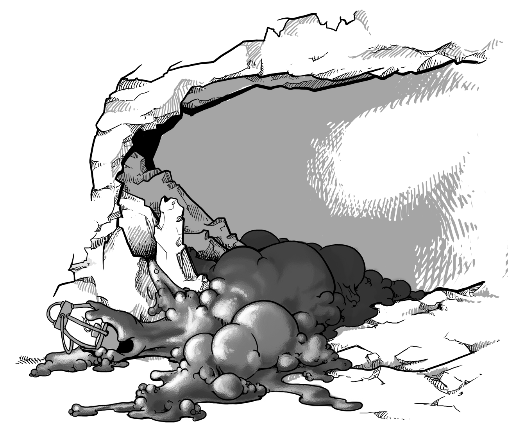

\null\vfill
\Large
Menschen & Magie - Monster und Schätze \newline
\normalsize
Eine Hausregelsammlung für Old-School Rollenspiele \newline
kompatibel mit *Swords & Wizardry* und allen Regeln, die auf dem
Original Fantasy Rollenspiel von 1974 basieren.
\newline
Version *beta*, 
\newline
Text und Satz: © Wanderer Bill, 2019, 2020\newline
<wandererbill73@gmail.com>
\small

Grafiken: LadyofHats, CC 0, public domain,
<https://commons.wikimedia.org/wiki/User:LadyofHats> 

*Swords & Wizardry* ist ein eingetragenes Warenzeichen von Matthew J.
Finch

Die *Menschen & Magie* ist Open Game
Content im Sinne der Open Game License, OGL 1.0a

Das heißt, Du darfst dieses Buch für Dich und für andere kopieren.
Gib es gerne weiter! 

Es ist auch kein Problem, die *Hausregeln* für deinen
eigenen Open Game Content zu benutzen, vorausgesetzt, Du hälst Dich
dabei an die Regeln der Open Game License.

Schließlich ist *Menschen & Magie* auch Open Source. Du findest die Quelldateien für dieses Dokument unter 
<https://github.com/lskh/Hausregeln>

\normalsize 

\clearpage

\tableofcontents

\listoftables

\mainmatter

# "Monster"

## Monsterklassen

: 1W20 Monsterklassen

|  1W20   | Monsterklasse |
|:------:|:------------------|
|    1	 | Menschen |
|    2	 | Lykanthropen |
|    3	 | Fantasyvölker |
|    4	 | Feenwesen |
|    5	 | Goblinoide |
|    6	 | Tiermenschen |
|    7	 | Riesen |
|    8	 | Untote |
|    9	 | Raubtiere |
|   10 | 	Herdentiere |
|   11 | 	Riesentiere |
|   12 | 	Chimären und mythische Kreaturen |
|   13 | 	Elementare |
|   14 | 	Drachen |
|   15 | 	Ungeziefer |
|   16 | 	Urtiere |
|   17 | 	Konstrukte |
|   18 | Dämonen, Engel und Teufel |
|   19 | Kosmische Urwesen |
|   20 | Gonzo und Slapstick |

## Menschen

Menschen sind auch in der Fantasywelt die häufigsten Begegnungen. Sie
treten in der Wildnis in großen Gruppen mit 30-300 Individuen pro
Hexfeld, oder dörflicher Siedlung auf. Sie werden mit 15%
Wahrscheinlichkeit in ihrem "Lager" mit einem Schatztyp A angetroffen.
Mit einer
Wahrscheinlichkeit von 5% (1/20) handelt es sich bei dem Lager um irgend 
eine Art von befestigte Wohnanlage.

Einzelne Begegnungen sollten an die Stärke der Spielergruppe angepasst
werden. Individuen haben Wertgegenstände in Höhe von 2-12 Silbermünzen
(SM) bei sich, und besitzen mit einer Wahrscheinlichkeit von 5% 
*einen* zufällig bestimmten magischen Gegenstand.

> **Normale Menschen:** RK 9 [10], TW 1, #AT 1 (unbewaffnet 1-3
>, bewaffnet 1-6)

Gelegentlich
werden Menschen mit Charakterklassen angetroffen, die dann
entsprechend der Regeln mehr Trefferwürfel, und besondere Fähigkeiten
haben können.

Kämpfer habe zu *je* 5% pro Stufe eine magische Rüstung,
einen magischen Schild, und ein magisches Schwert.

Zauberkundige haben zu *je* 5% pro Stufe einen magischen Stab, einen
magischen Ring und einen sonstigen magischen Gegenstand

Kleriker haben zu *je* 5% pro Stufe eine sonstige magische Waffe, eine
magische Rüstung, und einen magischen Schild.

Sonstige Soldaten oder Söldner, haben im Zeifel RK 6 [13], entsprechend einem einfachen Kettenhemd,
Schuppenpanzer, beschlagenem Leder oder ähnlichem. 

> **Soldaten:** RK 6 [13], TW 1, #AT 1 (1-6)

Soldaten sind in weitläufiger Umgebung in der Regel beritten (Leichte
Kavallerie 40%, mittlere Kavallerie 40%, Fußsoldaten 20%). Zu 50% sind
alle Soldaten mit Fernkampfwaffen (Bögen, Armbrust, Wurfspeeren)
ausgerüstet, und zu 10% mit größeren Belagerungsmaschinen wie z.B.
Katapulten oder Rammböcken.

Die kulturellen Eingenheiten der angetroffenen Menschen hängen, von
der Umgebung, und Geografie ab. 
Traditionell werden in der Fantasy-Welt folgende archetypische Gruppen
angetroffen:

: 1W10 Menschengruppen

| 1W10 | Menschengruppen (Gesinnung) |
|:---:|:-----------------|
| 1  | Banditen/Räuber (chaotisch) |
| 2  | Piraten (chaotisch) / Freibeuter (neutral) |
| 3  | Berserker (+2 im Kampf, neutral/chaotisch) |
| 4  | religiöse Fanatiker (+1 im Kampf, rechtschaffen/chaotisch) |
| 5  | Nomaden/Naturvölker (rechtschaffen/neutral) |
| 6  | Höhlenmenschen (immer 2 Trefferwürfel, neutral) |
| 7  | Pilger (rechtschaffen/chaotisch) |
| 8  | Händler (neutral) |
| 9 | Soldaten (je nach Fraktion, sonst neutral) |
| 10 | Abenteurergruppen (beliebig) |

Menschliche Gruppen sind meistens hierarchisch organisiert. Als
Faustregel gilt folgende "militärische" Struktur:

* auf je 30 Menschen kommt ein Stufe 4 Kämpfer
* gibt es drei oder mehr Stufe 4 Kämpfer zusätzlich ein Kämpfer der
 Stufe 5-6
* 100 Menschen oder mehr werden von einem Stufe 8-9 Kämpfer angeführt
* 100+ Menschen werden in 25% von einem Kleriker der Stufe 6-9 (1W4+5),
  und in 50% von einem Zauberkundigen der Stufe 6-11 (1W6+5) begleitet
* 300+ Menschen werden immer (100%) von Klerikern begleitet, und
  meistens (50%) von Klerikern.
* Religiöse Gruppen, Pilger oder "Fanatiker" werden immer (100%) von
 Klerikern begleitet; die o.g. Angaben für Kämpfer beziehen sich dann
 einfach auf Kleriker.

Als Reit-, Zug- und Arbeitstiere benutzen Menschen in der Regel
Herdentiere wie Pferde, Kamele, Rinder, aber auch z.B. Elefanten.
Selten verwenden Menschen auch Chimären oder Riesentiere.

## Lykanthropen

Bei Lykanthropen (wörtlich Wolfsmenschen) handelt es sich um normale
Menschen, die von der infektiösen *Lykanthropie* befallen sind, und
sich daher ausgelöst durch bestimmte Ereignisse in eine - in aller
Regel monströse - Tierform
verwandeln, und sich dann meistens chaotisch, aggressiv, und
allgemein "böse" und monströs verhalten. Klassische Beispiele sind die
Werwölfe, aber auch Wereber, Wertiger, Werbären und Werratten sind in
der Fantasy-Welt nicht unüblich. Allgemein ist die Lykanthropie in
Kombination mit jeder Tierart denkbar (siehe Raubtiere/Herdentiere),
und die resultierende Werform sollte 1-2 Trefferwürfel mehr haben, als
die entsprechende Tierart. Die übrigen Spielwerte und Eigenschaften
mit Ausnahme von Intelligenz und Gesinnung entsprechen der jeweiligen
Tierart.

>**Werwolf:** RK 5 [14], TW 4, BW 15 (XX m), chaotisch

In der Regel verhält sich der
sonst *neutrale* Mensch in seiner "Werform" chaotisch. Eine
traditionell wichtige Ausnahme ist in Anlehnung an den Charakter
*Beon* aus J.R.R. Tolkiens *Hobbit* der *neutrale* Werbär, der sich in
seiner menschlichen Form *rechtschaffen* verhält.

Die Lykanthropie wird als infektiöse Krankheit auf alle Menschen
übertragen, die von einem Lykanthropen verletzt werden. Die Erkrankung
bricht nach einer Inkubationszeit von 1-6 Wochen aus, und zeigt sich
dann bei dem betroffenen Menschen das erste mal, sobald der
entsprechende Auslöser auftritt.

: 1W4 Auslöser für Lykanthropie

| 1W4 | Auslöser |
|:---:|:----------|
| 1  | Vollmond |
| 2 | willentlich |
| 3 | Angst/Stress (ggf. RW gegen Lähmung) |
| 4 | Kampfsituationen |

Besteht eine Lykanthropie, bei der sich der betroffene Mensch
willentlich verwandeln kann, tritt die erste Verwandlung zufällig
ein (z.B. 5% pro Tag nach Ende der Inkubationszeit). Der Betroffene
erkennt dann, dass er von der Lykanthropie befallen ist, und dass er
sich willentlich in seine Werform verwandeln kann.

Lykanthropen sind meistens Einzelgänger (50%), kommen aber auch in
Gruppen von 2-20 Individuen vor (50%).

## Fantasyvölker

Zu den Fantasyvölkern gehören traditionell die Elfen, Halb-Elfen, Zwerge,
Halblinge und Gnome. Sie haben in aller Regel genau wie Menschen
grundsätzlich einen Trefferwürfel, können aber auch Abenteurerklassen
(Kämpfer, Zauberkundige, Kleriker usw.) mit mehren Trefferwürfeln,
entsprechend ihrer Stufe haben. Es werden 30-300 (1W10 * 3) Individuen
angetroffen, bzw. eine Anzahl entsprechend der Gruppenstärke der
Spielercharaktere. Zu 50% befinden sie sich in Ihrem Lager und haben
dort den Schatztyp C, E oder G. Individuen haben in der Regel 3-18
Silbermünzen bei sich, und haben zu 5% einen zufälligen magischen
Gegenstand. Fantasyvölker mit Charakterklassen haben magische
Gegenstände entsprechend ihrer Klassenstufe (siehe unter Menschen).

>**Elfen/Zwerge:** RK 8 [11] oder nach Rüstung, TW 1, #AT 1 (1-6)

Siedlungsformen richten sich nach der jeweiligen Kultur - Wohnbäume
für Elfen, Bergwerke und unterirdische Festungen für Zwergen und
Gnome, idyllische Hügeldörfer für Halblinge sind der Standard.

: 1W12 besondere Eigenschaften von Fantasyvölkern

| 1W12 | Eigenschaft |
|:---:|:---------------|
| 1  | Resistenz gegen Lähmung (Elfen) |
| 2 | Magieresistenz, +4 auf Rettungswurf (Zwerge) |
| 3 | besondere technische Begabung (Gnome) |
| 4 | besondere magische Begabung (Elfen) |
| 5 | Dunkelsicht (Zwerge/Gnome) |
| 6 | besondere handwerkliche Begabung (Zwerge) |
| 7 | besonders feines Gehör (2 auf W6) |
| 8 | Gespür für Geheimtüren (4 auf W6) |
| 9 | Besondere Begabung sich zu verstecken (Halblinge/Elfen) |
| 10 | Wahre Namen |
| 11 | Geschickt mit Pfeil und Bogen (+1, Halblinge +2) |
| 12 | Geschickt mit dem Schwert (+1) |

Fantasyvölker können jede Gesinnung haben. Als Reittiere verwenden sie
neben Herdentieren in passender Größe, auch Chimären oder Riesentiere.

: 1W8 Reittiere für Fantasyvölker

| 1W8  | Reittiere |
|:---:|:----------------------|
| 1 | Pferde / Ponies |
| 2 | andere Herdentiere |
| 3 | Raubtiere |
| 4 | Riesenadler (Roc) |
| 5 | Pegasi |
| 6 | Hippogreifen |
| 7 | Greifen |
| 8 | Drachen |

## Feenwesen

Zu den Feenwesen zählen zahlreiche mythologische oder aus
Märchentraditionen stammende Wesen. Auch sie haben in der Regel wie
ein Mensch *einen* Trefferwürfel und eine Rüstungsklassen je nach Aussrüstung, haben aber
häufig etwas ausgefallenere Eigenschaften. Feenwesen sind häufig von
neutraler Gesinnung (01-50), sie können chaotisch (51-90), und selten
rechtschaffen sein (91-00). Typische Beispiele sind Feen, Pixies,
Wichtel, Pukkas, Dryaden, Baumherren, Satyre, Faunen und Zentauren, aber auch Wassermänner, Nixen,
Fluss- und Waldgeister, je nach Umgebung in der sie angetroffen
werden. 

> **Fee:** RK 3 [16], TW 1/2, willkürliche Unsichtbarkeit, geflügelt
> (BW 12"/18"), an das Feenreich gebunden, kann einen 
> *begrenzten Wunsch* wirken.

> **Pukka:** RK 6 [13], TW 1, Unverträglichkeit von Eisen,
> Magiebegabt, Menschenfresser

Feenwesen treten einzeln, in Kleingruppen von
1-6, oder in Gruppen von 10-100 auf, befinden sich zu 50% in ihrem
Lager und haben dort die Schatztypen B, C oder D.

: 1W6 Größenstufen für Feenwesen

| 1W6 | Größe | Trefferwürfel |
|:----:|:------|:-----------------|
| 1 | winzig | 1/2 |
| 2 | klein | 1/2 | 
| 3 | zwergengroß | 1 |
| 4 | menschengroß | 1 |
| 5 | groß wie ein Pferd | 2-3 |
| 6 | riesenhaft | 4-8 (doppelter Schaden) |

: 1W20 Eigenschaften der Feenwesen

| 1W20 | Eigenschaften (1-4 mal würfeln) |
|:----:|:----------------------------|
| 1 | Unverträglichkeit von Eisen (doppelter Schaden) |
| 2 | Wahre Namen |
| 3 | Unsichtbarkeit, willkürlich (RK -4 [+4])|
| 4 | geflügelt (RK -2 [+2], BW 12"/18") |
| 5 | Dunkelsicht und/oder Lichtscheu |
| 6 | Schwer zu entdecken (Überraschen auf 4/6) |
| 7 | Magiebegabt (1-4 Zauberkundigen Sprüche der Stufen 1-4) |
| 8 | geistartiger Körper (nur magische Waffen schädigen) |
| 9 | tierische Merkmale, wie Hörner, Hufe, oder ein Schwanz |
| 10 | zentauroider Körper (i.d.R. den Rumpf eines Herdentieres) |
| 11 | an das Feenreich gebunden |
| 12 | an einen Baum, Hein oder ein Gewässer gebunden |
| 13 | pflanzenhafter Körper (Haare aus Ranken, Äste als Gliedmaßen) |
| 14 | natürliche Begabung Menschen zu bezaubern (RW -2) |
| 15 | Beschwörung von Dickichten oder animierten Bäumen |
| 16 | Beschwörung von Tieren, die zu Hilfe kommen |
| 17 | Menschen besonders hilfreich |
| 18 | Ständig zu Streichen aufgelegt, Verzauberung von Tierherden |
| 19 | kündigen mit ihrer "Wilden Jagd" Unheil an |
| 20 | Menschenfresser |

## Goblinoide

Goblinoide sind in Fantasy-Rollenspielen traditionell die "bösen" menschenartigen Kreaturen. In
der Geschichte der Mythologien und Märchen gibt es zahlreiche
Überschneidungen mit den Feenwesen, so dass zur Ausgestaltung
ausgefallener
Goblinoide auch die Tabelle *Eigenschaften der Feenwesen* (siehe dort)
genutzt werden kann. 

Goblinoide so wie Fantasyvölker in großen Gruppen von 40-400
Individuen auf, und sie haben in der Regel ebenfalls *einen*
Trefferwürfel. Ähnliche wie die militärische Struktur menschlicher
Gruppen, werden jeweils bis zu 30 Individuen von einem Individuum der
jeweils nächsten Größenstufe angeführt, und falls sich mehr als 60
Individuen in einer Gruppe finden, wird der Stamm von einem Anführer
jeweils 2 Größenstufen höher angeführt. 

Goblinoide befinden sich zu 50% in ihrem Lager und haben dann dort
einen Schatz der Klasse D. Außerdem tragen einzelne Individuen 3-18
Kupfer münzen bei sich.

Als Nichtspielercharaktere können einzelne Goblinoide nach Ermessen
der Spielleitung auch Charakterklassen und -stufen haben, und können
dann auch entsprechend mehr Trefferwürfel und auch magische
Gegenstände haben.

: 1W6 Goblinoide Größenstufen

| 1W6 | Größe | Rüstungsklasse | Trefferwürfel |
|:----:|:-------|--------------|-------------|
| 1 | Kobolde | 7 [12] | 1/2 |
| 2 | Goblins | 6 [13] | 1-1 |
| 3 | Orks | 6 [13] | 1 |
| 4 | Hobgoblins | 5 [14] | 2 |
| 5 | Grottenschrate | 5 [14] | 3+1 |
| 6 | Oger | 5 [14] | 4+1 |

: 1W6 Goblinoide Eigenschaften

| 1W6 | Eigenschaft |
|:---:|:---------------|
| 1 | Dunkelsicht |
| 2 | Lichtscheu (-1 im Kampf bei Sonnenlicht) |
| 3 | Furcht vor Magie (RW gegen Magie -2) |
| 4 | Berserkergang (+2 im Kampf) |
| 5 | Nilbog (siehe Text) |
| 6 | natürliche Magiebegabung wie Stufe 2 ZK |

Nilbogs heilen verlorene Trefferpunkte, wenn
sie verletzt werden, greifen
an, wenn man ihnen ein Friedensangebot unterbreitet, Lachen, wenn
etwas zum weinen ist usw. Die Nilbog Eigenschaft sollte nur 
sehr sparsam eingesetzt werden, da
sie sehr schnell sehr albern werden kann und sich der Effekt auch
schnell verbraucht, wenn er einmal erkannt ist.

Selbstverständlich sind Goblins immer irgendwie häßlich, unförmig,  
haben spitze, schartige Ohren, eine fliehende Stirn und hervorstehende
spitze Zähne. Darüber hinaus können Goblinoide aber durchaus noch
etwas origineller Ausgestaltet werden:

: 1W8 Goblinoide Haut- und Haarfarben

| 1W8 | Hautfarbe | Haarfarben |
|:---:|:----------|-----------|
| 1 | wie Menschen | braun |
| 2 | olivgrün | schwarz |
| 3 | ocker | braun |
| 4 | rostrot | kupferrot |
| 5 | blau | dunkelblau |
| 6 | grau | rotbraun |
| 7 | aschfahl | grau |
| 8 | gelblich | wie verfaulendes Gras |

: 1W6 Goblinoide Reit- und Wachtiere

| 1W6 | Tier |
|:---:|:------------|
| 1 | Wölfe |
| 2 | Bären |
| 3 | Ungeziefer in geeigneter Größe |
| 4 | Riesentiere |
| 5 | Drachen |
| 6 | Raubtiere |

## Tiermenschen

Bei den Tiermenschen handelt es sich um anthropomorphe Tiere.
Klassische Beispiele sind Hyänenmenschen (Gnolle), Echsenmenschen, 
Troglodyten, Fischmenschen (Sahuagin), aber auch Katzenmenschen,
Dinosauriermenschen und Insektenmenschen sollen zum Beispiel 
vorkommen. 

Um eine
Tiermenschenart zu erzeugen, sollte auf einer der Tiertabellen
(Raubtiere, Herdentiere, vielleicht auch "Ungeziefer") gewürfelt
werden, um die allgemeine Form festzulegen. Ansonsten gelten folgende
Richtwerte:

* 10-40 Individuen
* zu 50% im Lager, dann Schatztyp D
* einzelne Individuen tragen 1-10 Kupfermünzen oder 1-4 kleine
 Rohedelsteine bei sich
* 1-4 Trefferwürfel (nach Ermessen der Spielleitung evtl. auch
 Charakterklassen)
* Rüstungsklasse 7-3 ([12]-[16])
* Schaden (1W100): 01-60: menschliche Waffen (1-6, oder variabler
 Waffenschaden), 61-90: 2 Klauenangriffe (1-6/1-6), 91-00: 2
 Klauenangriffe und 1 Biss (1-6/1-6/1-6)

: 1W6 Eigenschaften von Tiermenschen

| 1W6 | Eigenschaften |
|:---:|:--------------------|
| 1 | "tierischer" Gestank (Gegner RW oder -2 auf Angriffswürfe) |
| 2 | feine Witterung, Wahrnehmung 4/6 |
| 3 | natürliche Tarnung, Überraschen 4/6 |
| 4 | Herbeirufen "ihrer" Tierart in 3-6 Kampfrunden |
| 5 | Dunkelsicht |
| 6 | Verwandlung in "ihre" Tierart, willkürlich |

## Riesen

Bei Riesen handelt es sich um ungewöhnlich große Ausgaben von
Menschen, oder selten auch Fantasyvölkern, Goblinoiden oder
Tiermenschen. Sie sind in der Regel Einzelgänger, oder treten in
Kleingruppen oder Familienverbänden von auf 1-10 Individuen auf. Man
trifft sie zu 30% in ihrem Lager, und sie bewachen dort einen
Schatztyp E zuzüglich 5.000 Goldmünzen (Titane Schatztyp A).
Einzelne wandernde Riesen tragen nicht selten 1.000-6.000 Goldmünzen mit
sich herum.

Abgesehen davon, dass Riesen
durch ihre gewaltige Größe ein vielfaches an Schaden
verursachen, können sie
wie ein Katapult mit Felsbrocken schleudern, und dabei 2-20 Punkte 
Schaden anrichten.

: 1W6 Größenstufen der Riesen

| 1W6 | Größe | Trefferwürfel | Schaden |
|:--:|:-------------|--------|---------|
| 1 | Hügelriese | 8 | 2-16 (2W6) |
| 2 | Steinriese | 9 | 3-18 (3W6) |
| 3 | Frostriese | 10+1 | 4-24 (4W6) |
| 4 | Feuerriese | 11+3 | 5-30 (5W6) | 
| 5 | Wolkenriese | 12+2 | 6-36 (6W6) | 
| 6 | Titane | 12-16 | 7-72 (7W6) |

: 1W6 Eigenschaften für Riesen

| 1W6 | Eigenschaft |
|:---:|:--------------------|
| 1 | Kälteresistent |
| 2 | Hitzeresistent |
| 3 | Magiebegabt wie ein Stufe 7 Zauberkundiger |
| 4 | Kleriker der 7. Stufe |
| 5 | feiner Geruchssinn (Wahrnehmung 4/6) |
| 6 | Wahrer Name |

Riesen sind an den erstaunlichsten Orten anzutreffen und nennen
Behausungen von unterirdischen Höhlen, über Tierställe und gewaltige
Burgen bis hin zu Wolkenpalästen ihr Heim. Als Haus-, Wach- und
Hütetiere halten sie oft sehr große normale Tiere oder Riesentiere.
Aber auch jede Art von tierartigem phantastischem Wesen ist denkbar.

## Untote

Skelette, Zombies, Schatten, Gruftschrecken, Ghule (?), Banshees,
Geister, Vampire

## Raubtiere

Raubkatzen, Bären, Wölfe, Haie, Raubvögel

## Herdentiere

Rehe, Hirsche, Elche, Pferde, Kamele, Llamas, Elefanten, Wale

## Riesentiere

Riesenformen der Raub- und Herdentiere

## Chimären und mythische Kreaturen

Chimeras, Manticore, Pegasi, Hippogreifen, Greifen, Sphinxen, Trolle
Medusen, Basilisken, Hydras

## Elementare

Feuer-, Erd-, Wasser-, Luftelementare

## Drachen

: 1W6 drakonische Größenstufen

| 1W6 | Größe |
|:-----:|:----------------|
| 1 | Wyrmling |
| 2 | Jungdrache |
| 3 | ausgewachsener Drache |
| 4 | alter Drache |
| 5 | Uralter Drache |
| 6 | Leviathan |

: 1W20 drakonische Eigenschaften 

| 1W20 | Eigenschaft (1W4 mal würfeln) |
|:---:|:-------------|
| 1 | vier Beine, zwei Flügel |
| 2 | Schlangenartig, geflügelt |
| 3 | zwei Beine, zwei Flügel |
| 4 | mehr als zwei Flügel |
| 5 | sprachbegabt, Intelligenz 9-14 (1W6+8) |
| 6 | magiebegabt, wie ZK der 3-6. Stufe |
| 7 | mehrköpfig (1-4 Köpfe) |
| 8 | mit Giftstachel bewehrte Schwanzspitze |
| 9 | *keine* Odemwaffe |
| 10 | kann willentlich menschliche Gestalt annehmen |
| 11 | Verbreitet Angst und Schrecken (Rettungswurf) |
| 12 | Phasendrache: kann sich willentlich teleportieren |
| 13 | Chamäleon: kann mit der Umgebung optisch verschmelzen | 
| 14 | amphibisch, kann unter Wasser atmen |
| 15 | wahrer Name | 
| 16 | |
| 17 | |
| 18 | |
| 19 | |
| 20 | |

: 1W12 drakonische Farben

| 1W12 | Farbe |
|:---:|:--------------------------|
| 1 | rot |
| 2 | grün |
| 3 | weiß |
| 4 | schwarz |
| 5 | blau |
| 6 | braun |
| 7 | Kupfer |
| 8 | Bronze |
| 9 | Silber |
| 10 | Gold |
| 11 | Rubin |
| 12 | Saphir (grün, blau, violett bis orange) |

: 1W6 Odemwaffen

| 1W6 | Odem |
|:---:|:----------------|
| 1 | Giftgas |
| 2 | Feuer |
| 3 | Eis |
| 4 | Blitzschlag |
| 5 | Gift |
| 6 | 2 x würfeln und kombinieren |

## Ungeziefer

Schleime, gelatinöse Kreaturen, Pilze, monströse Pflanzen, 
Würmer, Insekten, Schlangen, Echsen,
Lurche, Klesche

## Urtiere

Dinosaurier, prähistorische Säugetiere, Dodos

## Konstrukte

Golems, Roboter, Automata

## Dämonen, Engel und Teufel

Dämonen, Teufel, Engel, Halbgötter, Diener

### Dämonen

: 1W10 Dämonenklassen

| 1W10 | Klasse | TW  | RK | Eigenschaft |
|:-:|-------|:----:|----|-------------|
| 1 | Unterdämon | 1-4 | 2 |  |
| 2 | Kleindämon | 4-7 | 1 |  |
| 3 | A | 8 | 0 |      |
| 4 | B | 9 | -2 |    |
| 5 | C | 10 | -4 |    |
| 6 | D | 11 | -1 |    |
| 7 | E | 7+7 | -7 |   |
| 8 | F | 8+8 | -2 |   |
| 9 | Lord |  |  |  |
| 0 | Prinz |  |  |  |

Dämonische Eigenschaften

Dämonische Namen

### Engel

### Teufel

Teuflische Größenklassen

Teuflische Eigenschaften

## Kosmische Entitäten

Kosmische Schrecken, Godzilla, Götter, Dinge von denen die Menschheit nichts
wissen darf.

## Gonzo und Slapstick

Zufallsmonster, Außerirdische, Laser ("piu-piu")

### Allgemeine Verkehrskontrolle 
Die zwei Streifenpolizisten Herbert
Hasenfuß und Bernd Sauerbier (beide NM, AC 9, TP 1W6,
Dungeon-Polizei-Knüppel 1W4) führen allgemeine Verkehrskontrollen
durch. Mit ihrer Dungeon-Polizei-Kristallkugel ermitteln sie einen
Atemalkohol von 1W3-komma-1W10 Prozent, liegt der Wert über 2,0
teleportieren Sie den betreffenden Spieler-Charakter ohne weitere
Fragen zu stellen: bei ungrade direkt zum Endboss, bei gerade zurück
zum Ausgang - XP 0.

### Der Einhornbär
| AC: 6
| HD: 5*
| No appearing: 1 - 3 (wenn mehr als einer angetroffen werden, handelt es sich um eine Mutter mit 1 - 2 Jungen)
| Move: 150’(50’)
| #AT: claw/claw/bite/horn or special
| Dmg: 1-6/1-6/1-8/1-8
| ML: 10
| Schatztyp: speziell, 1-10 Edelsteine, 1-3 beliebige magische Gegenstände außer Tränke und Rollen
| Aln: Chaotic Neutral
| XP: 250

Einhornbären sind sehr seltene verträumte bunte Kuschelbären, aber sie
können auch anders: Wenn sie sich missverstanden fühlen
(Reaktionswurf), oder sie Junge bei sich haben werden sie sofort voll
aggro.

Gefürchtet ist ihr Spezialangriff - der Regenbogen-Rülpser: dabei
stoßen sie, begleitet von einem markerschütternden Brüllen, welches an
ein übernatürlich lautes Klangschalen- und Windspiel-Klimbim erinnert,
eine regenbogen-farbene Wolke messerscharfer Glitzerpartikel aus:
Schaden 2W8 für jedes Wesen innerhalb eines 10’ x 40’ Konus,
Rettungswurf gegen Drachenodem halbiert den Schaden.

Manchmal (1-3 auf W6) kommt auch noch anderer Mageninhalt mit, dann
wird jedem Betroffenen - zusätzlich zu jedem anderen Schaden - so
speiübel, dass für 1-6 Runden -2 auf jede Probe gilt.

Felle von Einhornbären bringen auf dem Schwarzmarkt 500 GM (weiß) bis
2500 GM (Regenbogen oder Glitzi), junge dressierte Einhornbären
bringen stubenrein bis zu 3000 GM, man muss halt die richtigen Leute
kennen.

### Der Fuß

| Auftreten 1-4
| HD 2
| AC 12
| #AT 1
| S: 1W8 Trampelschaden + Spezialeffekt
| Sv Kä1
| Mv 6”
| ML 12
| XP 25

Falls man den Angriff eines Fußes überlebt, bekommt man auf jeden Fall
Fußpilz, was dazu führt, dass man sich ständig an den Füßen kratzen
muss. Das stört sehr und senkt die Geschicklichkeit für die Dauer der
Erkrankung mit allen Konsequenzen auf 3. Heilt Krankheiten, oder auch
ein Fluchbrecher können helfen.

### Der Rotzling

| Auftreten 1-4
| HD 1
| AC 10
| #AT 1 Spezial
| Sv: M1
| Mv 12”
| ML 12
| XP 5

Rotzlinge sind kleine gräßliche koboldartige Kreaturen aus grünem
Schleim, die leidend vor sich hin stöhnen, husten, und nießen, und
versuchen jeden Gesunden anzugreifen. Man kann Rotzlinge nur
verletzen, in dem man sie mit Ingwerwurzeln, oder Kräuterteebeuteln
bewirft. Bei einem erfolgreichen Angriff eines Rotzlings wird das
Opfer infiziert, wodurch es selbst zu einem Rotzling wird. Nun kann
ihm nur noch ein Heilt Krankheiten eines mächtigen Klerikers, oder
absurd große Mengen Kräutertee helfen. Nach einer Woche vergeht der
Rotz allerdings von selbst, und der Charakter ist wieder ganz der
Alte…

#  Schätze

## 1W24 Schatztypen

1. **A (XXII)**   
  Land: 1000 KM 1-6:25%, 1000 SM 1-6:30%, 1000 GM 2-12:35%, Steind und
  Geschmeide 6-36:50%, Magische Gegenstände und Karten  any 3:40%
  
  Wüste:     1-4:20%   1-4:25%  1-6:30%   10-40:50%     3 magic:60%

  Meer:      nil       nil      5-30:60%  10-16:60%     1 map:50%

2. **B (XXI)**   1-8:50%   1-6:25%  1-3:25%   1-6:25%       10%: Waffe,
                                                       Rüstung, or
                                                       misc. weapon

3. **C (XX)** 
 
4. **D (XIX)**

5. **E (XVIII)**

6. F (XVII)

7. G (XVI)

8. H (XV)

9. I (XIV)

10. J (XIII)

11. K (XII)

12. L (XI)

13. M (X)

14. N (IX)

15. O (VIII)

16. P (I)

17. Q (II)

18. R (III)

19. S (IV)
 
20. T (V)

21. U (VI)

22. V (VII)

23. W

24. X 

## 1Wxx magische Schwerter

## 1Wxx magische Schilde

## 1Wxx sonstige magische Waffen

## 1Wxx magische Rüstungen

## 1Wxx Magische Gegenstände

| Zauber | Ring | Rolle | Trank | Stab | Stecken | Rute |
|:--:|:--:|:--:|:--:|:--:|:--:|:--:|:--:|:--:|:--:|:--:|
| 1-3 Sprüch 1-3 | 1 | 2 | 3 | 4 | 5 | 6 | 7 | 8 | 9 | 10 |
| 1-3 Sprüche 4-6 | 11 | 12 | 13 | 14 | 15 | 16 | 17 | 18 | 19 | 20 |
| Schutz Lykanthropen | 21 | 22 | 23 | 24 | 25 | 26 | 27 | 28 | 29 | 30 |
| Schutz +1 | 31 | 32 | 33 | 34 | 35 | 36 | 37 | 38 | 39 | 40 |
| Unsichtbarkeit | 41 | 42 | 43 | 44 | 45 | 46 | 47 | 48 | 49 | 50 |
| 1 Spruch 1-4 | 51 | 52 | 53 | 54 | 55 | 56 | 57 | 58 | 59 | 60 |
| 1 Spruch 1-4 | 61 | 62 | 63 | 64 | 65 | 66 | 67 | 68 | 69 | 70 |
| 1 Spruch 1-4 | 71 | 72 | 73 | 74 | 75 | 76 | 77 | 78 | 79 | 80 |
| 1 Spruch 1-4 | 81 | 82 | 83 | 84 | 85 | 86 | 87 | 88 | 89 | 80 |
| 1 Spruch 1-4 | 91 | 92 | 93 | 94 | 95 | 96 | 97 | 98 | 99 | 00 |

## 1.000.000 magische Artefakte

\tiny

| 1W30 | Gegenstand | 1W4 Eigenschaften | Material | 1W6 Mächte | 
|:--:|:-----------|:------------|:--------------|:-------------------|
| 01 | Kessel | Krähenfüße | Gold | 1-6 Sprüche 1-6 |
| 02 | Amulet | Entenfüße | Kupfer | 1-4 Sprüche 4-9 |
| 03 | Hütte | Fledermausflügel | Silber | 1-4 Wünsche |
| 04 | Handschuhe | schwebend | Papier | Vakuumreisen |
| 05 | Gürtel | Lumineszenz | Samt | Flammenstrahl |
| 06 | Mantel | Gesinnungstreu | Seide | Feuerresistenz |
| 07 | Kelch | Sprachbegabt | Ebenholz | Kälteresistenz |
| 08 | Schale | Int. 15 | Eiche | Feuerodem |
| 09 | Würfel | Telepatiebegabt | Eibe | Eisodem |
| 10 | Polyhedron | unsichtbar | Leder | Zeitreisen |
| 11 | Löffel | Taschendimension | Bernstein | Ebenenreisen |
| 12 | Gabel | Kommandowort | Obsidian | Geräuschlosigkeit |
| 13 | Schere | zerbrechlich | Messing | Zerstörung |
| 14 | Tierfigur | unzerstörbar | Mithril | 1-4 Gebete 1-4 |
| 15 | Besen | magnetisch | Federn | 1-4 Gebete 4-7 |
| 16 | Ruderboot | giftig | Porzellan | Spurlosigkeit |
| 17 | Kanu | verflucht | Meteorit | Int. +2 |
| 18 | Muschel | chaotisch | Hämatit | Wei. +2 |
| 19 | Schneckenhaus | egoistisch | Mondstein | Größenwechsel |
| 20 | Spieluhr | rechtschaffen | Licht | Parallelweltreisen |
| 21 | Sextant | schwer | Äther | Spähen |
| 22 | Helm | leicht | Dunkelheit | Orientierung |
| 23 | Stiefel | schwelend | Klang | Extrastufen 1-4 |
| 24 | Umhang | eiskalt | Esche | Riesenschritte |
| 25 | Zepter | geladen | Fischhaut | Adlerflug |
| 26 | Orb | Taubenflügel | Glas | Tauchen |
| 27 | Horn | 1-10 Augen | Platin | Festung |
| 28 | Leier | Monstergestalt | Perlmutt | Stä. * 2 |
| 29 | Laute | annihilierend | Karneol | Adlerflug |
| 30 | Knopf | schillernd | Sternenhimmel | Energiestrahl |

\normalsize

