\null\vfill
\Large
Menschen & Magie - Monster und Schätze \newline
\normalsize
Eine Hausregelsammlung für Old-School Rollenspiele \newline
kompatibel mit *Swords & Wizardry* und allen Regeln, die auf dem
Original Fantasy Rollenspiel von 1974 basieren.
\newline
Text und Satz: © Wanderer Bill, <wandererbill73@gmail.com>\newline
Datum:
\small

Grafiken: LadyofHats, CC 0, public domain,
<https://commons.wikimedia.org/wiki/User:LadyofHats> 

*Swords & Wizardry* ist ein eingetragenes Warenzeichen von Matthew J.
Finch

Die *Menschen & Magie* ist Open Game
Content im Sinne der Open Game License, OGL 1.0a

Das heißt, Du darfst dieses Buch für Dich und für andere kopieren.
Gib es gerne weiter! 

Es ist auch kein Problem, die *Hausregeln* für deinen
eigenen Open Game Content zu benutzen, vorausgesetzt, Du hälst Dich
dabei an die Regeln der Open Game License.

Schließlich ist *Menschen & Magie* auch Open Source. Du findest die Quelldateien für dieses Dokument unter 
<https://github.com/lskh/Menschen-und-Magie>

\normalsize 

\clearpage

\tableofcontents*

\listoftables*

\mainmatter

# "Monster"

Standardformat:

>**Name/Bezeichnung** Anzahl Dungeon (Wildnis), RK desc[asc] 
>und ggf. besondere Verteidigung, TW oder
>Klasse, BW, S: Schaden und ggf. besondere Effekte

## Trefferwürfel - W6 oder W8?

In Old-School Rollenspielen kommen je nach Regelsystem zwei
unterschiedliche Größen an Trefferwürfeln vor: der W6 oder der
W8. Es ist letztlich Entscheidung der Spielrunde welche Größe
für Monster zum Einsatz kommen soll. In jedem Fall sollten dann
aber auch die Trefferwürfel der Spielercharaktere dazu passend
gewählt werden: in einer W6 Welt wird das natürlich der W6 sein.
Entscheidet man sich für eine W8 Welt, haben die verschiedenen
Charakterklassen typischerweise unterschiedliche Trefferwürfel:
Zauberkundige einen W4, Diebe einen W4 oder W6, Kleriker einen
W6, und Kämpfer einen W8 oder W10. 

## Schaden - W6 oder variabler Waffenschaden?

In den Originalregeln machte ein Angriff grundsätzlich 1-6 Punkte
Schaden, also 1W6. Große Gegener - solche mit mehreren
Trefferwürfeln - konnten bei Gegnern der ersten Stufe (bzw.
Gegnern mit nur einem Trefferwürfel) in jeder Kampfrunde einen 
Angriff *pro Stufe* ausführen. Ein Bär Grizzlybär mit 4
Trefferwürfeln, hätte also demnach gegen einen Kämpfer der ersten 
Stufe vier Angriffe pro Kampfrunde gut gehabt. Sobald beide
Kontrahenten mehr als einen Trefferwürfel hatten, bzw. mehr als eine
Stufe, war grundsätzlich für beide Seiten nur noch ein Angriff pro Runde
möglich. 

Für einige Kreaturen wurden auch schon in den Originalregeln
mehrere Schadenswürfel angegeben. So zum Beispiel für die Riesen,
die je nach Größe 2W6 oder 3W6 Schaden anrichteten.

Mit dem ersten Supplement wurde dann der variable Waffenschaden
eingeführt, also unterschiedliche Schadenswürfel je nach Größe
und Art der Waffe - z.B. 1W4 für einen Dolch und 1W10 für ein
Zweihandschwert. Passend dazu bekamen die Monster ebenfalls
unterschiedliche Schadenswürfel sowie die sogenannten
Angriffsroutinen. Letztere legten fest, wie genau eine Kreatur
mehrfach angreifen konnte. Zum Beispiel drei Angriffe pro Runde
"Klaue/Klaue/Biss", mit 1W4/1W4/1W8 Schaden. 

Variabler Waffenschaden und Angriffsroutinen machen in der Regel
mehr Schaden als das W6 basierte System. Daher sollten
Angriffsroutinen nur zum Einsatz kommen, wenn auch der variable
Waffenschaden für die Spielercharaktere gilt.

In diesem Band wird jeweils beides angegeben, zuerst der W6
basierte Schaden, dann in eckigen Klammern der variable Schaden, 
bzw. die Angriffsroutine. Besteht die Angriffsroutine aus drei
Werten wie im o.g. Beispiel handelt es sich in aller Regel um die
Routine "Klaue/Klaue/Biss", bei zwei gleichen Werten um
"Klaue/Klaue".  Andere Varianten werden gesondert benannt. Fehlt
die Angabe in Klammern, ist der Wert für beide Systeme gleich.

Im Zweifel kann für einen Trefferwürfel immer ein W8 verwendet
werden, und für einen Schadenswurf immer ein W6.

## Monsterklassen

: 1W30 Monsterklassen

|  1W30   | Monsterklasse |
|:------:|:------------------|
|    1	 | Menschen |
|    2	 | Lykanthropen |
|    3	 | Fantasyvölker |
|    4	 | Feenwesen |
|    5	 | Goblinoide |
|    6	 | Tiermenschen |
|    7	 | Riesen |
|    8	 | Untote |
|   9   | Affen |
|   10	 | Raubtiere |
|   11 | 	Herdentiere |
|   12 | Nagetiere |
|   13 | Fledertiere |
|   14 | Echsen und Lurche |
|   15 | Vögel |
|   16 | Fische |
|   17 | Insekten und Spinnenartige |
|   18 | Riesentiere |
|   19 | 	Drachen |
|   20 | Chimären und Mythische Kreaturen | 
|   21 | Elementare |
|   22 | Gonzo und Pop-Kultur |
|   23 | Seeungeheuer |
|   24 | Pilze und Pflanzen |
|   25 | 	Würmer |
|   26 |  Blob, Glibber und Schleim |
|   27 | 	Urtiere |
|   28 | 	Konstrukte |
|   29 | Dämonen, Engel und Teufel |
|   30 | Kosmische Urwesen |


## Menschen

Menschen sind auch in der Fantasywelt die häufigsten Begegnungen. Sie
treten in der Wildnis in großen Gruppen mit 30-300 Individuen pro
Hexfeld, oder dörflicher Siedlung auf. Sie werden mit 15%
Wahrscheinlichkeit in ihrem "Lager" mit einem Schatztyp A angetroffen.
Mit einer
Wahrscheinlichkeit von 5% (1/20) handelt es sich bei dem Lager um irgend 
eine Art von befestigte Wohnanlage.

Einzelne Begegnungen sollten an die Stärke der Spielergruppe angepasst
werden. Individuen haben Wertgegenstände in Höhe von 2-12 Silbermünzen
(SM) bei sich, und besitzen mit einer Wahrscheinlichkeit von 5% 
*einen* zufällig bestimmten magischen Gegenstand.

> **Normale Menschen:** RK 9 [10], TW 1, BW 12" (36 m), 
> S: 1-6 [je nach Waffe], unbewaffnet 1-2

Gelegentlich
werden Menschen mit Charakterklassen angetroffen, die dann
entsprechend der Regeln mehr Trefferwürfel, und besondere Fähigkeiten
haben können. Die Stufe des entsprechenden Charakters kann mit
1W4+1W10 zufällig bestimmt werden.

Kämpfer habe zu *je* 5% pro Stufe eine magische Rüstung,
einen magischen Schild, und ein magisches Schwert.

Zauberkundige haben zu *je* 5% pro Stufe einen magischen Stab, einen
magischen Ring und einen sonstigen magischen Gegenstand

Kleriker haben zu *je* 5% pro Stufe eine sonstige magische Waffe, eine
magische Rüstung, und einen magischen Schild.

Es ist unwahrscheinlich, dass solche einzelnen höherstufigen
Charaktere alleine angetroffen werden. Sie werden 1-8 Gefolgsleute
oder Mietlinge bei sich haben. Dabei kann es sich um normale Menschen
handeln, oder auch um Charaktere mit Klassen bis maximal zwei Stufen
unter der Stufe des Hauptcharakters.

Sonstige Soldaten oder Söldner, haben im Zeifel RK 6 [13], entsprechend einem einfachen Kettenhemd,
Schuppenpanzer, beschlagenem Leder oder ähnlichem. 

> **Soldaten:** RK 6 [13], TW 1, BW 9" (27 m), S: 1-6 [je nach
> Waffe]

Soldaten sind in weitläufiger Umgebung in der Regel beritten (Leichte
Kavallerie 40%, mittlere Kavallerie 40%, Fußsoldaten 20%). Zu 50% sind
alle Soldaten mit Fernkampfwaffen (Bögen, Armbrust, Wurfspeeren)
ausgerüstet, und zu 10% mit größeren Belagerungsmaschinen wie z.B.
Katapulten oder Rammböcken.

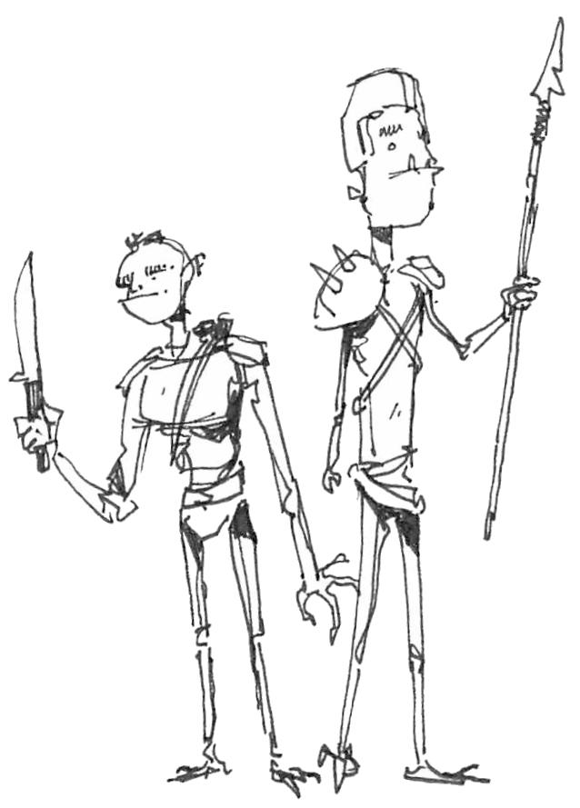

Die kulturellen Eingenheiten der angetroffenen Menschen hängen, von
der Umgebung, und Geografie ab. 
Traditionell werden in der Fantasy-Welt folgende archetypische Gruppen
angetroffen:

: 1W10 Menschengruppen

| 1W10 | Menschengruppen (Gesinnung) |
|:---:|:-----------------|
| 1  | Banditen/Räuber (chaotisch) |
| 2  | Piraten (chaotisch) / Freibeuter (neutral) |
| 3  | Berserker (+2 im Kampf, neutral/chaotisch) |
| 4  | religiöse Fanatiker (+1 im Kampf, rechtschaffen/chaotisch) |
| 5  | Nomaden/Naturvölker (rechtschaffen/neutral) |
| 6  | Höhlenmenschen (immer 2 Trefferwürfel, neutral) |
| 7  | Pilger (rechtschaffen/chaotisch) |
| 8  | Händler (neutral) |
| 9 | Soldaten (je nach Fraktion, sonst neutral) |
| 10 | Abenteurergruppen (beliebig) |

Menschliche Gruppen sind meistens hierarchisch organisiert. Als
Faustregel gilt folgende "militärische" Struktur:

* auf je 30 Menschen kommt ein Stufe 4 Kämpfer
* gibt es drei oder mehr Stufe 4 Kämpfer zusätzlich ein Kämpfer der
 Stufe 5-6
* 100 Menschen oder mehr werden von einem Stufe 8-9 Kämpfer angeführt
* 100+ Menschen werden in 25% von einem Kleriker der Stufe 6-9 (1W4+5),
  und in 50% von einem Zauberkundigen der Stufe 6-11 (1W6+5) begleitet
* 300+ Menschen werden immer (100%) von Klerikern begleitet, und
  meistens (50%) von Klerikern.
* Religiöse Gruppen, Pilger oder "Fanatiker" werden immer (100%) von
 Klerikern begleitet; die o.g. Angaben für Kämpfer beziehen sich dann
 einfach auf Kleriker.


Als Reit-, Zug- und Arbeitstiere benutzen Menschen in der Regel
Herdentiere wie Pferde, Kamele, Rinder, aber auch z.B. Elefanten.
Selten verwenden Menschen auch Chimären oder Riesentiere.

## Lykanthropen

Bei Lykanthropen (wörtlich Wolfsmenschen) handelt es sich um normale
Menschen, die von der infektiösen *Lykanthropie* befallen sind, und
sich daher ausgelöst durch bestimmte Ereignisse in eine - in aller
Regel monströse - Tierform
verwandeln. Sie verhalten sich dann meistens chaotisch, aggressiv, und
allgemein "böse" und monströs. Klassische Beispiele sind die
Werwölfe, aber auch Wereber, Wertiger, Werbären und Werratten sind in
der Fantasy-Welt nicht unüblich. 

>**Werwolf:** RK 5 [14], TW 4, BW 15" (45 m), S: 1-6 und Lykanthropie,
>V: nur Silberwaffen sind effektiv

Allgemein ist die Lykanthropie in
Kombination mit jeder Tierart denkbar (siehe Raubtiere/Herdentiere),
und die resultierende Werform sollte 1-2 Trefferwürfel mehr haben, als
die entsprechende Tierart. Die übrigen Spielwerte und Eigenschaften
mit Ausnahme von Intelligenz und Gesinnung entsprechen der jeweiligen
Tierart. Der Übergang zu Tiermenschen, die sich in normale Menschen
verwandeln können, ist fließend.

Lykanthropische Eigenschaften

 1W8  Eigenschaft
----- -----------------------------------------------
 1    Verletzbar *nur durch* Silberwaffen 
 2    Wahre Namen
 3    Tierform ist die "normale" Form
 4    Überraschen bei 3 in 6
 5    
 6
 7
 8

In der Regel verhält sich der
sonst *neutrale* Mensch in seiner "Werform" chaotisch. Eine
traditionell wichtige Ausnahme ist in Anlehnung an den Charakter
*Beon* aus J.R.R. Tolkiens *Hobbit* der *neutrale* Werbär, der sich in
seiner menschlichen Form *rechtschaffen* verhält.

Die Lykanthropie wird als infektiöse Krankheit auf alle Menschen
übertragen, die von einem Lykanthropen verletzt werden, und dabei mehr
als die Hälfte ihrer Trefferpunkte verlieren. Die Erkrankung
bricht nach einer Inkubationszeit von 1-6 Wochen aus, und zeigt sich
dann bei dem betroffenen Menschen das erste mal, sobald der
entsprechende Auslöser auftritt. Lykanthropie kann geheilt werden,
sofern *vor* der ersten Verwandlung ein *Krankheiten heilen* Zauber
gewirkt wird.

: 1W4 Auslöser für Lykanthropie

| 1W4 | Auslöser |
|:---:|:----------|
| 1  | Vollmond |
| 2 | willentlich |
| 3 | Angst/Stress (ggf. RW gegen Lähmung) |
| 4 | Kampfsituationen |

Besteht eine Lykanthropie, bei der sich der betroffene Mensch
willentlich verwandeln kann, tritt die erste Verwandlung zufällig
ein (z.B. 5% pro Tag nach Ende der Inkubationszeit). Der Betroffene
erkennt dann, dass er von der Lykanthropie befallen ist, und dass er
sich willentlich in seine Werform verwandeln kann.

Lykanthropen sind häufig Einzelgänger (50%), kommen aber auch in
Packs von 2-8 Individuen vor (50%). Bei 2-5 Individuen handelt es sich
um eine Gruppe von Erwachsenen. Bei 6 oder mehr um eine Familie
bestehend aus 2 Erwachsenen und mehreren Kindern/Jungtieren. Wird
eines der Kinder angegriffen, kämpft die Mutter für 4 Runden mit drei
Angriffen pro Runde. Wird die Mutter angegriffen, kämpft der Vater in
allen folgenden Runden mit 2 Angriffen pro Runde. Sollten beide Eltern
getötet werden, gelten die Kinder/Jungtiere automatisch als
Unterworfen. Im Lager von Lykanthropen finden sich 1-4 solcher Packs,
sowie normale Tiere der entsprechenden Art in etwa der Hälfte der Zahl.
Lykanthropen haben in Ihrem Lager einen Schatz des Typs C.

### Doppelgänger

Ähnlich den Lykanthropen sind die Doppelgänger. Es handelt sich dabei
um monströse Humanoide, die nach einer gewissen Zeit der Beobachtung
perfekt die Gestalt und den Habitus eines bestimmten Menschen oder
Menschenähnlichen annehmen
können. Sie töten dann die jeweilige Person, und nehmen
deren Rolle ein, bis sie Ihr nächstes Opfer ausgemacht haben.

>**Doppelgänger** RK 5 [14], TW 4, BW 9" (27 m), S: 1-6 [1-12], V:
>Immun gegen Schlaf- und Bezauberungs-Sprüche, Rettungswürfe wie
>Kämpfer der Stufe 10

Doppelgänger treten meistens einzeln auf, können aber auch in Gruppen
von 3-12 Individuen vorkommen. In Ihrem Lager haben sie einen Schatz
des Typs E.

## Fantasyvölker

Zu den Fantasyvölkern gehören traditionell die Elfen, Halb-Elfen, Zwerge,
Halblinge und Gnome. Sie haben in aller Regel genau wie Menschen
grundsätzlich einen Trefferwürfel, können aber auch Abenteurerklassen
(Kämpfer, Zauberkundige, Kleriker usw.) mit mehren Trefferwürfeln,
entsprechend ihrer Stufe haben. Es werden 30-300 (1W10 * 3) Individuen
angetroffen, bzw. eine Anzahl entsprechend der Gruppenstärke der
Spielercharaktere. Zu 50% befinden sie sich in Ihrem Lager und haben
dort den Schatztyp C, E oder G. Individuen haben in der Regel 3-18
Silbermünzen bei sich, und haben zu 5% einen zufälligen magischen
Gegenstand. Fantasyvölker mit Charakterklassen haben magische
Gegenstände entsprechend ihrer Klassenstufe (siehe unter Menschen).

>**Elfen** RK 8 [11] oder nach Rüstung, TW 1, BW 15" (45 m), S:
>1-6 [je nach Waffe]

>**Zwerge** RK 8 [11] oder nach Rüstung, TW 1, BW 9" (27 m), S: 1-6
>[je nach Waffe]

Siedlungsformen richten sich nach der jeweiligen Kultur - Wohnbäume
für Elfen, Bergwerke und unterirdische Festungen für Zwergen und
Gnome, idyllische Hügeldörfer für Halblinge sind der Standard.

: 1W12 besondere Eigenschaften von Fantasyvölkern

| 1W12 | Eigenschaft |
|:---:|:---------------|
| 1  | Resistenz gegen Lähmung (Elfen) |
| 2 | Magieresistenz, +4 auf Rettungswurf (Zwerge) |
| 3 | besondere technische Begabung (Gnome) |
| 4 | besondere magische Begabung (Elfen) |
| 5 | Dunkelsicht (Zwerge/Gnome) |
| 6 | besondere handwerkliche Begabung (Zwerge) |
| 7 | besonders feines Gehör (2 auf W6) |
| 8 | Gespür für Geheimtüren (4 auf W6) |
| 9 | Besondere Begabung sich zu verstecken (Halblinge/Elfen) |
| 10 | Wahre Namen |
| 11 | Geschickt mit Pfeil und Bogen (+1, Halblinge +2) |
| 12 | Geschickt mit dem Schwert (+1) |

Fantasyvölker können jede Gesinnung haben. Als Reittiere verwenden sie
neben Herdentieren in passender Größe, auch Chimären oder Riesentiere.

: 1W8 Reittiere für Fantasyvölker

| 1W8  | Reittiere |
|:---:|:----------------------|
| 1 | Pferde / Ponies |
| 2 | andere Herdentiere |
| 3 | Raubtiere |
| 4 | Riesenadler (Roc) |
| 5 | Pegasi |
| 6 | Hippogreifen |
| 7 | Greifen |
| 8 | Drachen |

## Feenwesen

Zu den Feenwesen zählen zahlreiche mythologische oder aus
Märchentraditionen stammende Wesen. Auch sie haben in der Regel wie
ein Mensch *einen* Trefferwürfel und eine Rüstungsklassen je nach Aussrüstung, haben aber
häufig etwas ausgefallenere Eigenschaften. Feenwesen sind häufig von
neutraler Gesinnung (01-50), sie können chaotisch (51-90), und selten
rechtschaffen sein (91-00). Typische Beispiele sind Feen, Pixies,
Wichtel, Pukkas, Dryaden, Baumherren, Satyre, Faunen und Zentauren,
aber auch Wassermänner, Nixen, Meervolk
Fluss- und Waldgeister, je nach Umgebung in der sie angetroffen
werden. 

> **Fee:** RK 3 [16], TW 1/2, BW 12"/18" (36 m/54 m), S: kann einen
> begrenzten Wunsch wirken, V: willkürliche Unsichtbarkeit, geflügelt,
> an das Feenreich gebunden.

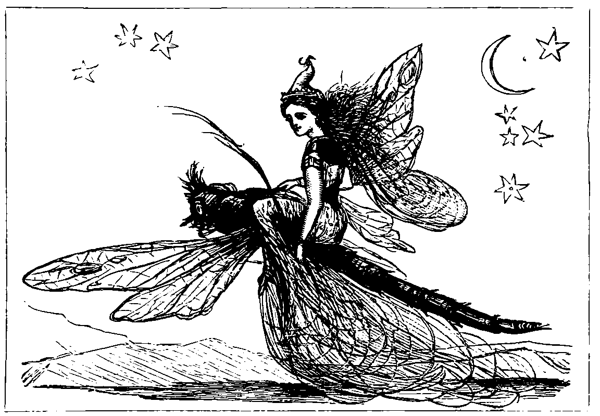

> **Pukka:** RK 6 [13], TW 1, BW 12" (36 m), S: 1-6, Menschenfresser
> magiebegabt wie Stufe 3 Zauberkundiger, V: Unverträglichkeit von
> Eisen, an das Feenreich gebunden.

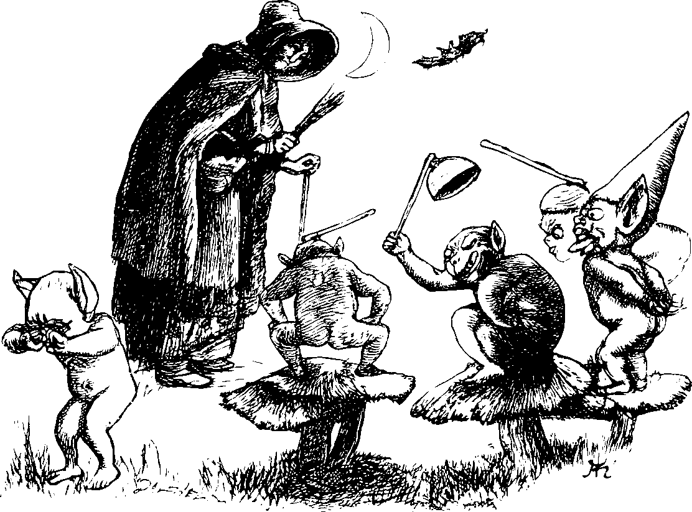

Feenwesen treten einzeln, in Kleingruppen von
1-6, oder in größeren Gruppen von 10-100 auf, befinden sich zu 50% in ihrem
Lager und haben dort die Schatztypen B, C oder D.

: 1W6 Größenstufen für Feenwesen

| 1W6 | Größe | Trefferwürfel |
|:----:|:------|:-----------------|
| 1 | winzig | 1/2 |
| 2 | klein | 1/2 | 
| 3 | zwergengroß | 1 |
| 4 | menschengroß | 1 |
| 5 | groß wie ein Pferd | 2-3 |
| 6 | riesenhaft | 4-8 (doppelter Schaden) |

: 1W20 Eigenschaften der Feenwesen

| 1W20 | Eigenschaften (1-4 mal würfeln) |
|:----:|:----------------------------|
| 1 | Unverträglichkeit von Eisen (doppelter Schaden) |
| 2 | Wahre Namen |
| 3 | Unsichtbarkeit, willkürlich (RK -4 [+4])|
| 4 | geflügelt (RK -2 [+2], BW 12"/18") |
| 5 | Dunkelsicht und/oder Lichtscheu |
| 6 | Schwer zu entdecken (Überraschen auf 4/6) |
| 7 | Magiebegabt (1-4 Zauberkundigen Sprüche der Stufen 1-4) |
| 8 | geistartiger Körper (nur magische Waffen schädigen) |
| 9 | tierische Merkmale, wie Hörner, Hufe, oder ein Schwanz |
| 10 | zentauroider Körper (i.d.R. den Rumpf eines Herdentieres) |
| 11 | an das Feenreich gebunden |
| 12 | an einen Baum, Hein oder ein Gewässer gebunden |
| 13 | pflanzenhafter Körper (Haare aus Ranken, Äste als Gliedmaßen) |
| 14 | natürliche Begabung Menschen zu bezaubern (RW -2) |
| 15 | Beschwörung von Dickichten oder animierten Bäumen |
| 16 | Beschwörung von Tieren, die zu Hilfe kommen |
| 17 | Menschen besonders hilfreich |
| 18 | Ständig zu Streichen aufgelegt, Verzauberung von Tierherden |
| 19 | kündigen mit ihrer "Wilden Jagd" Unheil an |
| 20 | Menschenfresser |

## Goblinoide

Goblinoide sind in Fantasy-Rollenspielen traditionell die "bösen"
menschenartigen Kreaturen. In der Geschichte der Mythologien und
Märchen gibt es zahlreiche Überschneidungen mit den Feenwesen, so dass
zur Ausgestaltung ausgefallener Goblinoide auch die Tabelle
*Eigenschaften der Feenwesen* (siehe dort) genutzt werden kann. 

Goblinoide so wie Fantasyvölker in großen Gruppen von 40-400
Individuen auf, und sie haben in der Regel ebenfalls *einen*
Trefferwürfel. Ähnliche wie die militärische Struktur menschlicher
Gruppen, werden jeweils bis zu 30 Individuen von einem Individuum der
jeweils nächsten Größenstufe angeführt, und falls sich mehr als 60
Individuen in einer Gruppe finden, wird der Stamm von einem Anführer
jeweils 2 Größenstufen höher angeführt. 

> **Orks:** RK 6 [13], TW 1, S: 1-6 oder nach Waffe

Goblinoide befinden sich zu 50% in ihrem Lager und haben dann dort
einen Schatz der Klasse D. Außerdem tragen einzelne Individuen 3-18
Kupfer- oder Silbermünzen bei sich.

Als Nichtspielercharaktere können einzelne Goblinoide nach Ermessen
der Spielleitung auch Charakterklassen und -stufen haben, und können
dann auch entsprechend mehr Trefferwürfel und auch magische
Gegenstände besitzen.

: 1W6 Goblinoide Größenstufen

| 1W6 | Größe | RK | TW | Schaden |
|:----:|:-------|------|------------|
| 1 | Kobolde | 7 [12] | 1/2 | 1-6 [1-4 oder nach Waffe] |
| 2 | Goblins | 6 [13] | 1-1 | 1-6 [1-4 oder nach Waffe] |
| 3 | Orks | 6 [13] | 1 | 1-6 [je nach Waffe] | 
| 4 | Hobgoblins | 5 [14] | 2 | 1-6 [1-8] |
| 5 | Grottenschrate | 5 [14] | 3+1 | 2-7 [2-8] |
| 6 | Oger | 5 [14] | 4+1 | 3-8 [1-10] |

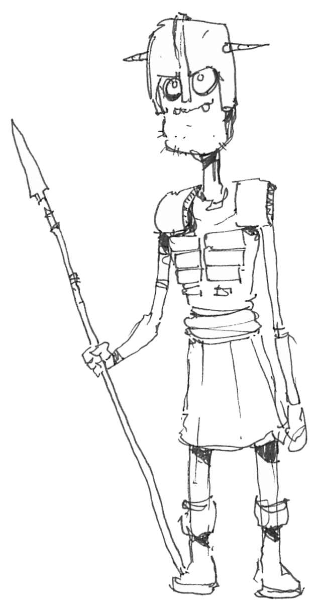

: 1W8 Goblinoide Eigenschaften

| 1W8 | Eigenschaft |
|:---:|:---------------|
| 1 | Dunkelsicht |
| 2 | Lichtscheu (-1 im Kampf bei Sonnenlicht) |
| 3 | Furcht vor Magie (RW gegen Magie -2) |
| 4 | Berserkergang (+2 im Kampf) |
| 5 | Nilbog (siehe Text) |
| 6 | natürliche Magiebegabung wie Stufe 2 ZK |
| 7 | Moral +1 | 
| 8 | 100 bis 600 GM im Marschgepäck |


Nilbogs heilen verlorene Trefferpunkte, wenn
sie verletzt werden, greifen
an, wenn man ihnen ein Friedensangebot unterbreitet, Lachen, wenn
etwas zum weinen ist usw. Die Nilbog Eigenschaft sollte nur 
sehr sparsam eingesetzt werden, da
sie sehr schnell sehr albern werden kann und sich der Effekt auch
schnell verbraucht, wenn er einmal erkannt ist.

Selbstverständlich sind Goblins immer irgendwie häßlich, unförmig,  
haben spitze, schartige Ohren, eine fliehende Stirn und hervorstehende
spitze Zähne. Darüber hinaus können Goblinoide aber durchaus noch
etwas origineller Ausgestaltet werden:

: 1W8 Goblinoide Haut- und Haarfarben

| 1W8 | Hautfarbe | Haarfarben |
|:---:|:----------|-----------|
| 1 | wie Menschen | braun |
| 2 | olivgrün | schwarz |
| 3 | ocker | braun |
| 4 | rostrot | kupferrot |
| 5 | blau | dunkelblau |
| 6 | grau | rotbraun |
| 7 | aschfahl | grau |
| 8 | gelblich | wie verfaulendes Gras |

: 1W6 Goblinoide Reit- und Wachtiere

| 1W6 | Tier |
|:---:|:------------|
| 1 | Wölfe |
| 2 | Bären |
| 3 | Ungeziefer in geeigneter Größe |
| 4 | Riesentiere |
| 5 | Drachen |
| 6 | Raubtiere |


## Tiermenschen

Bei den Tiermenschen handelt es sich um anthropomorphe Tiere.
Klassische Beispiele sind Hyänenmenschen (Gnolle), Echsenmenschen, 
Troglodyten, Fischmenschen (Sahuagin), aber auch Katzenmenschen,
Dinosauriermenschen und Insektenmenschen sollen vorkommen. 

Um eine
Tiermenschenart zu erzeugen, sollte auf einer der Tiertabellen
(Raubtiere, Herdentiere, vielleicht auch "Ungeziefer") gewürfelt
werden, um die allgemeine Form festzulegen. Ansonsten gelten folgende
Richtwerte:

* 10-40 Individuen
* zu 50% im Lager, dann Schatztyp D
* einzelne Individuen tragen 1-10 Kupfermünzen oder 1-4 kleine
 Rohedelsteine bei sich
* 1-4 Trefferwürfel (nach Ermessen der Spielleitung evtl. auch
 Charakterklassen)
* Rüstungsklasse 7-3 ([12]-[16])
* Schaden (1W100): 01-60: menschliche Waffen (1-6 oder je nach Waffe),
  61-90: 2 Klauenangriffe (1-6/1-6), 91-00: 2 Klauenangriffe und 1 Biss
  (1-6/1-6/1-6)

: 1W6 Eigenschaften von Tiermenschen

| 1W6 | Eigenschaften |
|:---:|:--------------------|
| 1 | "tierischer" Gestank (Gegner RW oder -2 auf Angriffswürfe) |
| 2 | feine Witterung, Wahrnehmung 4/6 |
| 3 | natürliche Tarnung, Überraschen 4/6 |
| 4 | Herbeirufen "ihrer" Tierart in 3-6 Kampfrunden |
| 5 | Dunkelsicht |
| 6 | Verwandlung in "ihre" Tierart, willkürlich |

## Riesen

Bei Riesen handelt es sich um ungewöhnlich große Ausgaben von
Menschen, oder selten auch Fantasyvölkern, Goblinoiden oder
Tiermenschen. Sie sind in der Regel Einzelgänger, oder treten in
Kleingruppen oder Familienverbänden von auf 1-10 Individuen auf. Man
trifft sie zu 30% in ihrem Lager, und sie bewachen dort einen
Schatztyp E zuzüglich 5.000 Goldmünzen (Titane Schatztyp A).
Einzelne wandernde Riesen tragen nicht selten 1.000-6.000 Goldmünzen mit
sich herum.

Abgesehen davon, dass Riesen
durch ihre gewaltige Größe ein vielfaches an Schaden
verursachen, können sie
wie ein Katapult mit Felsbrocken schleudern, und dabei 2-20 Punkte 
Schaden anrichten.

: 1W6 Größenstufen der Riesen

| 1W6 | Größe | Trefferwürfel | Schaden |
|:--:|:-------------|--------|---------|
| 1 | Hügelriese | 8 | 2-16 (2W6) |
| 2 | Steinriese | 9 | 3-18 (3W6) |
| 3 | Frostriese | 10+1 | 4-24 (4W6) |
| 4 | Feuerriese | 11+3 | 5-30 (5W6) | 
| 5 | Wolkenriese | 12+2 | 6-36 (6W6) | 
| 6 | Titane | 12-16 | 7-72 (7W6) |

: 1W6 Eigenschaften für Riesen

| 1W6 | Eigenschaft |
|:---:|:--------------------|
| 1 | Kälteresistent |
| 2 | Hitzeresistent |
| 3 | Magiebegabt wie ein Stufe 7 Zauberkundiger |
| 4 | Kleriker der 7. Stufe |
| 5 | feiner Geruchssinn (Wahrnehmung 4/6) |
| 6 | Wahrer Name |
| 7 | zwei Köpfe (dann Ettin genannt) |
| 8 | Nur ein Auge, ein Zyklop, -2 auf Fernkampfangriffe |

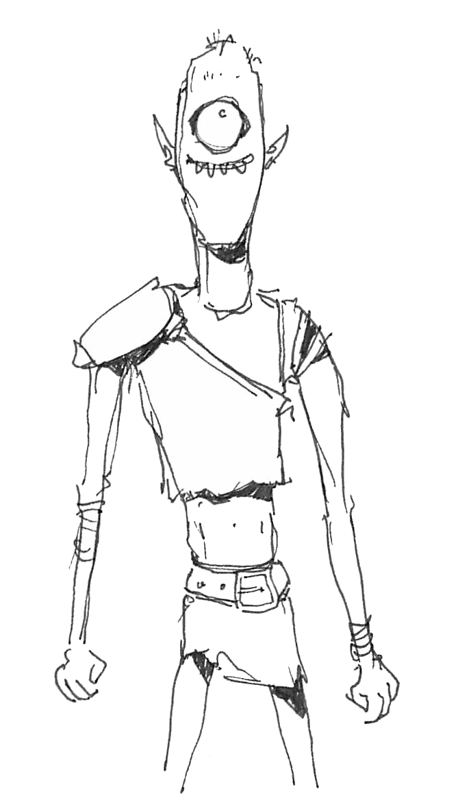

Riesen sind an den erstaunlichsten Orten anzutreffen und nennen
Behausungen von unterirdischen Höhlen, über Tierställe und gewaltige
Burgen bis hin zu Wolkenpalästen ihr Heim. Als Haus-, Wach- und
Hütetiere halten sie oft sehr große normale Tiere oder Riesentiere.
Aber auch jede Art von tierartigem phantastischem Wesen ist denkbar.

#### Elementardruiden

Manche Riesen hängen einem besonderen druidischen Glauben an. In
diesem Glaubenssystem werden die Elemente verehrt, es gibt zum
Beispiel Eis-, Wasser-, Feuer- und Erddruiden unter den Riesenvölkern.
Diese Elementardruiden beherrschen neben den üblichen druidischen
Sprüchen auch die Zauberkundingensprüche, die sich auf ihr jeweiliges
Element beziehen.

#### Geschichten mit Riesen

: 1W6 Abenteuer-Aufhänger mit Riesen

| 1W6 | Aufhänger |
|:---:|:----------------------------------------------------------|
| 1 | |
| 2 | |
| 3 | |
| 4 | |
| 5 | |
| 6 | |

## Untote

Untote haben einige gemeinsame Eigenschaften: sie sind bis auf
wenige Ausnahmen immun gegen *Schlaf* und *Bezauberungs*-Sprüche.

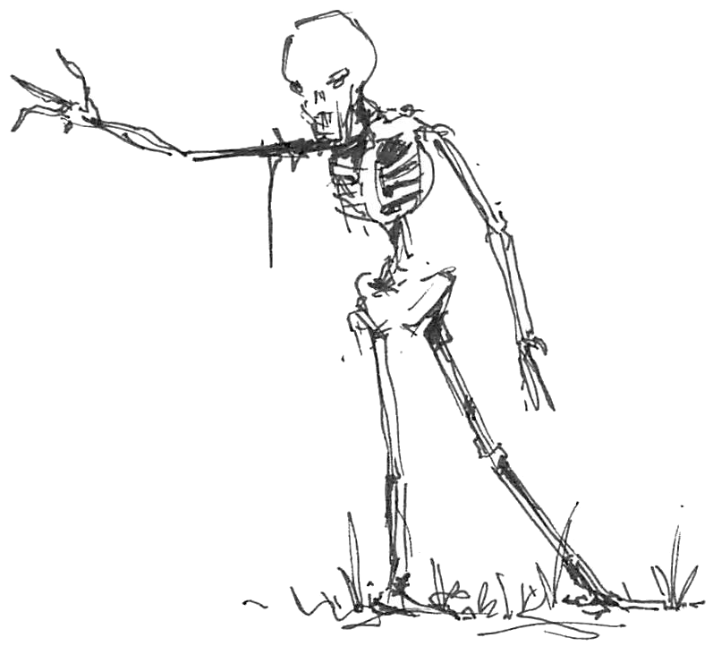

: 1W12 Machtstufen von Untoten

| 1W12 | Typisches Beispiel | Anzahl | TW | RK |
|:--:|--------------------|--------|------|----|
| 1 | Skelett/Zombie | 3-30 | 1/2-2 | 7-8 [11-12] |
| 2 | Ghul | 2-24 | 2 | 6 [13] |
| 3 | Schatten | 2-24 | 2-3 | 7 [12] |
| 4 | Gruftbewohner (Wight) | 2-24 |  3 | 5 [14] |
| 5 | Unhold (Ghast) | 1-6 | 4 | 4 [15] |
| 6 | Todesalb (Wraith) | 2-16 | 4-5 | 3 [16] |
| 7 | Mumie | 1-12 | 5-6 | 3 [16] |
| 8 | Schreckgespenst (Spectre) | 1-8 | 6-7 | 2 [17] |
|  9 | Todesfee (Banshee) | 1 | 7 | 0 [19] |
| 10 | Vampir | 1-6 | 7-9 | 2 [17] |
| 11 | Geist | 1 | 10 | 0 [19] |
| 12 | Leichnam (Lich) | 1 | 11+ | 0 [19] | 

: 22 untote Eigenschaften

| 1W10 + Stufe | Eigenschaft 1-4 x würfeln |
|:--:|-----------------------------|
|  1 | langsam, BW 6" |
|  2 | nimmt nur halben Schaden |
|  3 | Verwesungsgestank |
|  4 | Lähmende Berührung |
|  5 | Verursacht Krankheit |
|  6 | Unsichtbar, nur ein Schatten |
|  7 | Stärkeraub |
|  8 | Silberwaffen machen vollen Schaden | 
|  9 | Stufenraub |
| 10 | Silberwaffen machen halben Schaden | 
| 11 | Opfer wird nach 24 Stunden zu Untotem gleicher Art |
| 112| Kann außer durch Magie nur durch Feuer geschädigt werden |
|  7 | Geisterheulen: Rettungswurf oder *Furcht* |
| 12 | Resistenz gegen nichtmagische Waffen |
| 20 | Eisige Berührung 1-10 Punkte Schaden |
|  9 | schnell, BW 12" |
|  3 | Stufenraub x 2 |
|  5 | Int. 13, magiebegabt wie ZK entsprechender Stufe |
| 11 | gasförmig, kann duch Spalten und Schlüssellöcher gleiten |
| 19 | Zauberkruke |

#### Geschichten mit Untoten

## Affen

Paviane, Gorillas, Weiße Affen, geflügelte Affen

## Raubtiere

### Wiesel, Frettchen und Marder

### Wölfe 

Wölfe und andere hundeartige Raubtiere kommen fast in jedem Ökosystem
vor. Normale Wölfe sind etwas zähere Kämpfer als Menschen, daher
bekommen sie zwei Trefferwürfel. Als Rüstungsklasse kann man, wie für
alle wilden Tiere 6 annehmen, für scheue und eher harmlose Wölfe
vielleicht eher eine 7, für sehr gefährliche, kampferprobte und
erfahrene Wölfe eher eine 5.

> **Normale Wölfe** Anzahl 2-20, RK 7[12], TW 2, S:1-6, BW 
> 16"/54 m

Ein Rudel wolfsartiger Raubtiere besteht in der Regel aus einem
Alpha-Tier (+1 TW) und einigen Jungtieren (-1 TW), die ungefähr 
1/4 der Rudelstärke entsprechen. Gefangene Jungtiere können gezähmt
und Abgerichtet werden.

: 1W20 Eigenschaften wolfsartiger Raubtiere

| 1W20  | Eigenschaft, 1W4 mal würfeln             |

: 22 untote Eigenschaften

| 1W10 + Stufe | Eigenschaft 1-4 x würfeln |
|:--:|-----------------------------|
|  1 | langsam, BW 6" |
|  2 | nimmt nur halben Schaden |
|  3 | Verwesungsgestank |
|  4 | Lähmende Berührung |
|  5 | Verursacht Krankheit |
|  6 | Unsichtbar, nur ein Schatten |
|  7 | Stärkeraub |
|  8 | Silberwaffen machen vollen Schaden | 
|  9 | Stufenraub |
| 10 | Silberwaffen machen halben Schaden | 
| 11 | Opfer wird nach 24 Stunden zu Untotem gleicher Art |
| 12 | Kann außer durch Magie nur durch Feuer geschädigt werden |
| 13 | Geisterheulen: Rettungswurf oder *Furcht* |
| 14 | Resistenz gegen nichtmagische Waffen |
| 15 | Eisige Berührung 1-10 Punkte Schaden |
| 16 | schnell, BW 12" |
| 17 | Stufenraub x 2 |
| 18 | Int. 13, magiebegabt wie ZK entsprechender Stufe |
| 19 | gasförmig, kann duch Spalten und Schlüssellöcher gleiten |
| 20 | Zauberkruke |
| 21 | | 
| 22 | |

#### Geschichten mit Untoten

## Affen

: Größenstufen von Affen

 1W4   Stufe
------ --------------------------------------------------
 1     10-100 Äffchen, RK 5 [14], TW 1/2
 2     3-30 Pavian, RK 6 [13], TW 1-2
 3     2-20 Schimpansen, RK 7 [12], TW 2-3
 4     2-20 Gorillas, RK 5 [14], TW 3

: Ungewönliche Eigenschaften von Affen

 1W6   Eigenschaft
------ --------------------------------------------------
 1     Albino
 2     Menschenfresser
 3     geflügelt, BW 15" (45 m)
 4     Intelligenz 8+, dann auch zu 50% sprachbegabt
 5     geschickte Werfer, Fernkampfangriff wie Schleuder
 6     Reißzähne, Schaden +2

## Raubtiere

### Wiesel, Frettchen und Marder

### Wölfe 

Wölfe und andere hundeartige Raubtiere kommen fast in jedem Ökosystem
vor. Normale Wölfe sind etwas zähere Kämpfer als Menschen, daher
bekommen sie zwei Trefferwürfel. Als Rüstungsklasse kann man, wie für
alle wilden Tiere 6 annehmen, für scheue und eher harmlose Wölfe
vielleicht eher eine 7, für sehr gefährliche, kampferprobte und
erfahrene Wölfe eher eine 5.

> **Normale Wölfe** Anzahl 2-20, RK 7[12], TW 2, S:1-6, BW 
> 16"/54 m

Ein Rudel wolfsartiger Raubtiere besteht in der Regel aus einem
Alpha-Tier (+1 TW) und einigen Jungtieren (-1 TW), die ungefähr 
1/4 der Rudelstärke entsprechen. Gefangene Jungtiere können gezähmt
und Abgerichtet werden.

: 1W20 Eigenschaften wolfsartiger Raubtiere

| 1W20  | Eigenschaft, 1W4 mal würfeln             |
|:---:|:-----------------------------------------|
| 1 | 3 TW, S:2-8                               |
| 2 | 1 TW (es handelt sich um Schakale o.ä.) |
| 3 | 6 TW, S:2-12 (furchtbare Riesenwölfe) |
| 4 | ungewöhnlich Intelligent  |
| 5 | psionisch begabt  |
|   | Schaden entsprechend der TW. |
| 6 | Besondere Verteidigung: Flimmern, siehe Text. |
| 7 | Anzahl 3-12 |
| 8 | Anzahl 2-8 |
| 9 | Anzahl 4-40 |
| 10 | untot, necromantisch animierte Monster |
| 12 | Aasfresser, wo sie auftauchen geht der Tod um. |
| 13 | Dämonenhunde, diese Wölfe sind durch ein 
|    | Ritual beschworden worden, TW+3, Schaden +2 |
| 14 | Sehr gute Tarnung, Überraschung auf 4 in 6 |
| 15 | Blutrausch, diese Wölfe greifen sofort an! |
| 16 | gutes Fell, es bringt TW x 10 GM ein. |
| 17 | besonders edles Fell, es bringt TW x 100 GM ein. |
| 18 | Elementarwesen 1-3: Eis, 4-6: Feuer, immun gegen |
|    | entsprechenden Schaden, Odemwaffe S: TW |
|    | das Fell bringt TW x 1000 GM ein. |
| 19 | RK 6 [13] | 
| 20 | RK 5 [14] |

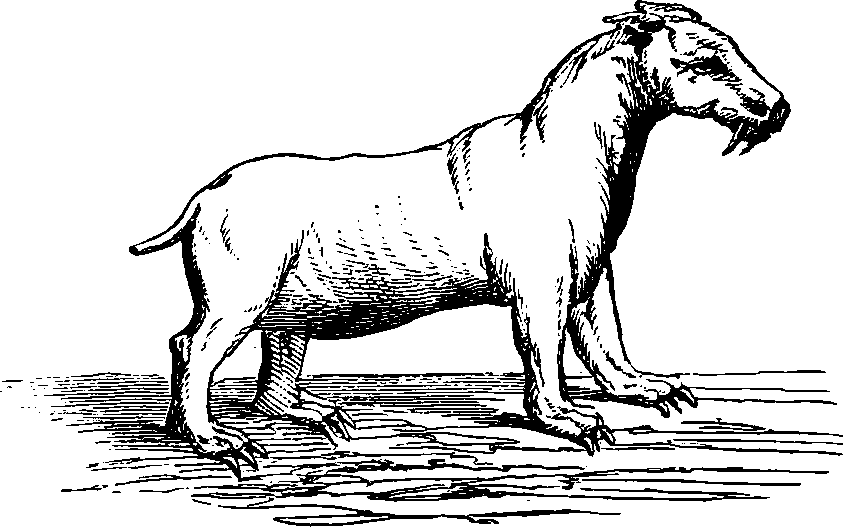

#### Flimmern

Beim Flimmern handelt es sich um die besondere Eigenschaft
der sogenannten *Flimmerhunde*. Bei einem Wurf von 7 oder mehr auf 1W12
teleportieren sich die Hunde während eines Angriffs spontan, und zwar:

: Flimmern

| 1W12 | Position zu der teleportiert wird |
|:----:|:---------------------------------:|
| 1    | unmittelbar vor den Gegner |
| 2  | links vor den Gegner |
| 3 | rechts vor den Gegner |
| 4-12 | hinter den Gegener |

Ist eine Gruppe Flimmerhunde ernsthaft in Gefahr flimmert sie sich
zu Beginn der nächsten Kampfrunde dauerhaft weg.

#### Wolfsgeschichten

: 1W6 Aufhänger für Wolfsabenteuer

| 1W6  | Aufhänger |
|:----:|:----------------------------------------|
| 1 | Es gibt kaum noch Beutetiere, die Wölfe haben Hunger. |
| 2 | In den letzten Wochen werden immer wieder Weidetiere 
|   | gerissen. |
| 3 | Den Abenteurern begegnet ein einsamer Wolf. Irgend etwas |
|   | veranlasst ihn, den Abenteurern zu folgen. |
| 4 | Der Baron wünscht ein besonderes Wolfsfell als Trophäe. |
| 5 | Wolfsfelle sind in letzter Zeit begehrt, auf dem nahe |
|   | gelegenen Markt bringen sie das doppelte des üblichen |
|   | Preises ein. |
| 6 | Der Gemahl einer Adeligen soll in einen Wolf verwandelt |
|   | worden sein. Sie hat einen hohen Preis darauf ausgesetzt, |
|   | ihn zu finden, und den Fluch zu brechen. |


### Raubkatzen

Berglöwe, Tiger, Säbelzahntiger

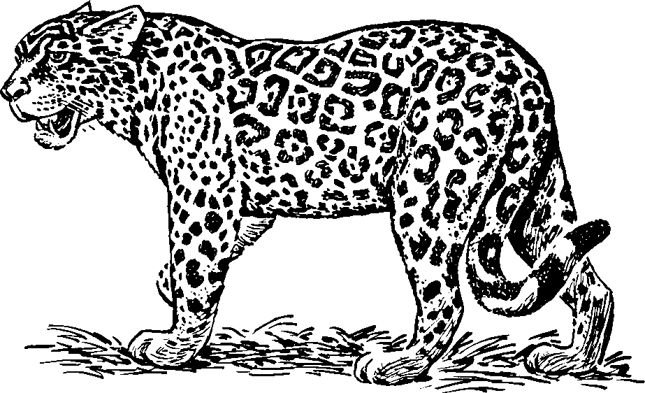

Phasentiger

### Bären

Bären sind Allesfresser und deshalb nicht unbedingt darauf aus,
Abenteurer zu verspeisen. In kargen Umgebung wie polaren
Eiswüsten, auf Gletschern mag das anders sein. Alle Bären
verteidigen jedoch ihre Jungtiere bis zum Tod, und alle Bären
können bei einem Trefferwurf von 18 oder mehr ihr Opfer
umklammern und fortan 1-6 Schaden pro Runde verursachen.

Hier ein typischer Vertreter: 

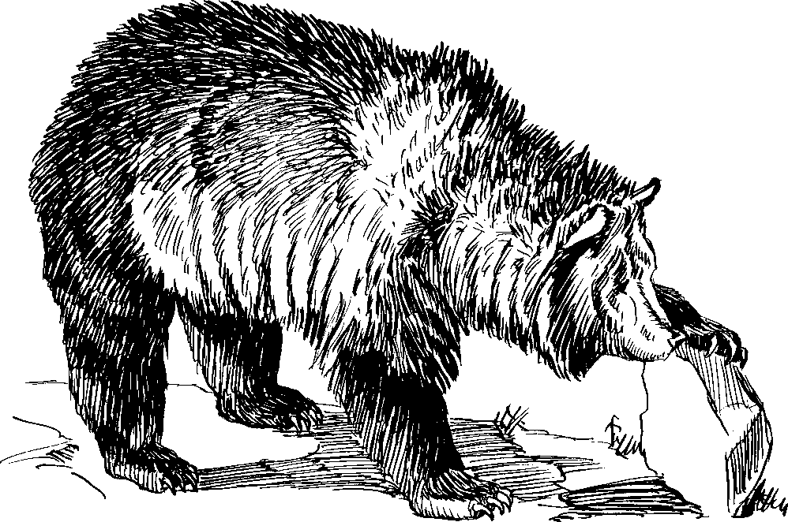

>**Braunbär**, RK 7 [12], TW 4+1, S: 2-12

: 1W4 Bärenarten

 1W4  Art            RK      TW      Schaden
----- ----------- -------- ------ --------------
  1   Schwarzbär   6 [13]   2-3        1-6
  2   Braunbär     6 [13]   4+1        2-12
  3   Eisbär       6 [13]    5         2-12
  4   Höhlenbär    6 [13]   6+6        2-12

## Herdentiere

Rehe, Hirsche, Elche, Pferde, Maultiere,  Kamele, Llamas, Elefanten,
Nashörner Eber / Wildschweine

## Nagetiere 

Mäuse, Ratten, Bieber

## Fledertiere

Fledermäuse, Flughunde, Riesenfledermäuse
Klesche

## Echsen und Lurche

Schlangen

Grubenotter

Speikobra

Wasserschlange

Python

Klapperschlange

Krokodil

Drachenechse, Gecko, Tuatara, Gehörntes Chamäleon

Kröten

## Vögel

Falken

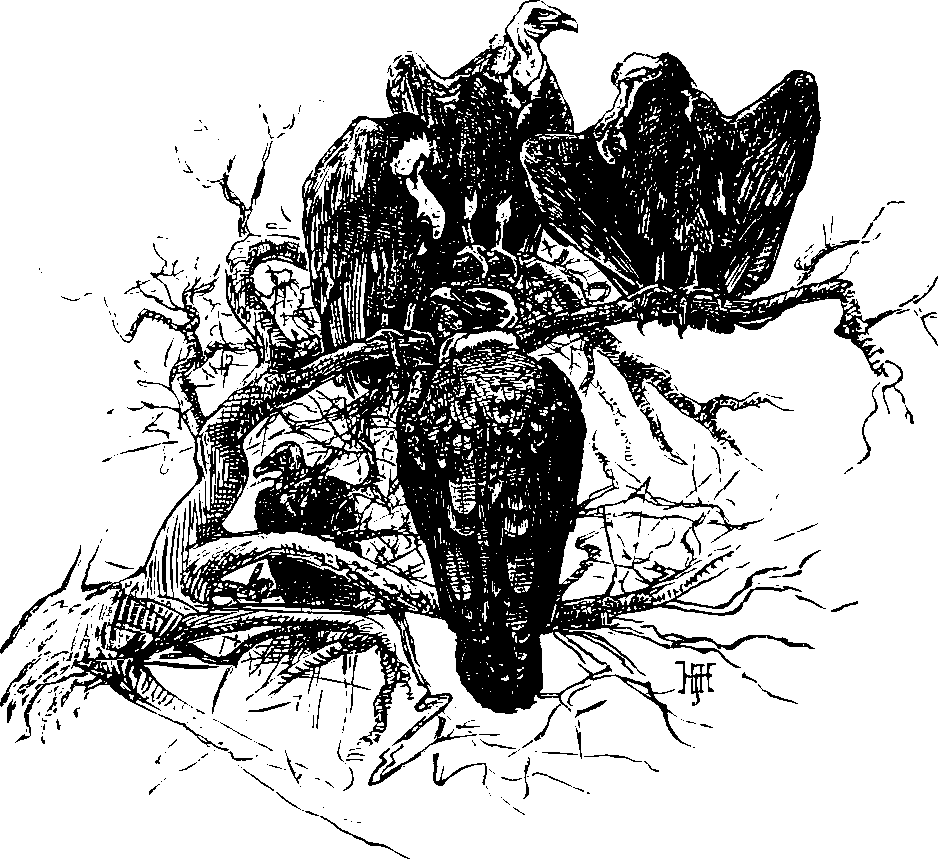

## Fische

### Hechte

### Störe

### Haie 

Katzenfisch

### Piranhas

## Insekten und Spinnenartige

Schwärme

Heuschrecken, Käfer

Fliegen, Bienen, Wespen, Libellen, Flöhe

Tausendfüßler

Spinnen, Skorpione

Tarantel, Krabbenspinne, Schwarze Witwe, Vogelspinne

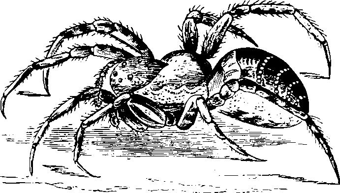

Krebse

## Riesentiere

Riesenspitzmaus

Riesenformen der Raub- und Herdentiere

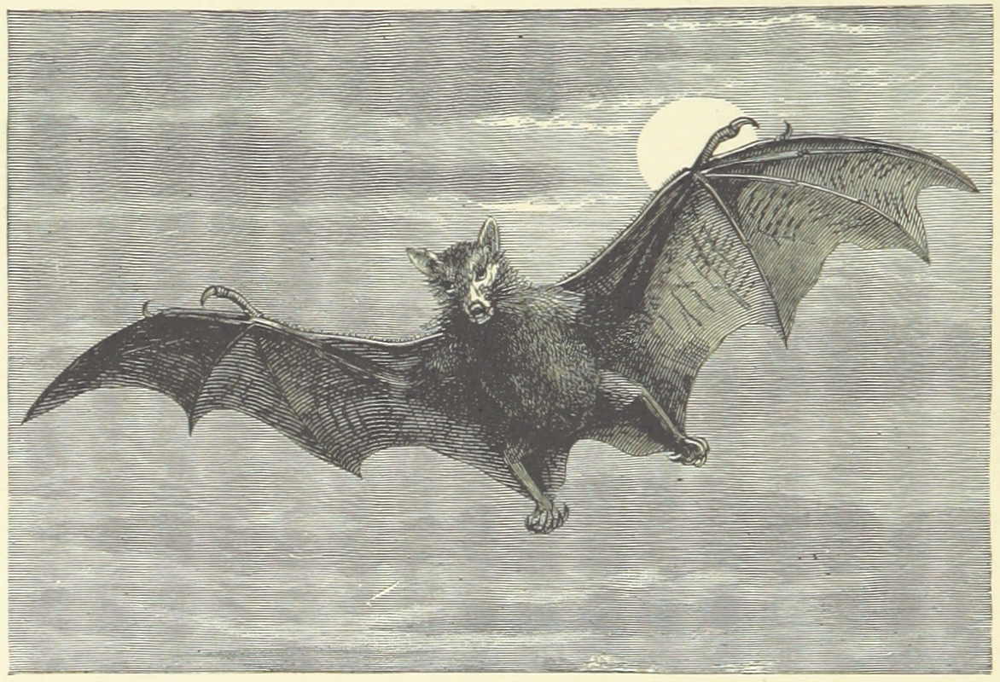

Gigantische Monster

## Mythische Kreaturen

### Chimeren

### Manticore

### Pegasi Hippogreifen/Pferdegreif, Greifen,
Sphinxen, 

### Riesen
Trolle, Zyklopen

### Wesen mit dem versteinernden Blick

Medusen, Basilisken, 

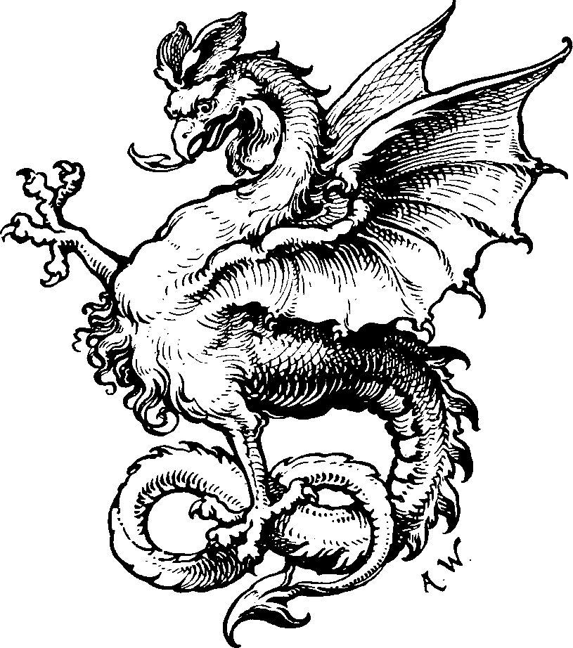

Hydras, Dschinni, Gorgone, Harpyie

Höllenhund, Teufelsschwein, Hydra, Ifrit, Minotauren


Roc, Salamander (Eis und Feuer)

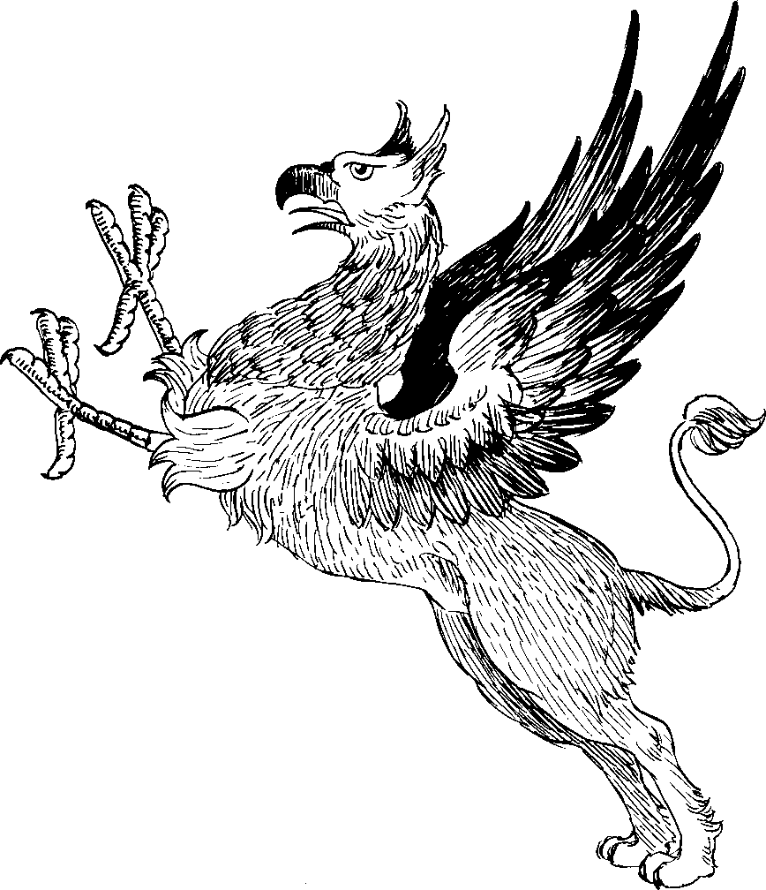


### Einhörner

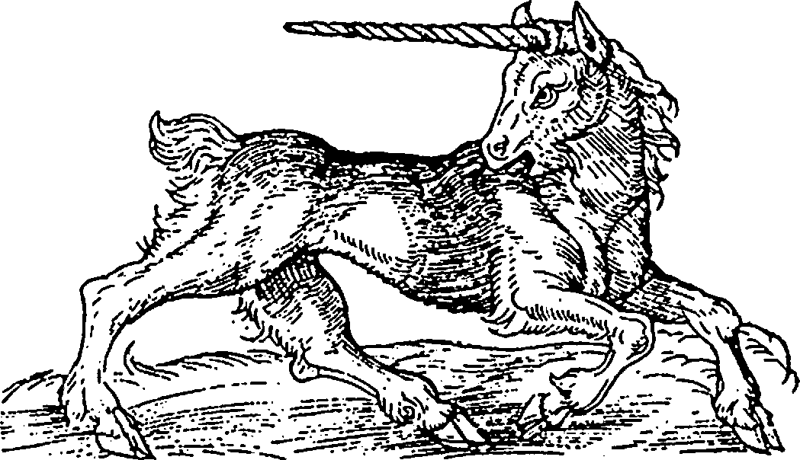

### Elementare

Feuer-, Erd-, Wasser-, Luftelementare

## Drachen

: 1W6 drakonische Größenstufen

| 1W6 | Größe |
|:-----:|:----------------|
| 1 | Wyrmling |
| 2 | Jungdrache |
| 3 | ausgewachsener Drache |
| 4 | alter Drache |
| 5 | Uralter Drache |
| 6 | Leviathan |

: 1W20 drakonische Eigenschaften 

| 1W20 | Eigenschaft (1W4 mal würfeln) |
|:---:|:-------------|
| 1 | vier Beine, zwei Flügel |
| 2 | Schlangenartig, geflügelt |
| 3 | zwei Beine, zwei Flügel |
| 4 | mehr als zwei Flügel |
| 5 | sprachbegabt, Intelligenz 9-14 (1W6+8) |
| 6 | magiebegabt, wie ZK der 3-6. Stufe |
| 7 | mehrköpfig (1-4 Köpfe) |
| 8 | mit Giftstachel bewehrte Schwanzspitze |
| 9 | *keine* Odemwaffe |
| 10 | kann willentlich menschliche Gestalt annehmen |
| 11 | Verbreitet Angst und Schrecken (Rettungswurf) |
| 12 | Phasendrache: kann sich willentlich teleportieren |
| 13 | Chamäleon: kann mit der Umgebung optisch verschmelzen | 
| 14 | amphibisch, kann unter Wasser atmen |
| 15 | wahrer Name | 
| 16 | |
| 17 | |
| 18 | |
| 19 | |
| 20 | |

: 1W12 drakonische Farben

| 1W12 | Farbe |
|:---:|:--------------------------|
| 1 | rot |
| 2 | grün |
| 3 | weiß |
| 4 | schwarz |
| 5 | blau |
| 6 | braun |
| 7 | Kupfer |
| 8 | Bronze |
| 9 | Silber |
| 10 | Gold |
| 11 | Rubin |
| 12 | Saphir (grün, blau, violett bis orange) |

: 1W6 Odemwaffen

| 1W6 | Odem |
|:---:|:----------------|
| 1 | Giftgas |
| 2 | Feuer |
| 3 | Eis |
| 4 | Blitzschlag |
| 5 | Gift |
| 6 | 2 x würfeln und kombinieren |

Lindwürmer

## Seeungeheuer

### Wale

Delfin, Orka, Narwal, Pottwal, Blauwal

Meeresdrachen

Drachenschildkröten

Seeschlange

## Pilze und Pflanzen

Gelbschimmel

Kreischer

## Würmer

Viele, wenn nicht die meisten Würmer sind harmlos. Man würde kein
Aufhebens um diese Kreaturen machen, gäbe es nicht einige berühmt -
berüchtigte und furchteinflößende Vertreter:

>**Fäulnisraupe**, RK 8 [11], TW 1 TP, BW 9", S: bohren sich
>schnell unter die Haut des Opfers, verursachen Krankheit und Tod 
>in 1-3 Phasen

Gegen den Befall mit Fäulnisraupen hilft nur das sofortige Ausbrennen
der Stelle des Befalls. Dabei erleidet das Opfer 1-6 Punkte Schaden.
Auch ein *Heilt Krankheiten* kann helfen. Sind die Raupen jedoch
nach 1-3 Kampfrunden in Körper des Opfers eingedrungen, graben sie sich
bis zu Herz des Opfers vor. Dadurch stirbt das Opfer in 10 bis 30
Minuten.

Kaum weniger unangenehm sind die

>**Riesenblutegel**, RK 8 [11], TW 1-4, BW 6", S: Blut saugen (Verlust
>von Trefferpunkten oder Stufen)

Es gibt verschiedene Arten von Riesenblutegeln. Die gefährlichsten
entziehen dem Opfer 1 Erfahrungsstufe pro Kampfrunden, beginnend nach
der Kampfrunden in der sie sich erfolgreich an ihrem Opfer
festgebissen haben. Weniger gefährliche Arten entziehen dem Opfer nur
Trefferpunkte in der Höhe der eigenen Trefferwürfel. Kleine Egel,
solche mit 1-2 Trefferwürfeln, werden durch ihren anästhesierenden
Speichel manchmal erst bemerkt, wenn das Opfer die Hälfte seiner
Trefferpunkte verloren hat, sich nur noch mit halber Geschwindigkeit
bewegen kann, und nicht mehr in der Lage ist zu kämpfen.

Nur die erfahrensten Abenteurer können von Begegnungen mit folgender
monströser Kreatur berichten:

>**Purpurwurm**, RK 6 [13], TW 15, BW 6", S: Biss 2-12, Giftstachel 
>1-8 + Gift

Purpurwürmer sind gigantisch groß, und können Kreaturen von der Größe
eines Ogers mit einem Mal verschlingen. Dazu ist ein Angriffswurf
erforderlich, der wenigstens 4 Punkte besser als der erforderliche
Wurf ist. Der Einfachheit halber hier eine spezielle Angriffstabelle
für Purpurwürmer: 

: Verschlingen durch Purpurwürmer und ähnliche Riesentiere

 RK des Opfers     Angriffswurf des Wurms
--------------- ----------------------------
  9 [10]         1+ trifft, 4+ verschlingt
  8 [11]         1+ trifft, 5+ verschlingt
  7 [12]         2+ trifft, 6+ verschlingt
  6 [13]         3+ trifft, 7+ verschlingt
  5 [14]         4+ trifft, 8+ verschlingt 
  4 [15]         5+ trifft, 9+ verschlingt
  3 [16]         6+ trifft, 10+ verschlingt
  2 [17]         7+ trifft, 11+ verschlingt
  1 [18]         8+ trifft, 12+ verschlingt
  0 [19]         9+ trifft, 13+ verschlingt

Da Purpurwürmer regelmäßig Abenteurer verschlingen, kann man in ihrem
Inneren, und in ihren Ausscheidungen unverdauliche
Wertgegenstände entsprechend Schatztyp D (XIX) finden.

### Andere Würmer

In der Weite der Welten gibt es zahlreiche andere unheimliche,
faszinierende und schreckliche Würmer, von denen längst nicht alle
erforscht sind.

Sie kommen in allen erdenklichen Größenstufen vor. Auch kosmische
Entitäten, gar ganze Welten, die in Wirklichkeit auf oder in einem
Wurm existieren sind denkbar.

: 1W6 Größenstufen für Würmer

 1W6   Anzahl    Größe                                   TW
----- ---------- --------------------------------- --------------
  1    100-1000  mikroskopisch klein                Schwarm: 1-4
  2    10-100    so groß wie eine Made              Schwarm: 1-2
  3     2-12     eine Handspanne lang               jeweils 1 TP
  4     1-6      eine Elle lang                         1-4
  5     1-4      1-10 Meter lang                        2-8
  6     1-2      10-100 Meter lang                      5-20   


Würmer können ungewöhnliche äußere Merkmale haben. Hier nur einige
Beispiele:

: 1W10 äußere Merkmale von Würmern

-----------------------------------------------------------------
 1W10  Merkmal
------ ----------------------------------------------------------
  1    Zahlreiche kleine Beine wie bei einer Raupe, oder
       einem Tausendfüßler, BW 9"

  2    die Haut schillert in mäandernden Regenbogenfarben

  3    hypnotisches Muster der Haut, Rettungswurf Lähmung

  4    mit zahlreichen beweglichen Stacheln besetzt, RK 4 [15],
       bei einem erfolglosen Angriff gegen den Wurm muss ein
       Rettungswurf gegen Lähmung gelingen, um nicht 1-6 Punkte
       Schaden zu erleiden.

  5    Säuredrüsen auf der Haut (siehe Blob, Glibber und 
       Schleime)

  6    massive Beißwerkzeuge, Schaden +2

  7    Der Wurm ist rund wie ein Regenwurm

  8    Der Wurm ist platt und hat die Form einer Flunder

  9    Der Wurm ist gallertartig transparent

  10   Der Wurm ist getigert ... zwei verminöse Farben würfeln

-----------------------------------------------------------------

Würmer haben oft Farben, die man sonst im Tierreich selten beobachtet:

: 1W8 verminöse Farben (zum Teil ekelig)

-----------------------------------------------------------------
 1W8   Farbe
------ ----------------------------------------------------------
  1    purpur

  2    giftgrün

  3    schwefelgelb

  4    schwarz-rot, wie geronnenes Blut

  5    kobaltblau

  6    ocker

  7    veränderlich, wie bei einem Chamäleon

  8    fleischfarben, mit glitzernden Kristalleinschlüssen
 
-----------------------------------------------------------------

Würmer haben auch in unserer Welt die ungewöhlichsten
Lebenszyklen und Verhaltensweisen. Das ist sicher auch in den
Weiten der Fantasy-Welten nicht anders.


: 1W8 Bizarre Effekte von Würmern (Body Horror!)

-----------------------------------------------------------------
 1W8  Effekt
----- -----------------------------------------------------------
  1   Der Wurm ist nur die Larve einer seltenen Drachenart. Ist
      er sehr groß, entwickelt sich der Drache direkt aus dem 
      Wurm, handelt es sich um einen kleinen Wurm, durchläuft er
      noch mehrere Größenstufen bis er zu einem Drachen wird.

  2   Der Wurm bringt Larven in den Körper des Opfers ein. Diese
      reifen innerhalb von 1-6 Tagen heran. Lebt das Opfer zu
      diesem Zeitpunkt noch, wird es wie durch ein *Geas*
      gezwungen, sich an einen Ort zu begeben, der für die
      Verbreitung der Würmer günstig ist. Sobald das Opfer den
      Ort erreicht hat, oder falls es ohnehin schon tot war,
      brechen hunderte kleine Würmer aus seinem
      Körper hervor.

  3   Der Wurm dringt kaum merklich in den Körper des Opfers ein.
      Es handelt sich um die Larve eines Rieseninsekts, welches
      nach 1-6 Tagen aus dem Opfer hervor bricht. Die Chancen,
      diese Tortur zu überleben sind gering.

  4   Larven des Wurms breiten sich im Körper des Opfers aus.
      Nach 1-6 Tagen bemerkt das Opfer ein Kriechen unter der
      Haut und es können wurmförmige, wandernde Schwellungen am
      Körper des Opfers bemerkt werden. Das Opfer ist hierdurch
      krank und geschwächt, und kann sich kaum bewegen. Nach 1-6
      weiteren Tagen kriechen 10-100 Würmer aus sämtlichen
      Körperöffnungen des Opfers ... auf der Suche nach neuen
      Opfern. Die Chance diese Tortur zu überleben steigt, wenn
      ein kundiger Heiler aufgesucht wird.

  5   Das Opfer ist nur Zwischenwirt des Wurms. Der Wurm zwingt
      sein Opfer wie durch ein *Geas* das Lager eines großen
      Monsters aufzusuchen. Der Lebenszyklus des Wurms schließt
      sich, wenn das Monster das Opfer frisst.

  6   Das Opfer ist ein Fehlwirt des Wurms, dennoch verliert es
      1-6 Punkte Konstitution, und seine Haut bekommt eiterige
      Beulen. Berührung dieser Beulen verursacht Säureschaden,
      ähnlich wie bei Blobs und Schleimen (siehe dort)

  7   Ob von innen oder von außen, der Wurm verdaut sein Opfer 
      vollständig innerhalb von 1-6 Phasen.

  8   Der Wurm frisst sich äußerst schmerzhaft durch den Körper
      des Opfers. Das Opfer ist Handlungsunfähig und 
      erleidet 1-6 Punkte Schaden pro Phase bis es
      geheilt wird. Verfehlt es einen Rettungswurf gegen
      Gift verliert es durch die verheerende Wirkung der
      Wurminfestation einen Arm oder ein Bein. 

-----------------------------------------------------------------


## Blob, Glibber und Schleim

Diese viele zu groß geratenen Mikroorganismen sind häufig
Zufallsbegegnungen, und können wie Fallen 
funktionieren. Durch besondere Resistenzen und
Empfindlichkeiten können Blobs auch als gefährliche Rätsel
eingesetzt werden.

Außerdem kann ein Blob natürlich in einem
*B-Movie* artigen Szenario das echte Boss-Monster sein. Vielleicht
gibt es sogar die Invasion der Blobs.

Allen Blobs und glibberigen Schleimen ist gemeinsam, dass sie
nicht auf Gestein wirken, sich jedoch auch durch feine Ritzen
quetschen können, und ohne Probleme unter Türspalten
hindurchgleiten können.

Ein typischer Vertreter ist der Grünschleim. Dieser breitet sich
auf tückische Weise aus, indem
er die meisten Dinge die ihn berühren ebenfalls in Grünschleim
verwandelt ... so zum Beispiel auch die Hand des unvorsichtigen
Entdeckers. Andererseits ist er gut an seiner Farbe zu erkennen
und bewegt sich nicht, so dass die Abenteurer nichts zu
befürchten haben, wenn sie einfach vorbei gehen.

>**Grünschleim**, wird automatisch getroffen, empfindlich für
>Feuer, Kälte, und *Heilt Krankheiten*, 
>Resistenzt gegen Waffen- und Blitzschlag, TW 2, BW unbeweglich, 
>S: 1-6 Schaden pro Runde, Metall und jegliche organische Substanz
>wird in Grünschleim verwandelt, Stein wird nicht angegriffen.

Vielleicht der gefährlichste der traditionellen Amöboiden ist der
Schwarzpudding. Er ist nicht leicht zu schädigen, verursacht
selbst mit seinen hervorschnellenden Pseudopodien schweren
Schaden, und ist nicht langsamer als ein voll gerüsteter Krieger.


>**Schwarzpudding**, RK 6 [13] resistent gegen Kälte, Waffen- und Blitzschlag
>teilt den Pudding in zwei Puddings, TW 10, BW 6", S: 3-18 Holz und
>Metall werden innerhalb einer Runde aufgelöst.

Ein kurioser Vertreter der Glibberfamilie ist der Gallertblock,
denn er hat eine besondere Funktion in der Dungeon-Ökologie. Mit
seiner würfelförmigen Gestalt und seinen Abmessungen von ziemlich
genau 10' x 10' x 10' (3 m x 3 m x 3 m) ist er perfekt dazu
geeignet diskret und lautlos durch die Gänge des Dungeons zu gleiten, und
dabei zersplitterte Schilde, übrig gebliebene Rationen und
herumliegende Leichen in sich aufzunehmen. Lediglich die
Metallgegenstände, also Waffen und Münzen bleiben in seinem
Inneren unbeschädigt. Da er wegen seiner perfekten
Transparenz bei schummriger Beleuchtung
praktisch unsichtbar ist, kann der Eindruck entstehen, dass 
besagte Gegenstände langsam und gleichförmig durch die Luft
schweben. 

>**Gallertblock**, RK 8 [11] resistent gegen Kälte, Furcht,
>Blitzschlag, Lähmung und Verwandlung, TW 4, BW 6", S: 1-6 pro Runde,
>Lähmung (Rettungswurf), löst organisches Material auf, Metall bleibt
>intakt.

: 1W20 Dinge, die im Inneren eines Gallertblocks gefunden werden
können

-----------------------------------------------------------------
 1W20   Gegenstand, 1W4 mal würfeln
------ ----------------------------------------------------------
  1    Ein Kompass, nach einem Bad in neutralisierender 
       Seifenlauge funktioniert er noch.

  2    1W4 Schwerter, bei 1 in 20 (5%) ist eines davon ein
       magisches Schwert

  3    Ein Mithril-Kettenpanzer

  4    Ein Kuhfuß (eine metallene Brechstange)

  5    Das Sägeblatt einer Kreissäge

  6    Eine Plattenrüstung für Zwerge

  7    12 Eisennägel und ein Hammerkopf

  8    Ein Streitkolben, eine Gürtelschnalle und ein Helm

  9    2W10 Klangstäbe eines Metallophons

  10   eine Klangschale und ein Amboss

  11   ein Posthorn und 2W20 Silbermünzen

  12   2W8 Zinnsoldaten

  13   ein pistolenförmiges Metallding, es sieht aus als käme es
       nicht von dieser Welt

  14   eine kleine Messingstatue, sie stellt ein seltsames Wesen
       dar. Es hat Tentakeln am Kopf, lange Klauen und 
       Fledermausflügel.

  15   3 Speerspitzen und ein Axtkopf

  16   1-4 Geschmeide und eine Spaten ohne Stiel

  17   der metallene Kessel einer kleinen Trommel, wenn man sie
       mit neuen Fellen bespannt, kann man sie wieder benutzen.

  18   1-4 Dolche, Diebeswerkzeug, ein Wurfhaken und 1W20
       Stahlkugeln und 2W20 Goldmünzen

  19   Eine Plattenrüstung mit Helm, ein Morgenstern, ein 
       silbernes religiöses Symbol und 2W20 Goldmünzen

  20   

-----------------------------------------------------------------


Blobs können in verschiedenen Glibberigkeitsstufen vorkommen.
Den Glibberwesen ist gemein, dass sie sich auch an Wänden und
Decken entlang mit normaler Geschwindigkeit bewegen können.
Ist ein Schleim unbeweglich, so ist ungeachtet seiner
Rüstungsklasse kein Trefferwurf erforderlich um ihm potentiell
Schaden zuzufügen.

: 1W6 Daseinsformen von Glibbern und Schleimen

 1W6  Gestalt                                            BW ["]
----- ------------------------------------------------- --------
  1   unbeweglicher Schleim                                0
  2   beweglicher Schleim                                  1
  3   Glibber                                              3
  4   amorphe Gallerte, Blob                               3
  5   Riesenamöbe mit Pseudopodien, Pudding                6
  6   Geformte Gallerte, ein würfelförmiges Etwas          6

Glibber gibt es in allen möglichen Farben und Schattierungen.
Einige typische Farben zeigt die folgende Tabelle. Transparenz
kann wie am Beispiel des Gallertblocks erwähnt besondere Effekte
bedingen, ansonsten sind die Farben in erster Linie dazu da,
arglose Abenteurer zu verwirren.

: 17 glibberig-schleimige Farben

 1W10  Farbe             1W10  Farbe            
------ ---------------- ------ --------------------------------
   1   weiß                6   grün
   2   schwarz             7   gelb
   3   grau                8   lila
   4   ocker               9   transparent, 2. Wurf für Farbe
   5   orange             10   wasserklar

Ein Blob kann ein harmloser Popel, aber auch ein apokalyptisches
Monster sein, auch kosmische Größenstufen sind denkbar.

: 1W8 gallertige Größenstufen

 1W8   RK                TW                 Schaden
----- ----------------- ------------------ ----------------------
  1    8 [11]             2                 1-6 pro Runde
  2    8 [11]             3                 2-12 pro Runde
  3    8 [11]             4                 1-6 pro Runde
  4    8 [11]             5                 1-6 pro Runde
  5    8 [11]             5                 2-12 pro Runde
  6    7 [12]             8                 2-12 pro Runde
  7    6 [13]             10                3-18 pro Runde
  8    5 [12]             12                3-18 pro Runde

Praktisch alle Blobs haben irgendeinen Spezialangriff, und
grundsätzlich kann davon ausgegangen werden, dass schon die bloße
Berührung der Blob-Oberfläche zu Verätzungen führt.

: 1W6 Schleimige Spezialangriffe

------------------------------------------------------------------
 1W6  Art des Schadens
----- ------------------------------------------------------------
  1   Säureschaden bei jeglichem Kontakt, Metall von Waffen und 
      Rüstungen wird innerhalb einer Runde aufgelöst.
      Plattenrüstungen halten zwei Runden. Kein Effekt 
      auf Holz.
  
  2   Transformation, jegliches Metall und organische Substanzen
      werden in lebenden Schleim, Glibber oder Blob verwandelt.

  3   Säureschaden bei jeglichem Kontakt, Holz und Metall von 
      Waffen und Rüstungen werden innerhalb einer Runde
      aufgelöst.

  4   Jegliches organisches Material wird aufgelöst, Metall
      bleibt intakt. Bei transparenten Blobs können aufgenommene
      Metallgegenstände wie Waffen oder Münzen im inneren des
      Blobs sichtbar sein.

  5   Der Blob funktioniert symbiontisch mit einem anderen
      Monster aus der Kategorie Würmer, Pilze oder Insekten: bei
      Kontakt ist ein Rettungswurf gegen Lähmung erforderlich,
      und der Blob schüttet Pheromone aus, die den monströsen
      Symbionten anlocken. Dieser wird in 1-6 Kampfrunden
      erscheinen.

  6   Der Blob lockt seine Opfer telepathisch an. Jede
      intelligente Kreatur im Umkreis von 30' (10 m) muss einen
      Rettungswurf gegen Zaubersprüche bestehen, um nicht den
      Blob anfassen zu wollen. Berührung löst *Schwachsinn* für
      1-6 Runden, sowie mentalen Schaden aus: Schadenspunkte werden
      vom Attribut Intelligenz (INT) abgezogen. 

------------------------------------------------------------------

Blobs haben keine Knochen, kein Gehirn, kein vorne, hinten, oben
oder unten. Schon deshalb ist es nicht leicht ihnen Schaden
zuzufügen, aber meistens verfügen sie zusätzlich auch noch über
besondere Resistenzen.

: 1W6 Amöboide Abwehrmechanismen

------------------------------------------------------------------
 1W6  Art der Abwehr
----- ------------------------------------------------------------
  1   Waffen oder Blitzschlag teilen den Blob, von nun an sind da
      zwei Blobs. Trefferwürfel werden durch 2 geteilt und
      aufgerundet.

  2   Resistenz gegen Feuer- und Kälteschaden

  3   Resistenz gegen Kälte, Waffen- und Blitzschlag

  4   Resistenz gegen Kälte und Blitzschlag, Resistenz gegen
      magische Furcht, Lähmung und Verwandlung

  5   Resistenz gegen Feuerschaden

  6   Resistenz gegen Feuerschaden. Blitzschlag und Feuerbälle
      Teilen den Blob in 2-5 kleinere Blobs, Trefferwürfel werden
      entsprechend verteilt und aufgerundet

------------------------------------------------------------------


## Urtiere

Flugsaurier: Pterodaktyl, Pteranodon

Stegosaurus, 

Triceratops

Tyrannosaurus rex

Dinosaurier, prähistorische Säugetiere, Dodos

Wollnashorn
Mastodon

## Konstrukte

Lebende Statuen,
Golems, Roboter, Automata
 Gargyle
Unsichtbarer Schleicher

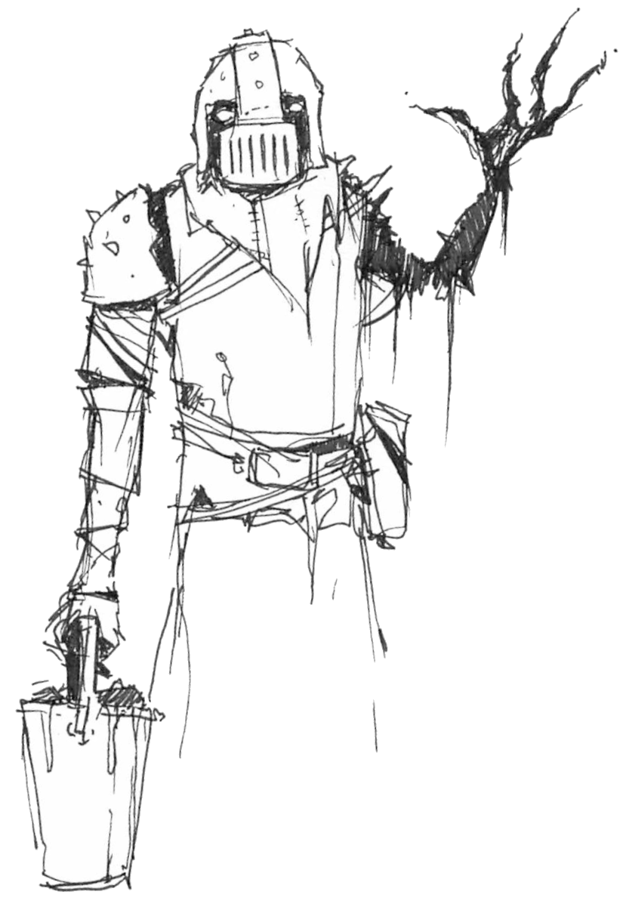

: 1W20 Eigenschaften magischer Konstrukte

| 1W20 | Eigenschaften (1W4+2) |
|:----:|:--------------------------------------------------|
| 1 | kugelförmig |
| 2 | polyhedrisch |
| 3 | in der Luft schwebend |
| 4 | unter wasser schwebend |
| 5 | tierförmig |
| 6 | humanoid |
| 7 | Tentakel |
| 8 | 1W20 gestielte Augen, die je einen Zauberspruch wirken können. |
| 9 | ein großes Antimagie-Strahl-Auge |
| 10 | wahlweise Unsichtbar |
| 11 | an Erzeuger gebunden |
| 12 | unabhängig von seinem Erzeuger |
| 13 | psionisch begabt |
| 14 | kann sich willentlich teleportieren |
| 15 | zu Ebenenreisen in der Lage |
| 16 | chaotisch und habgierig |
| 17 | altruistisch |
| 18 | willentlich gasförmig |
| 19 | kann sich selbst klonen |
| 20 | Äthergestalt |

## Dämonen, Engel und Teufel

### Dämonen

: 1W10 Dämonenklassen

| 1W10 | Klasse | TW  | RK | Eigenschaft |
|:-:|-------|:----:|----|-------------|
| 1 | Unterdämon | 1-4 | 2 |  |
| 2 | Kleindämon | 4-7 | 1 |  |
| 3 | A | 8 | 0 |      |
| 4 | B | 9 | -2 |    |
| 5 | C | 10 | -4 |    |
| 6 | D | 11 | -1 |    |
| 7 | E | 7+7 | -7 |   |
| 8 | F | 8+8 | -2 |   |
| 9 | Lord |  |  |  |
| 0 | Prinz |  |  |  |

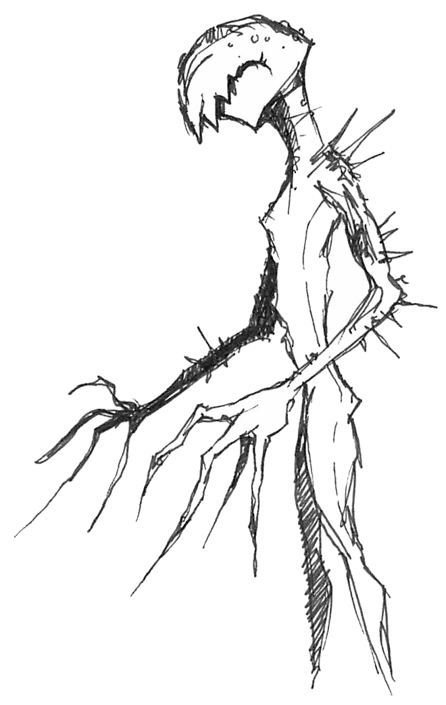

: 1Wx Dämonische Eigenschaften

| 1Wx |                                           |
|:---:|:------------------------------------------|
|  1 | Äthergestalt | 
| 2 | Magieresistenz |
| 3 | Schwäche gegen Eisen |
| 4 | Schwäche gegen eine Element |
| 5 | |
| 6 | |


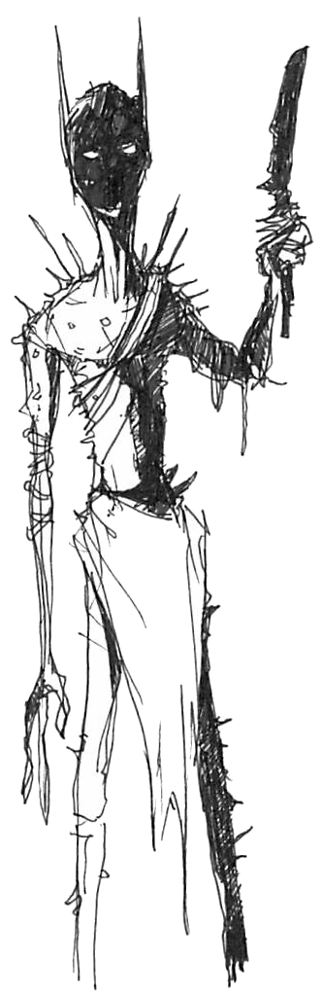

: 1Wx dämonische Einflusssphären

: 1Wx Dämonische Namen

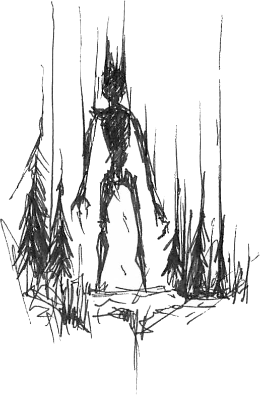

### Engel

### Teufel

: Teuflische Größenklassen

|  | Klasse | TW | RK |
|:--:|----------|:---:|:---:|
|  | niederste | 1 | 9 |
|  | niedere | 2-10 | 
|  | Erzteufel | 50 |

Teuflische Eigenschaften


## Kosmische Entitäten

### Meschenähnliche Halbgötter

Halbgötter, irgendwie menschenförmige göttliche Entitäten, oder auch
die humanoiden Avatare kosmischer Schrecken können als sehr mächtige
menschliche Charaktere mit folgenden Sonderregeln dargestellt werden.

#### Multiple Klassen

Die übernatürlichen Fähigkeiten von Halbgöttern können gut dargestellt
werden, in dem der Entität mehrere Klassen zugeteilt werden, und zwar
in beliebiger Kombination, auf jeweils passenden Stufen. 

Zum Beispiel könnte der Halbgott *Jagdala*, eine spirituelle Kreatur
der Schneeland-Elfen wie folgt dargestellt werden:

>**Jagdala, Seher des Eiswindes**: ST 16 IN 16 WE 17 GE 11 KO 9 CH
>10, RK 3 [16], Kämpfer Stufe 20, Zauberkundiger Stufe 22, Druide
>Stufe 25

Damit hat Jagdala im Spiel einen hohen Angriffsbonus (je nach
Regelsystem zum Beispiel +10), und beherrscht Zauberkundigensprüche
und Druidenzauber der höchsten Stufen.

Aus der Überlegung, dass ein Halbgott mehrere Klassen gleichzeitig
verkörpert, lässt sich auch eine Möglichkeit ableiten, wie man 
zu göttlicher Macht aufsteigen kann. Nämlich, in dem man den langen
und beschwerlichen Weg geht, über das dual-classing eine
Klasse nach der anderen erwirbt. Sobald der Charakter in mindestens
zwei Klassen die Stufe 20 überschreitet, darf er alle bis dahin
akquirierten Trefferwürfel neu werfen, um seine neue Anzahl an
Trefferpunkten zu ermitteln.

#### Trefferwürfel / Trefferpunkte

Menschliche Helden, die zu einem gottartigen Status aufgestiegen sind,
haben sehr hohe Trefferpunkte die mindestens 42 Charakterstufen
entsprechen. Um diese große Zahl an Trefferpunkten zu ermitteln,
werden mit Aufstieg zu göttlichem Status alle Trefferwürfel für alle 
Klassen, in welcher der Charakter erfahren ist, neu geworfen. 

> Für Jagdala könnte die Rechnung zum Beispiel so aussehen:
> 
> Kämpfer Stufe 20: 9W6+20 = 51
> Zauberkundiger Stufe 22: 6W6+18 = 39
> Druide Stufe 25: 8W6+17 = 45
> Gesamt: 135 TP

Der Einfachheit halber können für Monster und Nichtspielercharaktere 
auch folgende kosmische Charakterstufen angesetzt werden:

: 1W10 kosmische Charakterstufen

| Stufe [1W10] | Trefferpunkte | Angriffsbonus |
|:------------:|:-------------:|:-------------:|
| 1 | 100 | +10 |
| 2 | 125 | +10 |
| 3 | 150 | +10 |
| 4 | 175 | +10 |
| 5 | 200 | +11 |
| 6 | 225 | +11 |
| 7 | 250 | +11 |
| 8 | 275 | +11 |
| 9 | 300 | +12 |
| 10 | 325 | +12 |

#### Avatare

Menschenähnliche Halbgötter werden in der Regel ein oder mehrere
Tiere oder Monstergestalten haben, die sie willentlich annehmen
können. Hierzu einfach 1-4 passende Menschen, Menschenähnliche oder
Tiere aussuchen. 

> Für Jagdala würde sicher eine geheimnisvolle
> weißhaarige Greisin, ein Eisbär und ein gehörnter Narwal passen.

#### Artefakte

Für jeden göttliche Kreatur sollte auch ein Artefakt ermittelt werden,
welches die besonderen Fähigkeiten der Entität unterstreicht, und
vielleicht auch geeignet ist Begehrlichkeiten unter den Göttern
plausibel zu machen, oder anzuheizen.

> Für Jagdala habe ich folgendes Artefakt ermittelt:

### Kosmische Schrecken

Godzilla, Götter, Dinge von denen die Menschheit nichts
wissen darf.

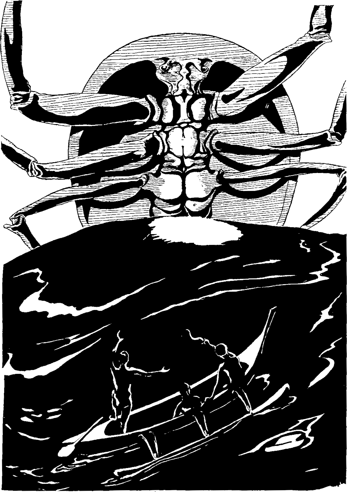

## Gonzo und Pop-Kultur

Zufallsmonster, Außerirdische, Laser ("piu-piu")

Rostmonster, Eulenbär

### Allgemeine Verkehrskontrolle 
Die zwei Streifenpolizisten Herbert
Hasenfuß und Bernd Sauerbier (beide NM, AC 9, TP 1W6,
Dungeon-Polizei-Knüppel 1W4) führen allgemeine Verkehrskontrollen
durch. Mit ihrer Dungeon-Polizei-Kristallkugel ermitteln sie einen
Atemalkohol von 1W3-komma-1W10 Prozent, liegt der Wert über 2,0
teleportieren Sie den betreffenden Spieler-Charakter ohne weitere
Fragen zu stellen: bei ungrade direkt zum Endboss, bei gerade zurück
zum Ausgang - XP 0.

### Der Einhornbär
| AC: 6
| HD: 5*
| No appearing: 1 - 3 (wenn mehr als einer angetroffen werden, handelt es sich um eine Mutter mit 1 - 2 Jungen)
| Move: 150’(50’)
| #AT: claw/claw/bite/horn or special
| Dmg: 1-6/1-6/1-8/1-8
| ML: 10
| Schatztyp: speziell, 1-10 Edelsteine, 1-3 beliebige magische Gegenstände außer Tränke und Rollen
| Aln: Chaotic Neutral
| XP: 250

Einhornbären sind sehr seltene verträumte bunte Kuschelbären, aber sie
können auch anders: Wenn sie sich missverstanden fühlen
(Reaktionswurf), oder sie Junge bei sich haben werden sie sofort voll
aggro.

Gefürchtet ist ihr Spezialangriff - der Regenbogen-Rülpser: dabei
stoßen sie, begleitet von einem markerschütternden Brüllen, welches an
ein übernatürlich lautes Klangschalen- und Windspiel-Klimbim erinnert,
eine regenbogen-farbene Wolke messerscharfer Glitzerpartikel aus:
Schaden 2W8 für jedes Wesen innerhalb eines 10’ x 40’ Konus,
Rettungswurf gegen Drachenodem halbiert den Schaden.

Manchmal (1-3 auf W6) kommt auch noch anderer Mageninhalt mit, dann
wird jedem Betroffenen - zusätzlich zu jedem anderen Schaden - so
speiübel, dass für 1-6 Runden -2 auf jede Probe gilt.

Felle von Einhornbären bringen auf dem Schwarzmarkt 500 GM (weiß) bis
2500 GM (Regenbogen oder Glitzi), junge dressierte Einhornbären
bringen stubenrein bis zu 3000 GM, man muss halt die richtigen Leute
kennen.

### Der Fuß

| Auftreten 1-4
| HD 2
| AC 12
| #AT 1
| S: 1W8 Trampelschaden + Spezialeffekt
| Sv Kä1
| Mv 6”
| ML 12
| XP 25

Falls man den Angriff eines Fußes überlebt, bekommt man auf jeden Fall
Fußpilz, was dazu führt, dass man sich ständig an den Füßen kratzen
muss. Das stört sehr und senkt die Geschicklichkeit für die Dauer der
Erkrankung mit allen Konsequenzen auf 3. Heilt Krankheiten, oder auch
ein Fluchbrecher können helfen.

### Der Rotzling

| Auftreten 1-4
| HD 1
| AC 10
| #AT 1 Spezial
| Sv: M1
| Mv 12”
| ML 12
| XP 5

Rotzlinge sind kleine gräßliche koboldartige Kreaturen aus grünem
Schleim, die leidend vor sich hin stöhnen, husten, und nießen, und
versuchen jeden Gesunden anzugreifen. Man kann Rotzlinge nur
verletzen, in dem man sie mit Ingwerwurzeln, oder Kräuterteebeuteln
bewirft. Bei einem erfolgreichen Angriff eines Rotzlings wird das
Opfer infiziert, wodurch es selbst zu einem Rotzling wird. Nun kann
ihm nur noch ein Heilt Krankheiten eines mächtigen Klerikers, oder
absurd große Mengen Kräutertee helfen. Nach einer Woche vergeht der
Rotz allerdings von selbst, und der Charakter ist wieder ganz der
Alte…


-------------------------------------------------------------------------------
             Number      Number         Move        Lair     Treasure    
Type         Appearing   In Lair   AC   Rate   HD   Nearby   Type       Align 
------------ ----------- --------- ---- ------ ---- -------- ---------- -------
Androids        1-8        3-18     9    12     2     15       A2        Any

Ants,           2-12      20-240    3   18/3    2     10       C          N
giant

Apes            1-8        n/a      6   12/12  4+1    n/a      n/a        N

Basilisks       1-6        1-6      4   6      6+1    40       F        C, N

Bats            10-80     100-800    8   3/12     ½    15      n/a        N

Bats,            1-8        1-8      7   3/15     4    15       C         N
giant 

Bears            1-6       1-6       6    12     5+5    n/a    n/a        N

Beetles,         1-12       n/a      3    9/6    2-7    n/a    n/a        N
giant

Black pudding       1     n/a      7     3      10     n/a   n/a        N

Boars             1-12    n/a      7     15     1+2    n/a   n/a        N

Boars, giant      1-8     n/a      6     12      7     n/a   n/a        N

Cave bears        1-2     n/a      6     12     6+6    n/a    n/a       N

Cavemen           2-12  30-180+    9     12       2     15     C        N

Centaurs          2-8     4-24+    6     18       4      5     A1      L, N

Centipedes,       1-6      1-6    3/7    12      3+1     60    B        N
giant

Centipedes,       2-24   n/a    9      6       ½       n/a     n/a      N
large

Chimeras          1-4     1-4    4      12/18    9      50     F         C

Cockatrices       1-8     1-8    6      9/18     5      35     D        C, N

Crabs, giant      3-12    n/a    3      6        3      n/a     n/a      N

Crocodiles        2-12    3-24    6      9/15     3      20    n/a       N

Crocodiles,        1-6    2-12    5      9/15     7      20    n/a        N
giant

Cyborgs            2-8   30-180   5       9      3+3      15     G       C, N

Cyclopes           1-4     1-4       2     15      16      30     E*        N

Dinosaurs             

Brontosaurs         1-6     n/a      5     6      32      n/a     n/a      N 

Mosasaur            1-4     n/a      5    3/15    14      n/a     n/a      N

Pterodactyls        1-8     n/a      5    3/12    2-7     n/a     n/a      N 

Stegosaurs          2-8     n/a      2/5    6       8      n/a     n/a     N 

Triceratops         2-8     n/a      2/5    9       16     n/a     n/a      N 

Tyrannosaurus Rex    1-2    n/a      5     15       20    n/a      n/a     N 

Deinonychus          1-6     n/a     5     21      4      n/a      n/a     N

Djinni                1      n/a      6    9/24    7+1    n/a       n/a    N

Dogs               4-16      n/a      7      15     1     n/a       n/a    N 

Doppelgangers       1-6      3-12     5      9      4      25       E      C, N

Dragon turtles      1-4      1-4      2     3/9     12     60       H      N

Dragons             

Black               1-4      1-4     5-2   Various 2-12    60       H*     C 

Blue                1-4      1-4     5-2   Various 2+2-14   60      H*     C 

Golden              1-4      1-4     5-2   Various 2-1-16  60      H*     L 

Green               1-4       1-4    5-2   Various 2+1-13  60      H*     C 

Red                 1-4       1-4    5-2   Various 2+3-15  60      H*     C

White               1-4       1-4    5-2   Various 2-1-11   60     H*     C

Dryads             1-6      1-6      5     12       2       20      D     L, N 

Dwarfs             2-12    20-240+    4    9        1       50      G     L, N

Efreeti             1       n/a       4    9/24   10      n/a     n/a      C

Elemental            

Air                1         n/a       3    -/36  8/12/16  n/a   n/a       N 

Earth              1         n/a       3    6/6   8/12/16   n/a   n/a      N  

Fire              1          n/a       3     12   8/12/16   n/a   n/a        N 

Water              1         n/a       3   6/18   8/12/16   n/a   n/a       N

Elves            2-12       20-240+    7    12    1      25        E       L, N

Fish, giant      2-12        n/a       5   -/30  4-9     n/a     n/a        N

Gargoyles        1-10       2-20       6   9/15   4      25       C          C

Gelatinous        1         n/a        8     6    4      n/a       *         N
cube 

Ghouls          1-12        2-24       7   9      2      20       B          C

Giants             

Cloud           1-8         1-8        3    15   12+2     30       E*        N

Fire            1-8         1-8        3    12   11+3     30       E*        C 

Frost           1-8         1-8        4    12   10+1     30       E*        C 

Hill            1-8         1-8        4    12    8       30       E*        C 

Stone           1-8         1-8        2    12    9       30       E*        N 

Storm           1-8         1-8         2   15    15      30       E*        N

Gnolls         2-10        20-200+      6    9     2      30       D         C

Gnomes         2-12        20-240+   6    9     1      60       C        L, N

Goblins        2-20        40-400+   7    9    1-1     50       *        C

Golems             

Clay             1         n/a       2    6     12     n/a     n/a        N
 
Flesh            1         n/a       9    9      9     n/a     n/a        N

Gorgons         1-4        1-4       3     12    8      50       E        C

Gothrogs        1-6        1-6       3    9/15   10      25       F       C

Gray ooze        1         n/a       9      3     3      n/a     n/a       N

Green slime      1         n/a       9     n/a    3      n/a     n/a       N

Griffons        1-8      2-16        4    12/30   7     10        E        N

Halflings       2-8       30-180+    7      9     1     70        B       L, N

Hippogriffs     1-8        2-16      6    18/36  3+1    n/a      n/a       N

Hobgoblins      2-12      20-240+    5     9     1+1    30        D        C

Horses             

Destrier         n/a        n/a      7    12    2+4    n/a       n/a       N 

Draft horse      n/a        n/a      7    12    2+1    n/a       n/a       N 

Mule             n/a        n/a      7    12     2     n/a       n/a       N

Riding horse     n/a        n/a      7    24     2     n/a       n/a       N 

War horse        n/a        n/a      7    18    2+2    n/a       n/a       N

Hydras           1-2        1-2      5    12    5-12    25        B        N

Invisible          1        n/a      2    -/12    8     n/a      n/a       N
stalker

Juggernaut         1        n/a      2     9      37    n/a      n/a       N

Kobolds          2-20     40-400+    7    6/9     ½     50        *       C, N
 
Leeches,         2-12       n/a      8     3/6    2     n/a      n/a        N
giant

Lions            1-6       2-12      6     12     5+2    25      n/a        N

Lions,           2-8        2-8      5     12     6+2    25      n/a        N
spotted

Living statues

Iron              1         n/a      2      6    18     n/a    n/a        N

Stone             1         n/a      5      6    14     n/a    n/a        N

Lizards,          1-6       2-12     5      15   3+1    60      n/a       N
giant

Lizards,          1-6       2-12     8      12    ½     60      n/a       N
large

Lizardmen         2-8       10-40+   6     6/12  2+1    40       D       C, N

Lycanthropes
             
Werebears        1-10        2-20    3      9     6      15      C       L, N

Wereboars        1-10        2-20    5     12    4+1     15      C       C, N

Weretigers       1-10        2-20    4     12    5       15      C       C, N

Werewolves       1-10       2-20     6     15     4     15       C       C, N
        
Manticoras       1-4         1-4     5    12/18   6+1    25      D       C

Mastadons       1-12    n/a     6       15       12     n/a     n/a     N

Medusae         1-4     1-4     7       9       4        75      F      C

Men

Bandits         2-16    30-300+  8       12      1       15      A1      C, N

Berserkers      2-16    30-300+  9       12      1+1     15      A1      N

Brigands        2-16    30-300+  6       12      1       15      A1      C

Buccaneers      2-16     30-300+  8      12      1       15       A3      C, N

Dervishes       2-16    30-300+  8       12      1+1     15      A2      L

Mercenaries     2-16    30-300+     6    12      1+1     15      A3      N

Nomads          2-16    30-300+     8     12     1       15     A2      C, N

Pirates         2-16    30-300+     8     12       1     15      A3       C

Zealots         2-16     30-300+    9     12     1+1     15       A2       C

Mermen          2-12     20-240+    7     3/15    1+1     40     A3        N

Minotaurs        1-8      1-8       6      12     6       30     C        C, N

Mummies          1-6  1-12 4 6 5+1  30  D C

Nixies     2-20  10-100 7 6/12 1-1  100  B N

Ochre jelly  1  n/a 9 3 5  n/a  n/a N

Octopi, giant  1-4  1-4 7 -/9 4  30  A3 N

Ogres     1-8  3-18 6 9 4+1  30  C* C

Orcs     2-16  30-300+ 7 9 1  50  D C

Pegasi     1-12  n/a 6 24/48 2+2  n/a  n/a L, N

Pixies     2-20  10-100 6 9/18 1-1  25  C N

Purple worms  1-4  1-4 6 9/9 15  25  D N

Rats, giant  2-12  10-60 7 12/6 ½  10  C N

Robots     1-4  n/a 3 6/6 7  n/a  n/a C, N

Rocs

Young     1-8  1-20 6 6/48 6  20  I N
    
Adult    1-6 1-20 5 6/42 12 20 I N 

Ancient    1-4 1-20 4 6/36 18 20 I N

Sabre toothed tigers 1-2  1-2 6 12 7+2  15  n/a N

Salamanders     2-5  2-5 3/5 9 7+3  70  F C

Scorpions, giant  1-4  1-4 3 15 5+4  50  D N

Sea monsters

Leviathan     1  1 4 -/18 45  n/a  H N

Kraken     1  1 2 3/18 30  75  G* N

Sea serpents  1-4  1-4 6 -/21 15  25  D N

Shadows     1-10  2-20 7 -/9 2+2  50  F C

Skeletons     3-30  n/a 8 6 ½  n/a  n/a N

Snakes, giant  1-4  n/a 6 9/9 7  n/a  n/a N

Snakes, large  2-16  n/a 8 6/6 ½  n/a  n/a N

Spectres    1-8  1-8 3 -/15 6  25  E C

Spiders, giant  1-8  1-8 5 3/12 4+4  70  C C

Spiders, large  1-10  2-20 8 6/15 ½  60  C N

Squid, giant  1-6  2-12 7/3 -/12 6  20  A3 N

Thulls     1-8  3-18 6 9 3  35  D C

Tigers     1-4  1-4 6 12 5+4  15  n/a N

Titanotheres     1-12  n/a 7 12 12 n/a  n/a N

Titan     1  1 2 18 21  5  A1* Any

Toads, giant  1-6  3-30 6 6/6 2+4  40  n/a N

Treants     1-10  2-20 2 6 8  15  n/a L, N

Trolls     1-6  2-12 5 12 6+3  50  D C

Unicorns     1-4  n/a 3 24 4  n/a  n/a L

Vampires     1-6  1-6 2 12/18 8  20  F C

Weasels, giant  1-8  1-8 6 15 2  15  n/a N

Wight apes  1-6  1-6 6 12/12 5+2  10  C N

Wights    1-12 2-24 6 9 3  60  B C

Wolves     1-10  2-20 7 18 1  15  n/a N

Wolves, giant  1-6  3-12 6 18 2+2  15  n/a C

Woolly mammoths 1-12  n/a 5 15 13  n/a  n/a N

Woolly rhinoceroses 1-4  n/a 5 12 10  n/a  n/a N

Wraiths     1-8  2-16 4 -/12 4  20  E C

Wyverns     1-6  1-6 4 9/24 7  60  E C, N

Yellow mold  1  n/a 9 n/a 3  n/a  n/a N

Zombies     3-30  n/a 9 6 1  n/a  n/a N

---------------------------------------------------------------------------


#  Schätze

## Edelsteine und Geschmeide

Edelsteine kommen in verschiedensten Größen zwischen etwa erbsgroß bis
faustgroß vor. Außerdem können sie geschliffen oder ungeschliffen
sein. Daruch kann der Wert von Edelsteinen stark variieren.

: Wert einzelner Edelsteine

 1W%        Wert      Beispiele
------- ------------- -------------------------------
 01-08   10 GM        Perle, Obsidian, Türkis
 09-22   35 GM        Karneol, Rosenquarz, Zirkon
 23-67   100 GM       großer Bernstein, Turmalin
 68-87   350 GM       schwarze Perle, goldener Topaz
 88-98   1.000 GM     großer Aquamarin, blauer Spinel
 99      3.500 GM     blauer Saphir, großer Rubin
 00      10.000 GM    berühmter, faustgroßer Diamant

Geschmeide sind von Goldschmieden hergestellte Werkstücke, die
typischerweise aus Gold und Edelsteinen bestehen. Wird ein Geschmeide
beschädigt (Rettungswurf 12), so halbiert sich der Verkaufswert in
Folge der Beschädigung auf die Hälfte.

Geschmeide könnnen in Ihre Einzelteile zerlegt werden. Als Richtwert
beträgt der Goldanteil 10% des entgültigen Wertes. Außerdem besteht
jedes Geschmeide aus 1W4+1W8 Edelsteinen, deren Wert nach der oben
genannten Tabelle ausgewürfelt werden kann. In Ausnahmefällen wird
sich dabei heraus stellen, dass ein einzelner Edelstein in
Wirklichkeit mehr wert ist als es dem zunächsten geschätzten Wert des
Geschmeides entsprach.

: Wert einzelner Geschmeide

 1W%            Wert           Beispiele
------- ---------------------- --------------------------
 01-20   3W6 $\cdot$ 100 GM    Ohrring, kleine Brosche
 21-40   5W6 $\cdot$ 100 GM    Fibel, Armreif, Anhänger
 41-60   1W6 $\cdot$ 1.000 GM  Kette, Schale, Kelch
 61-80   2W4 $\cdot$ 1.000 GM  Gürtel, Schwertscheide
 81-90   3W4 $\cdot$ 1.000 GM  Zepter, heiliges Symbol
 91-00   3W6 $\cdot$ 1.000 GM  Krone, Diadem

## 1W24 Schatzklassen

1. **A (XXII)** - durchschnittlich 18.000 GM; Menschen
  
   An Land: 
   
    25%: 1-6 $\cdot$ 1.000 KM

    30%: 1-6 $\cdot$ 1.000 SM

    35%: 2-12 $\cdot$ 1.000 GM

    50%: 6-36 Edelsteine

    50%: 6-36 Geschmeide

    40%: 3 beliebige magische Gegenstände einschließlich Karten
  
   In der Wüste:
   
    20%: 1-4 $\cdot$ 1.000 KM

    25%: 1-4 $\cdot$ 1.000 SM

    30%: 1-6 $\cdot$ 1.000 GM

    50%: 10 - 40 Edelsteine

    50%: 10 - 40 Geschmeide

    60%: 3 beliebige magische Gegenstände 

   Zur See:

    60%: 5-30 $\cdot$ 1.000 GM

    60%: 10-60 Edelsteine

    60%: 10-60 Geschmeide

    50%: eine Karte

2. **B (XXI)** - durchschnittlich 2.000 GM; Grottenschrate, Aaskriecher, Ghule, Gruftbewohner (Wights), Hydras, Nixies 

   50%: 1-8 $\cdot$ 1.000 KM 

   25%: 1-6 $\cdot$ 1.000 SM 

   25%: 1-3 $\cdot$ 1.000 GM 
       
   25%: 1-6 Edelsteine
        
   25%: 1-6 Geschmeide
        
   10%: eine magische Waffe oder eine magische Rüstung 

3. **C (XX)** - durchschnittlich 1.000 GM; Oger, Gargyle, Harpyien, Blinzelhunde,
   Höllenhunde, Eulenbären, Lykanthropen, Minotauren, Pixies, Gnome

   20%: 1-12 $\cdot$ 1.000 KM

   30%: 1-4 $\cdot$ 1.000 SM

   25%: 1-4 Edelsteine

   25%: 1-4 Geschmeide

   10%: zwei beliebige magische Gegenstände einschließlich Karten
 
4. **D (XIX)** - durchschnittlich 3.900 GM; Orks, Hobgoblins, Gnolle, Echsenmenschen, Trolle,
   Versetzerbestien, Mumien, Cockatrices, Mantikore, Purpurwürmer, Dryaden

   10%: 1-8 $\cdot$ 1.000 KM

   15%: 1-12 $\cdot$ 1.000 SM

   60%: 1-6 $\cdot$ 1.000 GM

   30%: 1-8 Edelsteine

   30%: 1-8 Geschmeide

   20%: zwei beliebige magische Gegenstände einschließlich Karten, ein Zaubertrank

5. **E (XVIII)** - durchschnittlich 3.900 GM; Riesen, Elfen, Todesalben (Wraiths), Schreckgespenster
   (Spectres), Doppelgänger, Gorgonen, Halbdrachen (Wyverns),
   Phasenspinnen, Erdkolosse (Umber Hulks)

   5%: 1-10 $\cdot$ 1.000 KM

   30%: 1-12 $\cdot$ 1.000 SM
   
   25%: 1-8 $\cdot$ 1.000 GM

   10%: 1-10 Edelsteine

   10%: 1-10 Geschmeide

   30%: drei beliebige magische Gegenstände einschließlich Karten,
   eine Spruchrolle

6. **F (XVII)** - durchschnittlich 7.700 GM; Vampire, Basilisken, Medusen, Chimeren, Salamander

   10%: 2-20 $\cdot$ 1.000 SM

   45%: 1-12 $\cdot$ 1.000 GM

   20%: 2-24 Edelsteine

   20%: 2-24 Geschmeide

   35%: drei beliebige magische Gegenstände einschließlich Karten, jedoch
   keine Waffen, ein Zaubertrank, eine Spruchrolle

7. **G (XVI)** - durchschnittlich 23.000 GM; Zwerge

   75%: 10-40 $\cdot$ 1.000 GM
   
   25%: 3-18 Edelsteine

   25%: 1-10 Geschmeide

   40%: vier beliebige magische Gegenstände einschließlich Karten,
   eine Spruchrolle

8. **H (XV)** - durchschnittlich 60.000 GM; Drachen

   25%: 3-24 $\cdot$ 1.000 KM

   50%: 1-100 $\cdot$ 1.000 SM

   75%: 10-60 $\cdot$ 1.000 GM

   50%: 1-100 Edelsteine

   50%: 10-40 Geschmeide

   20%: vier beliebige magische Gegenstände einschließlich Karten,
   ein Trank, eine Spruchrolle

9. **I (XIV)** - durchschnittlich 11.000 GM; Rocs

   50%: 2-16 Edelsteine

   50%: 2-16 Geschmeide

   20%: ein beliebiger magischer Gegenstand oder eine Karte

10. **J (XIII)** - durchschnittlich 25 GM

    25%: 1-4 $\cdot$ 1.000 KM

    10%: 1-3 x 1.000 SM

11. **K (XII)** - durchschnittlich 180 GM

    30%: 1-6 x 1.000 SM

    10%: 5-10 x 500 GM

12. **L (XI)** - durchschnittlich 240 GM

    50%: 1-4 Edelsteine

13. **M (X)** - durchschnittlich 50.000 GM

    90%: 5-30 x 1.000 GM

    55%: 5-20 Edelsteine

    45%: 2-12 Geschmeide

14. **N (IX)**

    45%: 2-8 Zaubertränke

15. **O (VIII)**

    45%: 1-4 Schriftrollen

16. **P (I)**

    3-24 (3W8) KM

17. **Q (II)** - einzelne Nomaden, Banditen und Briganten

    3-30 (2W10) SM

18. **R (III)** - einzelne Kobolde und Goblins

    1-6 GM

19. **S (IV)** - einzelne Piraten

    2-12 (2W6) GM

20. **T (V)**

    5-30 (5W6) GM

21. **U (VI)**

    10%: 1-100 KM 

    10%: 1-100 SM
    
    5%: 1-100 GM

    5%: 1-4 Edelsteine
 
    5%: 1-4 Geschmeide

    2%: ein beliebiger magischer Gegenstand

22. **V (VII)**

    15%: 2-200 SM

    15%: 2-200 GM

    10%: 1-4 Edelsteine

    10%: 1-4 Geschmeide

    5%: ein beliebiger magischer Gegenstand

23. **W**

    50%: 5-500 GM

    20%: 1-4 beliebige magische Gegenstände

    10%: ein Artefakt

24. **X**

    50%: 50-5.000 SM
 
    50%: 50-5.000 GM   

    50%: 2-8 beliebige magische Gegenstände einschließlich Karten

    10%: ein Artefakt

## Magische Schwerter

: 32 magische Schwerter

 1W%     Trefferbonus    Schadensbonus (ggf. Gesinnung)
------- -------------- ---------------------------------------------
 1-30    +1              kein Schadensbonus
 31-35   +1              +1W6 gegen unheilige Kreaturen (rechtsch.)
 36-40   +1              +2 gegen Hippogreifen 
 41-45   +1              +2 gegen Rocs (chaotisch)
 46-50   +1, flammend    +2 gegen Untote (rechtschaffen)
 51-55   +1, frost.      +2 gegen Lykanthropen (rechtschaffen)
 56-60   +1, frost.      +2 gegen beschworene Monster
 61-65   +2, frost.      +2 gegen Zauberkundige
 66-70   +2              +2 gegen Trolle
 71-75   +2, flammend    +3 gegen Trolle
 76-80   +3              +1W6 gegen heilige Wesen (chaotisch)
 81-85   +3, flammend    +3 gegen Untote (rechtschaffen)
 86-90   +4              +3 gegen Drachen 
 91-95   +5              +3 gegen Baumherren (chaotisch)
 96-98   -1              Lebensentzug (pro Treffer 1 Stufe / TW)
 99-00   -2              +5 gegen Feuergeschöpfe (auch Feuerdrachen)


Flammende Schwerter verursachen +3 Schaden gegen feuerempfindliche
Kreaturen wie zum Beispiel Mumien, Baumherren und Eisdrachen.
Forstklirrende Schwerter verursachen +3 Schaden gegen Kreaturen des
Feuers wie zum Beispiel Feuerelementare, Efreeti und Feuerdrachen.

### Intelligente Schwerter

Mit einer Wahrscheinlichkeit von 50% verfügt ein magisches Schwert
über ein gewisses Maß an Intelligenz. Solche besonderen Schwerter haben
*immer* eine Gesinnung und können über besondere Mächte verfügen.
Chaotische Schwerter, die häufig an ihrer
dunklen Färbung und unheilvollen Verzierungen zu erkennen sind, 
können gefährlich sein:
rechtschaffene Charaktere, die ein chaotisches Schwert an sich nehmen
erleiden einen Abzug von -2 auf Reaktionswürfe und Rettungswürfe. Sie
fühlen sich seltsam belastet, und alles kommt ihnen düster
vor. Versuchen sie, ein chaotisches Schwert im Kampf zu 
führen, erleiden sie 2-12 Punkte Schaden. Gehen sie erfolgreich aus
einer Schlacht hervor, oder töten sie einen Gegner mit dem chaotischen
Schwert, müssen sie die Gesinnung wechseln, sofern ihnen kein
Rettungswurf gegen Sprüche gelingt. Ganz entsprechend geht es
chaotischen Charakteren im Umgang mit rechtschaffenen Schwertern.

: Gesinnung besonderer Schwerter

 1W6      Gesinnung
------- ------------------
 1       chaotisch
 2-3     neutral
 4-6     rechtschaffen


: Eigenschaften besonderer Schwerter

 1W12    Intelligenz         Kommunikation      Mächte
------- ------------------ ------------------ -------------------
 2-6     -                   -                  -
  7      Int 7 (Ego 2W12)   empathisch          1
  8      Int 8 (Ego 2W12)   empathisch          2
  9      Int 9 (Ego 2W12)   verbal              3
 10      Int 10 (Ego 2W12)  mehrsprachig        3
 11      Int 11 (Ego 2W12)  kann Magie lesen    3
 12      Int 12 (Ego 2W12)  telepathisch        3+1 außerordentl.


Mehrsprachige Schwerter sprechen zusätzlich zur Gemeinsprache 1-6
verschiedene Sprachen, und können so als Dolmetscher fungieren. 

Intelligente Schwerter verfügen über die folgenden Mächte. Je nach
Intelligenz evtl. mehrmals würfeln:

: Mächte intelligenter Schwerter

 2W6            Macht
-------- ----------------------------------
 2       zweimal würfeln
 3       entdeckt Unsichtbares
 4       entdeckt Edelsteine
 5       entdeckt Silber
 6       Architekturkunde (wie Zwerge)
 7       entdeckt Gefälle
 8       entdeckt Gutes/Böses
 9       entdeckt Fallen
 10      entdeckt Gold
 11      entdeckt Magie
 12      außerordentliche Macht


: außerordentliche Mächte intelligenter Schwerter

 3W18    Macht
-------- -----------------------------------------------
  3      dreimal würfeln
  4      zweimal würfeln
  5      Teleportieren
  6      Telekinese
  7      Regeneration (1 TP pro Runde bis zu 6 pro Tag)
  8      Person bezaubern
  9      Klopfen
  10     ESP
  11     Levitation
  12     Halluzination
  13     Röntgenblick
  14     Fliegen
  15     Riesenkraft
  16     Stufenraub
  17     1-4 Wünsche
  18     ein zufällig ausgewählter Zauberspruch

## Sonstige magische Waffen

Bei sonstigen magischen Waffen wirkt sich der Bonus auf
| 1-3 Sprüch 1-3 | 1 | 2 | 3 | 4 | 5 | 6 | 7 | 8 | 9 | 10 |
| 1-3 Sprüche 4-6 | 11 | 12 | 13 | 14 | 15 | 16 | 17 | 18 | 19 | 20 |
| Schutz Lykanthropen | 21 | 22 | 23 | 24 | 25 | 26 | 27 | 28 | 29 | 30 |
| Schutz +1 | 31 | 32 | 33 | 34 | 35 | 36 | 37 | 38 | 39 | 40 |
| Unsichtbarkeit | 41 | 42 | 43 | 44 | 45 | 46 | 47 | 48 | 49 | 50 |
| 1 Spruch 1-4 | 51 | 52 | 53 | 54 | 55 | 56 | 57 | 58 | 59 | 60 |
| 1 Spruch 1-4 | 61 | 62 | 63 | 64 | 65 | 66 | 67 | 68 | 69 | 70 |
| 1 Spruch 1-4 | 71 | 72 | 73 | 74 | 75 | 76 | 77 | 78 | 79 | 80 |
| 1 Spruch 1-4 | 81 | 82 | 83 | 84 | 85 | 86 | 87 | 88 | 89 | 80 |
| 1 Spruch 1-4 | 91 | 92 | 93 | 94 | 95 | 96 | 97 | 98 | 99 | 00 |

## 1.000.000 magische Artefakte

\tiny

| 1W30 | Gegenstand | 1W4 Eigenschaften | Material | 1W6 Mächte | 
|:--:|:-----------|:------------|:--------------|:-------------------|
| 01 | Kessel | Krähenfüße | Gold | 1-6 Sprüche 1-6 |
| 02 | Amulet | Entenfüße | Kupfer | 1-4 Sprüche 4-9 |
| 03 | Hütte | Fledermausflügel | Silber | 1-4 Wünsche |
| 04 | Handschuhe | schwebend | Papier | Vakuumreisen |
| 05 | Gürtel | Lumineszenz | Samt | Flammenstrahl |
| 06 | Mantel | Gesinnungstreu | Seide | Feuerresistenz |
| 07 | Kelch | Sprachbegabt | Ebenholz | Kälteresistenz |
| 08 | Schale | Int. 15 | Eiche | Feuerodem |
| 09 | Würfel | Telepatiebegabt | Eibe | Eisodem |
| 10 | Polyhedron | unsichtbar | Leder | Zeitreisen |
| 11 | Löffel | Taschendimension | Bernstein | Ebenenreisen |
| 12 | Gabel | Kommandowort | Obsidian | Geräuschlosigkeit |
| 13 | Schere | zerbrechlich | Messing | Zerstörung |
| 14 | Tierfigur | unzerstörbar | Mithril | 1-4 Gebete 1-4 |
| 15 | Besen | magnetisch | Federn | 1-4 Gebete 4-7 |
| 16 | Ruderboot | giftig | Porzellan | Spurlosigkeit |
| 17 | Kanu | verflucht | Meteorit | Int. +2 |
| 18 | Muschel | chaotisch | Hämatit | Wei. +2 |
| 19 | Schneckenhaus | egoistisch | Mondstein | Größenwechsel |
| 20 | Spieluhr | rechtschaffen | Licht | Parallelweltreisen |
| 21 | Sextant | schwer | Äther | Spähen |
| 22 | Helm | leicht | Dunkelheit | Orientierung |
| 23 | Stiefel | schwelend | Klang | Extrastufen 1-4 |
| 24 | Umhang | eiskalt | Esche | Riesenschritte |
| 25 | Zepter | geladen | Fischhaut | Adlerflug |
| 26 | Orb | Taubenflügel | Glas | Tauchen |
| 27 | Horn | 1-10 Augen | Platin | Festung |
| 28 | Leier | Monstergestalt | Perlmutt | Stä. * 2 |
| 29 | Laute | annihilierend | Karneol | Adlerflug |
| 30 | Knopf | schillernd | Sternenhimmel | Energiestrahl |

\normalsize

\backmatter

# Spielleiterreferenz

Eine Spielphase (10 min.)
-------------------------------------------------

1.  Check Wandelnde Monster (1 auf 1W6)
2.  Spieler beschreiben ihre Aktionen
3.  Es wird ...
    a.  ein neuer Höhlenabschnitt beschrieben,
    b.  eine Begegnung abgehandelt,
    c.  etwas entdeckt,
    d.  weiter gemacht bei 1.

Lauschen
-------------------------------

erfolgreich bei 1 auf 1W6, Halbmenschen bei 1-2 auf 1W6

Türen
-----------------------------

Geheimtüren finden 1-2 auf 1W6, Elfen bei 1-4 auf 1W6.

Zwerge finden große Fallen, Schiebewände, abfallende Gänge und neue
Einbauten bei 1-2 auf 1W6

Türen aufbrechen bei 1 auf 1W6, ggf. Stärkebonus einrechnen.

Verstecken
-------------------------------

Halbling: im Verlies 5+ auf 1W6, im Freien 5+ auf 2W6

Dieb, Stufe 1: 15+ auf 3W6, Stufe 2: 14+ auf 3W6, 
Stufe 3: 13+ auf 3W6

Eine Begegnung
-------------------------------

1.  Anzahl der Monster?
2.  Überraschung? (je 1W6)
3.  Reaktionen? (2W6)
4.  Wenn ...
    a.  beide Seiten verhandeln, weitere Reaktionswürfe 
    b.  eine Seite die Flucht ergreift, Flucht und Verfolgung
        abhandeln
    c.  eine Seite angreift, der Kampf abhandeln.

## Zufallsbegegnungen im Dungeon

Dungeon: alle 2 Phasen bei 1 auf 1W6

: Auswahl der Zufallsbegegnungstabelle nach Dungeon-Level

 Level     1     2     3     4     5     6
-------- ----- ----- ----- ----- ----- -----
   0      1-5    6 
   1      1-4   5-6 
   2      1-2   3-5    6
   3       1    2-4   5-6
   4            1-2   3-5    6
   5             1    2-4   5-6
   6                  1-2   3-5    6
   7                   1    2-4   5-6
   8                        1-2   3-5    6
   9                         1    2-4   5-6
   10                             1-2   3-6
   11                              1    2-6
   12+                                  1-6

Die folgenden Tabellen gehen von einer Gruppenstärke von 3
Spielercharakteren aus. Ab 5 Spielern sollten die erwürfelten Zahlen
verdoppelt werden.

: Dungeon-Begegnungen, Tabellen 1-2

 2d6   Tabelle 1             Tabelle 2           
------ --------------------- ------------------- 
  2    1-6 Räuber            1-3 Krokodile       
  3    1-6 Tausendfüßlr.     1 Junger Drache     
  4    1-2 Wyrmlinge         1-3 Gargyle         
  5    3-8 Goblins           1 Gallertwürfel     
  6    3-8 Hobgoblins        3-8 Ghoule          
  7    2-12 Kobolde          3-8 Gnolle          
  8    2-12 NSCs             3-8 Echsenmenschen  
  9    3-8 Orks              1-3 Medusen         
  10   2-12 Skelette         2-12 NSCs           
  11   1-3 Riesenspinnen     1-3 Thoule          
  12   3-8 Zombies           1-3 Wights          

: Dungeon-Begegnungen, Tabellen 3-4

 2d6   Tabelle 3              Tabelle 4             
------ ---------------------  --------------------- 
  2    1-6 Höhlenbären        1-2 Basilisken        
  3    1-3 Cockatrice         1-2 Große Drachen     
  4    1 Erwachsener Drache   1 Elementar 8 TW      
  5    1 Hydra, 4-6 Köpfe     1-2 Wyrmlinge         
  6    1-6 Lykanthropen       3-8 Goblins           
  7    1-3 Minotauren         3-8 Hobgoblins        
  8    1-6 Mumien             2-12 Kobolde          
  9    2-12 NSCs              2-12 NSCs             
 10    1-6 Oger               3-8 Orks              
 11    1-6 Skorpione          2-12 Skelette         
 12    1-6 Riesenspinnen      1-3 Riesenspinnen     

: Dungeon-Begegnungen, Tabellen 5-6

 2d6   Tabelle 5           Tabelle 6
------ ------------------- ---------------------
  2    1-2 Efreeti         1 Uralter Drache
  3    1 Elementar 12 TW   1 Elementar 16 TW   
  4    1-3 Gargyle         1 Hydra, 4-6 Köpfe
  5    1 Gallertwürfel     1-6 Lykanthropen
  6    3-8 Ghoule          1-6 Minotauren
  7    3-8 Gnolle          1-6 Mumien
  8    3-8 Echsenmenschen  2-12 NSCs
  9    1-3 Medusen         1-6 Oger
  10   2-12 NSCs           1-6 Skorpione
  11   1-6 Thoule          1-6 Riesenspinnen
  12   1-6 Wights          1-6 Wraiths

## Wildnisbegegnungen

Begegnungsentfernungen
--------------------------------

Dungeon: 2W6 $\cdot$ 10' = 20 bis 120' (6 bis 36 Meter)

6 bis 36 Meter können auch durch **6W6** ermittelt werden!

Überraschung 1W4 $\cdot$ 10' = 10 bis 40'

3 bis 12 Meter entsprechen auch ungefähr **2W6** Meter

Wildnis: 4W6 $\cdot$ 10 Meter = 40 bis 240 Meter

Überraschung: 1W4 $\cdot$ 10 Meter = 10 bis 40 Meter

praktischer: **1W6** $\cdot$ 10 Meter, also 10 bis 60 Meter.

Eine Kampfrunde 
-----------------------------------

Eine Kampfrunde dauert so lange, wie die Charaktere brauchen um eine
Bewegungsweite zurück zu legen *und* eine signifikante AKtion im Kampf
durchzuführen. Die genaue Dauer einer Runde kann zwischen 6 Sekunden
und etwa einer Minute dauern.

1. Überraschung
2. Absichten und Sprüche erklären
3. Initiative
    a. Moral-Check für Monster / NSC
    b. Bewegung, Manöver und Fernkampfangriffe 1 in der Reihenfolge der
       Initiative
    c. Sprüche werden aktiv
    d. Nahkampf in Initiativ-Reihenfolge
    e. Fernkampfangriffe 2 (falls in Schritt 4 auf Bewegung verzichtet
       wurde)


Wandelnde Monster
----------------------------


Wildnis:  einmal pro Hex bzw. pro Tag bei 1-2 auf W6, einmal pro Nacht
bei 1-2 auf W6

1-2 erste Wache, 3-4 zweite Wache, 5-6 dritte Wache


Überraschung
---------------------------------

bei 1-2 auf 1W6

Reaktionen
-----------------------------

2W6 | Reaktion
:----:|:-------------
2 | feindselig
3-5 | unfreundlich
6-8 | indifferent
9-11 | freundlich
12 | hilfsbereit


Initiative
--------------------------------
\index{Initiative}

je Seite 1W6, die höhere Zahl gewinnt die Initiative

Genau genommen agiert jede Seite in dem *Segment*, welches die gegnerische
Seite ausgewürfelt hat.

Moral
-------------------------------
\index{Moral}

2W6 - ist das Ergebnis höher
ergreift es die Flucht, ergibt sich, o.ä.

1.  Check bei erster Verletzung bzw. Kampfunfähigkeit des ersten
    Individuums einer Gruppe
2.  Check bei Verlust von 50 % der TP bzw. Kampfunfähigkeit der Hälfte
    der Individuen einer Gruppe


: Moral

-------------------------------------------------------------
 Moral (ML)   Charakter-Typ/Monster        Standhaft bei ...
------------  --------------------------- -------------------
 2            Fluchttiere, die immmer      12
              flüchten

 3            Fluchttiere, die sich ver-   11
              teidigen wenn in die Enge
              getrieben
 
 4            Fluchttiere, die ihre        10
              Jungen verteigiden
 
 5            Raubtiere, Feiglinge          9
 
 6            Vorsichtige normale             8
              Menschen, Bauern
 
 7            Normale Menschen,             7
              Soldaten
 
 8            Gut geführte Truppen           6
 
 9            Elitetruppen                   5

 10           Fanatiker,                     4
              Ritter 

 11           Verrückte                     3   
 
 12           Unnatürliche Kreaturen          2

-------------------------------------------------------------


Fernkampfreichweite
-------------------------------------

: Fernkampfreichweite

---------------------------------------------------------------------
Waffe               Feuerrate      Nah(+1)   Mittel(0)    Fern(-4)
------------------ ----------- ------------ ------------ ------------
Keule/Hammer           1         10'(3 m)   20'(6 m)     30'(10 m)

Wurfbeil               1         10'(3 m)   20'(6 m)     30'(10 m)

Dolch                  2         10'(3 m)   20'(6 m)     30'(10 m)

Speer                  1         10'(3 m)   20'(6 m)     30'(10 m)

Öl/Weihwasser          1         10'(3 m)   30'(10 m)    50'(17 m)

Wurfpfeil              3         15'(5 m)   30'(10 m)    45'(15 m)

Wurfspieß              1         20'(6 m)   40'(12 m)    60'(20 m)
(Javelin)

Kurzbogen              2         50'(17 m)  100'(34 m)   150'(50 m)

Kompositbogen          2         60'(20 m)  120'(40 m)   180'(60 m)

Armbrust, leicht       1         60'(20 m)  120'(40 m)   180'(60 m)

Langbogen              2         70'(23 m)  140'(46 m)   210'(70 m)

Armbrust, schwer       1/2       80'(26 m)  160'(52 m)   240'(80 m)

---------------------------------------------------------------------


Deckung
-----------

Im Fernkampf sollten als weitere Modifikatoren, und als Chance für
taktisches Spiel, Modifikatoren für Deckung berücksichtigt werden. Je
nach Qualität und Beschreibung können diese Modifikatoren zwischen -1
und -4 liegen. Maximale Deckung --- vollständig hinter einem Fels
verborgen --- kann Treffer schlicht unmöglich machen, dann kann der in
Deckung befindliche Charakter aber selbst auch keine Fernkampfangriffe
ausführen.


Fallschaden
--------------------------------

1W6 pro 10' Fallhöhe

Untote vertreiben
-----------------------------------

Probe mit 2W6, Erfolg wenn Wurf größer oder gleich Zielwert, V -
automatisch vertrieben, N - nie vertrieben:

: Untote vertreiben

| Untote TW:     | 1 | 2 | 3 | 4 | 5 | 6 | 7 | 8 | 9 | 10+ |
|:--------------:|:-:|:-:|:-:|:-:|:-:|:-:|:--|:-:|:-:|:---:|
| Kleriker Stufe |   |   |   |   |   |   |   |   |   |     |
| 1              | 7 | 9 |11 | - | - | - | - | - | - | -   |
| 2              | 5 | 7 | 9 | 11| - | - | - | - | - | -   |
| 3              | 3 | 5 | 7 | 9 | 11| - | - | - | - | -   |
| 4              | V | 3 | 5 | 7 | 9 |11 | - | - | - | -   |
| 5              | V | V | 3 | 5 | 7 | 9 |11 | - | - | -   |
| 6              | Z | V | V | 3 | 5 | 7 | 9 |11 | - | -   |
| 7              | Z | Z | V | V | 3 | 5 | 7 | 9 |11 | -   |
| 8              | Z | Z | Z | V | V | 3 | 5 | 7 | 9 | 11  |
| 9              | Z | Z | Z | Z | V | V | 3 | 5 | 7 |  9  |
| 10             | Z | Z | Z | Z | Z | V | V | 3 | 5 |  7  |
| 11             | Z | Z | Z | Z | Z | Z | V | V | 3 | 5   |
| 12             | Z | Z | Z | Z | Z | Z | Z | V | V | 3   |
| 13             | Z | Z | Z | Z | Z | Z | Z | Z | V | V   |
| 14+            | Z | Z | Z | Z | Z | Z | Z | Z | Z | V   |

\index{Untote vertreiben}


Es werden 2W6 Trefferwürfel an Untoten vertrieben

Wurfgeschosse
------------------------------------------

Weihwasser: Trefferwurf wie Fernkampf, 1W8 Schaden bei Untoten.

Öl: Trefferwurf wie Fernkampf, tropft innerhalb von 2 Runden ab,
brennendes Öl macht 1W8 Schaden.


## Treffer- und Rettungswürfe

: Angriffstabelle für Kämpfer

 Stufe    9 [10]    8 [11]   7 [12]   6 [13]   5 [14]   4 [15]   3 [16]   2 [17]
-------  --------  -------- -------- -------- -------- -------- -------- --------
 1-3        10        11       12       13       14       15       16       17
 4-6        8         9        10       11       12       13       14       15  
 7-9        5         6        7         8        9       10       11       12
10-12       3         4        5         6        7        8        9       10  
13-15       2         2        3         4        5        6        7        8
 16+        2         2        2         2        2        3        4        5


: Angriffstabelle für Kleriker

 Stufe    9 [10]    8 [11]   7 [12]   6 [13]   5 [14]   4 [15]   3 [16]   2 [17]
-------  --------  -------- -------- -------- -------- -------- -------- --------
 1-4      10       11        12       13       14       15       16       17
 5-8       8        9        10       11       12       13       14       15
 9-12      5        6         7        8        9       10       11       12
13-16      3        4         5        6        7        8        9       10
17-20      2        2         3        4        5        6        7        8
 21+       2        2         2        2        2        3        4        5


: Angriffstabelle für Zauberkundige und Diebe

 Stufe    9 [10]    8 [11]   7 [12]   6 [13]   5 [14]   4 [15]   3 [16]   2 [17]
-------  --------  -------- -------- -------- -------- -------- -------- --------
  1-5      10       11        12       13       14       15       16       17
 6-10       8        9        10       11       12       13       14       15
 11-15      5        6         7        8        9       10       11       12
 16-20      3        4         5        6        7        8        9       10
 21-25      2        2         3        4        5        6        7        8
  26+       2        2         2        2        2        3        4        5


:Angriffstabelle für Monster

 TW       9 [10]    8 [11]   7 [12]   6 [13]   5 [14]   4 [15]   3 [16]   2 [17]
-------  --------  -------- -------- -------- -------- -------- -------- --------
 <=1        10       11        12       13       14       15       16       17
   1+       9       10        11       12       13       14       15       16  
   2+       8        9        10       11       12       13       14       15
   3+       6        7         8        9       10       11       12       13
   4+       5        6         7        8        9       10       11       12
   6+       4        5         6        7        8        9       10       11
   9+       2        3         4        5        6        7        8        9
  11+       2        2         2        3        4        5        6        7


## Rettungswürfe

Klasse     Stufe   Tod   Tech   Hind.   AOE   Psi
--------- ------- ----- ------ ------- ----- -----
Kämpfer     1-3     12    13      14     15   16
            4-6     10    11      12     13   14
            7-9      8     9      10     10   12
           10-12     6     7       8      8   10
            13+      4     5       5      5    8
Kleriker    1-4     11    12      14     16   15
            5-8      9    10      12     14   12
            9-12     6     7       9     11    9
            13+      3     5       7      8    7
ZK          1-5     13    14      13     16   15
            6-10    11    12      11     14   12 
           11-15     8     9       8     11    8
            16+      5     6       5      8    3
          


Flucht und Verfolgung
-----------------------------------------

--------------------------------------------------------------------------------
Manöver          Effekt
---------------  ---------------------------------------------------------------
Rückzugs-        Rückwärtsbewegung mit halber Geschwinigkeit, *ohne* einen 
gefecht          Gelegenheitsangriff zu riskieren,
                 folgt der Gegner und greift an, darf der zurückziehende
                 Charakter zuerst schlagen.

Rückzug          Flucht mit voller Geschwindigkeit, der Gegner erhält einen 
                 Gelegenheitsangriff

Flucht           Flucht mit Laufgeschwindigkeit, die flüchtende Partei erhält 
                 eine Runde Vorsprung. Erwäge Ausrüstung, Nahrung oder Wert-
                 gegenstände abzuwerfen.

--------------------------------------------------------------------------------


Die flüchtende Partei bekommt eine Runde Vorsprung.

## Verirren in der Wildnis

Landschaft                Verirrt bei ... auf 1W6
------------------------ -------------------------
Offen / Steppe             1
Sumpf, Dschungel, Wüste    1-3
alle anderen               1-2

## Ausweichen in der Wildnis

Falls die Gruppe *nicht* überrascht ist, wird mit 1W% gewürfelt, ob
ein Ausweichen gelingt.

```{=latex}
\begin{center}
\begin{tabular}{lcccc}
\toprule
 & \multicolumn{3}{c}{Gruppenstärke} & Chance \\
 &                 1-4 & 5-12 & 13-24 &  \\
\midrule
       Anzahl &     &       &  1-6  &  25\% \\
     Monster  &  &   1-3 &  7-16 &  35\% \\
               &   1 &  4-8 &  17+ &   50\% \\
               &  2-3 & 9+ &      &    70\% \\
               &  4+ &    &     &      90\% \\
\bottomrule
\end{tabular}
\end{center}
```


Schaden
-------

+-----------------------------------+-----------------------------------+
| 1-2                               |  Mensch, unbewaffnet              |
+-----------------------------------+-----------------------------------+
| 1W6-2                             |  Knüppel, Dolch, Schleuder,       |
|                                   | Fackel                            |
+-----------------------------------+-----------------------------------+
|  1W6                              |  Bogen, Kriegsbeil, Streitkolben, |
|                                   | Armbrust, Kurzschwert, Speer,     |
|                                   | Kriegshammer, Bärenklauen         |
+-----------------------------------+-----------------------------------+
| 1W6+2                             |  Langschwert, Streitaxt,          |
|                                   | Drachenklauen                     |
+-----------------------------------+-----------------------------------+
| 2W6                               |  Stangenwaffen, Zweihänder, Biss  |
|                                   | einer Hydra                       |
+-----------------------------------+-----------------------------------+


## Rüstungsklasse

Umrechnung: RK (aufst.) = 19 - RK (abst.)

: Rüstungsklassen

Rüstung                                    RK      Rüstungsbonus
---------------------------------------- -------- ------------------
ungerüstet                                9 [10]        0 [0]
Schild, Waffenrock, Dicke Kleidung        8 [11]       -1 [+1]
Lederrüstung                              7 [12]       -2 [+2]
Lederrüstung+Schild, Schuppenpanzer       6 [13]       -3 [+3]
beschl. Lederrüstung, Wildtiere
Kettenhemd                                5 [14]       -4 [+4]
Kettenhemd+Schild, Bänderpanzer           4 [15]       -5 [+5]
Plattenpanzer                             3 [16]       -6 [+6]
Plattenpanzer+Schild, Drachenschuppen     2 [17]       -7 [+7]


