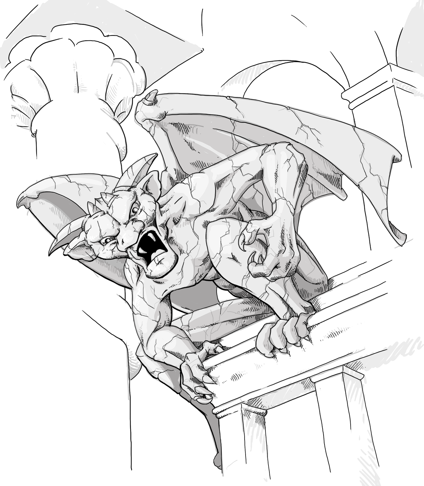

\null\vfill
\noindent
\Large
Menschen & Magie - Geheimes Wissen
\normalsize\newline
*Menschen & Magie* ist eine Hausregelsammlung für Old-School
Rollenspiele, 
kompatibel mit den Regeln von 1974, und denen davor und danach.

Text und Satz: © Wanderer Bill,
<wandererbill73@gmail.com>,\newline
Datum:
\small

Grafiken: LadyofHats, CC 0, public domain,
<https://commons.wikimedia.org/wiki/User:LadyofHats> 

Das Wanderer Bill-Logo ist © 2020 Wanderer Bill, der gesamte Text von
*Geheimes Wissen*, dem Spielleiterbuch zur *Menschen & Magie*-Reihe
steht unter der Creative Commons-Lizenz CC-BY-SA 4.0 
<http://creativecommons.org/licenses/by-sa/4.0/>

Schließlich ist *Menschen
& Magie* auch Open Source. Du findest die Quelldateien für dieses
Dokument unter <https://github.com/lskh/Menschen-und-Magie>

\clearpage

\normalsize 

\tableofcontents*

\listoftables*

\mainmatter

# Einleitung

*Geheimes Wissen* ist ein Spielleiterbuch für DIY Abenteuer Spiele!

...

Dieses Buch beschäftigt sich in seinem ersten Abschnitt auch mit der
Geschichte der Pen-and-Paper Rollenspiele, der *Gaming Archeology*.
Jedoch nicht mit dem Ziel die Historie akkurat wieder zu geben, dass
haben andere schon viel besser getan, sondern mit dem Ziel, die
einfachen Überlegungen und genialen Einfälle der ersten Gamer als
Bausteine für eigene Entwicklungen zugänglich zu machen.

## Subsysteme

Betrachtet man die verschiedensten Iterationen an Rollenspielregeln,
so fällt auf, dass es verschiedene, mehr oder weniger in sich
geschlossene Subsysteme gibt, die zusammenhängen. Zum Beispiel das
Subsystem *Schaden und Lebenspunkte*, das Subsystem *Attribute*, oder
das Subsystem *Trefferwürfel und Stufen*. Meine Idee ist, diese typischen
Regelfragemente so aufzubereiten, dass sie in eigenen
Regelvarianten modular kombiniert werden können.

## Konventionenen

Zahl+ bedeutet: "dieser Wert oder mehr", Zahl- bedeutet: "dieser Wert oder
weniger". +Zahl bedeutet: diese Zahl soll hinzu gerechnet werden,
-Zahl bedeutet: diese Zahl soll abgezogen werden.

# Charaktererschaffung I

## Attribute

Charaktere in Old-School Rollenspielen werden durch ihre Attribute
definiert.

Die klassischen sechs Attribute sind *Stärke, Intelligenz, Weisheit,
Geschicklichkeit, Konstitution* und *Charisma*. Diese Attribute können
natürlich auch anders genannt werden, und es ist auch möglich zum
Beispiel nur drei oder vielleicht auch acht oder mehr Attribute fest
zu legen. 

: Die sechs klassischen Attribute

------------------- ------------------- -------------------
 Stärke                  Intelligenz        Weisheit
 Geschicklichkeit    Konstitution        Charisma 
------------------- ------------------- -------------------

Allgemein bezeichnen Attribute Eigenschaften, *die Grundsätzlich jeder
Charakter hat*, im Gegensatz zu Fertigkeiten, Vor- oder Nachteilen, die
nur bestimmte Personen haben können. Jeder Charakter vefügt über ein
bestimmtes Maß an Geschicklichkeit, aber nur bestimmte Personen sind
im Bootsbau geübt, oder in der Anwengung von Magie ausgebildet.

Ein Beispiel für ein System mit nur drei Attributen wäre 
*Stärke, Geschicklichkeit* und *Willenskraft*. Ein System mit nur zwei
Attributen könnte alle geistigen Attribute zu *Psyche* und alle
körperlichen Attribute zu *Physis* zusammenfassen. Andere Attribute könnten
zum Beispiel *Sozialstatus*, *Bildung*, *Gesundheit* oder *Korruption*
sein, je nach dem, was in dem geplanten Spiel hervorgehoben werden
soll.

: Alternative Attribute

------------------- ------------------- -------------------
 Gesundheit          Lebenspunkte        Korruption
 Bildung             Sozialstatus        Empathie
 Gewandtheit         Fingerfertigkeit    Psyche
 Physis              Willenskraft        Körperkraft
 Geschwindigkeit     Resistenz           Glück
 Mut                 Moral               Reaktion
------------------- ------------------- -------------------

Die Qualität der Attribute wird in den allermeisten Spielen numerisch
angegeben.  Und zwar in einem Wertebereich, der durch eine bestimmte
Kombination von Würfeln voregeben wird. Weit verbreitet, und Standard
in Old-School Rollenspielen ist der Wertebereich 3-18, der mit 3W6
erzeugt wird, und der sich hervorragend eigenet um Proben mit 1W20
oder 2-4 W6 zu würfeln. Daneben ist auch der Wertebereich 2-12
wichtig, da er mit 2W6 abgedeckt werden kann - einer
Würfelkombination, die in *der ersten* Fantasy-Kampagne bis heute
verwendet wird, und auch in einigen modernen Spielen wieder eine
gewisse Renaissance erfahren hat. Den genannten Würfelkombinationen
ist gemeinsam, dass sie eine Glockenkurve erzeugen, dass heißt:
mittlere Werte sind häufiger als extreme Werte. Entsprechend werden
auch in einigen Spielen, die grundsätzlich auf dem Wertebereich 1-100
basieren, die Attribute nicht mit W% ausgewürfelt, sondern mit
3W6 $\cdot$ 5,
was eine Glockenkurve für den Wertebereich 15-90 produziert.

: Wertebereiche

---------------------------------------------------
 Wertebereich        Würfelformel 
--------------- -----------------------------------
 3-18               3W6

                    4W6, beste drei Würfel

 8-13               1W6+7

 2-12               2W6

 1-100              W%

 15-90              3W6 $\cdot$ 5

 1-6                1W6

---------------------------------------------------

Alternativ können Attribute auch verbal ausgedrückt werden (z.B.
von *schwach* über *durchschnittlich, gut, sehr gut, exzellent,* bis
hin zu *übernatürlich*), oder sie werden anhand verschiedener Größen
oder Mengen von Würfeln angegeben (W4 in Geschicklichkeit, W6 in
Stärke, W8 in Intelligenz usw, oder z.B. 2W6 in Geschicklichkeit, 3W6
Stärke oder 4W6 in Intelligenz). Letzlich geht es darum, jedes
Attribut zu qualifizieren, und ihm einen Wert zu geben, der mit einer
zufällig erzeugten Zahl verglichen werden kann. Die
Wahrscheinlichkeit, dass dabei der Attributswert und die zufällig
generierte Zahl einander gleichen, größer oder kleiner sind,
entscheiden über den Ausgang einer Probe und damit über das Geschehen
in der gespielten Geschichte.

> Ich habe Lust ein neues Spiel zu starten, ich denke an Steampunk
> Fantasy. Es braucht also auf jeden Fall Regeln für Magie, für
> Schusswaffen und auch für Fahrzeuge. Ein Luftkampf im Zeppelin
> sollte schon dabei sein. Aber erst mal zu den
> Charaktereigenschaften:
>
> Ich mag Systeme mit weniger Attributen. Vielleicht wären vier gut
> für dieses Spiel, und da verrückte Technik und Mathematik ein
> wichtiges Thema im Steampunk sind, suche ich mir folgende Attribute
> aus: Kraft (KRA), Gewandtheit (GEW), Intuition (INT) und Bildung
> (BIL). Außerdem mag ich die klassischen sechseitigen Würfel, und
> besonders klassisch finde ich 2W6. Also entscheide ich mich für den
> Wertebereich 2-12.

## Modifikatoren

Während einige Spielsysteme nur mit den Werten der Attribute
auskommen, benötigen manche Würfelmechniken Modifikatoren, die
traditionell von den Attributen abgeleitet werden. Mehr zu
Würfelmechaniken und Spielsystemen im Kapitel [Würfelproben].

Für den klassischen Zahlenbereich für Attribute von 3-18 haben sich
verschiedenen Systeme von Modifikatoren etabliert, die man sogar
den verschiedenen Entwicklungsstufen des Originalspiels zuordnen kann:

: Modifikatoren für 3W6

----------------------------------------------------------------
 Wert      Originalregeln     Old-School     (n/2 abgerundet)-5  
--------- ---------------- --------------- ---------------------
 3             -1                -3               -4

 4             -1                -2               -3
 
 5             -1                -2               -3
 
 6             -1                -1               -2
 
 7                               -1               -2
 
 8                               -1               -1
 
 9                                                -1
 
 10
 
 11
 
 12                                               +1
 
 13                              +1               +1
 
 14                              +1               +2
 
 15            +1                +1               +2
 
 16            +1                +2               +3
 
 17            +1                +2               +3
 
 18            +1                +3               +4

----------------------------------------------------------------

Je nach dem für welches System man sich hier entscheidet, werden die
Attribute und ihre Modifikatoren in ihrer Wichtigkeit mehr oder 
weniger betont.

Für den Wertebereich 2-12, also für 2W6 basierte Systeme wären zum
Beispiel folgende Modifikatoren denkbar:

: Modifikatoren für 2W6

| 2W6 | n/5 abgerundet | (n/3 abgerundet)-2 |
|:---:|:----------:|:-------------:|
| 2 |    |   -2  |
| 3 |    |   -1 |
| 4 |    |   -1 |
| 5 | +1  |  -1 |
| 6 | +1 | |
| 7 | +1 | |
| 8 | +1 |  |
| 9 | +1 |   +1 |
| 10 | +2 |  +1 |
| 11 | +2 | +1 |
| 12 | +2 | +2 |

> Für mein Steampunkspiel stelle ich mir vor, dass alle mehr Lust
> haben hoch zu würfeln. Es macht einfach mehr Spass Sechsen zu
> würfeln als Einsen. Daher braucht mein Spiel Modifikatoren mit deren
> Hilfe der Attributswert in die Proben einfließen kann. Ich
> entscheide mich für das feiner granulierte System: 2: -2, 3 bis 5:
> -1, 6 bis 8: kein Modifikator, 9 bis 11: +1, 12: +2

## Modifikatoren als Attribute

Wenn man es sich genau überlegt, braucht man eigentlich in einem Spiel
dessen Proben auf Modifikatoren beruhen gar keine Attribute. Man kann
auch einfach den entsprechenden Modifikator als Attributswert benutzen. 
Das hat auch den Vorteil, dass die Zahlen dann kleiner sind.
In solch einem Spiel könnten die Spielwerte eines Zauberkundigen zum
Beispiel so aussehen: 

> Körperkraft 0, Intelligenz +3, Magie +2

Die entsprechenden Werte könnten zur Charaktererschaffung nach einem
Punktesystem gekauft werden, in dem zum Beispiel neue Charaktere mit
20 Charakterpunkten ausgestattet werden, und jede "Stufe" eines
Attributs jeweils einen Charakterpunkt kostet.

Alternativ können auch Tabellen wie die Folgende benutzt werden um
Charaktere zufällig zu generieren.

 1W6   Körperkraft     Reflexe          Willen
----- --------------- --------------- ---------------
  1       +1            -1                +2 
  2       +1            +2                -1
  3       -1            +2                +1
  4       -1            +1                 +2
  5       +2            -1                 +1
  6       +2            +1                 -1


Attributs jeweils einen Charakterpunkt kostet.

## Fertigkeiten

Als Fertigkeiten werden in Rollenspielen allgemein Eigenschaften
Verstanden, die im Gegensatz zu Attributen, nicht unbedingt jeder
Charakter hat. Meistens sind dies Fähigkeiten oder Qualitäten, die
erlernt werden. Während zum Beispiel jeder Charakter eine mehr oder
weniger ausgeprägte Geschicklichkeit hat, können nur manche Charaktere
Gold schmieden, und nur andere wiederum sind in einer bestimmten
esoterischen Geheimlehre geschult.

: Typische Fertigkeiten

------------------- ------------------- -------------------
 Schleichen          Verstecken          Lauschen
 Fährten lesen       Rudern              Diplomatie
 Taschendiebstahl    Klettern            Fallenkunde
 Architektur         Wildnisleben        Navigation
 Kryptografie        Tiere bändigen      Pflanzenkunde
 Reiten              Boot fahren         Tauchen
 Verhandeln          Pilot               Mechanik
------------------- ------------------- -------------------

Fertigkeiten können als Modifikatoren angegeben werden, die
für eine Probe, je nach Situation,  mit einem bestimmten 
Attributswert kombiniert werden.
Zum Beispiel könnte die Fertigkeit *Klettern +2* mit dem Attribut
*Geschicklichkeit* kombiniert werden, um an einer schmalen Felskante
entlang zu klettern, oder mit dem Attribut *Stärke* wenn es darum
geht, einen Klimmzug an einem Ast zu machen, um beladen mit schwerem
Marschgepäck einen Baum hinauf zu klettern.

Eine andere Möglichkeit besteht darin, Fertigkeiten Werte aus dem
gleichen Zahlenbereich wie dem der Attribute zu geben. Entsprechend
könnte in einem 2W6 System ein Charakter *Klettern 6* und *Diplomatie
8* haben. Proben könnten dann als einfache *roll under* Würfe
ausgeführt werden^[Näheres zu Proben siehe Seite
\pageref{wuerfelproben}]. Fertigkeiten und Fertigkeitsproben werden
allgemein als Element eher modernerer Rollenspiele angesehen.

Schließlich wäre folgende, auf den ersten Blick etwas kompliziertere, aber
im Spiel einfache Methode genutzt werden: und zwar könnte man für den
Zielwert jeweils den Gegenwert des relevanten Charakterattributes
festlegen. In einem W20 basierten System würde das so
aussehen:

Fertigkeit    Attribut           Zielwert
------------- ----------------- ---------------------
Schleichen    Geschicklichkeit   20-Geschicklichkeit
              z.B. 12            z.B. 8 
Wildnisleben  Weisheit           20-Weisheit
              z.B. 13            z.B. 7
Rudern-1      Konstitution       20-Konstitution-1
              z.B. 8             Zielwert: 11

Ein Charakter mit Geschicklichkeit 12 und Fertigkeit Schleichen müsste
also eine 8 oder mehr auf W20 würfeln, um erfolgreich zu Schleichen;
und ein Charakter mit Weisheit 13 und Fertigkeite Wildnisleben müsste
entsprechend eine 7 oder mehr auf dem W20 würfeln, um einen günstigen
Lagerplatz zu finden. Der bei "Rudern" angegebene Bonus wird vom
Zielwert abgezogen, so dass der Zielwert im Endeffekt leichter wird.
Wenn man so will werden mit dieser Methode spezialisierte 
Rettungswürfe erzeugt.

Je nachdem wie das Kampfsystem aussieht, könnte es auch Kampfbezogene 
Fertigkeiten geben:

: Kampfbezogene Fertigkeiten

------------------- ------------------- -------------------
 Nahkampf            Fernkampf           Angriff
 Verteidigung        Ausweichen          Blocken
 Fechten             Schusswaffen        Kung-Fu
 Balistik            Laser               Geschütze
 Langschwert         Kurzschwert         Langbogen
------------------- ------------------- -------------------

In solch einem Spiel könnte dann der Kampf mit Proben auf
bestimmte Kampftechniken abgewickelt werden, und ein Treffer könnte
durch einen erfolgreichen Wurf auf eine defensive Fertigkeit abgewehrt
werden.

## Lebenspunkte und Trefferwürfel

Trefferpunkte, oder auch Lebenspunkte sind ein besonderes Attribut,
welches anzeigt, wieviel Schaden ein Charakter aushalten kann, bevor
er handlungsunfähig wird, oder sogar stirbt. 

Die Höhe der Trefferpunkte sollte in einem vernünftigen Verhältnis
stehen zu dem Schaden, den die in der Spielwelt übliche Standardwaffe
anrichtet, denn damit entscheidet sich, wie *tötlich* der Kampf im
Spiel ist, bzw. wie schnell ein Kampf --- möglicherweise mit
dramatischem Ende --- vorbei sein soll.

In den alten Zinnsoldaten-Spielen, die allgemein als Vorläufer der
Rollenspiele angesehen werden, genügte ein Treffer, um eine Einheit
auszuschalten. Wenn man so will hatte also jeder Zinnsoldat *einen*
Lebenspunkt, und wenn dieser vergeudet war, dann war Feierabend - für
den einen Zinnsoldaten. Aber immerhin es stand *ein Treffer* gegen
*ein Leben*. Ein Spiel, in dem jeder Spieler *einen* Zinnsoldaten mit
*einem* Lebenspunkt spielen würde, wäre ziemlich schnell vorbei und
wohl wenig erbaulich. Die Rechnung geht aber auf, wenn man nicht wie die
Zinnsoldaten-Spieler *viele* Zinnsoldaten mit jeweils *einem*
Lebenspunkte spielt, sondern *einen* Charakter mit *vielen*
Lebenspunkten.

Da es bereits zu Zeiten der Zinnsoldaten nicht unüblich war, dass
mit 1W6 gewürfelt wird, um die Anzahl an Treffern zu ermitteln, die
eine bestimmte Einheit verursachte, war also der nächste, in der Tat
recht bedeutende Schritt, dass jeder Charakter nicht nur einen
Treffer, sondern 1-6 (also 1W6) Treffer aushalten konnte. Nun stand es
also 1-6 Punkte Schaden gegen 1-6 Punkte Leben, was schon viel
spannender ist, da ein einzelner Schwerthieb den Gegner töten *kann*
aber *nicht muss*. Vermutlich wegen des ursprünglich engen
Zusammenhangs zwischen den Treffern die eine Einheit austeilen konnte,
und dem Schaden, den eben diese Einheit einstecken konnte, hat
sich in einigen Regelsystemen der etwas irreführende Begriff 
"Trefferpunkte" für das etabliert,
was man intuitiv eher *Gesundheit* oder *Lebenspunkte* nennen
würde. Tatsächlich wurde im ersten veröffentlichten Fantasy
Rollenspiel dieser Zusammenhang noch weiter betont, in dem klar
gemacht wurde, dass *die 1-6 Punkte* die durch einen W6 dargestellt werden -
seien es Schadens- oder Lebenspunkte - *einen* menschlichen Charakter
repräsentierten --- kurz: 1W6 = 1 Mensch!

: Standardregel für Trefferpunkte

------------------------------------------------------------ 
 Ein menschengroßes Wesen hat 1W6 Trefferpunkte.

 Eine Kreatur mit der Kampffähigkeit von 2 Menschen 
 entsprechend 2W6,

 ein Held der für vier Kämpft 4W6,

 usw.

------------------------------------------------------------


Entsprechend ergibt sich, dass eine Gruppe von 4 Menschen durch 4W6
repräsentiert werden können, und 8 Menschen durch 8W6, womit der
Zirkelschluss zu den Zinnsoldaten erreicht wäre. Aber es wird noch
besser, denn vier oder mehr W6 können natürlich genau so gut eine
*einzelne* Figur darstellen, die so gut kämpft und entsprechend viel
Schaden anrichtet, wie vier oder mehr Menschen. Und damit wäre der
entscheidende Schritt zum Spiel mit heroischen Charakteren und
fantastischen Monstern getan, denn nun kann der Superheld mit 8W6
Trefferpunkten - oder auch 8 *Trefferwürfeln* - gegen den gigantischen
Drachen kämpfen, der mit jedem Feuerstoß 10W6 Punkte an Schaden
anrichtet. Mehr dazu im Abschnitt über [Erfahrung und Stufen].

Alternativ, und in den neueren Editionen bekannter Fantasy
Rollenspiele inzwischen Standard, kann auch ein W8 als
Basis-Trefferwürfel benutzt werden. In solch einem System wird also
eine menschengroße Kreatur durch 1W8 dargestellt, und ein heroischer
Charakter oder ein fantastisches Monster könnte 4W8 Trefferpunkte
haben.

Aus meiner Sicht ist das Prinzip der Trefferwürfel gerade für
Old-School Rollenspiele sehr zentral. Ich würde sogar sagen, es ist
*der eine gemeinsame Regelkern*, denn sobald klar ist, wie viele
Trefferwürfel eine Kreatur hat, wird sie bereits zu einem spielbaren
Charakter. Die Angaben *Ork: 1 TW, Goblin: 1-1 TW, Kobold: 1/2 TW*
oder *Oger: 5 TW* reichen bereits aus, um diese vier verschiedenen
Monster auftreten zu lassen, solange das Regelsystem einen
Anhaltspunkte gibt wie viel Schaden ein Treffer verursacht, und wie,
gegebenenfalls in Abhängigkeit von der Anzahl der Trefferwürfel, die
Trefferwahrscheinlichkeit einer bestimmten Kreatur ist.

### Das Lebens- und Schadenspunkte-Subsystem

Das Verhältnis von potentiellem Schaden eines Angriffs und
durchschnittlichen Lebenspunkten ist sehr entscheidend für die
Gefährlichkeit von Kämpfen, und spielt damit eine zentrale Rolle für
das allgemeine Spielgefühl eines Regelsystems.

Folgende Tabelle zeigt die durchnittlichen Werte und Wertespannen
verschiedener Würfelformeln, die für die Ermittlung von Lebenspunkten
und Schaden zur Anwendung kommen:

: Wertebereiche häufiger Würfelformeln

| Würfelformel | Wertebereich | Durchschnitt |
|:------------:|:------------:|:------------:|
| 1W4          |  1-4         |   2,5        | 
| 1W6-1        |  1-5         |   2,5        |
| 1W6          |  1-6         |   3,5        |
| 1W6+1        |  2-7         |   4,5        |
| 1W8          |  1-8         |   4,5        |
| 1W6+2        |  3-8         |   5,5        |
| 1W6+3        |  4-9         |   6,5        |
| 2W6          |  2-12        |   7,0        |
| 1W6+4        |  5-10        |   7,5        |
| 2W6+1        |  3-13        |   8,0        |
| 1W6+5        |  6-11        |   8,5        |
| 2W6+2        |  4-14        |   9,0        |
| 2W6+3        |  5-15        |  10,0        |
| 3W6          |  3-18        |  10,5        |

Setzt man den Schaden einer Standardwaffe wie zum Beispiel einem
Schwert mit den durchschnittlichen Lebenspunkten eines frisch
generierten Charakters ins Verhältnis werden typische Verhältnisse
deutlich:

: Verhältnisse zwischen Waffenschaden und Lebenspunkten

| Standardlebenspunkte | Standardwaffe    | Verhältnis  |
|:--------------------:|:----------------:|:-----------:|
|       1              |      1           |    1:1      |
|      3,5 (1W6)       |      3,5 (1W6)   |    1:1      |
|      4,5  (1W8)      |      4,5 (1W8)   |    1:1      |
|      10,5 (3W6)      |  4,5 (1W6+1)     |  2,3:1      |
|      21 (3 x 2W6)    |  7,0 (2W6)       |    3:1      |
|      30              |  7,5 (1W6+4)     |    4:1      |

Für welches Verhältnis man sich hier entscheidet hängt stark davon ab,
wie sehr häufige Kämpfe gewünscht sind. Sollten Kämpfe gefährlich
sein, und daher eher vermieden werden, was sicherlich realistisch ist,
dann sollte das Verhältnis *eher klein* sein. Sind dagegen häufige
Kämpfe gewünscht, sollten diese weniger gefährlich sein, was ein eher
hohes Verhältnis von Lebens zu Schadenspunkten nahe legen würde.

### Leben ohne Trefferwürfel

Abweichend vom Prinzip der Trefferwürfel kann ein Spiel auch
Lebenspunkte als willkürlich festgelegtes Attribut vorsehen. Dieses
Attribut könnte durch eine spezielle Würfelmechanik ausgewürfelt
werden, zum Beispiel 1W20+10, was einem Wertebereich von 11 - 30
entsprechen würde, und in einem heroischen Spiel noch ganz gut zu der
Vorstellung passen könnte, dass ein Kurzschwert 1W6 Schadenspunkte
verursacht. Den Helden bliebe in diesem Spiel also fürs erste das
traurige Schicksal erspart, in den ersten fünf Spielminuten durch
einen einzelnen gegnerischen Schwerthieb aus dem Spiel
auszuscheiden. Das kann durchaus wünschenswert sein.

Setzt man den Basiswert der Lebenspunkte höher an, zum Beispiel bei 30
Punkten für einen menschlichen Charakter, sollten auch die
Schadenswerte der Waffen und Monsterangriffe entsprechend nach oben
korrigiert werden. Ein Kurzschwert könnte dann zum Beispiel immer
1W6+4 Punkten schaden verursachen, also 5 - 10 Punkte pro Angriff an
statt 1-6.

Alternativ zum eigenen Attribut können schließlich auch die schon
vorhandenen körperlichen Attribute wie *Stärke*
oder *Physis* als Wert für die Lebenspunkte angesehen werden. 
Das würde dann auch nahe legen, dass nach dem Erleiden von körperlichen 
Schaden die Proben auf körperliche Leistungen schwerer 
werden --- da sozusagen das Attribut selbst beschädigt wird.

Schließlich werden in einigen Spielen auch die Summe mehrerer
Attribute als Lebenspunkte aufgefasst, also zum Beispiel der Summe aus
*Kraft*, *Willen* und *Gewandtheit*. So könnte sich das Erleiden von
Schaden je nach Art der Verletzung mehr auf die Ausdauer, die
Präzision der Gegenangriffe oder auch die Moral auswirken.
Entsprechend wären dann wahrscheinlich auch unterschiedliche Maßnahmen
zur Heilung des erlittenen Schadens erforderlich. Erst wenn zum
Beispiel alle betroffenen Attribute auf Null reduziert sind würde der 
Charakter schließlich sterben.

### Zustände und Wundstufen

Eine weitere bewährte Möglichkeit besteht darin, nicht nur Punkte
vorzusehen, sondern eskalierende Zustände, die durch eine Folge von
Treffern verursacht werden können. So könnte ein Charakter zum
Beispiel 3 *Kratzer* und 2 *Wunden* aushalten, nach erleiden einer
Wunde vorübergegend *benommen* sein,
nach einem schweren Treffer handlungsunfähig werden, da er einen 
*Zusammenbruch* erleidet, bevor er schließlich durch einen letzten
Treffer *getötet* wird. Hier können bloße Treffer gezählt werden, es
wäre aber auch denkbar, dass zum Beispiel ein oder zwei Schadenspunkte
nur jeweils "Kratzer" verursachen, während fünf Schadenspunkte
sicherlich schon eine "Wunde" hinterlassen würden. Sind erst einmal
zwei Wunden gesetzt wird jeder weitere Treffer zu Handlungsunfähigkeit
oder gar Tod führen.

Wundstufen bieten auch die Möglichkeit, dem Spiel das ganze Grauen zu
nehmen, in dem man den Zustand "tot" einfach nicht vorsieht:

: Alternative Wundstufen für ein kinderfreundliches Spiel

----------------------------------------------------------------------
Erster Treffer           Zweiter Treffer          Dritter Treffer 
------------------------ ------------------------ --------------------
Nur ein Kratzer, war
das alles Du 
Schwächling?

                         KAWUMM! Aua!
                         sieht Sterne, für 
                         eine Runde -1 auf alle
                         Proben.

                                                   K.O., muss von den
                                                   Sanitätern weg 
                                                   getragen werden.

----------------------------------------------------------------------

Einfache Gegner könnten schon beim ersten Treffer K.O. gehen, und der
fiese Endboss, könnte vielleicht noch einen vierten Zustand haben:
*verwandelt sich in violetten Schleim, der mit ulkigem blubbern
langsam zu harmlosem Nichts verpufft*.

## Rüstungsklassen und Rüstungsschutz

### Rüstungsklasse: wie wahrscheinlich ist ein Treffer?

Der Vorteil der Rüstungsklasse liegt darin, dass in der Regel kein
Verteidigungswurf nötig wird, weil ja die Chance auf einen Treffer
integraler Bestandteil des Konzeptes RÜstungsklasse ist. Auf einen
erfolgreichen Treffer wird mit einem weiteren Würfelwurf der Schaden
ermittelt.

### Rüstungsschutz: wieviel Trefferpunkte absorbiert die Rüstung?

In diesem System wird die tatsächliche Eigenschaft der Rüstung Energie
aufzunehmen und damit den Schaden zu reduzieren akurater abgebildet.
Soll nicht jeder Angriff automatisch treffen, was auch seinen Reiz
haben kann, da es den Angriffswurf erspart, dann ist bei diesem System
ein Verteidigungswurf erforderlich.

### Rüstung als Rettungswurf: Chance auf Schutz!

Eine besondere Variante, die möglicherweise in der Blackmoor-Kampagne
zum Einsatz kam ist, den Rüstungswert als Zielwert für einen
Rettungswurf zu benutzen. Ist der Gegener mit seinem Angriff
erfolgreich (oder ist dieser automatisch erfolgreich), dann ist ein
Rettungswurf erlaubt, um den Treffer vollständig zu negieren. Und
dieser Rettungswurf wird um so leichter, je besser die Rüstung.

: Typische Rüstungswerte

| Rüstung          | 1W20 | 2W6 | 2W6 (RW) | Schadensreduktion  |
|:----------------:|:----:|:---:|:--------:|:------------------:|
| Normale Kleidung |   10 |   0 |   10     |                 0  |
| Kleid. + Schild  |   11 |   2 |   9      |                 -1 |
| Lederrüstung     |   12 |   1 |   9      |                 -1 |
| Leder. + Schild  |   13 |   3 |   8      |                 -2 |
| Kettenrüstung    |   14 |   4 |   8      |                 -2 |
| Kette. + Schild  |   15 |   5 |   6      |                 -3 |
| Plattenrüstung   |   16 |   6 |   6      |                 -3 |
| Platte. + Schild |   17 |   7 |   5      |                 -4 |

## Vor- und Nachteile

In Systemen mit Charakterpunkten können Vorteile gekauft und mit
Nachteilen verrechnet werden. In Systemen mit zufälliger
Charaktererschaffung werden häufig Charakterklassen benutzt, denen
bestimmte Vor- und Nachteile fest zugeordnet sind.

: typische Vorteile

------------------------ ------------------------ --------------------
 Dunkelsicht              Zähigkeit                Magieresistenz
 Magiebegabung            Gespür für Geheimtüren   Verbündete
 +2 auf Fernkampf         +2 gegen Riesen          perfekte Balance
 Göttlicher Segen         Adel                     +1 Trefferpunkte
------------------------ ------------------------ --------------------


: typische Nachteile

------------------------ ------------------------ --------------------
 Völlerei                 Habsucht                 Geiz
 Jähzorn                  Kampfstarre              Abhängigkeit
 Leichtsinn               Eitelkeit                Treueschwur
 -1 Trefferpunkte         einbeinig                Blindheit
------------------------ ------------------------ --------------------

## Charakterklassen

Kämpfer

Zauberkundige

Kleriker

Diebe, Spezialisten

### Beispiel für eine eigene Charakterklasse


#### Primärattribute

Weisheit + Geschicklichkeit

#### Mindestwerte

Stärke 12

Weisheit 9

Geschicklichkeit 14

#### Klassenfertigkeiten

##### Wahrnehmung

Drachenblütige haben einen besonders ausgeprägten Geruchssinn. Sie
nehmen die Anwesenheit anderer Lebewesen in geschlossenen Räumen bis zu
einer Distanz von 60' auch in völliger Dunkelheit bei 1-2/W6 beiläufig
wahr, und bei 1-4/W6 wenn sie sich konzentrieren.

Im Gelände hängt die Reichweite vom Wind ab: 100 m gegen den Wind, 1
Meile bei Windstille, 3 Meilen mit dem Wind.

Entsprechend sind Drachenblütige nur bei 1/W6 überrascht.

Außerdem können Drachenblütige riechen, ob ein Gegner Angst hat. Sie
dürfen in einem Kampf vor der ersten Kampfrunde einen Moralwurf für die
Gegner ausführen. Wird der Wurf verfehlt, "weiss" der Dracheblütige,
dass die Gegner Angst haben, und versuchen werden, dem Kampf zu
entgehen, sobald sie den ersten Schaden erleiden. Erleidet die Seite des
Drachenblütigen dennoch zuerst den größeren Schaden, gelten wieder die
normalen Moral-Regeln.

##### Qi-Punkte

Drachenblütige erhalten eine bestimmte Anzahl an Qi-Punkten pro Tag, die
sie zum Wirken von Klerikersprüchen oder zur Verbesserung ihrer
Kampfmanöver einsetzen können. Beides muss tageweise durch intensive
Meditation vorbereitet werden.

##### Klerikersprüche

Für einen Qi-Punkt kann jeweils eine Stufe an Klerikerzauber gewirkt
werden. Für 3 Qi-Punkte also z.B. 3 Stufe-1-Sprüche, 1 Stufe-3-Spruch,
oder auch 1 Stufe-2- und 1 Stufe-1-Spruch

##### Waffenloser Kampf

Drachenblütige sind hervorragende natürliche Kämpfer: sie haben
unbewaffnet zwei Angriffe 1-4/1-4 zuzüglich Geschicklichkeits- und
Stärkebonus und eingesetzten Qi-Punkten. Ansonsten bevorzugen
Drachenblütige als Waffe den selbst gefertigten Kampfstab (1W8), zu
dessen Schaden sie ebenfalls die genannten Zuschläge addieren können.

##### Odemwaffe

Drachenblütige müssen sich bei der Charaktererschaffung für eine
Odemwaffe der Drachen entscheiden. Sie können diese 1 x täglich
einsetzen: Schaden entsprechend der eigenen aktuellen TP, Reichweite und
Rettungswürfe wie bei den entsprechenden Drachen.

##### Natürliche Rüstung

Durch ihr Schuppenkleid haben Drachenblütige einen natürlichen
Rüstungsbonus +2 gegenüber Stich- und Schnittverletzungen. Sie können je
einen Qi-Punkt für 2 weitere Punkte Rüstungsbonus einsetzen.

#### Einschränkungen

-   Drachenblütige benutzen keine geschmiedeten Waffen.

-   Drachenblütige tragen keine Rüstungen.

-   Drachenblütige haben immer einen Reaktionsabzug von -2 gegenüber
    Menschen, anderen Halbmenschen und allen Humanoiden.

: Stufentabelle der Drachenblütigen

 Stufe	 Erfahrung     TP   Stufe   Erfahrung   TP
------- ----------- ------ ------- ----------- ------
 1          0         2W6     11    1.100.800    +1
 2         4.300     +1W6     12    1.376.000    +1
 3        8.600      +1W6     13    1.651.200    +1
 4        17.200     +1W6     14    1.926.400    +1
 5        34.400     +1W6     15    2.201.600    +1
 6        68.800     +1W6     16    2.476.800    +1
 7        137.600    +1W6     17    2.752.000    +1
 8        275.200    +1W6     18    3.027.200    +1
 9        550.400    +1W6     19    3.302.400    +1
 10       825.600     +1      20    3.577.600    +1


## Erfahrung und Stufen

: Eine generische Stufentabelle

 Stufe   Erfahrungspunkte   Stufe   Erfahrungspunkte  
------- ------------------ ------- ------------------
 1             0              6            32
 2             2              7            64
 3             4              8           128
 4             8              9           256
 5            16              10          512

Eine typische Variante der Verbesserung bei jedem Stufenaufstieg wäre,
die Lebenspunkte um 1W6 zu erhöhen, *ein* beliebiges Attribut, oder
eine z.B. 1W6 Attribute um jeweils einen Punkt zu erhöhen.
Fertigkeiten sollten wahrscheinlich eher in Abhängigkeit der
bewältigen Aufgaben oder der tatsächlich gesammelten Erfahrungen
erhöht werden. Man könnte auch argumentierten, dass eine Verbesserung
in akademischen Fertigkeiten mit Geld erkauft werden muss, und
vielleicht auch das Verstreichen eines gewissen Zeitraums in Anspruch
nimmt, sofern die Studien an der Universität  nicht im Detail
ausgespielt werden sollen.

Je nach System kann es sich bei den Erfahrungspunkten um den in der
Tabelle angegebenen Wert handeln, die Erfahrungspunkte lassen sich
dann gut zum Beispiel mit Charakterpunkten verrechnen, oder es handelt
sich um 100er Werte (also 200, 400, 800, 1600 usw.), oder traditionell
sehr fein gegliedert um 1.000er Werte (also 2.000, 4.000, 8.000 usw.).

### Erfahrung durch Überwundene Gegner

In den klassischen Fantasyspielen kommen häufig Kämpfe gegen "Monster"
oder andere Gegner vor. Die einfachste Möglichkeit wäre, einfach *einen
Erfahrungspunkt pro bestandenem Kampf* zu vergeben. Dann wäre
allerdings ein Kampf gegen sehr einfache Gegner genauso viel Wert wie
ein Kampf gegen eine epische Monstrosität. Das kann gewünscht sein,
oder auch nicht. Dieses System würde ohne weitere Anpassungen mit der
oben genannten "generischen" Stufentabelle funktionieren: Nach zwei
bestandenen Kämpfen würde die 2. Stufe erreicht, nach zwei weiteren
die 3. Stufe, nach 4 weiteren Kämpfen die 4. Stufe usw. Würde man aus
irgendeinem Grund die Werte pro Stufe erhöhen, zum Beispiel in
den traditionellen Tausenderstufen, müsste man die Werte entsprechend
erhöhen: 1000 Punkte pro bestandenem Kampf, unabhängig von der
Gefährlichkeit der Gegener.

In den 1974 veröffentlichten Fantasyregeln wurde Verknüpfung von
Erfahrungspunkten und überwundenen Trefferwürfeln vorgeschlagen, und
zwar sollten jeweils 100 Erfahrungspunkte pro überwundenem
Trefferwürfel vorgeschlagen:

: 1974er Erfahrungspunkte für Trefferwürfel

 TW      EP    TW    EP      TW    EP       TW    EP
----- ------- ----- ------- ----- ------- ----- -------
 1       100    7    700     13    1.300   19    1.900
 2       200    8    800     14    1.400   20    2.000
 3       300    9    900     15    1.500   21    2.100
 4       400    10   1.000   16    1.600   22    2.200
 5       500    11   1.100   17    1.700   23    2.300
 6       600    12   1.200   18    1.800   24    2.400

In späteren Editionen des Originalspiels wurde die Progression
angepasst, so dass harmlosere Gegener releativ weniger
Erfahrungspunkte einbringen, sehr mächtige jedoch verhältnismäßig
mehr. Eine exponentielle Progression (hier zum Beispiel *Stufe²
$\cdot$ 10) bildet dieses System gut ab:

: Exponentielle Erfahrungspunkte für Trefferwürfel

 TW      EP    TW    EP      TW    EP       TW    EP
----- ------- ----- ------- ----- ------- ----- -------
 1       10     7    490     13    1.690   19    3.610
 2       40     8    640     14    1.960   20    4.000
 3       90     9    810     15    2.250   21    4.410
 4       160    10   1.000   16    2.560   22    4.840
 5       250    11   1.210   17    2.890   23    5.290
 6       360    12   1.440   18    3.240   24    5.760


### Erfahrung für Gold

Ebenfalls traditionell ist das anrechnen von erbeuteten Schätzen in
Erfahrungspunkte. Die klassische Formal dafür ist: *Erfahrungspunkte =
Goldmünzen*. Das heißt, erbeutet ein Charakter 100 Goldmünzen, bekommt
er dafür 100 Erfahrungspunkte gut geschrieben. 

### Erfahrung durch gutes Rollenspiel


### Erfahrung durch erfolgreiche Proben

### Erfahrung durch Fehlschläge

### Erfahrung durch Ereignisse

Meilensteine


# Charaktererschaffung II

1. Erscheinung - hier wird alles beschrieben, was sich über den
   Charakter wahrnehmen lässt. Also natürlich 
   Aussehen, Kleidung, aber auch zum Beispiel
   Stimme, Akzent oder sogar Geruch, oder ein seltsames
   Schleifgeräusch beim Gehen. Ob der Charakter "kräftig und erfahren"
   aussieht gibt einen Hinweis auf die Spielwerte,
   wie etwa einen erhöhten Stärkewert und 2 - 3 mal so viele
   "Trefferwürfel" wie ein normaler Mensch.

2. Motivation - Was will der Charakter, und was will er nicht. Hier kann
   auch stehen, wie sich der jeweilige Charakter in die 
   Hintergrundgeschichte des Abenteuers einfügt.

3. Eigenschaften - Hier stehen Fertigkeiten, Stärken und Schwächen des
   Charakters. Wichtige Eigenschaften werden auf einer Skala von
   *schwach* über *durchschnittlich*, *gut*, *sehr gut*, *exzellent*
   bis hin zu *übernatürlich gut* angegeben. Je nach Spielsystem
   können diese Beschreibungen in geeignete Spielwerte übertragen
   werden.

4. Ressourcen - Hiermit ist alles gemeint, was der Charakter hat oder verbirgt und
   was für die Spielercharaktere von Interesse sein könnte. Also ganz
   traditionell Schätze und magische Gegenstände, aber natürlich auch
   Informationen, die für die Spielercharaktere wichtig sein könnten,
   oder gar dunkle Geheimnisse, die im Rahmen des Abenteuers gelüftet
   werden müssen.


Ein Beispiel: 

**Der alte Balduin**

Erscheinung:
:    Balduin ist ein **klappriger, alter Knacker** von dürrem, gebeugtem
     Körperbau. Von seinem Kinn sprießt ein schütterer grauer Bart,
     und seine grauen Augen sind fast immer halb geschlossen. Balduin
     murmelt ständig unverständlich vor sich hin.

Motivation:
:    Von der alten Zeit erzählen, ein deftiges Essen und ein 
     paar Getränke ausgegeben bekommen.

Eigenschaften:
:    Balduin ist **sehr gut im Glücksspiel und in Trinkwettbewerben**. 
     Er kennt ein paar kleine Zaubertricks und ist **gut im Angst
     einflößen**, in dem er seine alten Schauergeschichten erzählt.

Ressourcen:
:    Balduin ist praktisch immer pleite. Allerdings kann er zu jedem
     der unten genannten Gerüchte noch ein paar schaurig ausgestaltete
     Details beisteuern.


Und noch ein zweites Beispiel:

**Ein Söldner**

Erscheinung:
:     Aufrecht, kräftige Stimme, Helm, Harnisch und Hellebarde

Motivation:
:     Die Befehle einhalten, Recht und Ordnung, im Notfall die eigene Haut retten.

Fertigkeiten:
:     **Gute Nahkämpfer**, bessere Konstitution als die meisten
      Steintaler, allenfalls **durchschnittliche Moral**.

Ressourcen:
:     Ihre Rüstung, die Hellebarde, und ein Dolch im Stiefel, jeder
      Söldner hat eine handvoll (etwa 2W6) Silbermünzen im Beutel.

Und noch ein Goblin-Schamane:


## Ausrüstung & Geld

: Münzwert bezogen auf eine Goldmünze (GM)

-----------------------------------------------
Münzen	PM	GM	EM	SM	KM
------ ------  ----    ----    ----    ----
OD&D		1		10	50

AD&D 1	1/5	1	2	20	200

B/X	1/5	1	2	10	100

AD&D 2	1/5	1	2	10	100

3.5e	1/10	1		10	100

4e	1/100	1		10	100

5e	1/10	1	2	10	100

-----------------------------------------------

# Würfelproben

Die Würfel werden in Old School Rollenspielen etwas anderes genutzt
als in modernen Rollenspielen. Während es in letzteren typischerweise
Fertigkeiten gibt in denen ein Charakter besonders gut ist - das wird
durch eine hohe Wahrscheinlichkeit abgebildet, dass der
Fertigkeitswurf auch gelingt - ist die übliche Mechanik in Old School
Rollenspielen der Rettungswurf. Ein Rettungswurf hat typischerweise
eine geringe Erfolgswahrscheinlichkeit, denn er dient wirklich nur der
letzten Rettung, wenn alles andere schon schief gegangen ist. 

Es ist sehr wichtig, sich diesen Unterschied klar zu machen, denn wenn man
die Rettungswürfe als Fertigkeitswürfe missbraucht, werden die Spieler
nicht glücklich und beschweren sich zurecht, wie es sein kann, dass
ein ein "Dieb" nur eine Wahrscheinlichkeit von 15% haben soll, 
erfolgreich ein Schloss zu knacken. 

In Old School Rollenspielen zählt an erster Stelle die erzählerische
Darstellung, und wenn ein Spieler beschreibt, wie er sich nach
gründlicher Vorbereitung an ein kompliziertes Schloss macht, dann
sollte er - wenn nicht deutlich etwas dagegen spricht - ohne einen
Würfelwurf erfolgreich sein.

: Fausregel um fragliche Situationen zu lösen

------------------------------------------------------------------------------
Erfolgswahrscheinlichkeit       Reaktion des Spielleiters
-----------------------------   ----------------------------------------------
hoch, eine Routineaufgabe       sagt "ja", kein würfeln nötig

grenzwertig, mäßiges Risiko     sagt "ja, aber" und führt ohne 
                                Würfeln eine Komplikation ein

hohes Risiko                    fordert eine Würfelprobe

------------------------------------------------------------------------------


Um allgemein ein bestimmtes Attribut oder eine Fertigkeit 
auf die Probe zu stellen, wird deren Wert
mit einem Würfelwurf verglichen. 

: Würfelmechaniken

------------------------------------------------------------
 Bezeichnung  Würfelmechanik
------------- ----------------------------------------------
 roll low     Erfolg, wenn die gewürfelte Zahl kleiner oder
              gleich dem Zielwert ist.

 roll high    Erfolg, wenn die gewürfelte Zahl größer
              oder gleich dem Zielwert ist.

 roll high    Erfolg, wenn die gewürfelte Zahl kleiner oder
 under        gleich dem Zielwert ist, aber je höher die
              gewürfelte Zahl desto besser, genau der 
              Zielwert ist ein kritischer Erfolg

 PbtA         Je höher die gewürfelte Zahl desto besser. 
              Unter unterem cut-off: Fehlschlag,
              über oberem cut-off: voller Erfolg,
              dazwischen: Teilerfolg

------------------------------------------------------------

### *roll low*

Eine der einfachsten
Probenmechanismen wird häufig als *roll under* oder *roll low*
bezeichnet: Eine Probe ist dann erfolgreich, wenn die gewürfelte Zahl
kleiner oder gleich dem getesteten Attribut ist. Diese Methode ist
einfach und charmant, da sie nur den Würfel und den Attributswert
benötigt. 

Im Grunde lässt sich nur mit den 6 Standard-Attributen und der *roll
low* Mechanik ein komplettes Abenteuerspiel bestreiten.

: Chancen - roll low

 Wert    1W20   1W6   2W6   3W6   4W6   5W6   
------- ------ ----- ----- ----- ----- ----- 
 20      100%                     97%   78%
 19       95%                     95%   69%
 18       90%              100%   90%   60%
 17       85%              99%    84%   50%
 16       80%              98%    76%   40%
 15       75%              95%    66%   31%
 14       70%              90%    56%   22%
 13       65%              83%    44%   15%
 12       60%        100%  74%    34%   10%
 11       55%        97%   63%    24%   6%
 10       50%        92%   50%    16%   3%
 9        45%        83%   38%    10%   2%
 8        40%        72%   26%    5%    1%
 7        35%        58%   16%    3%    .3%
 6        30%  100%  42%   9%     1%    .1%
 5        25%  83%   28%   5%     .4%   .01%
 4        20%  67%   17%   2%
 3        15%  50%   8%    .5%
 2        10%  33%   3%
 1         5%  17%

### *roll high*

Bei dieser Würfelmechanik bedeutet ein Wurf höher oder gleich einem
bestimmten Wert einen Erfolg. Einfache *roll-high* Proben sind zum
Beispiel die Angriffswürfe, oder die Rettungswürfe in den klassischen
Regeln. Dabei kann der Zielwert die Rüstungsklasse eines
Gegners sein, die mit dem Würfelwurf erreicht oder überschritten werden
muss. Oder die Spielleitung legt willkürlich einen Zielwert fest,
welcher der jeweiligen Situation angemessen erscheint. Zum Beispiel:

> "um die Felsspalte zu überspringen benötigt Ihr einen Wert von 8 oder
> mehr 2W6".

Der Nachteil von *roll high* Proben ist, dass sie sich zunächst nicht
auf irgendein Attribut des Charakters beziehen. Um einen Attributswert
dennoch einfließen zu lassen, hat es sich in vielen Spielen etabliert,
von dem eigentlichen Attributswert einen Modifikator abzuleiten, der
dann dem Würfelergebnis zugeschlagen wird. Zum Beispiel:

> "um die Felsspalte zu überspringen benötigt Ihr einen Wert von 8
> oder mehr auf 2W6, Geschicklichkeit von 10 oder mehr gibt einen 
> Bonus von +1 auf den Wurf.

In einem 1W20 System entspricht dabei ein Bonus von +1 einer 5%igen
Erleichterung, ein Bonus von +2 einer 10%igen usw. Entsprechend können
die Boni in einem 1W100 System in 5% oder 10% angesetzt werden. Bei
Systemen mit mehreren Würfeln wie 2W6 oder 3W6 variiert der Effekt der 
Boni entsprechend der Glockenkurvenverteilung. 
Als Faustregel sollten Boni im 2W6 System in 1er
Schritten, und im 3W6 System in 2er Schritten angesetzt werden.

: Schwierigkeitsgrade

 Schwierigkeit   1W20      2W6      1W100   Chance
--------------- -------- -------- -------- --------
 sehr leicht                 5       18      83%
                    5                21      80%
 leicht             6                26      75%         
                             6       29      72%
                    7                31      70%
                    8                36      65%
 ungewiss           9                41      60%
                             7       43      58%
                   10                46      55%
                   11                51      50%
                   12                56      45%
                             8       60      41%
 schwer            13                61      40%
                   14                66      35%
                   15                71      30%
                             9       73      28%
 sehr schwer       16                76      25%
                   17                81      20%
                             10      84      17%
                   18                86      15%
 fast unmöglich    19                91      10%
                             11      93       8%
                   20                96       5%
                             12      98       3%
 nur mit Bonus     
 möglich           21+       13+     101+                 

Je nachdem wie häufig Boni in einem System sind, wird sich die die
Schwierigkeitsskala nach oben aufspreizen. In einem Spiel in dem 
Boni von +4 bis +6 an der Tagesordnung sind, wäre zum Beispiel 
ein Schwierigkeitsgrad von 10
*einfach*, einer von 15 *ungewiss* und ein Schwierigkeitsgrad von 20
*schwer* usw. 

In vielen Spielen werden die Zielwerte auch als *Schwierigkeitsgrad*,
kurz *SG* bezeichnet --- in Anlehnung an die Abkürzung *RK* für die 
den Begriff *Rüstungsklasse*. Legt man fest, dass der Rüstungswert
nicht den Schaden reduziert, sondern die Wahrscheinlichkeit bestimmt,
dass überhaupt Schaden angerichtet wird, ist die Rüstungsklasse
tatsächlich ja auch nichts anderes als der *Schwierigkeitsgrad*, bei
dem jeweiligen Gegener Schaden anzurichten.


### Teilerfolg

Das Spiel *Apocalypse World* von Vincent Baker führte eine besondere
2W6-Mechanik ein, die sich seit dem großer Beliebtheit erfreut: eine 6
oder weniger bedeutet: Fehlschlag, die Spielleitung entscheidet was
passiert. Eine 7-9 bedeutet: Teilerfolg, der Charakter erreicht sein
Ziel, muss aber einen Preis dafür zahlen, bzw. einen Rückschlag in
Kauf nehmen. Eine 10 oder mehr bedeutet: voller Erfolg, dem Charakter
gelingt, was er versucht hat. Diese Mechanik nenne ich der Einfachheit
halber *PtbA*. Dieses Akronym steht eigentlich für *Powered by the
Apocalypse*, also für das gesamte Spielsystem, welches *Apocalypse
World* zu Grunde liegt.

Insbesondere die Teilerfolge sind, was dieses System so populär macht,
denn sie treiben die Geschichte an. Wie erreicht der Charakter sein
Ziel *gerade so*? Welchen Preis müssen er oder seine Gefährten dafür
zahlen?

Seit dem haben viele Spielsysteme die unterschiedlichsten Mechaniken
entwickelt, die einen Wertebereich für Teilerfolge beinhalten.
Ein Beispiel ist folgende Kombination aus *Roll high under*
und *PtbA*:

### *roll high under*

Bei dieser Mechanik muss ebenfalls grundsätzlich ein Wert *kleiner
oder gleich* dem Zielwert gewürfelt werden, jedoch gilt eine Probe um
so besser bestanden, je näher die gewürfelte Zahl am Zielwert liegt.
Wenn als Beispiel eine
Geschicklichkeitsprobe gefordert ist, und der betreffende Charakter
eine Geschicklichkeit von 12 hat, dann ist jede gewürfelte Zahl von 1
bis 12 ein Erfolg, und zwar je höher desto besser: 1 wäre der
schwächste Erfolg, genau eine 12 (also der Attributswert selbst) wäre
ein kritischer Erfolg. Jede Zahl über dem Attributswert verfehlt die
Probe und eine 20 ist immer ein kritischer Misserfolg.

: Kombination aus *Roll high under* und *PtbA*-Mechanik

| 1W20 | Effekt |
|------|---------|
| 1-8 | Teilerfolg |
| 9+ | Normaler Erfolg |
| Attributswert | Kritischer Erfolg |
| > Attributswert | Fehlschlag |
| 20 | Kritischer Fehlschlag |


## Rettungswürfe

Während normale Würfelproben typischer Weise ausgeführt werden, wenn
ein Charakter aktiv versucht, etwas zu erreichen, kommen Rettungswürfe
eher dann zum tragen, wenn ein Charakter passiv oder zumindestens
unfreiwillig einer Gefahr ausgesetzt wird. Rettungswürfe sind - wie
die Bezeichnung schon suggeriert - oft die letzte Chance unbeschadet
davon zu kommen. Entsprechend sind die Wahrscheinlichkeiten auf einen
erfolgreichen Rettungswurf meistens schlechter als die einer normalen
Würfelprobe - zum Beispiel in der Größenordnung von 25%.

In den klassischen Old-School-Regeln werden Rettungswürfe als *roll
high* Probe mit 1W20 gewürfelt. Als Ausgangswert kann man sich an der
15 orientieren, was einer 25%igen Erfolgswahrscheinlichkeit
entspricht. In einem 2W6-System würde das einem Wurf von 9+
entsprechen.

: Beispielhafte Rettungswurfkategorien

------------------------ ------------------------ --------------------
 Todesstrahlen             Gift                     Zauberstäbe
 Lähmung                   Versteinerung           Drachenfeuer
 Zaubersprüche             Verzauberung            Geschicklichkeit
 Konstitution              Flächeneffekte          Beeinflussung
 Tod                       Strahlung               Reflex
 physisch                  mental                  spirituell
 Willen                    Physis                  Zähigkeit
------------------------ ------------------------ --------------------

Ein besonderer Rettungswurf wäre der Rettungswurf gegen die
Rüstungsklasse. Eine Mechanik, die möglicherweise in Dave Arnesons
*Blackmoor*-Kampagne zur Anwendung kam.

## Reaktionswürfe

Reaktionswürfe sind ein typisches Spielelement von Old-School
Regelsystemen. Anhand eines Würfelwurfes wird dabei entschieden, wie
sich ein Nicht-Spielercharakter (NSC) verhält. Bei diesen NSC kann es
sich um Gegener handeln, aber auch um Verbündete oder untergeordnete
Begleiter der Spielercharaktere. Meistens werden Reaktionswürfe mit
mehreren Würfeln gewürfelt, um eine Wahrscheinlichkeitsverteilung mit
Glockenkurve zu erhalten. Ungewisse Reaktionen mit mittleren Werten
sind häufiger als extreme Reaktionen. Der Klassische Wurd erfolgt mit
2W6 - vielleicht der ältesten Würfelmechanik in diesem Genre.

: Reaktionswürfe

-----------------------------------------------------------
 1W%       2W6       3W6    Reaktion
------- --------- --------- -------------------------------
 1-3        2       3-4     katastrophal, 
                            sofortiger Angriff,
                            massive Ablehnung
                            Panikreaktion

 4-28      3-5      5-8     schlecht, feindseelig, skeptisch,
                            ängstlich
            
 29-72     6-8      9-12    mittelwertig, unklar, unentschieden

 73-97     9-11     13-16   gut, freundlich, hilfsbereit, mutig

 98-100     12      17-18   best möglich, enthusiastisch, 
                            dienstverpflichtet, 
                            unerschrocken

-----------------------------------------------------------


## Situationswürfe

Mit Situationswürfen ist etwas ähnliches gemeint wie mit
*Reaktionswürfen*. Man könnte auch sagen, dass Situationswürfe eine
Verallgemeinerung der Reaktionswürfe sind.
Der Schwierigkeitsgrad einer Situation wird schlicht ausgewürfelt, an
statt dass die Spielleitung ihn willkührlich festlegt. Grundsätzlich sind
für Situationswürfe Würfelkombinationen wie 2W6 oder 3W6, die eine
Glockenkurve ergeben, besser geeignet, da mittlere Werte dann
wesentlich häufiger sind als sehr niedrige oder sehr hohe.

> Ein kleiner Roboter versucht sich unbemerkt in das Computernetz
> einer gewaltigen mörderischen Raumstation einzuhacken.
>
> Die Spielleiterin hat keine Ahnung wie schwer dieser Versuch sein
> könnte. Immerhin handelt es sich um völlig fremdartige
> Alien-Technologie, und welcher normalsterbliche menschliche
> Spielleiter weiß schon, was so ein Androide alles kann. Also
> entscheidet sie sich für einen Situationswurf mit 3W6,
> der eine 10 ergibt - das Computernetzwerk scheint für unseren kleinen
> Roboter kein all zu großes Hindernis zu sein.
>
> Der Spieler des Robters würfelt 1W20 und darf wegen seiner
> speziellen Fähigkeiten auch noch einen Bonus
> von +3 hinzuzählen. Leider würfelt er eine 6. 
> Er kann sich zwar verbinden, bemerkt aber sofort, wie ein
> Sicherheitsalgoritmus seine Signatur registriert ... verdammt, er
> ist erwischt worden.

Benutzt man für den Situationswurf die gleichen Würfel wie für die
eigentliche Probe ergeben sich ausgewogene opponierende Würfe. Zum
Beispiel 2W6 versus 2W6, oder 3W6 versus 3W6.

Eine sehr einfache Mechanik für Erzählrollenspiele mit opponierenden
Würfen geht so: 

: Opponierte 2W6 Proben

------------------- --- ---------------------------
 Du würfelst hoch    =   Du erzählst was passiert
 ich würfel hoch     =   ich erzähle was passiert
 fast Gleichstand    =    wir verhandeln
------------------- --- ---------------------------

Besondere Fähigkeiten, Vorteile oder Nachteile können als 
Bonus von +1 bis +2, oder als entsprechende Abzüge 
berücksichtigt werden.

## Modifikatorwürfe

Eine weitere Würfelmechanik kommt in einigen Spielen vor, die ich hier
"Modifikatorwurf" nenne, da sie einen Wertebereich abdeckt, der
typischerweise symmetrisch und glockenkurvenartig um Null variiert,
und dessen Wertebereich große Ähnlichkeit zu den typischen
Modifikatoren hat.

: Modifikatorwürfe

 Würfel     Wertebereich
--------- ----------------
 W6-W6      -5 bis +5 
 4WF        -4 bis +4
 W4-W4      -3 bis +3
 2WF        -2 bis +2

In der Regel werden zwei verschiedenfarbige Würfel der gleichen
Größe geworfen. Einer der Würfel wird dabei positiv gewertet und der
andere negativ. Anders gesagt wird der Wert des *negativen Würfels*
von dem des *positiven* Würfels abgezogen. Eine besondere Mechanik,
die zu ähnlichen Werten führt ist das werfen von 4 *Fudge*-Würfeln,
auch bekannt als *Fate*-Würfel (in der oben stehenden Tabelle als WF
angegeben). Dabei handelt es sich um sechsseitige
Würfel, bei denen jeweils zwei Seiten leer sind, zwei Seiten mit einem
"+" markiert sind, und zwei Seiten mit einem "-". 

Modifikatorwürfe können als Situationswürfe eingesetzt werden um eine
Erleichterung oder Erschwernis in einer bestimmten Situation zufällig
zu bestimmen. Eine andere Einsatzmöglichkeit wäre das direkte
Auswürfeln von Modifikatorwerten, die als Attributswerte eingesetzt
werden sollen (siehe dazu auch [Modifikatoren als Attribute]). 

## Schicksalswürfe

Schicksalswürfe sind vielleicht die simpelste Mechanik die man sich
vorstellen kann. Eine einfache Variante wäre "gerade ist gut". Dazu
kann ein beliebieger Würfel geworden werden und jedes gerade Ergebnis
ist "gut" für die Spielercharaktere --- zeigt also eine günstige
Wendung im Handlungsverlauf an --- und jedes ungerade Ergebnis zeigt
ein ungünstiges Ergebnis für die Spielercharaktere an. 

Schicksalswürfe können aber auch noch weiter ausgestaltet werden. Zum
Beispiel könnte eine Situation um so günstiger sein, je höher der
gewürfelte Wert auf einem W6.

 1d6     Effekt
-------- ------------------------------------------------
 1       Begegnung mit einem "wandernden Monster"
 2       Hinweis auf ein wanderndes Monster
 3-4     kein besonderes Ereignis
 5       Ein hilfreicher Hinweis
 6       Ein hilfreicher Hinweis und ein paar Goldmünzen


Eine andere Verteilung könnte so aussehen:

 1d6     Effekt
-------- ------------------------------------------------
 1       Fehlschlag / ernsthafte Konsequenz
 2-3     Teilerfolg / nachteilige Konsequenz
 4-5     Teilerfolg
 6       Erfolg / glückliche Fügung


Tatsächlich sind Würfe um die Initiative im Kampf, oder Würfe um zu
klären ob eine Gruppe von Charakteren von einer Situation überrascht
wird Schicksalswürfe. 

: Tod und Verstümmelung

--------------------------------------------------------------------
 2W6   Resultat
------ -------------------------------------------------------------
 2     **Sofortiger Tod**: Kopf abgeschlagen oder ähnliches; das
       Opfer kann auch durch Magie nicht wieder zum Leben 
       erweckt werden.

 3     **Fatale Wunde und Tod**: in 1d6 Runden: Lungendurchstich,
       Wirbelsäulenbruch oder ähnliches; das Opfer kann durch 
       Magie wiederbelebt werden .

 4     **Verlust eines Gliedes und Tod**: in 3W6 Runden; W4:
       1 -- Schwertarm, 2 -- Schildarm, 3, 4 -- Bein; 
       der Tod kann mit Kauterisierung durch Feuer oder einem 
       Tourniquet verhindert werden; bei der Verwendung von 
       Magie bleibt das Glied verloren.

 5     **Schmerzlicher Verlust**: 1 -- Nase, 2 -- Auge, 3 -- Ohr, 
       4 -- Finger, 5 -- 1W6 Zähne, 6 -- nur eine Fleischwunde, 
       aber es bleibt eine fette Narbe; bei der Verwendung von 
       Magie bleibt der Verlust bestehen.

 6     **Knochenbruch**: 1 -- Schwertarm, 2 -- Schildarm, 3 -- Bein, 
       4 -- Rippe; Heilung dauert 2W4+9 Wochen; bei der Verwendung von
       Magie bleibt das Glied gebrochen.

7, 8   **Ohnmächtig**: wehrlos für 2W6 Runden; mit Helm nur eine
       Runde lang betäubt.

9      **Betäubt**: wehrlos für eine Runde; mit Helm wird man einfach
       nur niedergeschlagen (weitere Feinde erhalten +4).

10     **Niedergeschlagen**: kann sich in der nächsten Runde entweder 
       bewegen oder angreifen aber nicht beides.

11     **Knapp dem Tod entkommen!**

12     **Adrenalinschub!** Für jede zwei Stufen (aufgerundet) erhält
       man 1W4 Punkte Lebensenergie; nach dem Kampf verliert man 
       allerdings alle Lebensenergie und fällt für 2W6 Runden in 
       Ohnmacht.

--------------------------------------------------------------------


## Zahlenbereiche

: Dice to Roll for Number Ranges

------------------------------------------------------------
Number    Four    Six     Eight    Ten      Twelve    Twenty 
of Dice   Sided   Sided   Sided    Sided    Sided     Sided 
-------- ------- ------ -------- -------- ---------  ------- 
1          1-4     1-6     1-8     1-10      1-12     1-20 

1+1        2-5     2-7     2-9     2-11      2-13     2-21 

1+2        3-6     3-8     3-10    3-12      3-14     3-22 

2          2-8    2-12     2-16    2-20      2-24     2-40 

2+1        3-9    3-13     3-17    3-21      3-25     3-41 

3         3-12    3-18     3-24    3-30      3-36     3-60

------------------------------------------------------------


## Angriffswürfe

: Generische W20 Angriffstabelle

 Stufe   9 [10]   8 [11]   7 [12]   6 [13]   5 [14]   4 [15]   3 [16]   2 [17]
------- -------- -------- -------- -------- -------- -------- -------- --------
   1       10       11       12       13       14      15        16       17  
   2        9       10       11       12       13      14        15       16
   3        8        9       10       11       12      13        14       15
   4        7        8        9       10       11      12        13       14
   5        6        7        8        9       10      11        12       13
   6        5        6        7        8        9      10        11       12
   7        4        5        6        7        8       9        10       11
   8        3        4        5        6        7       8         9       10
   9        2        3        4        5        6       7         8        9
  10        1        2        3        4        5       6         7        8
  11        1        1        2        3        4       5         6        7
  12        1        1        1        2        3       4         5        6
  13        1        1        1        1        2       3         4        5
  14        1        1        1        1        1       2         3        4
  15        1        1        1        1        1       1         2        3
  16        1        1        1        1        1       1         1        2
  17        1        1        1        1        1       1         1        1


### Angriffsbonus und ThacO

ThacO \index{ThacO} ist ein Akronym für ``to hit armor class zero''. 
ThacO bezieht sich
auf die absteigende Rüstungsklasse und kann benutzt werden, um den
erforderlichen Wurf für einen Treffer zu berechnen:

Trefferwurf = ThacO - RK

Entsprechend trifft ein Kämpfer mit ThacO 19 einen Kontrahenten in
Kettenhemd, also mit Rüstungsklasse 5 auf einen Wurf von 14.

Der Angriffsbonus (AB) oder Grundangriffsbonus (GAB) ist das
Gegenstück der ThacO für aufsteigende Rüstungsklassen.

Trefferwurf = RK - AB

Um mit den klassischen TSR Editionen, aber auch Swords &
Wizardry, der 5. Edition, so weit wie möglich kompatibel zu sein,
entspricht ein AB von 0 einer Thac0 von 19, und wie o.g.
entspricht die absteigende Rüstungsklasse 9 der aufsteigenden
Rüstungsklasse 10.


# Story-Telling

## Gemeinsames Worldbuilding

## Handlungsfragen

## Szenen aufstellen

## Fokus und Abstraktion

Würfelprobe in einem traditionellen Rollenspiel kann eine einzelne
Aktion darstellen, vielleicht einen Schwerthieb, den Versuch ein
Schloss zu knacken, oder vielleicht auch der Versuch jemanden durch
ein kurzes Gespräch zu überzeugen.

Es ist aber auch möglich durch einen Wurf auf z.B. "Recherchieren" die
tagelange Suche durch eine Bibliothek darzustellen. Ein klassischer
Erfolgswurf wird da eher langweilig sein, da er nur entscheiden kann
ob die gewünschte Information gefunden wird. Ein abgestufter
Erfolgswurf mit Teilerfolg, oder ein Schicksalswurf kann aber neue
Aspekte aufbringen. Ein Teilerfolg könnte bedeuten, dass man zwar
erfährt, dass es die Information in der Bibliothek gibt, sie aber aus
irgend einem Grund unter Verschluss gehalten wird. 

## Schicksalspunkte

Charaktere können zum Beispiel mit 3 Schicksalspunkten pro Runde
starten.

: Mögliche Einsätze für Schicksalspunkte

-----------------------------------------------------------------
Einsatz             Effekt
------------------- ---------------------------------------------
 Dem Tod entgehen   Anstatt  zu Sterben stabilisiert sich der 
                    Charakter bei 1 Lebenspunkt

 Probe wiederholen  Der Spieler darf einfach nochmal würfeln.

 Bonus bekommen     Je nach System ist der Punkt einen Bonus von 
                    z.B. +2 oder 10% wert.

 Detail hinzufügen  Der Spieler darf den Schicksalspunkt ausgeben
                    um zu einer Szene ein Detail hinzu zu fügen.

 Gegnerische        Die Probe eines Gegnerst um -2 oder -10% 
 Probe erschweren   oder entsprechend erschweren.
-----------------------------------------------------------------

Schicksalspunkte können gewonnen werden, in dem zum Beispiel eine
Komplikation zu lasten eines Charakters in Kauf genommen wird, als
besondere Belohnung für gutes Rollenspiel, oder im Tausch gegen
Erfahrungspunkte.

## Plotpunkte

Für bestimmte Ereignisse können Plotpunkte vergeben werden.
Die Menge der angesammelten Plotpunkte zeigt an, wie weit die
Charaktere bei der Erforschung eines Geheimnis, oder der Lösung eines
Problems fortgeschritten sind. Eine einfache Strichliste ist häufig
alles, was gebraucht wird.

## Belastende Attribute

Die im Abschnitt zur Charaktererschaffung genannten Attribute sind in
der Regel "positive" Attribute. Je höher die Zahl des Attributs, desto
"besser" für den Charakter. Eine hohe Geschicklichkeit zu haben, ist
zum Beispiel in aller Regel besser, als eine niedrige.

Geht es aber in einer Geschichte gerade darum, tragischen Niedergang,
oder das näher kommen der Apokalypse zu beschreiben, können Attribute
sinnvoll sein, die um so belastender oder auch "negativer" sind, je
höher die Zahl ist. Solche Attribute machen besonders viel Sinn, wenn
sei veränderlich sind (siehe nächster Abschnitt), und ggf. auch mit
einem oberen Limit begrenzt sind. Ein Charakter, dessen *Wahnsinn* den
Wert 10 erreicht, könnte so verrückt geworden sein, dass er aus dem
Spiel ausscheidet, oder nur noch als Nicht-Spielercharakter existiert.

: Belastende Attribute

----------------- ----------------- -------------------
 Verfall           Belastung         Pflichten
 Korruption        Wahnsinn          Dunkelheit
----------------- ----------------- -------------------

Andererseits können solche belastenden Attribute wiederum mit
besonderen Fähigkeiten verknüpft sein. Vielleicht muss man sich die
Fähigkeit Magie zu wirken mit Korruption erkaufen. Erst wenn diese
einen Wert von z.B. 3 oder mehr hat, ist man überhaupt in der Lage
Zauber zu wirken. Oder es könnte sein, dass man Feenwesen erst mit
einem gewissen Wert in *Verfall* überhaupt wahrnehmen kann. Steigt der
Wert weiter an, kann man sie sehen, und mit ihnen Kommunizieren.
Steigt der Wert in *Verfall* aber zu hoch, wird man in die Feenwelt
aufgenommen und assimiliert ... und es führt kein Weg zurück. 

Auf diesem Weg können negative Attribute viel impliziertes Setting
kommunizieren und Antrieb und Motivation für Handlungsstränge liefern.

## Dynamische Attribute

Es kann spannend sein, für bestimmte Dinge um die es in einem Spiel
gehen kann Attribute einzuführen, die sich je nach Verlauf der
Ereignisse im Spiel verändern. Gute Beispiele wären *Wahnsinn*,
*Trauma* oder ähnliches. Oder auch *Vertrauen* oder *Rückhalt*
... In gewisser Weise ist auch die Stufe eines klassischen Fantasy
Charakters ein dynamisches Attribut. Und ein besonders traumatisches
Erreignis in klassischer Old-School Fantasy ist ja auch, wenn ein
Charakter eine Stufe "Lebensenergie" verliert. 

## Verbindungen und Überzeugungen

: Beispiele für Verbindungen

--------------------------------------------------------------
Beowulf war immer mein Vorbild, ich verdanke ihm viel!
Eines Tages werde ich es Kassandra heimzahlen!
Ludwig kann viel von mir lernen!
Solveig hat nicht nur mein Herz gestohlen!
--------------------------------------------------------------

Wann immer eine Verbindung rollenspielerisch eingesetzt wird, kann
dies mit besonderen Erfahrungspunkten, oder auch Schicksalspunkten
belohnt werden. Wenn eine Verbindung aufgelöst oder geklärt wird,
könnte dies einen Meilenstein in der Charakterentwicklung markieren.

## Aspekte

Aspekte spielen im *Fate System* eine zentrale Rolle. Bei Aspekten
kann es sich um Vor- oder Nachteile, Verbindungen oder Überzeugungen
handeln. Aspekte können Erzählrecht begründen, wenn es zum Beispiel
darum geht ob ein Charakter eine bestimmte Begabung hat, oder nicht.

Aspekte können auch einfach begründen, dass bestimmte Würfelproben mit
einem Bonus oder mit *Vorteil* gewürfelt werden dürfen. Ein Beruf oder
eine kulturelle Zugehörigkeit könnte zum Beispiel solch ein Aspekt
sein.

# Antagonisten

: 36 Antagonisten

 W66                             
----- -----------------------------------------------------------
 11   ein Anti-Kleriker
 12   ein Nekromant
 13   die Herrin der Drachen
 14   der König der Unterwelt
 15   Die Kabale der östlichen Zauberwirker
 16   Die Verschwörung aus dem Osten
 21   Die Rächer des Westens
 22   Die Eisbarbaren
 23   Die Hexenmeister der dampfenden Dschungel
 24   Die wilden Horden
 25   Morlocks aus der Unterwelt
 26   Eroberer aus einer fernen Welt
 31   Eindringlinge von einer fremden Ebene
 32   Die sieben Dämonen
 33   Der Geheimbund der Seelenfischer
 34   Aliens from outer space
 35   Die wahren Alten aus der Tiefe
 36   ein ungewöhnlich intelligentes Monster
 41   der Kaiser selbst
 42   das Imperium
 43   der König
 44   der Bruder / die Schwester des Königs
 45   das Handelshaus der Worschecks
 46   die Nation, die schon immer unser Erzfeind war
 51   Orkbanden aus den Bergen
 52   Riesen aus dem eisigen Norden
 53   Die Reformer von Raal
 54   Die Bewahrer von Zerkant
 55   eine Halbgöttin, oder ein Halbgott
 56   ein Teufel aus den flammenden Höllen
 61   eine wahre Gottheit
 62   ein gefallene Gottheit
 63   Die Gilde der Glückshändler
 64   Die Ghule der Dunkelheit
 65   Seltsame Geistwesen aus dem grünen Licht
 66   Das Nichts


: 36 Motive für Antagonisten

 W66  Motiv                           
----- -----------------------------------------------------------
 11   Die Weltherrschaft erlangen
 12   Alleinige Macht über die Magie der Welt erlangen 
 13   Die Welt zerstören
 14   Das Volk ... zerstören
 15   Die Ungläubigen strafen
 16   Rache üben
 21   Den Kampf der Gerechtigkeit führen  
 22   Die Wahrheit ans Licht bringen
 23   Ein Geheimnis hüten
 24   Freiheit erlangen
 25   Schätze anhäufen, die/der reichste ... der Welt werden.
 26   Das Land erobern
 31   Fressen
 32   Sich Fortpflanzen
 33   Unsterblich werden
 34   Zur Gottheit aszendieren
 35   Die Götter strafen
 36   Herr der Dämonen werden
 41   Das Geheimnis der Zeitreise lüften
 42   Die Vergangenheit manipulieren
 43   Die Zukunft manipulieren
 44   Das Gefüge der Welt neu ordnen
 45   Das Chaos ausbreiten
 46   Die Rechtschaffenheit ausbreiten
 51   Die Drachen von *Bengress* wecken
 52   Diener des Einen werden
 53   Den Einen erwecken
 54   Eins werden mit der Singularität
 55   Den Übergang in die Ebenen schaffen
 56   Das Portal finden
 61   Das Portal öffnen
 62   Den Weltenberg spalten
 63   Den Stein der Weisen finden
 64   Den Eckstein der Welt entdecken
 65   An das Ende der Zeit reisen
 66   die Unendlichkeit sehen

Mit diesen beiden Tabellen lassen sich 1.296 Konstellationen aus
möglichen Antagonisten und deren Motiven erzeugen. 

Zum Beispiel habe ich auf der ersten Tabelle eine 1 und 5 gewürfelt:
*Die Kabale der östlichen Zauberwirker*, und auf der zweiten Tabelle
eine 2 und 4: *Freiheit erlangen*. Es sieht also ganz danach aus, als
sei die Kabale der östlichen Zauberwirker eine unterdrückte
Organisation, vielleicht hatte sie mal Macht, vielleicht ruhen die
Geheimnisse der Kabale in irgendwelchen alten Höhlen, aber sie sind
zur Zeit nicht zugänglich.  Daraus ergeben sich schon ein paar
Abenteuerideen. Mitglieder der Kabale könnten die Charaktere für
Kurierdienste anheuern um untereinander geheim zu kommunizieren, oder
sie könnten die Abenteurer beauftragen Zutaten für ein magisches
Ritual zu beschaffen, mit der die Kabale zum alten Glanz zurück finden
könnte. Auch politische Motive wären denkbar. Vielleicht versucht die
Kabale Regierungskreise zu infiltrieren um endlich frei zu kommen, und
nutzt dazu die Dienste der Spielercharaktere. Wenn deutlich wird,
wofür die Kabale wirklich steht, könnte dies die Charaktere in
schwierige moralische Konflikte stürzen.

Vielleicht sind der oder die jenigen, welche die Kabale unterdrücken
aber auch noch viel schlimmer als die Kabale selbst. Um heraus zu
finden, wer das sein könnte, würfele ich noch einmal auf der
Antagonistentabelle: 3 und 5, also *die wahren Alten aus der Tiefe*.
Na wenn das kein Stoff für eine Kampagne ist. Je weiter der Plan der
Kabale fortschreitet, und je mehr sich die Charaktere
instrumentalisieren lassen, desto offensichtlicher geraten sie in
Konflikt mit den unheimlichsten Kreaturen, von denen die Menschheit
nie etwas hätte wissen dürfen.

## Monster und Antagonisten entwerfen

TODO: Tabellen und Regeln zur Monsterentwicklung

## Beispielmonster

1. **Androids**, 1-8 (3-18), AC 9, Move 12, HD 2, Lair nearby 15%,
   Treasure A2, Alignment Any

2. **Ants, giant**, 2-12 (20-240), AC 3, Move 18/3, HD 2, Lair nearby
   10%, Treasure C, Alignment Neutral

   Riesenameisen sind zäh und anpassungsfähig.  Arbeiterameisen sind
   etwa 6 Fuß lang, die Königin aber kann eine kolossale Größe
   erreichen. Riesenameisen sind Allesfresser und fressen tatsächlich
   nahezu alles. Sie werd en sich niemals zurückziehen, wenn sie ihren
   Bau verteidigen.  Normalerweise haben Riesenameisen nur eine kleine
   Menge

3. **Apes**, 1-8 (n/a), AC 6, Move 12/12, HD 4+1, Lair nearby n/a,
   Treasure n/a, Alignment Neutral

4. **Basilisks**, 1-6 (1-6), AC 4, Move 6, HD 6+1, Lair nearby 40%,
   Treasure F, Alignment Chaos / Neutral

# Schätze

## Schätze entwickeln

TODO: Tabellen um Schätze und magische Gegenstände zu entwickeln

## Beispielschätze

# Szenarios, Aufhänger, Abenteuer und die Welt

: 36 Szenario-Aufhänger

 W66                             
----- -----------------------------------------------------------
 11   einen Mord aufklären  
 12   ein Artefakt finden
 13   eine Gefangene/einen Gefangenen befreien
 14   eine Karawane begleiten
 15   einen mystischen Ort aufspüren
 16   einen unbekannten Ort untersuchen
 21   eine Botschaft überbringen
 22   eine Ware überbringen
 23   einen Raub vereiteln
 24   einen Raub ausführen
 25   die See bereisen
 26   eine Schatz finden
 31   Zutaten für ein magisches Ritual beschaffen
 32   Schmuggler aufdecken
 33   Verbotene Ware schmuggeln
 34   ein seltenes Tier erbeuten
 35   ein Monster erbeuten
 36   ein Portal finden 
 41   den Mahlstrom entdecken
 42   einen Schatz zurück bringen
 43   
 44
 45
 46
 51
 52
 53
 54
 55
 56
 61
 62
 63
 64
 65
 66


: 36 Auftraggeber

 W66                             
----- -----------------------------------------------------------
 11   ein einsamer Wanderer
 12   die Königin selbst
 13   ein Magier   
 14   eine erblindete Kriegerin
 15   der Herr der Silberdrachen
 16   das magische Schwert des alten Hexenmeisters
 21   ein Händler
 22   der Tavernenwirt
 23   eine Magt
 24   ein Stallbursche
 25   der Bürgermeister
 26   der Dorfschulze
 31   der alte Mann mit der Augenklappe
 32   ein sprechender Papagei
 33   der alte Mann mit dem Holzbein
 34   ein sterbender Bote des Fürsten
 35   die weise Kräuterfrau
 36   der Dorfälteste
 41   die Vision eines Monsters
 42   die Vision einer Gottheit
 43   die Vision eines Dämons
 44   ein winziger Gnom, der Euch ins Ohr flüstert
 45   ein sprechender Rabe
 46   der Dorfpriester
 51   der Bischoff von Westfurt
 52   die Weisen von Aung
 53   ein alter Abenteurer, der drei Tage mit Euch gereist ist
 54   der Hauptmann der Stadtwache
 55   der Geist eines Verstorbenen
 56   eine Traumgestalt
 61   ein Flammenwesen, welches im Feuer erscheint
 62   der alte Meister
 63   die eigenen Eltern
 64   der Bruder der 5 Jahre lang verschollen war
 65   die Schwester die den Baron geheiratet hatte
 66   ein mutiges Mädchen mit einer Steinschleuder


: 36 abenteuerliche Situationen

 W66                             
----- -----------------------------------------------------------
 11   "Ihr habt den Pass gerade noch bei Tageslicht hinter Euch 
      gebracht, als ..."
 12   "Ihr sitzt in der Sonne am Ladekai des kleinen Hafens 
      als ..."
 13   "Tagsüber konntet Ihr Euer Ziel schon in der Ferne sehen,
      doch dann zog Nebel auf, und jetzt wird es auch noch dunkel
      ..."
 14   "Seit Tagen seit Ihr schon in diesen Sümpfen unterwegs als
      ihr plötzlich beginnt im moorigen Boden zu versinken ..."
 15   "Die Furt vor Euch führt zu viel Wasser, mitten im Fluss
      droht ein Fuhrwerk zu versinken. Als die Verunglückten Euch
      bemerken, rufen sie und flehen um Eure Hilfe ..."
 16   "Nach einer Pause im Dorfkrug seit ihre gerade dabei die
      kleine Ortschaft zu verlassen, als Ihr bemerkt, dass Ihr
      verfolgt werdet ... "
 21   "Weit und mühsam war der Weg hierher, doch jetzt steht ihr
      direkt davor: Am Eingang zu den sagenumwobenen Höhlen ...
      worauf wartet Ihr noch?"
 22   "Die rote Sonne nähert sich langsam dem Horizont und taucht
      das Land in violettes Abendlicht. Als Ihr beim Blick ins
      Lagerfeuer in Gedanken versunken seit, ist da plötzlich
      eine Stimme ..."
 23   "Der Markt wimmelt vor Händlern, Schaustellern und Gesinde.
      Es riecht nach Feuer, Eisen, Schweiß, und geröstetem
      Fleisch.  Während Ihr Euch umschaut, bemerkt Ihr, dass Euch
      einer der Händler aus dem Schatten seines großen Zeltes mit
      bestimmter Geste zu Euch heran winkt ..."
 24   "Völlig außer Atem, und im letzten Moment entdeckt Ihr eine
      Stelle in der Böschung in der Ihr Euch und Eure Reittiere
      verstecken könnt. Eure Verfolger scheinen getäuscht. Sie
      suchen noch eine Weile weiter unten am Hang nach Euch, dann
      geben Sie auf. Vor wem seit Ihr auf der Flucht? Warum? Was
      ist Euer Ziel?  ..."
 25   "Neben einigen anderen Reisenden habt Ihr Euer Lager
      außerhalb der Ortschaft aufgeschlagen. Plötzlich bemerkt
      Ihr eine Person mit langem Umhang und Kapuze, die sich dem
      Lager nähert. Die anderen Reisenden scheinen nervös, und
      suchen Ihre Waffen zusammen ..."
 26   "Die Sonne neigt sich dem Horizont zu und die silbernen
      Hörner der Wächter ertönen. Es ist Zeit in den sicheren
      Schutz der Siedlung zurück zu kehren. Am Tor werdet Ihr
      jedoch von einem Beamten aufgehalten ..."
 31  
 32  
 33  
 34  
 35  
 36  
 41
 42
 43
 44
 45
 46
 51
 52
 53
 54
 55
 56
 61
 62
 63
 64
 65
 66   You all meet in a tavern 


## Dungeons

### Karten und Level

### Dungeon Stocking

2d6  | Room
-----|---------
1-10 | Empty
11-  | Creatures
14-1 | Creatures with Treasure
17   | Trap
18   | Trap with Treasure
19   | Something Weird
20   | Unguarded Treasure


### Fallen

: 2d6 Fallen


### One-Page Dungeon

TODO: Kopiervorlage One-Page-Dungeon

### Five-Room Dungeon

### Megadungeons

TODO: Beispielskizze vertikale Dungeonkarte

### Ein Deskriptiver Dungeongenerator

#### Liste 1
Der Eingang ... (würfel 1W6)

1. ... ist eine unscheinbare natürliche Höhle, die verdeckt von dichtem
   Gestrüpp kaum zu erkennen ist.

2. ... ist ein uraltes gemauertes Portal aus grob gehauenen grauen
   Steinquadern. Vom Eckstein herab schaut Euch eine hämisch grinsende
   dämonische Fratze an.

3. ... ist durch ein geschmiedetes Gittertor verschlossen. Es ist rostig
   und mit spitzen Zacken versehen. An einer der Eisenzacken hängt ein
   Stofffetzen, der sich im Wind träge etwas hin und her bewegt.

4. ... sieht aus wie ein stillgelegter Bergwerksstollen. Der Weg in den
   Stollen ist mit ein paar Holzbohlen blockiert und auf einem Schild
   steht in verblichener Farbe "Lebensgefahr"

5. ... ist eine Spalte im Stamm einer gewaltigen tausendjährigen Eiche.
   Mühsam müsst Ihr Euch mit Euren Habseeligkeiten durch den Spalt
   quetschen, bevor Ihr auf einer engen Wendeltreppe etwa 6 Meter
   weit in die Tiefe hinab klettern könnt.

6. ... wird sichtbar, als Ihr die große Steinplatte mit Mühe zur Seite
   schieben könnt. Im flackernden Licht Eurer Fackeln sehr Ihr wie der
   jahrhunderte alte Staub auf die steinernen Treppenstufen rieselt,
   die vor Euch in die Dunkelheit führen.

#### Liste 2
Nachdem Ihr vorsichtig einige Meter gegangen seit ... (würfel 1W6)

1. ... ändert sich die Struktur des Bodens und der Wände. Der Gang vor
   Euch ist aus grauen Steinquadern gemauert, etwa 3 Meter breit und 2
   Meter hoch. Ihr könnt in Zweierreihen gehen, wenn ihr wollt. Alle
   paar Meter seht ihr alte schmiedeeiserne Fackelhalter an den
   Wänden. Hier und da seht ihr auch noch verkohlte Stümpfe von
   Fackeln. Ihr hört Eure Schritte deutlich hallen, aber wenn ihr kurz
   inne haltet könnt ihr hinter Euch noch ganz leise den Wind wehen
   hören.

2. ... kommt ihr in einen etwa drei Meter breiten, 
   grob aus dem Erdreich gegrabenen Gang. Hier und
   da sind Kratzspuren an den Wänden zu sehen. Welche Kreaturen
   diesen Gang wohl mit ihren Krallenhänden gegraben haben mögen? Im
   flackernden Licht Eurer Fackeln seht ihr ab und zu kleine Spinnen
   und Tausendfüßler im rissigen Lehm verschwinden. Plötzlich hört Ihr
   vor Euch ein Geräusch.

3. ... geht der Gang in eine natürliche Höhle über. Das Vorankommen
   ist mühsam, denn es geht über den felsigen Boden ständig auf und
   ab. Hier und da seht ihr Gruppen von Tropfsteinen, und ab und zu hört Ihr
   das Geflatter von Fledermäusen. Plötzlich rutscht
   *ein zufällig bestimmter Charakter - z.B. der mit dem niedigsten
   Geschicklichkeitswert* aus, und rutscht mit lautem Gepolter 
   einen schrägen Fels hinunter. Ein Rettungswurf entscheidet, ob er
   sich dabei verletzt.

4. ... kommt ihr zu einer etwa drei Meter breiten steinernen Treppe,
   die weiter nach unten ins Dunkel führt. Als Ihr die Treppe
   hinabsteigt, habt Ihr das Gefühl, dass Eure Schritte noch lauter
   hallen als zuvor. Die Luft ist stickig. Als Ihr am unteren
   Treppenabsatz ankommt, hört ihr weit vor Euch das Knarren von
   rostigen Türangeln und dann einen Knall der nur langsam verhallt.

5. ... bemerkt ihr plötzlich einen Windstoß. Eure Fackeln beginnen
   heftig zu flackern und drohen zu erlöschen. Bei einem Wurf von 3
   oder weniger auf 1W6 steht ihr einen Moment später im Dunklen. Wenn
   Ihr Euch konzentriert, könnt ihr irgendwo vor Euch, in einiger
   Distanz, vorsichtige Schritte hören. Zündet Ihr die Fackeln wieder
   an, oder wartet Ihr?

6. ... erreicht Ihr einen in unheimliches Licht getauchten Gang, 
   der quer zu Eurer Marschrichtung von links nach rechts verläuft.
   Der Gang ist etwa 3 Meter breit, und aus grauen, grob behauenen
   Steinen gemauert. Etwa alle 5 bis 6 Meter ist der Gang mit einer
   Fackel erleuchtet, die in einem schmiedeeisernen Fackelhalter
   steckt.


#### Liste 3
Nachdem ihr vielleicht 10 Minuten vorsichtig weiter gegangen seid ...
(würfel 1W20)

1. ... erreicht Ihr eine verschlossene Tür. Sie ist aus schweren, etwas
   feuchten Holzbohlen zusammen gesetzt und mit schmiedeeisernen
   Bändern verstärkt. Sie kann nur mit einer entsprechenden
   erfolgreichen Probe geöffnet werden.

   Bei 1 auf W6 könnte hinter der Tür eine Zufallsbegegnung statt
   finden. Durch eine erfolgreiche Probe auf Lauschen kann
   Überraschung vermieden werden.

2. ... zweigt nach rechts ein Gang ab. 

   Bei 1 auf W6 kommt es zu einer Zufallsbegegnung. 
   
   Bei einer entsprechenden
   erfolgreichen Probe ist aus Richtung der Abzweigung ein Geräusch zu
   hören, auch wenn es nicht zu einer Begegnung kommt. 


3. ... zweigt nach links ein Gang ab.

   Bei 1 auf W6 kommt es zu einer Zufallsbegegnung. 
   
   Bei einer entsprechenden
   erfolgreichen Probe ist aus Richtung der Abzweigung ein Geräusch zu
   hören, auch wenn es nicht zu einer Begegnung kommt. 

4. ... öffnet sich der Gang durch einen runden Torbogen 
   in eine achteckige Kammer etwa 9 x 9
   Meter groß. In der gegenüberliegenden Wand, und an den beiden
   geraden Wänden links und rechts, seht ihr ebenfalls Torbögen, die
   mit Fresken wiederlicher Teufelsfratzen verziert sind. Auf den Boden
   der Kammer ist mit brauner Farbe ein thaumaturgischer Kreis
   gezeichnet. Vor den vier diagonalen Wänden hängen an jeweils drei
   Messingketten Weihrauchfässer von der Decke herab. Die Luft ist
   kalt, und der Raum scheint länger nicht mehr benutzt worden zu
   sein. Dennoch liegt ein Spur von Weihrauch in der Luft.

   Bei 5 oder 6 auf 1W6 steht vor einer der diagnonalen Wände eine
   schwere Truhe. Sie ist mit Sicherheit durch irgend einen
   Fallenmechanismus gesichert, im Zweifel durch Giftpfeile. Sind die
   Spieler nicht vorsichtig, entscheidet ein Rettungswurf, ob ein
   Charakter beim Versuch die Truhe zu öffnen tötlich verunglückt. In
   der Truhe finden sich 1 - 4 magische Elixiere, 1 Schriftrolle, ein
   magischer Dolch. Unter einem doppelten Boden schließlich auch noch
   30-180 Goldmünzen.
   
5. ... springt die Wand auf der rechten Seite etwas zurück. In der
   etwa 3 Meter breiten, und 1 Meter tiefen Nische seht Ihr eine
   verschlossene Tür.

   Ein Wurf von 1 auf 1W6 entscheidet, ob hinter der Tür eine
   Begegnung lauert.

6. ... springt die Wand auf der linken Seite etwas zurück. In der
   etwa 3 Meter breiten, und 1 Meter tiefen Nische seht Ihr eine
   verschlossene Tür.

   Ein Wurf von 1 auf 1W6 entscheidet, ob hinter der Tür eine
   Begegnung lauert.

7. ... erreicht ihr erneut eine Treppe. 
   WÜrfel 1W4: (1) Diese führt geradeaus in
   die Tiefe. Ihr bemerkt einen kühlen Luftzug, der Euch von unten
   entgegen weht. (2) Diese zweigt nach rechts vom Gang ab, und führt
   nach unten. (3) Diese
   zweigt nach links vom Gang ab und führt nach oben. (4) Diese führt
   nach oben. Ihr von oben hört Ihr etwas Rauschen. Vielleicht Wind in
   der Ferne.

8. ... führt der Gang eine grobe natürliche Treppe über mehrere Meter
   nach Unten. Dann öffnet sich der Weg in eine große natürliche
   Höhle. Unmöglich bei dem schwachen Licht zu erkennen wie groß die Höhle
   ist. Ihr hört Fledermäuse und Eure Schritte hallen mit langem Echo
   wieder.

9. ... erreicht Ihr eine breite doppelflügelige Tür, die mit seltsamen
   Runen beschriftet ist, und mit einer schweren eisernen Kette
   verriegelt ist.

10. ... erreicht Ihr eine T-Kreuzung. Ihr könnt nach links oder nach
    rechts weiter gehen.

    Falls erfolgreich gelauscht wird, kann in einem der Gänge ein
    leises Geräusch gehört werden. WÜrfel auf der passenden
    Zufallebegegnungstabelle, worum es sich handeln könnte. 

    Bei 1 auf 1W6 kommt es nach wenigen Metern zu einer entsprechenden
    Begegnung.

11. ... bemerkt ihr im Gang vor Euch ein rostiges Fallgitter. Bei 1-3
    auf 1W6 ist es geschlossen, und kann nur mit einer schweren
    Stärkeprobe geöffnet werden. Bei 4-6 ist es geöffnet.

    Hinter dem Fallgitter öffnet sich der Gang nach wenigen Metern
    durch einen unheimlich schimmernden Torbogen in eine große längliche
    rechteckige Halle. Die Halle ist sicher 10 x 30 Meter groß, und
    die gewölbte Decke wird auf beiden Seiten durch Reihen von Säulen
    abgestützt. Am gegenüberliegenden Ende der Halle seht Ihr ein
    flaches Steinpodest, welches auf beiden Seiten mit Statuen gesäumt
    wird. Vor den Statuen stehen Kohlebecken.

    An beiden Längsseiten der Halle finden sich jeweils 1-4
    verschlossene Türen.

    Hier kann man sich natürlich sehr gut auch einen Altar vorstellen,
    der auf dem Podest steht. Wenn es in die Handlung passt, findet
    hier vielleicht auch gerade ein unheiliges Ritual oder eine
    Opferung statt. Die gläubigen, die dem Ritual beiwohnen können
    jeder Art sein. Vielleicht sind es gar kein Menschen, sondern
    ungewöhnliche Humanoide, oder es ist gar nicht zu erkennen, um wen
    es sich handelt, da alle lange Kutten oder Mäntel mit tief ins
    Gesicht gezogenen Kapuzen tragen.

    
12. ... bemerkt ihr einen unangenehmen Geruch. Irgendwie nach Tier,
    aber auch nach Verwesung. Vorsichtig den Gang entlang spähend,
    seht ihr links/rechts eine etwa vier Meter durchmessende 
    Öffnung in der Wand, die in eine
    natürliche Höhle zu münden scheint.

    Hier haben die Charaktere das Lager eines Monsters erreicht. Ein
    Wurf auf der entsprechenden Zufallsbegegnungstabelle entscheidet,
    worum es sich handelt.

13. ... erlischt Eure Lichtquelle. Ihr müsst sie nachfüllen, oder eine
    neue entzünden.

14. ... hört Ihr von irgendwo vor Euch ein Poltern.

15. ... hört Ihr hinter Euch ein kurzes Fauchen und dann einen dumpfen
    Knall. Danach ist es still. Ihr hört nur Euer Herzklopfen, welches
    Euch bis zum Hals hoch schlägt.

16. ... habt Ihr plötzlich das Gefühl, dass der Gang leicht ansteigt.

17. ... habt Ihr plötzlich das Gefühl, dass der Gang leicht abfällt.

18. ... gehen die Wände plötzlich in spiegelndes, bläulich glänzendes
    Schillern über. Als Ihr Euch herum dreht, seht ihr auch nichts
    weiter als diese seltsam glänzenden Wände. Der Gang, durch den Ihr
    gekommen seid, ist nicht mehr zu sehen ...

19. ... bemerkt Ihr im Schatten vor Euch eine Bewegung: Zeit für eine
    Zufallsbegegnung.

20. ... werdet Ihr plötzlich von einer Begegnung überrascht.


#### Liste 4

Hinter der Tür ... (würfel 1W10)

1. ... kommt Ihr in einen Gang, der nach etwa 6 Meter nach links /
   rechts abzweigt. Würfel einen W20 und gehe zurück zu Liste 3.

2. ... seht Ihr einen rechteckigen Raum, vielleicht 9 x 9 Meter groß.
   Es sind keine weiteren Türen zu sehen. Im
   schwachen Licht seht Ihr einen Tisch und ein paar Stühle in der
   Mitte des Raumes. Außerdem stehen an den Wänden 1-6 grob gezimmerte
   Bettgestelle. Die Luft riecht ranzig.

   In diesem Raum könnte ein kleiner Schatz zu finden sein (z.B.
   Schatztyp E). 

   Und leider auch ein paar unangenehme Dungeonbewohner, wie zum Beispiel ein
   Aaskriecher, irgendeine Art von Blob oder Schleim, Ratten oder
   Tausendfüßler, die Krankheiten übertragen, oder eine große
   Giftspinne könnte diesen Raum zu ihrem Lager gemacht haben.

   Falls die Abenteurer nach einer Gruppe von Räubern oder sonstigen
   NSCs suchen, könnte dieser Raum deren Unterschlupf sein.

3. ... findet Ihr eine Treppe, die nach unten führt. 1W20 und zurück
   zu Liste 3.

4. ... seht Ihr einen niedrigen gewölbten Raum, in dem mehrere Truhen
   stehen. Leider hört Ihr noch bevor Ihr den Raum wirklich betreten
   könnt ein Klicken und ein scharfes Zischen, und nur ein
   erfolgreicher Rettungswurf kann verhindern, dass der erste
   Charakter, der durch die Tür tritt von mehreren Speeren getroffen
   wird, die 2W6 Punkte Schaden verursachen.

   In den Truhen dieses Raumes könnte sich ein größerer Schatz, z.B.
   des Schatztyps E finden. Allerdings wird das Rumoren der Charaktere
   in diesem Raum in jedem Fall eine Zufallsbegegnung auslösen, die
   eintritt, sobald die Charaktere den Raum verlassen. 

   Außerdem könnten einige der Truhen mit weiteren Fallen oder Flüchen
   gesichert sein, oder - ein Klassiker: bei einer der Truhen handelt
   es sich um eine Mimik, ein magisches Raubtier, welches die Gestalt
   von Gegenständen annehmen kann, und so auf seine Opfer lauert.

   Was immer hier
   angetroffen wird, ist in jedem Fall sehr unglücklich darüber, dass der Raum
   geplündert wird.

5. ... geht ein gemauerter Gang für etwa 9 Meter geradeaus weiter,
   dann erreicht Ihr eine T-Kreuzung. 1W20 und zurück zu Liste 3.

6. ... findet Ihr einen großen rechteckigen Raum, etwa 6 x 12 Meter
   groß, den Ihr von einer der Längsseiten betretet. In der Ecke
   links/rechts, schräg gegenüber von Euch sehr ihr eine verschlossene
   Tür. Die Wände des Raumes sind mit Malereien und Wandteppichen
   geschmückt. Der Boden ist mit dicken Teppichen, Fellen und zu den
   Wänden hin mit einigen Kissen ausgelegt.

   Bei diesem Raum könnte es sich um das Lager von Menschen,
   Halbmenschen oder Humanoiden handeln. Dann wäre hier auch ein
   entsprechender Schatz zu finden. Ansonsten finden sich hier nur ein
   paar Nahrungsvorräte, zwei Fässer mit Trinkwasser, 
   einige Silbermünzen und je nach Ebene vielleicht auch ein paar
   Goldmünzen. Bei einem Wurf von 1-3 kommt es hier nach wenigen
   Minuten zu einer Zufallsbegegnung.

7. ... findet Ihr einen kreisrunden Raum von etwa 6 Metern Durchmesser. In der
   Mitte des Raumes befindet sich ein kreisrundes Becken, welches mit
   einer dunklen wässrigen Flüssigkeit gefüllt ist.

8. ... entdeckt Ihr eine Wendeltreppe, die sowohl nach unten als auch
   nach oben führt. Nach etwa 6 Metern rauf bzw. runter erreicht ihr
   eine verschlossene Tür. Weiter mit 1W10 auf dieser Tabelle.

9. ... kommt ihr in einen Gang, in dem die Luft deutlich kühler ist,
   als vor der Tür nach etwa 6 Metern durchschreitet Ihr einen kleinen
   Torbogen und erreicht eine Plattform von etwa 6 x 9 Metern Größe.
   Die durch eine niedrige steinerne Brüstung begrenzt ist. Die
   Plattform ragt in eine gewaltige natürliche Höhle hinein. Als Ihr
   Euch herum dreht, seht ihr, dass die Wand mit dem Torbogen,
   weit nach oben reicht. Mit euren Lichtquellen ist das
   obere Ende der Wand, bzw. das Dach der Höhle nicht zu erkennen.
   Unterhalb der Plattform scheint es in unendliche schwarze Tiefe
   hinab zu gehen. Links und rechts von der Plattform ist ebenfalls
   nichts zu sehen als die schroffe senkrechte Felswand.

   Genau in der Mitte der Plattform, zum Abgrund hin, ist die Brüstung
   auf einer Länge von etwa 3 Metern unterbrochen. Links und rechts
   bewachen steinerne Gargylen die Öffnung in den Abgrund.

   Ihr spürt etwas Luftbewegung um Euch herum.

   Hier ist vieles möglich. Es könnte sich einfach um das handeln, was
   es ist. Eine seltsame Plattform mit Steinskulpturen.  Oder eine
   Falle: die Gargylen warten bis ein unvorsichtiger Charakter an die
   Kante tritt, und stürzen ihn dann in die Tiefe, um sich später über
   ihn her zumachen. Oder es könnte eine Art Haltestelle für ein
   unterirdisches Verkehrsmittel sein, welches mit Hilfe von
   Flugsauriern oder Drachen betrieben wird. Der Ritt auf der
   Drachenbahn könnte überall hin führen. Auf ferne Inseln, ferne
   Planten, seltsame Ebenen ...

10. ... kommt ihr in einen Raum, bei dem es sich unverkennbar um eine
    Gruft handelt. Durch einen kleinen quadratischen Vorraum tretet
    Ihr durch zwei Säulen hindurch, und erreicht eine breite Treppe,
    die etwa einen Meter abwärts führt. Hier findet ihr einen
    rechteckigen Raum von etwa 9 x 18 Metern Größe, in dem mehrere
    steinerne Särge stehen. 

    Ganz offensichtlich handelt es sich hier um das Lager von Untoten.

#### Liste 5

Würfel 1W10: Nachdem Ihr einige Minuten mühsam dem Verlauf der Höhle
gefolgt seid ... 

1. ... erreicht ihr einen kühlen unteridischen Fluss. Ein Stück weit folgt
   er dem Verlauf der Höhle, dann verschwindet er durch einen Tunnel
   nach links/rechts. Es sieht fast so aus, als könnte man durch den
   Tunnel hindurch schwimmen. 

   Wenn Ihr den Fluss durchwatet, könnt Ihr
   auf der anderen Seite über ein paar ansteigende Felsvorsprünge
   weiter klettern. 

2. ... erreicht Ihr eine mächtige Halle. Hier und da funkeln Kristalle
   im Gestein weit über Euch. Ihr seht Gruppen von imposanten
   Tropfsteinsäulen, und riesige Kaskaden von feucht glänzendem Stein,
   so als sei hier vor Jahrtausenden ein Wasserfall versteinert worden.

   Aber was war das? War da nicht ein Knurren zu hören, hinter einer
   der großen Tropfsteinformationen?

   Eine Erkundung der Halle ergibt 1-4 Tunnel, die in benachbarte
   Höhlen führen.

3. ... findet ihr in einer Nische unerwartet behauenen Stein, und ...
   eine Tür - seltsam. 

   Würfel 1W10, es geht weiter auf Liste 4.

4. ... kommt Ihr an eine große Wasserfläche in einer gewaltigen Höhle.
   Als Ihr dicht an das Wasser tretet, seht ihr im Fackelschein einige
   Grottenolme, die sich schnell aus Eurem Blickfeld flüchten. In
   einiger Entfernung seht ihr aus dem Wasser einen Felsen 
   aufragen - eine kleine Insel.

   Auf der Insel könnte sich verschiedenes finden: 

   - Nichts, nur blanker Fels, 

   - das Lager eines seltsamen Höhlenbewohners, 

   - ein Schatz, der vielleicht durch einen Zauber getarnt ist, 

   - einen geheimen Ort für besondere Rituale, vermutlich sind noch
     Spuren der letzten Beschwörung zu entdecken, oder schließlich:

   - das **Ziel der Expedition**.

   Die Höhle ist wirklich riesig, so dass hier viel zu suchen und
   vielleicht auch einiges zu entdecken ist. Ansonsten hat sie 0-3
   (1W4-1) natürliche Ausgänge.

5. ... erreicht ihr einen Höhle, die aus grob gebrochenem Granit besteht.
   Überall seht ihr Spalten und Fissuren, zum Teil so groß, dass man
   sich hindurch quetschen könnte, zum Teil zu eng um weiter zu
   kommen. Wenn Ihr Euren Weg hier fortsetzen wollt, müsst ihr über
   eine etwa 20 Meter breite stark abschüssige Granitfläche
   überqueren. Am unteren Ende der Fläche seht ihr auch mit Euren
   Lichtquellen nur gähnende Dunkelheit.

   Rettungswurf Lähmung um nicht abzustürzen. Der Fall in die
   Dunkelheit ist 3 bis 18 Meter tief und macht entsprechend 1W6 bis
   6W6 Punkte Schaden.

   Gelingt es in der Tiefe Licht anzuzünden - und wurde der Sturz
   überlebt - könnte hier unten **ein besonderer Schatz** gefunden werden.
   Oder sogar **das Ziel der Expedition**. Ansonsten 
   geht es weiter mit 1W10 auf dieser Liste.

6. ... hört Ihr ein Geräusch. Ein Wurf auf der passenden
   Zufallsbegegnungstabelle zeigt, worum es sich handelt.

7. ... findet Ihr Spuren. Vielleicht ein paar Fußabdrücke im Staub des
   Höhlenbodens, etwas Kot, oder auch den Kadaver eines Opfers. Ein
   Wurf auf der Zufallsbegegnungstabelle zeigt, was die Spur
   hinterlassen hat.

7. ... bemerkt Ihr eine Bewegung vor Euch. Eine Zufallsbegegnung.

8. ... werdet Ihr plötzlich von einem Angriff überrascht.

9. ... zweigt sich der Tunnel durch den Ihr gerade geht ypsilon-förmig
   auf. Folgt Ihr dem linken, oder dem rechten Gang?

10. ... endet der Weg vor Euch. Ihr seid in eine Sackgasse geraten. 

    Bei 1 auf 1W6 erwartet die Abenteurer nach wenigen Minunten des
    RÜckwegs eine Zufallsbegegnung.

## Spielrunde

### Struktur einer offenen Spielrunde

-   Zusammenfinden der Abenteurer, auswürfeln neuer Charaktere
-   Planung der Expedition
-   Anheuern von Söldlingen falls gewünscht
-   Kaufen von Ausrüstung falls erforderlich
-   Aufbruch zur Expedition
-   Rückkehr von der Expedition
-   Verteilung von Schätzen und Erfahrungspunkten.

Referenz:
<https://thealexandrian.net/wordpress/1223/roleplaying-games/opening-your-game-table>


### Open Table
\index{Open Table}

Der Blogger *Justin Alexander* veröffentlichte im Oktober 2016 
sein *Open Table Manifesto*[^opentable]. Er beschrieb als Anlass
für sein Manifest die Problematik, dass in unserer heutigen Zeit
viele Leute zwar gerne ein Rollenspiel spielen würden, und auch
gerne die Gelegenheit hätten die Entwicklung einer größeren
Kampagne mit zu verfolgen, jedoch einfach nicht genug Zeit haben
um sich dauerhaft auf einen regelmäßigen Termin einzulassen. 
Viele "moderne" Rollenspiele erfordern ein Maß an
*Commitment*, welches man von vielen erwachsenen Spielern einfach
überhaupt nicht erwarten kann.

Rollenspiel sollte so spontan und einfach möglich sein, wie mit
Baseballschläger, Handschuh und Ball *catch* zu spielen. Oder -
sinngemäß übersetzt - mit ein paar Leuten locker einen Fußball
hin und her zu kicken.

Eine *Open Table*-Kampagne sollte so strukturiert sein, dass
jeder Zeit, beiläufig und informell, ein Spiel begonnen werden
kann, ohne große Planung. Dadurch wird auch ermöglicht, dass die
Spieler-Runde von Mal zu Mal ganz unterschiedlich besetzt sein
kann. So können Spielrunden spontan und ungeplant zusammen
getrommelt werden, und es spielen eben die mit, die gerade Zeit
und Lust haben.

In seinem Manifesto wies Justin Alexander auf folgende
Eigenschaften eines Spielsystems hin, die es für ein Open Table
Spiel gut geeignet machen, und die ich hier mit meinen eigenen
Kommentaren ergänze.

Schnelle Charaktererschaffung
:     Ein Spiel kann nicht spntan beginnen, wenn schon die
      Erschaffung eines einzelnen Charakters eine Stunde dauert. 
      Einen Old-School Charakter zusammen zu würfeln dauert ein
      paar Minuten.
 
Einfach zugängliches Regelsystem
:     Die Regeln des Spiels sollten sowohl zeitnah und 
      kostengünstig zugänglich sein, und auch inhaltlich
      überschaubar und leicht zu erfassen sein. Die OSR-Szene
      hat eine bunte Sammlung von Regelsammlungen hervor gebracht, 
      die in ihrem Umfang überschaubar sind, und häufig für
      kleines Geld oder sogar kostenlos als PDF erhältlich sind.
      Praktisch alle diese System sind dank der OGL oder einer
      Creative Commons Lizenz auch noch frei im Sinne freier Open
      Source Software.
 
Eine offene Gruppenstruktur
:     Beim Aufbau der Kampagne sollte von vornherein
      berücksichtigt werden, dass es keine feste Zusammensetzung
      der Spielergruppe geben wird. Eine Struktur mit
      vorgegebenen, langen und komplexen Spannungsbögen ist
      hierfür nicht gut geeignet. Eine Sandbox in der die Spieler 
      selbst Motive entwickeln, und ihre Charaktere individuelle 
      Ziele verfolgen lassen, dagegen schon.

Ein Standard-Ziel
:     Gerade zu Beginn einer neuen Rollenspielrunde kann die
      lähmende Frage im Raum stehen, was jetzt eigentlich das
      Ziel der einzelnen Charaktere sein soll. Natürlich kann es
      sehr spannend sein, wenn eine Charaktergruppe in einem
      komplexen Spiel mit langen Spannungsbögen und vielen
      Einzelsitzungen ein Netzwerk organisierter Kriminalität
      aufspürt und schließlich im großen Showdown dessen 
      Hauptpersonen zur Strecke bringt. Aber das ist nichts für
      einen Open Table. Old-School Rollenspiele machen es einem
      da leicht. Das Standard-Ziel ist: Schätze finden.


Eine Standard-Aktion
:     Um ins Spiel zu kommen ist es wichtig zu wissen, was man
      ganz konkret unternehmen kann, um dem Standard-Ziel einen
      Schritt näher zu kommen. Auch hier machen es einem die
      Old-School-Spiele leicht: den nächsten Dungeon aufsuchen, 
      bzw. innerhalb eines Dungeons den nächsten Raum aufsuchen,
      und im Hexcrawl das nächste Hexfeld ansteuern.

Regenerativer, erweiterbarer Inhalt
:     Eine offene Sandbox, sei es in Form eines Megadungeons
      oder eines Hexcrawls ist hoch komplex. Da der Spielleiter
      nicht vorher sehen kann, in welche Richtung es die Spieler
      zieht, sollten Möglichkeiten vorgesehen sein, die Welt 
      in jede beliebige Richtung schnell und interessant
      expandieren zu können. In der OSR ist es traditionell
      üblich, viele Aspekte der Welt mit Hilfe von
      Zufallstabellen auszugestalten. Wie geschaffen zur
      Erweiterung einer Open Table-Kampagne.

Referenz:
<https://thealexandrian.net/wordpress/38643/roleplaying-games/open-table-manifesto>

### Die Westmarches-Kampagne

Bei einer \"Westmarches-Kampagne\" wird die Planung der Expeditionen in
ein Forum wie einen Email-Verteiler oder eine Nachrichtengruppe
ausgelagert und die Planung der Spielabende wird von den Spielern
übernommen.

Referenz:
<http://arsludi.lamemage.com/index.php/78/grand-experiments-west-marches/>

## Ein Setting generieren

### Das sichere Dorf

Old School Rollenspiele brauchen ein Basislager für Charaktere. Es muss
ein geschützter Ort sein mit einem Treffpunkt, an dem die Charaktere
Pläne schmieden können, um zu neuen Abenteuern aufzubrechen. Aber sie
müssen auch Rasten und Verweilen können, um plausibel zu machen, dass
nicht bei jeder Expedition jeder Chatakter dabei sein muss. Am besten
sollten sich an dem Ort auch Möglichkeiten finden, um zu trainieren,
studieren, zu lernen und zu meditieren, um plausibel höhrere Level
erreichen zu können, und Spielzeit verstreichen zu lassen.

Damit eine Kampagne als offene Spielrunde funktionieren kann, sollten
die Abenteuerorte so gelegen sein, dass die Abenteurer am Ende der
Spielrunde wieder zurück im Ausgangsort sind. Oder genauer gesagt, der
Ort und die umgebenden Abenteurorte sollten so arrangiert sein, dass
sich eine Spielrunde entsprechend gestalten lässt.

### Landschaften

: 36 fantastische Landstriche

 d66  geografische Bezeichnung    d66  geografische Bezeichnung
----- -------------------------- ----- --------------------------
 11   Nebelmoor                   41   das Brachfeld 
 12   Grauwald                    42   das Dunkeltal
 13   Düsterwald                  43   das Bruchtal
 14   Feuerküste                  44   die hohen Recken
 15   Eisküste                    45   die milden Hügel
 16   die süßen Felder            46   das endlose Eisfeld
 21   Eiszacken                   51   Südmeer
 22   Nebelberge                  52   Nordmeer
 23   die schwarzen Berge         53   Ostmeer
 24   die eisernen Berge          54   Westmeer
 25   das Wetterfenn              55   Dunkelsee
 26   das Schwarzmoor             56   Purpursee
 31   die gelbe Steppe            61   Silbersee
 32   die weite Wüste             62   Ozean des Morgens
 33   die Schwebeberge            63   Ozean der Stille
 34   die Salzweite               64   die Wetterinseln
 35   der Bruch                   65   die Inseln der Hoffnung
 36   die Wirrweite               66   der Abgrund


: Ausdehnung und Fläche von Landstrichen

 1d6   1d6   Hexfelder  ungefähre Ausdehnung
----- ----- ----------- ----------------------------------------- 
 1-2    1     2 x 2     144 Quadratmeilen oder 400 qkm
 1-2    2     2 x 4     288 Quadratmeilen oder 800 qkm
 1-2    3     2 x 6     432 Quadratmeilen oder 1.200 qkm
 1-2    4     2 x 8     576 Quadratmeilen oder 1.600 qkm
 1-2    5     4 x 4     576 Quadratmeilen oder 1.600 qkm
 1-2    6     4 x 6     864 Quadratmeilen oder 2.400 qkm
 3-4    1     4 x 8     1.152 Quadratmeilen oder 3.200 qkm
 3-4    2     6 x 6     1.296 Quadratmeilen oder 3.600 qkm
 3-4    3     4 x 10    1.440 Quadratmeilen oder 4.000 qkm
 3-4    4     6 x 8     1.728 Quadratmeilen oder 4.800 qkm
 3-4    5     6 x 10    2.160 Quadratmeilen oder 6.000 qkm
 3-4    6     8 x 8     2.304 Quadratmeilen oder 6.400 qkm
 5-6    1     6 x 12    2.592 Quadratmeilen oder 7.200 qkm
 5-6    2     8 x 10    2.880 Quadratmeilen oder 8.000 qkm
 5-6    3     8 x 12    3.356 Quadratmeilen oder 9.600 qkm
 5-6    4     10 x 10   3.600 Quadratmeilen oder 10.000 qkm
 5-6    5     8 x 14    4.032 Quadratmeilen oder 11.200 qkm
 5-6    6     8 x 16    4.608 Quadratmeilen oder 12.800 qkm

Für kleine Hexkarten wie zum Beispiel die Karte auf Seite ... sollte
nur nur mit einem Würfel auf den 6 obersten Einträgen gewürfelt
werden.

: 36 fantastische Orte 

 d66                             
----- -----------------------------------------------------------
 11   Die Höhlen von/des/der/am/im ... (Ort oder Landstrich) 
 12   Die schwebende Stadt *Aereon*
 13   Die ewige Stadt *Panrogai*
 14   Die Minen von/des/der/am/im ... (Ort oder Landstrich) 
 15   Die Eisenfelder                           
 16   Der Turm des/der ... (NSC, Monster)                           
 21   Die hängenden Gärten von ... (NSC, Ort oder Landstrich)
 22   Die Pyramiden zu/des/der ... (NSC oder Ort)
 23   Die Nebelfelder
 24   Der Wald ohne Wiederkehr
 25   heiße Quellen
 26   der Übergang
 31   der Thing-Stein               
 32   die Katakomben von/des/der/am/im ...
 33   *Hara*, die Stadt der Händler                           
 34   die Walddörfer                           
 35   die lebenden Bäume                           
 36   die lebenden Berge                           
 41   der sprechende Fluss
 42   der Monolith
 43   Die Quelle der Erneuerung
 44   das große Tal
 45   der Gipfel der Weitsicht
 46   das grüne Tal
 51   der Weltenbaum
 52   die alte Esche
 53   die Eiche der Vorfahren
 54   der Friedensstein
 55   die Schwefelbäume
 56   die Hallen von/des/der/am/im ... 
 61   das Tal der Alten
 62   der gefallene Stern
 63   das Höllentor
 64   das Feentor
 65   der Ursprung
 66   das letzte Ende


### Himmelsrichtungen und Distanzen

: Himmelsrichtungen bei horizontalen Hexfeldern

 1W6                              1W6                         
----- -------------------------- ----- --------------------------
 1     Nordwesten                 4    Südosten
 2     Westen                     5    Osten
 3     Südwesten                  6    Südosten


: Himmelsrichtungen bei horizontalen Hexfeldern

 1W6                              1W6                         
----- -------------------------- ----- --------------------------
 1     Norden                     4    Süden   
 2     Nordwesten                 5    Südosten
 3     Südwesten                  6    Nordosten


: Distanzen und Reisedauer

 2d6  Die Reise dauert ...                          
----- ----------------------------------------------------------- 
 2    eine Stunde, gleiches Hexfeld
 3    eine Stunde, benachbartes Hexfeld
 4    wenige Stunden, benachbartes Hexfeld
 5    eine halbe Tagesreise, 1-2 Hexfelder
 6    eine Tagesreise, 2-3 Hexfelder
 7    zwei Tagesreisen, 4-6 Hexfelder
 8    drei Tagesreisen, 6-9 Hexfelder
 9    eine Woche, 10-18 Hexfelder
 10   2-3 Wochen, 19-54 Hexfelder
 11   einen Monat, 40-72 Hexfelder
 12   zwei Monate, 60-150 Hexfelder

Der jeweils untere Bereich der Reisedauer legt sehr beschwerliche
Bedingungen nahe, vielleicht dichten Urwald, schroffe Klippen, tiefe
Täler, eisige Hochebenen. Der obere Bereich der Reisedauer legt
günstige Bedingungen nahe, eine gut ausgebaute Straße vielleicht, oder
ein Fluss auf dem die Reise zügig voran geht.

### Das Ausgangsdorf befindet sich

1. an der Küste 
2. auf einer Insel die Teil eines Archipels ist 
3. in einem engen Tal im Gebirge
4. auf einer Insel in einem großen Binnensee
5. an einer Furt durch einen Fluss
6. am Rand der Wüste
7. in einer Oase

\cleartoverso

## Eine Hexkarte


**Legende**

\cleartorecto

**Kartenschlüssel**

\cleartoverso


Ortsnamen
---------

### Geografische Bezeichnungen

+0 Orte nahe der Küste
+1 Orte im Flachland
+2 Orte in gebirgigen Gegenden

1.   bek, 
2.   bach,
3.   dorf, 
4.   torp, 
5.   hof, 
6.   by, 
7.   stadt,
8.   furt,
9.   moor, 
10.   torf, 
11.   see,
12.   stein, 
13.   fels,
14.   feld, 
15.   wald
16.   hafen,
17.   burg,
18.   tal,
19.   bruch,
20.   brack,
21. Berg
22. Haus

### Attribute

-   finster ... Finsterwald
-   still ... Stillenfels
-   grau ... Graumoor
-   licht ... Lichterhafen
-   grün ... Grünensee
-   über
-   unter
-   hinter
-   vorder

### Titel

Kaiserfurt, Königstein, Fürstensee

### Eigennamen

-   Hildesbach, Petersdorf, Christiansfurt, Stefanshof usw.
-   Jerendilstorp, Taurielstein

### Heiligennamen

-   St. Cuthbert, St. Helena, Santa Emiglia

### Fantasywesen

-   Drachenmoor
-   Riesenfurt
-   Kleschenstein
-   Schlangenfels
-   Trolleby
-   Entmoor

Gebäude und Institutionen und NSC in \"Fort Graumoor\"
------------------------------------------------------

### Die Taverne

#### Tavernennamen

Der Ort, an dem alles beginnt.

  ---- ------------- ----------- -------------
  1    zum/zur       goldenen    Drachen
  2    bei/beim      grünen      Einhorn
  3    im            roten       Schild
  4    der/die/das   blauen      Schwert
  5                  silbernen   Dachs
  6                  alten       Gnom
  7                  neuen       Kobold
  8                  tanzenden   Schildkröte
  9                  lachenden   Buche
  10                 durstigen   Eiche
  ---- ------------- ----------- -------------

Gut funktionieren auch Namen mit Kombinationen aus der letzten Spalte:
wie \"Zum Dachs und Schwert\" oder \"Beim Drachenschild\". Oder Namen
wie Wappen von Grünensee.

#### Speisen und Getränke

  ------------------ -------
  Bier               1 SM
  Starkbier          1 GM
  Met                2 SM
  Traubenwein        2 GM
  Krug Wasser        1 KM
  Käsestulle         2 KM
  Brotsuppe          5 KM
  Griesbrei          2 KM
  Braten             1 GM
  Bankett pro Gast   10 GM
  ------------------ -------

#### Logis

  ----------------------------------------- ------
  Übernachtung im Schlafsaal pro Person     1 SM
  Übernachtung im Doppelzimmer pro Person   2 GM
  Übernachtung im Einzelzimmer              3 GM
  ----------------------------------------- ------

Es gibt 1-3 Schlafsäle mit je 3W6 Betten, 1W6 Doppelzimmer und 1W6
Einzelzimmer.

#### NSC

-   der Wirt/die Wirtin, Abenteurer (Kämpfer 1-3 oder Dieb 4-6) der
    Stufe 1W6+4
-   die Schankmaid/der Barmann (1 - 3, NM)
-   Knechte/Mägde (1 - 3, NM)

### Ein Rathaus / Gemeindehaus

#### Räumlichkeiten

-   Gemeindekontor
-   Ratssaal
-   Schatzkammer

#### NSC

-   der Bürgermeister (Kämpfer 1-3, Kleriker 4-5, Zauberkundiger 6) der
    Stufe 1W6+6
-   Schreiber (Kämpfer 1-2, Zauberkundiger 3-4, Elf 5-6) der Stufe 1W6+2
-   Kämmerer (Kämpfer 1-2, Zauberkundiger 3-4, Elf 5-6) der Stufe 1W6+2

### Die Stadtwache

#### Räumlichkeiten

-   Kaserne
-   Wachposten
-   Kerker

#### NSC

-   Hauptmann der Wache, Kämpfer 1-4 oder Elf 5-6 der Stufe 1W6+4
-   Wachsoldaten, Kämpfer oder Elfen der 1. Stufe, 3W4 pro Wachposten

### Ein Tempel der Rechtschaffenheit

#### Räumlichkeiten

-   Andachts/Meditationsraum
-   Krypta / Krematorium, Bestattungsräume
-   Unterkünfte, gegebenenfalls mit Krankenzimmer

#### NSC

-   Der Priester, Kleriker der Stufe 1W4+2
-   3W4 Akolythen (Kleriker der 1. Stufe)

### Der Markt

-   1W4 + 1 Bauernfamilien aus der Umgebung
-   fahrende Händler

### Der Händler

#### Räumlichkeiten

-   Verkaufsraum
-   Lager
-   Privat-Unterkunft

#### NSC

-   der Händler NM (1-2), Halbling (3-4) oder Kämpfer (5-6) der Stufe
    1-3
-   Händlerfamilie

### Der Waffenschmied

-   Schmiede
-   Privat-Unterkunft
-   Schmied

### Bank/Geldwechsler

### Die Diebesgilde

### Der Magierturm

### Stallungen


## Die Wildnis

### One-Page Wildnis-Karte

### Reiseereignisse

: 2w6 Szenen auf der Reise

 2W6  Szene
------ ------------------------------------
  2    nichts
  3    Hindernis
  4    Wildtiere (evtl. Wahrnehmungsprobe)
  5    andere Reisegruppe
  6    eine Falle (Sinnenschärfeprobe)
  7    ein Überfall
  8    Händler
  9    Spuren
 10    Fluchtszene
 11    Drachenszene
 12

: 1W6 Hindernisse

 1W6  Hindernis oder Problem
----- ---------------------------------------------------------
  1   kritischer Ausrüstungsgegenstand geht kaputt
  2   Weg überschwemmt oder von Erdrutsch/Verwehung blockiert
  3   eingestürzte Brücke
  4   Kontrollposten/Straßensperre
  5   umgestürzter Baum
  6   Weg zerstört/nicht mehr zu erkennen


: 1W6 Wildtier-Begegnungen

 1W6  Begegnung
----- -----------------------------------------------
  1   1 Fluchttier mit Jungen
  2   2W6 Fluchttiere
  3   1 einzelnes Jungtier (Muttertier in der Nähe)
  4   1 kleines Raubtier
  5   1W6 Rudel-Raubtiere
  6   1 großes Raubtier

Eine gelungene Wahrnehmungsprobe lässt die SC das Tiere/die Tiere
zuerst entdecken


: 1W6 Andere Reisegruppen

 1W6  Andere Reisegruppen
----- -----------------------------------------------
  2   1w6 offensichtlich zwielichtige Landstreicher
  3   Bauer/Landarbeiter mit Fuhrwerk
  4   einzelner Jäger
  5   einzelner verrückter Schatzsucher
  6   Soldaten/Milizen der benachbarten Lokalmacht

Eine gelungene Wahrnehmungsprobe lässt die SC die andere Gruppe zuerst
entdecken. Bei 1-2 verhält man sich feindselig, bei 3-4 neutral, bei 5
freundschaftl., bei 6 konspirativ. Alle geeignet Gerüchte zu
verbreiten

: 1W6 Fallen

 1W6  Falle
----- --------------------------------------------
  1   eine Fallgrube
  2   eine Stolperleine
  3   ein herunterfallender Gegenstand
  4   Ein Netz was sich zusammenzieht
  5   eine schon eingestürzte Fallgrube
  6   ein Geschoss streift die betroffene Person

Eine gelungene Wahrnehmungsprobe lässt die SC die Falle rechtzeitig
entdecken.

: 1Wx Überfallszenen

 1Wx  Szene
----- -------------------------------------------
  1   
  2   
  3   
  4   
  5   
  6   


: 1W6 Händler

 1W6  Waren oder Metier der angetroffenen Händler
----- ----------------------------------------------------
  1   Lebensmittel und Wasser
  2   magische Gegenstände (vielleicht auch Fälschungen)
  3   Einfache Ausrüstung bis zu Dolchen
  4   ein Waffenhändler
  5   ein Quacksalber
  6   ein Buchhändler

alle Geeignet Gerüchte zu verbreiten


: 1W6 Seltsame Spuren

 1W6  Spur oder Hinweis
----- -------------------------------------------------------------
  1   Spuren einer Fluchttierherde
  2   Spuren eines sehr großen Tieres
  3   Cadaver eines Fluchttieres
  4   ein umgestürztes Fuhrwerk, hier hat ein Kampf stattgefunden
  5   Ein niedergebrannter/gespaltener Baum (Drache/Gewitter?)
  6   Spuren eines magischen Ereignis


: 1W6 Fluchtszenen

 1W6  Szene
----- --------------------------------------------------------------------
  1   1w10 + 1w20 Fluchttiere kreuzen den Weg gefolgt von 1w10 Raubtieren
  2   1 kleine Maus flitzt quietschend vor den Füßen entlang
  3   ein Reiter wird in Reiserichtung von einem anderen verfolgt
  4   1 Raubtier flüchtet vor einem anderen - ein Revierkampf
  5   eine Gruppe von 3w6 Menschen befindet sich auf langsamer Flucht 
      in einem Planwagen o.ä. - sie können Gerüchte mitteilen
  6   eine Schlange o.ä. flüchtet vor den Füßen des Wanderers


: 1W6 Drachenszenen

 1W6  Szene
----- -------------------------------------------------------------------------
  1   ein großer Drache zieht majestätisch seine Bahn hoch am Himmel
  2   eine erschwerte Wahrnehmungsprobe lässt eine Drachenschuppe entdecken
  3   ein Drache fliegt feuerspuckend dicht über den SC hinweg, reagiert 
      mit heftigem Angriff falls er Grund bekommt sich bedroht zu fühlen.
  4   ein intelligenter, gut gelaunter Drache landet vor den SC, will diese 
      zur Unterhaltung mitnehmen oder behalten, testet sie mit Rätseln 
      und/oder Rechenaufgaben, lässt schließlich gelangweilt von
      Ihnen/Ihm ab.
  5   ein Schild oder Hinweis am Wegesrand, welches vor einem schrecklichen 
      Drachen warnt
  6   Spuren eines Kampfes und niedergebrannte Pflanzen, hier hat ein 
      Drachenkampf stattgefunden.


## Massengefechte


## Fahrzeuge, Luftkampf, Seegefechte


### Charakter-Tod interessanter machen

*Gewidmet Kaçak, dem Stufe 4 Dieb, dessen letzte Worte wir niemals 
hörten*

In Old-School-Rollenspielen ist das Sterben eines Charakters keine
Seltenheit. Kein Wunder, wenn ein durchschnittlicher Stufe 1 Charakter
ungefähr genauso viele Trefferpunkte hat, wie eine durchschnittliche
Waffe verursacht: nämlich 1-6. Es steht so in den Regeln, ist
akzeptierter Bestandteil des Old-School-Spiels, und es soll einen
bestimmten Spiel-Stil bevorzugen, nämlich das trickreiche Vermeiden
von Kämpfen.

Trotzdem mögen es Spieler meistens nicht gerne wenn ihr Charakter
stirbt… schon gar nicht, wenn dann einfach alles “um sonst” war, und
die ganze vielleicht liebevoll ausgearbeitete Charakter-Story verloren
geht.

Um genau diesen frustrierenden Moment zu verhindern und in etwas
sinnvolles für die Kampagne zu verwandeln, ohne die Old-School-Regeln
zu verlassen, schlage ich folgenden “Spielleiterzug” als Hausregel
vor:

Spielleiter, wenn ein Charakter auf 0 oder weniger Trefferpunkte
sinkt, oder einen Rettungswurf tödlich verfehlt: 

 - Gebe dem Charakter ein letztes Spotlight, zoom ganz nah ran, denke
   an Thorin Eichenschild, oder Han Solo als er in Karbonit versinkt
   (zwar nicht tödlich, aber genau das: Spotlight, Großaufnahme, Cooler
   Spruch …)  
   
 - biete dem Spieler das Erzählrecht an: wie sieht das aus?
   wie genau verunglückt sein Charakter tödlich?  

Gebe dem Spieler ein paar Momente Zeit über folgende Fragen
nachzudenken: 
 
 - was sind die letzten Worte seines Helden?  
 
 - war der Charakter auf einer geheimen Queste? (es macht überhaupt nichts, wenn
   der Spieler in diesem Moment das erste mal darüber nachdenkt, und
   schnell etwas erfindet) 

 - hat der Charakter einen letzten Willen? Er hat
   noch ein paar Momente Zeit, ihn seinen Mitstreitern mitzuteilen, denn:

 - gebe dem Charakter noch 1-6 Runden Zeit zu leben, falls er nicht
   gerade enthauptet in Lava versinkt. Er kann natürlich nicht mehr am
   Kampf teilnehmen, und es steht fest, dass er nach Ablauf dieser
   letzten Momente tot sein wird, aber er kann sich vielleicht noch ein
   paar Meter voran schleppen und eben seinen letzten Willen vor sich her
   murmeln.


### Leben und Reisen im Off

#### Längere Aufenthalte im Gasthaus
Spielercharaktere (SC), welche die vorangegangene Spielrunde in einer
Taverne beendet haben (was günstig ist, und angestrebt werden sollte),
bleiben so lange in der Taverne ohne an weiteren Abenteuern
teilzunehmen, bis die jeweiligen Spieler wieder an einer Runde
teilnehmen. Dem SC wird für den Aufenthalt, jeweils 1 GM pro Tag für
Kost und Logis berechnet. Natürlich kann das dazu führen, dass der SC
beim Wirt Schulden anschreiben muss.

#### Reisen 
Falls der SC einer abwesenden Spielerin eine Reise unternehmen muss,
um wieder mit dem Rest der Gruppe aufzuschließen, benötigt er eine
Woche Reisezeit für jede angefangenen 18 bis 90 Meilen (3 bis 15
Hexfelder), und muss pro Woche 15 GM an Reisekosten aufbringen. Falls
die Reise länger wird, bricht eine weitere Woche an. Für jede
Reisewoche wird auf ein Reiseereignis gewürfelt, und dem SC werden
Erfahrungspunkte in Höhe des Würfelergebnis * 20 gutgeschrieben.
\index{Reisen}

-------------------------------------------------------------------
 2W6    Reiseereignis
------- -----------------------------------------------------------
 2      Der reisende SC taucht nicht mehr auf und wird zum NSC. 
        Was genau passiert, weiß nur die Spielleitung. Er kann 
        wieder zum SC werden, falls sie oder er durch eine aktive 
        Suche der anderen SC wiedergefunden wird.
	  
 3      Es passiert etwas schreckliches, der SC wird traumatisiert 
        und verliert eine Stufe.

 4      Der SC wird ausgeraubt und verliert sein gesamtes Hab und 
        Gut. Er hat nun nur noch ein Bündel mit normaler Kleidung 
        (RK 9) und einen Knüppel (1W4) bei sich.

 5      Der SC wird im Kampf verletzt und verliert eine Woche 
        Reisezeit - also erneuter Wurf auf dieser Tabelle.
	  
 6      Der SC erhält auf seiner Reise Hilfe durch einen 
        höherstufigen NSC. Er steht nun in dessen Schuld.
		  
 7      Der SC macht auf dem Weg eine Entdeckung, er konnte nicht 
        viel herausfinden, aber es handelt sich um: 1. einen bisher 
        unentdeckten Höhleneingang, 2. eine überwucherte Ruine, 
	    3. ein ungeheuerliches Monster, 4. einen Übergang in eine 
	    andere Welt (1W4) - Spieler, denk’ dir was aus!

 8      Der SC findet einen freundlichen Reisegefährten (NSC): +2 
        für erneute Würfe auf dieser Tabelle, +2 auf Moral- und 
        Reaktionswürfe, falls der Reisegefährte nach der Reise als 
        “Waffenknecht” angeheuert wird.
	  
 9      Der SC kann sich durch kleine Arbeiten während der Reise 
        3W10 GM verdienen.
  
 10     Der SC kommt in den Besitz einer Schatzkarte.
   
 11     Der SC findet einen wertvollen Edelstein (1W10*100 GM).
  
 12     Der SC findet einen magischen Gegenstand (vom DM zufällig 
        bestimmt).
-------------------------------------------------------------------


#### 9-to-5 Jobs für Abenteurer
Falls ein Charakter mehr als zwei Wochen an einem Ort bleibt ohne auf
Abenteuer auszuziehen, kann er versuchen Arbeit\index{Arbeit} anzunehmen. Es wird
eine Probe mit 2W6 + Charisma-Modifikator gewürfelt. Ist das Ergebnis
8 oder mehr, gelingt es dem SC einen Job zu finden, mit dem er pro
Woche 2W4 * 10 GM verdient. Wird der Wurf verfehlt, verstreicht eine
Woche ohne Einkommen, bis eine erneute Probe abgelegt werden kann. Bei
einem kritischen Fehlwurf (also einer 2) muss der SC zwei Wochen ohne
Einkommen\index{Einkommen} hinnehmen.


\cleartoverso

\renewcommand{\arraystretch}{1.5}

### Treffertabelle
```{=latex}
\index{Treffertabelle}

\begin{tabular}{ccc|c}
\toprule
\multicolumn{3}{c}{Charakterklassen und Stufen} & ``Monster'' \\
 &  & & Trefferwürfel \\ 
\midrule 
  \rule{2.5cm}{.4pt} &  \rule{2.5cm}{.4pt} &  \rule{2.5cm}{.4pt} &
  \rule{2cm}{.4pt}\rule{0pt}{1.9em}  \\
  \rule{2.5cm}{.4pt} &  \rule{2.5cm}{.4pt} &  \rule{2.5cm}{.4pt} &   \rule{2cm}{.4pt}  \\
  \rule{2.5cm}{.4pt} &  \rule{2.5cm}{.4pt} &  \rule{2.5cm}{.4pt} &   \rule{2cm}{.4pt}  \\
  \rule{2.5cm}{.4pt} &  \rule{2.5cm}{.4pt} &  \rule{2.5cm}{.4pt} &   \rule{2cm}{.4pt}  \\
  \rule{2.5cm}{.4pt} &  \rule{2.5cm}{.4pt} &  \rule{2.5cm}{.4pt} &   \rule{2cm}{.4pt}  \\
  \rule{2.5cm}{.4pt} &  \rule{2.5cm}{.4pt} &  \rule{2.5cm}{.4pt} &   \rule{2cm}{.4pt}  \\
  \rule{2.5cm}{.4pt} &  \rule{2.5cm}{.4pt} &  \rule{2.5cm}{.4pt} &   \rule{2cm}{.4pt}  \\
  \rule{2.5cm}{.4pt} &  \rule{2.5cm}{.4pt} &  \rule{2.5cm}{.4pt} &   \rule{2cm}{.4pt}  \\
  \rule{2.5cm}{.4pt} &  \rule{2.5cm}{.4pt} &  \rule{2.5cm}{.4pt} &   \rule{2cm}{.4pt}  \\
  \rule{2.5cm}{.4pt} &  \rule{2.5cm}{.4pt} &  \rule{2.5cm}{.4pt} &   \rule{2cm}{.4pt}  \\
  \rule{2.5cm}{.4pt} &  \rule{2.5cm}{.4pt} &  \rule{2.5cm}{.4pt} &   \rule{2cm}{.4pt}  \\
  \rule{2.5cm}{.4pt} &  \rule{2.5cm}{.4pt} &  \rule{2.5cm}{.4pt} &   \rule{2cm}{.4pt}  \\
  \rule{2.5cm}{.4pt} &  \rule{2.5cm}{.4pt} &  \rule{2.5cm}{.4pt} &   \rule{2cm}{.4pt}  \\
  \rule{2.5cm}{.4pt} &  \rule{2.5cm}{.4pt} &  \rule{2.5cm}{.4pt} &   \rule{2cm}{.4pt}  \\
  \rule{2.5cm}{.4pt} &  \rule{2.5cm}{.4pt} &  \rule{2.5cm}{.4pt} &   \rule{2cm}{.4pt}  \\
  \rule{2.5cm}{.4pt} &  \rule{2.5cm}{.4pt} &  \rule{2.5cm}{.4pt} &   \rule{2cm}{.4pt}  \\
  \rule{2.5cm}{.4pt} &  \rule{2.5cm}{.4pt} &  \rule{2.5cm}{.4pt} &   \rule{2cm}{.4pt}  \\
  \rule{2.5cm}{.4pt} &  \rule{2.5cm}{.4pt} &  \rule{2.5cm}{.4pt} &   \rule{2cm}{.4pt}  \\
\bottomrule
\end{tabular}

\clearpage

\vspace*{3pt}

\begin{tabular}{cccccccccc}
\toprule
 \multicolumn{10}{c}{\rule{.4cm}{.4pt}W\rule{.8cm}{.4pt}-Wurf um folgende
 Rüstungsklasse zu treffen:} \\
 & & & & & & & & & \\
\midrule
 \rule{.7cm}{.4pt} & \rule{.7cm}{.4pt} & \rule{.7cm}{.4pt} & \rule{.7cm}{.4pt} & \rule{.7cm}{.4pt} & \rule{.7cm}{.4pt} & \rule{.7cm}{.4pt} & \rule{.7cm}{.4pt} & \rule{.7cm}{.4pt} & \rule{.7cm}{.4pt}  \rule{0pt}{1.9em}\\
 \rule{.7cm}{.4pt} & \rule{.7cm}{.4pt} & \rule{.7cm}{.4pt} & \rule{.7cm}{.4pt} & \rule{.7cm}{.4pt} & \rule{.7cm}{.4pt} & \rule{.7cm}{.4pt} & \rule{.7cm}{.4pt} & \rule{.7cm}{.4pt} & \rule{.7cm}{.4pt}  \\
 \rule{.7cm}{.4pt} & \rule{.7cm}{.4pt} & \rule{.7cm}{.4pt} & \rule{.7cm}{.4pt} & \rule{.7cm}{.4pt} & \rule{.7cm}{.4pt} & \rule{.7cm}{.4pt} & \rule{.7cm}{.4pt} & \rule{.7cm}{.4pt} & \rule{.7cm}{.4pt}  \\
 \rule{.7cm}{.4pt} & \rule{.7cm}{.4pt} & \rule{.7cm}{.4pt} & \rule{.7cm}{.4pt} & \rule{.7cm}{.4pt} & \rule{.7cm}{.4pt} & \rule{.7cm}{.4pt} & \rule{.7cm}{.4pt} & \rule{.7cm}{.4pt} & \rule{.7cm}{.4pt}  \\
 \rule{.7cm}{.4pt} & \rule{.7cm}{.4pt} & \rule{.7cm}{.4pt} & \rule{.7cm}{.4pt} & \rule{.7cm}{.4pt} & \rule{.7cm}{.4pt} & \rule{.7cm}{.4pt} & \rule{.7cm}{.4pt} & \rule{.7cm}{.4pt} & \rule{.7cm}{.4pt}  \\
 \rule{.7cm}{.4pt} & \rule{.7cm}{.4pt} & \rule{.7cm}{.4pt} & \rule{.7cm}{.4pt} & \rule{.7cm}{.4pt} & \rule{.7cm}{.4pt} & \rule{.7cm}{.4pt} & \rule{.7cm}{.4pt} & \rule{.7cm}{.4pt} & \rule{.7cm}{.4pt}  \\
 \rule{.7cm}{.4pt} & \rule{.7cm}{.4pt} & \rule{.7cm}{.4pt} & \rule{.7cm}{.4pt} & \rule{.7cm}{.4pt} & \rule{.7cm}{.4pt} & \rule{.7cm}{.4pt} & \rule{.7cm}{.4pt} & \rule{.7cm}{.4pt} & \rule{.7cm}{.4pt}  \\
 \rule{.7cm}{.4pt} & \rule{.7cm}{.4pt} & \rule{.7cm}{.4pt} & \rule{.7cm}{.4pt} & \rule{.7cm}{.4pt} & \rule{.7cm}{.4pt} & \rule{.7cm}{.4pt} & \rule{.7cm}{.4pt} & \rule{.7cm}{.4pt} & \rule{.7cm}{.4pt}  \\
 \rule{.7cm}{.4pt} & \rule{.7cm}{.4pt} & \rule{.7cm}{.4pt} & \rule{.7cm}{.4pt} & \rule{.7cm}{.4pt} & \rule{.7cm}{.4pt} & \rule{.7cm}{.4pt} & \rule{.7cm}{.4pt} & \rule{.7cm}{.4pt} & \rule{.7cm}{.4pt}  \\
 \rule{.7cm}{.4pt} & \rule{.7cm}{.4pt} & \rule{.7cm}{.4pt} & \rule{.7cm}{.4pt} & \rule{.7cm}{.4pt} & \rule{.7cm}{.4pt} & \rule{.7cm}{.4pt} & \rule{.7cm}{.4pt} & \rule{.7cm}{.4pt} & \rule{.7cm}{.4pt}  \\
 \rule{.7cm}{.4pt} & \rule{.7cm}{.4pt} & \rule{.7cm}{.4pt} & \rule{.7cm}{.4pt} & \rule{.7cm}{.4pt} & \rule{.7cm}{.4pt} & \rule{.7cm}{.4pt} & \rule{.7cm}{.4pt} & \rule{.7cm}{.4pt} & \rule{.7cm}{.4pt}  \\
 \rule{.7cm}{.4pt} & \rule{.7cm}{.4pt} & \rule{.7cm}{.4pt} & \rule{.7cm}{.4pt} & \rule{.7cm}{.4pt} & \rule{.7cm}{.4pt} & \rule{.7cm}{.4pt} & \rule{.7cm}{.4pt} & \rule{.7cm}{.4pt} & \rule{.7cm}{.4pt}  \\
 \rule{.7cm}{.4pt} & \rule{.7cm}{.4pt} & \rule{.7cm}{.4pt} & \rule{.7cm}{.4pt} & \rule{.7cm}{.4pt} & \rule{.7cm}{.4pt} & \rule{.7cm}{.4pt} & \rule{.7cm}{.4pt} & \rule{.7cm}{.4pt} & \rule{.7cm}{.4pt}  \\
 \rule{.7cm}{.4pt} & \rule{.7cm}{.4pt} & \rule{.7cm}{.4pt} & \rule{.7cm}{.4pt} & \rule{.7cm}{.4pt} & \rule{.7cm}{.4pt} & \rule{.7cm}{.4pt} & \rule{.7cm}{.4pt} & \rule{.7cm}{.4pt} & \rule{.7cm}{.4pt}  \\
 \rule{.7cm}{.4pt} & \rule{.7cm}{.4pt} & \rule{.7cm}{.4pt} & \rule{.7cm}{.4pt} & \rule{.7cm}{.4pt} & \rule{.7cm}{.4pt} & \rule{.7cm}{.4pt} & \rule{.7cm}{.4pt} & \rule{.7cm}{.4pt} & \rule{.7cm}{.4pt}  \\
 \rule{.7cm}{.4pt} & \rule{.7cm}{.4pt} & \rule{.7cm}{.4pt} & \rule{.7cm}{.4pt} & \rule{.7cm}{.4pt} & \rule{.7cm}{.4pt} & \rule{.7cm}{.4pt} & \rule{.7cm}{.4pt} & \rule{.7cm}{.4pt} & \rule{.7cm}{.4pt}  \\
 \rule{.7cm}{.4pt} & \rule{.7cm}{.4pt} & \rule{.7cm}{.4pt} & \rule{.7cm}{.4pt} & \rule{.7cm}{.4pt} & \rule{.7cm}{.4pt} & \rule{.7cm}{.4pt} & \rule{.7cm}{.4pt} & \rule{.7cm}{.4pt} & \rule{.7cm}{.4pt}  \\
 \rule{.7cm}{.4pt} & \rule{.7cm}{.4pt} & \rule{.7cm}{.4pt} & \rule{.7cm}{.4pt} & \rule{.7cm}{.4pt} & \rule{.7cm}{.4pt} & \rule{.7cm}{.4pt} & \rule{.7cm}{.4pt} & \rule{.7cm}{.4pt} & \rule{.7cm}{.4pt}  \\
\bottomrule
\end{tabular}

\renewcommand{\arraystretch}{1}

\clearpage
```




## W6 Zufallstabellen

: d6 Tabelle 1 Spalte (6 Ergebnisse, linear 16,67%)

 d6                            
----- -----------------------------------------------------------
 1    
 2   
 3
 4
 5
 6

: d6 Tabelle 2 Spalten (6 Ergebnisse, linear 16,67%)

 d6                               d6                          
----- -------------------------- ----- --------------------------
 1                                4
 2                                5
 3                                6

: 2d6 Tabelle 1 Spalte (11 Ergebnisse, Glockenkurve)

 2d6    %                        
----- ----- ----------------------------------------------------- 
 2     2,78
 3     5,56
 4     8,33
 5    11,11
 6    13,89 
 7    16,67
 8    13,89
 9    11,11
 10    8,33
 11    5,56
 12    2,78


: 3d6 Tabelle 1 Spalte (16 Ergebnisse, Glockenkurve)

 3d6    %
----- ----- ----------------------------------------------------- 
 3     0,46
 4     1,39
 5     2,78
 6     4,63
 7     6,94
 8     9,72
 9    11,57
 10   12,50
 11   12,50
 12   11,57
 13    9,72
 14    6,94
 15    4,63
 16    2,78
 17    1,39
 18    0,46

: d36 Tabelle 1 Spalte (18 Ergebnisse, linear 5,56%)

 1d6   1d6 
----- ----- ----------------------------------------------------- 
 1-2    1
 1-2    2
 1-2    3
 1-2    4
 1-2    5
 1-2    6
 3-4    1
 3-4    2
 3-4    3
 3-4    4
 3-4    5
 3-4    6 
 5-6    1
 5-6    2
 5-6    3
 5-6    4
 5-6    5
 5-6    6

: d36 Tabelle 3 Spalten (18 Ergebnisse, linear 5,56%)

 1d6  1-2                  3-4                  5-6
----- -------------------- -------------------- --------------------
  1
  2
  3
  4
  5
  6

: 4d6 Tabelle 1 Spalte (21 Ergebnisse, Glockenkurve)

 4d6    % 
----- ----- ----------------------------------------------------- 
 4     0,08
 5     0,31
 6     0,77
 7     1,54
 8     2,70
 9     4,32
 10    6,17
 11    8,02
 12    9,65
 13   10,80
 14   11,27
 15   10,80
 16    9,65
 17    8,02
 18    6,17
 19    4,32
 20    2,70
 21    1,54
 22    0,77
 23    0,31
 24    0,08


: d66 Tabelle 2 Spalten (36 Ergebnisse, linear 2,78%)

 d66                              d66                          
----- -------------------------- ----- --------------------------
 11                               41
 12                               42
 13                               43
 14                               44
 15                               45
 16                               46
 21                               51
 22                               52
 23                               53
 24                               54
 25                               55
 26                               56
 31                               61
 32                               62
 33                               63
 34                               64
 35                               65
 36                               66

: d66 Tabelle 1 Spalte (36 Ergebnisse, linear 2,78%)

 d66                             
----- -----------------------------------------------------------
 11                              
 12                              
 13                              
 14                              
 15                              
 16                              
 21                              
 22                              
 23                              
 24                              
 25                              
 26                              
 31                              
 32                              
 33                              
 34                              
 35                              
 36                              
 41
 42
 43
 44
 45
 46
 51
 52
 53
 54
 55
 56
 61
 62
 63
 64
 65
 66


